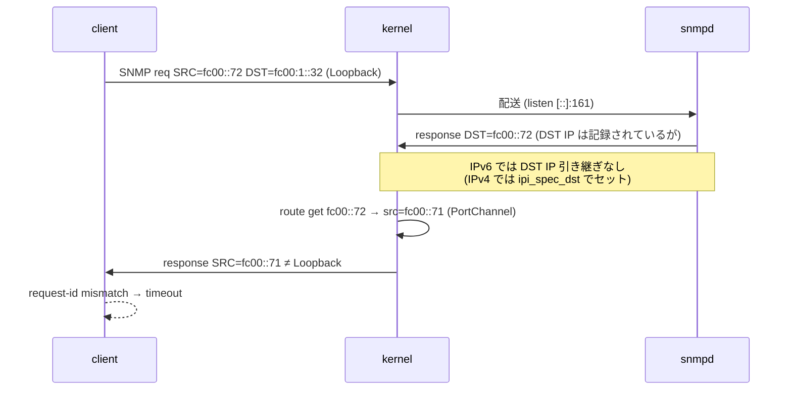
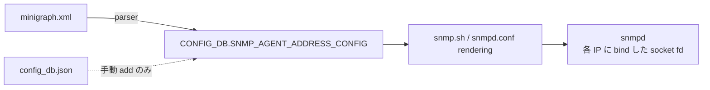

!!! warning "裏取りステータス: HLD-only"
    本ページは GitHub PR (15487 / 16013 / 17045) の実装を前提とした HLD 記述に基づく。minigraph parser の `SNMP_AGENT_ADDRESS_CONFIG` 自動投入、link-local IPv6 を agentAddress として使う処理、SNMP docker 内 `snmpd.conf` 生成テンプレートの現行実装は実コードでの裏取り未済。

# SNMP IPv6 応答の SRC IP 不整合と `SNMP_AGENT_ADDRESS_CONFIG` による回避

## 概要

SONiC 単一 ASIC 機の **SNMP over IPv6 がタイムアウトする** バグの設計修正を扱う[^1]。原因は **net-snmp の `snmpd` が IPv6 応答送信時に request の DST IP を引き継がず、kernel の route lookup で勝手に SRC IP を選ぶ** こと。result として Loopback 宛のクエリに対し SRC = PortChannel 等で応答が返り、クライアントは request-id とのマッチングに失敗する。

本 HLD は **「`agentAddress` を `0.0.0.0/::0` ではなく Loopback / Management 等の具体 IP に bind させる」** 方針で回避する[^1]。

## 動作仕様

### 既存設定

`SNMP` docker 内の `snmpd` は `snmpd.conf` の `agentAddress` で listen 先を決める[^1]:

```text
agentAddress udp:161
agentAddress udp6:161
```

CLI でも追加可能:

```bash
config snmpagentaddress add <ip>
```

### IPv6 タイムアウトの原因

問題シナリオ[^1]:

1. SNMP request が `SRC=fc00::72`、`DST=Loopback IPv6 fc00:1::32` で到着
2. `snmpd` (IPv6 socket `[::]:161`) が受理
3. response 生成、`DST=fc00::72` で送出
4. kernel が `ip -6 route get fc00::72` で best path を探し、**`src=fc00::71`（PortChannel IP）** を選ぶ
5. クライアントから見ると SRC が DST の Loopback と異なるため request-id が一致せずタイムアウト



#### IPv4 と IPv6 の違い

IPv4 では `net-snmp` は `ipi_spec_dst` で **request の DST IP を SRC として強制** する[^1]:

```c
/* snmplib/transports/snmpUDPBaseDomain.c */
ipi.ipi_spec_dst.s_addr = srcip->s_addr;
```

IPv6 にはこの仕組みが無く、kernel route lookup 任せになる。これが本問題の根本原因[^1]。

### なぜ multi-ASIC 機では発症しないか

multi-ASIC では **network namespace** で隔離される[^1]:

- `snmpd` は host namespace
- Management IF は host namespace
- Loopback0 は **asic namespace**

そのため受信 namespace の routing table 内で route lookup が完結し、SRC が Loopback と Management で混じらない。

### 修正方針

**`agentAddress` を `0.0.0.0/::0` でなく Loopback / Management の具体 IP に bind** することで、`snmpd` 側の socket fd を IP 別に分離し、応答送信時にも対応 fd（つまり対応 IP）から出ていくようにする[^1]。

#### 変更前の bind 状態

```text
netsnmp_udpbase: binding socket 7 to UDP:    [0.0.0.0]:161
netsnmp_udpbase: binding socket 8 to UDP/v6: [::]:161
```

#### 変更後の bind 状態

`SNMP_AGENT_ADDRESS_CONFIG` に Loopback0 (v4/v6) と Management IP を投入すると[^1]:

```text
socket 7  UDP    10.250.0.101:161   (Management v4)
socket 8  UDP    10.1.0.32:161      (Loopback0 v4)
socket 9  UDP/v6 fc00:2::32:161    (Management v6)
socket 10 UDP/v6 fc00:1::32:161    (Loopback0 v6)
```

`Loopback IPv6` への request は socket fd=10 で受信し、応答も fd=10（= Loopback v6 アドレス）で送出される。これで kernel が選ぶ SRC ではなく **socket bind 先の IP** が SRC になる。

#### 投入経路

| 起動元 | 動作 |
|--------|------|
| `minigraph.xml` を `config load_minigraph` で適用した場合 | minigraph parser が `SNMP_AGENT_ADDRESS_CONFIG` に **Loopback0 と Management IP を自動登録**[^1] |
| `config_db.json` を直接ロード | **自動登録なし**。`snmpd` は `0.0.0.0/::0` で listen し IPv6 問題が再発。回避するには `config snmpagentaddress add <ip>` で個別登録が必要[^1] |
| multi-ASIC 機 | 修正対象外（namespace 分離で発症しない）[^1] |



### 関連 PR

HLD は以下の PR で実装される[^1]:

| PR | 概要 |
|----|------|
| sonic-buildimage#15487 | SNMP IPv6 reachability の修正本体 |
| sonic-buildimage#16013 | link-local IPv6 を agentAddress に使えるようにする |
| sonic-buildimage#17045 | minigraph parser が `SNMP_AGENT_ADDRESS_CONFIG` を更新する変更 |

## 設定

### 関連する CONFIG_DB

| Table | 説明 |
|-------|------|
| `SNMP_AGENT_ADDRESS_CONFIG` | snmpd が listen する `<ip>[:<port>][@<vrf>]` を列挙 |

### 関連する CLI

| Command | 用途 |
|---------|------|
| `config snmpagentaddress add <ip> [-p <port>] [-v <vrf>]` | listen IP を追加 |
| `config snmpagentaddress del <ip>` | listen IP を削除 |
| `show snmpagentaddress` | listen IP 一覧表示 |

### 設定例

```bash
# 単一 ASIC 機で minigraph 経由で起動した場合は自動的に Loopback0/Management IP が
# SNMP_AGENT_ADDRESS_CONFIG に入る。明示追加したいときは:
config snmpagentaddress add 10.1.0.32
config snmpagentaddress add fc00:1::32
config snmpagentaddress add fe80::abcd          # link-local もサポート
```

## 制限事項

- **本修正は単一 ASIC 機向け**。multi-ASIC では namespace 分離で問題が出ないため変更なし[^1]
- `config_db.json` 直接ロード時は **`SNMP_AGENT_ADDRESS_CONFIG` の自動投入なし**。`agentAddress` は `0.0.0.0/::0` のままで IPv6 問題が再発する[^1]
- IP 追加時に Loopback / Management の **どちらを必要とするかはオペレータ責任**
- 本質的には net-snmp 側で IPv6 の `IPV6_PKTINFO` を使い DST IP を SRC として固定する修正が望ましいが、本 HLD は **回避策**

## 干渉する機能

- **`snmpd` (SNMP docker)**: 起動時に `snmpd.conf` の `agentAddress` を読む
- **`minigraph parser`**: `SNMP_AGENT_ADDRESS_CONFIG` の自動生成
- **`config snmpagentaddress` CLI**: 手動追加 / 削除の窓口
- **kernel routing**: `agentAddress` が `0.0.0.0/::0` の場合のみ介入。具体 IP に bind すると routing 経路は変わるが SRC は固定される
- **link-local IPv6 アドレス**: PR #16013 で追加サポート

## トラブルシューティング

- IPv6 SNMP query がタイムアウト → `redis-cli -n 4 keys 'SNMP_AGENT_ADDRESS_CONFIG*'` で具体 IP が登録されているか確認
- `agentAddress` の現状は `docker exec snmp cat /etc/snmp/snmpd.conf | grep agentAddress`
- `snmpd` の bind を確認: `docker exec snmp ss -ulnp | grep snmpd`
- request-id ミスマッチか確認: `tcpdump -ni any port 161` で request の DST と response の SRC を比較
- multi-ASIC 機なら本問題は出ないはず。出る場合は namespace 構成（`ip netns list`）を確認

## 引用元

[^1]: `sonic-net/SONiC` `doc/snmp/snmp-changes-to-support-ipv6.md` @ `49bab5b5ff0e924f1ea52b3d9db0dfa4191a7c06`

<!-- concerns hint:
- minigraph parser の SNMP_AGENT_ADDRESS_CONFIG 自動投入実装存在確認 (sonic-buildimage)
- snmpd.conf 生成テンプレート (snmp.sh / Jinja) で SNMP_AGENT_ADDRESS_CONFIG を反映する経路確認
- link-local IPv6 を agentAddress として bind する PR #16013 相当の取り込み確認
- config_db.json 直接ロード時に SNMP_AGENT_ADDRESS_CONFIG が空のままになる挙動が現行も維持されているか確認
- multi-ASIC 機での namespace 分離による回避が現行 master でも維持されているか確認
-->
