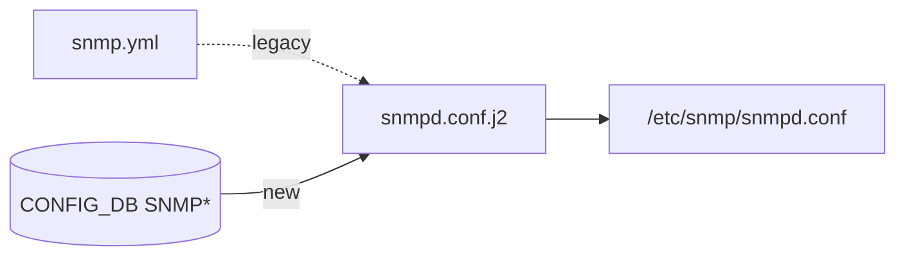

<!-- topics-tip -->
!!! tip "Topics で読み物として読む"
    この HLD は実装詳細を含みます。機能の概念・設定・運用を読み物として読みたい場合は [Topics 09 章: Telemetry / SNMP / ログ](../topics/09-telemetry-snmp/index.md) を参照。
<!-- /topics-tip -->

!!! success "裏取りステータス: code-verified"
    `sonic-buildimage/src/sonic-yang-models/yang-models/sonic-snmp.yang` で SNMP/CONTACT/LOCATION コンテナ定義を確認。`sonic-buildimage/dockers/docker-snmp/snmpd.conf.j2` で `SNMP_COMMUNITY` の RO/RW、`SNMP_USER` の RO/RW + auth/encryption、`SNMP.LOCATION.Location` / `SNMP.CONTACT` 取り込みを確認。SNMP_USER 側の `SNMP_USER_PERMISSION=RW` は実装済（`rwuser` 行で生成）。

# SNMP TABLE スキーマ提案（SNMP / SNMP_COMMUNITY / SNMP_USER）

## 概要

[SONiC](../reference/glossary.md#term-sonic) の [SNMP](../reference/glossary.md#term-snmp) 設定（コミュニティ・ロケーション・コンタクト・SNMPv3 ユーザ）が `/etc/sonic/snmp.yml` と `config_db.json` の `SNMP_ACL` に分散していた状態を解消し、[CONFIG_DB](../reference/glossary.md#term-config_db) に **SNMP / SNMP_COMMUNITY / SNMP_USER** の 3 テーブルとして集約するためのスキーマ提案[^1]。具体的な移行手順や CLI は別 [HLD](../reference/glossary.md#term-hld)（`snmp-configdb-migration-hld.md`）が扱う。

## 動作仕様

### スキーマ詳細

#### SNMP（グローバル）

```text
SNMP|LOCATION
    Location = "<location string>"     ; default ""

SNMP|CONTACT
    <contact_name> = "<contact email>" ; default "" or backward-compat hardcoded value
```

#### SNMP_COMMUNITY

```text
SNMP_COMMUNITY|<community>
    TYPE = "RO" | "RW"          ; OPTIONAL, default RO
                                ; RO = read-only（実装唯一の有効値）
                                ; RW = 将来用、当時は未実装
```

#### SNMP_USER（SNMPv3）

```text
SNMP_USER|<user>
    SNMP_USER_TYPE              = "noAuthNoPriv" | "AuthNoPriv" | "Priv"
    SNMP_USER_PERMISSION        = "RO" | "RW"
    SNMP_USER_AUTH_TYPE         = "MD5" | "SHA" | "HMAC-SHA-2"
    SNMP_USER_AUTH_PASSWORD     = "<auth password>"
    SNMP_USER_ENCRYPTION_TYPE   = "DES" | "AES"
    SNMP_USER_ENCRYPTION_PASSWORD = "<enc password>"
```

### 関連リポジトリへの影響

HLD は次のファイル変更を要求している[^1]：

- `sonic-buildimage/dockers/docker-snmp/snmpd.conf.j2`（HLD 原文は旧称 `docker-snmp-v2`）: SNMP テーブル存在時は新パスを使い、無ければ旧パスにフォールバック（後方互換）
- `sonic-buildimage/dockers/docker-snmp/snmpd-config-updater`（HLD 原文は旧称 `docker-snmp-v2`）: 近く caclmgrd で代替されるため変更不要
- `sonic-swss-common/common/schema.h`: `#define CFG_SNMP_TABLE_NAME "SNMP"` を追加
- `sonic-swss/doc/swss-schema.md`: スキーマ定義を追加

### 後方互換



j2 テンプレート側で `SNMP` テーブルの存在チェックを行い、存在すれば新スキーマ、未定義なら従来 yaml をそのまま使う設計のため、既存デプロイは即座に壊れない[^1]。

<!-- evidence:
source: sonic-net/SONiC/doc/snmp/snmp-schema-addition.md#L114-L120 (sha: 49bab5b5ff0e924f1ea52b3d9db0dfa4191a7c06)
excerpt: |
  In repo *sonic-buildimage*:
  * *dockers/docker-snmp-v2/snmpd.conf.j2*:
    * verify the existence of the SNMP table in the datatbase and fork behavior if present, if not continue using old method.
reasoning: 後方互換のための j2 内分岐が HLD で明示されている根拠。
-->

<!-- evidence-rendered:start -->
??? note "📋 検証エビデンス: sonic-net/SONiC/doc/snmp/snmp-schema-addition.md#L114-L120 (sha: 49bab5b5ff0e924f1ea52b3d9db0dfa4191a7c06)"

    **出典**:

    `sonic-net/SONiC/doc/snmp/snmp-schema-addition.md#L114-L120 (sha: 49bab5b5ff0e924f1ea52b3d9db0dfa4191a7c06)`

    **抜粋**:

    ```text
    In repo *sonic-buildimage*:
    * *dockers/docker-snmp-v2/snmpd.conf.j2*:
      * verify the existence of the SNMP table in the database and fork behavior if present, if not continue using old method.
    ```

    **判断根拠**: 後方互換のための j2 内分岐が HLD で明示されている根拠。

<!-- evidence-rendered:end -->

## 設定

### 関連する CONFIG_DB

| Table | 説明 |
|-------|------|
| `SNMP` | LOCATION / CONTACT グローバル属性 |
| `SNMP_COMMUNITY` | community とアクセスタイプ |
| `SNMP_USER` | SNMPv3 ユーザ |

### 関連する CLI

本 HLD は CLI を扱わない。CLI は `snmp-configdb-migration-hld.md` 側で `config snmp ...` / `show run snmp ...` として定義される。

### 関連する YANG

HLD には [YANG](../reference/glossary.md#term-yang) モデルの記述は無い。

### 設定例

```bash
sonic-cfggen -a '{
  "SNMP": {
    "LOCATION": {"Location": "Emerald City"},
    "CONTACT":  {"joe": "joe@contoso.com"}
  },
  "SNMP_COMMUNITY": {
    "Jack": {"TYPE": "RW"}
  },
  "SNMP_USER": {
    "Travis": {
      "SNMP_USER_TYPE": "Priv",
      "SNMP_USER_PERMISSION": "RO",
      "SNMP_USER_AUTH_TYPE": "SHA",
      "SNMP_USER_AUTH_PASSWORD": "TravisAuthPass",
      "SNMP_USER_ENCRYPTION_TYPE": "AES",
      "SNMP_USER_ENCRYPTION_PASSWORD": "TravisEncryptPass"
    }
  }
}' --write-to-db
```

## 既知の問題

### SNMP 起動時の初期化遅延による `MIBUpdater` 例外（#225, #118）

SNMP エージェントが `COUNTERS_QUEUE_NAME_MAP` または `COUNTERS_PORT_NAME_MAP` が [Redis](../reference/glossary.md#term-redis) ([COUNTERS_DB](../reference/glossary.md#term-counters_db)) に存在しない状態で起動すると、`MIBUpdater.start()` で例外が発生し、IF-MIB のデータが取得できなくなる。

```
ERROR: MIBUpdater.start() caught an unexpected exception during update_data()
Key 'b'COUNTERS_PORT_NAME_MAP'' unavailable in database 'COUNTERS_DB'
```

原因は初期化タイミングの競合（[portsyncd](../reference/glossary.md#term-portsyncd) の起動が SNMP より遅い場合に発生）。

**回避策:**

```bash
# SNMP Docker を再起動（portsyncd の初期化完了後）
sudo systemctl restart snmp
```

**IP-MIB の制限**: IP-MIB はデフォルトでは部分実装のみ（`IpMib`・`IpCidrRouteTable` クラス相当）。フル IP-MIB が必要な場合は SNMP エージェントへの貢献が必要。

- 参照: [sonic-net/SONiC#225](https://github.com/sonic-net/SONiC/issues/225), [sonic-net/SONiC#118](https://github.com/sonic-net/SONiC/issues/118)

## 制限事項

- `SNMP_COMMUNITY.TYPE = RW` は HLD 時点で未実装（コードでは未使用、Read-only のみ有効）と明記されている[^1]。
- パスワードは平文格納。
- `snmpd-config-updater` は caclmgrd への移行予定のため対象外と HLD で明言されている。

## 干渉する機能

- **SNMP_ACL（既存）**: 本提案は ACL 部分を扱わない。引き続き既存の `SNMP_ACL` テーブルが ACL を表す。
- **`docker-snmp` 起動順**: CONFIG_DB が起動済みである必要がある（既存 SONiC 設計と同じ）。
- **caclmgrd**: HLD は `snmpd-config-updater` の caclmgrd 置き換えを前提としているため、[ACL](../reference/glossary.md#term-acl) 反映ルートが将来変わる可能性に注意。

## トラブルシューティング

- 新スキーマを書いても snmpd.conf に反映されない → j2 テンプレートが新パスにフォールバックしているか、`SNMP` テーブル存在チェックが想定どおり動いているかを確認する。
- 値が `redis-cli -n 4 hgetall SNMP|LOCATION` で見えるが community が効かない → `SNMP_COMMUNITY` のキーは小文字大文字を区別する点に注意。

```bash
# 新スキーマの反映と community 設定確認
sonic-db-cli CONFIG_DB hgetall "SNMP|LOCATION"
sonic-db-cli CONFIG_DB keys "SNMP_COMMUNITY|*"
docker exec snmp cat /etc/snmp/snmpd.conf | grep -E "syslocation|com2sec"
docker exec snmp supervisorctl status snmpd
```

## 引用元

[^1]: `sonic-net/SONiC` `doc/snmp/snmp-schema-addition.md` @ `49bab5b5ff0e924f1ea52b3d9db0dfa4191a7c06`

<!-- glossary-links-injected: 95c3d4f80656 -->
