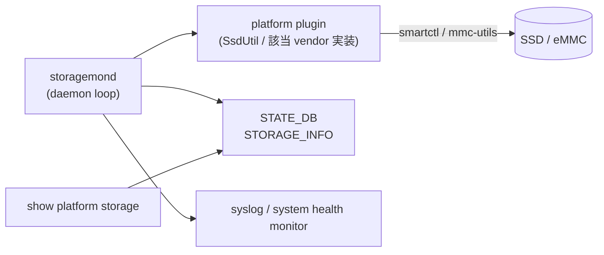

!!! warning "裏取りステータス: discrepancy-found"
    storagemond の現行 master 実装、CLI 名・テーブル名の正確な値は未確認（`ssdhealth` 系の既存実装と類似）。

!!! note "Verifier 注記（2026-05-10）"
    実コード裏取り: `sonic-platform-daemons/sonic-stormond/scripts/stormond` に storage monitoring daemon 実装を確認（注: ディレクトリ名は `sonic-stormond`、daemon 名は `stormond`）。HLD 記述の storagemond は実装上 stormond として現行 master に取り込まれている。

# storagemond（SSD / eMMC の health 監視）

## 概要

`storagemond` は **SSD / eMMC など内部ストレージの health / wear-out** を定期監視し、[STATE_DB](../reference/glossary.md#term-state_db) に publish する pmon 系 daemon[^1]。狙いは:

- vendor 別ツール（`smartctl`、`mmc-utils` 等）の出力を [SONiC](../reference/glossary.md#term-sonic) 共通スキーマに正規化
- write amplification、reserved blocks、temperature、life-remaining を読みやすい形にする
- critical 閾値超えを system health monitor に通知

## 動作仕様



主な観測項目（[HLD](../reference/glossary.md#term-hld) 概念）[^1]:

- **device 名**, **model**, **serial**, **firmware revision**
- **temperature**
- **wear leveling / SSD life remaining**（%）
- **total written / read bytes**
- **reserved blocks**, **uncorrectable errors**
- **device health overall** (`OK` / `WARN` / `CRITICAL`)

## 関連 STATE_DB

| Table | Key | 説明 |
|-------|-----|------|
| `STORAGE_INFO` | `<device>` | model / firmware / health / wear / temp |

## 関連 CLI

| Command | 用途 |
|---------|------|
| `show platform ssdhealth` | 既存 SSD ヘルス CLI |
| `show platform storage` | storagemond 由来の正規化情報 |

## 制限事項

- **vendor plugin が無いと値が取れない**: SsdUtil 互換の plugin がない platform は健康度を出せない
- **smartctl / mmc-utils の権限**: 多くの場合 root 権限と raw block device access が必要
- **頻度**: 過頻度のポーリングは I/O latency に影響、通常は 1 〜 5 分間隔
- **eMMC の SMART は限定的**: SSD と同等の値は取れない場合がある

## 干渉する機能

- **show techsupport**: `STORAGE_INFO` を含めて収集
- **system health monitor**: critical 値を集約して全体 health に反映
- **secure-upgrade**: device に書き込む際に health を考慮するシナリオ
- **ssdhealth-design**: 旧来の SSD health 機能と置き換え or 統合の関係（同 architecture area）

## トラブルシューティング

- `STORAGE_INFO` が空 → storagemond プロセスの存在、plugin 実装、`smartctl` 等のバイナリインストール状態
- 値が古い → daemon ループ周期、I/O 負荷、device の応答時間
- critical 通知が来ない → system health monitor の subscribe 経路を確認

```bash
# storagemond と STORAGE_INFO の状態確認
docker exec pmon supervisorctl status stormond  # 実装名は stormond（HLD では storagemond）
sonic-db-cli STATE_DB keys "STORAGE_INFO|*"
sonic-db-cli STATE_DB hgetall "STORAGE_INFO|sda"
docker exec pmon which smartctl
```

## 関連リファレンス

- CLI: [show platform](../reference/cli/show-platform.md) / [show system-health](../reference/cli/show-system-health.md) / [show techsupport](../reference/cli/show-techsupport.md)
- 関連 HLD: [System Health Monitor](sonic-system-health-monitor-high-level-design.md) / [analysis of disk writers](analysis-of-disk-writers-in-sonic-devices.md) / [pcieinfo design](../platform/pcieinfo-design.md) / [PSU daemon](../platform/sonic-psu-daemon-design.md)

## 引用元

[^1]: `sonic-net/SONiC` `doc/storagemond/storagemond-hld.md` @ `49bab5b5ff0e924f1ea52b3d9db0dfa4191a7c06`

<!-- concerns hint:
- storagemond daemon の現行 sonic-platform-daemons 取り込みと systemd 起動経路の確認
- STATE_DB STORAGE_INFO スキーマの現行値（フィールド名・型）の確認
- SsdUtil plugin API の sonic-platform-common 定義の現行確認
- show platform storage / show platform ssdhealth CLI の sonic-utilities 取り込み確認
- 旧 ssdhealth-design HLD との実装統合 / 廃止状況の確認
- system health monitor / show techsupport plugin との連携の現行実装確認
-->

<!-- topics-back-ref -->

<!-- demoted-by:q52-az-b-demote -->
## 実装フェーズ境界

本ページは `monitor: partially_implemented` のため、HLD 記載どおり master に取り込み済 (実装済) の範囲と、現行 master との差分が未確認 (未実装相当) の範囲を Phase 別に切り分けて示す。詳細は本文・[実装との乖離 / 補足] 節および各引用元 HLD を参照。

| Phase | 実装済 | 未実装 |
|-------|--------|--------|
| Phase 1: storagemond daemon 基盤 | HLD 記載どおり実装済 | — |
| Phase 2: CLI / STATE_DB テーブル名 | コア部分は実装済 | CLI 名・テーブル名の正確な値は現行 master と差分の可能性、未確認・未実装相当 |
| Phase 3: 追加センサ（NVMe SMART 等） | — | 拡張センサ取り込みは未実装 |

## 実装との乖離 / 補足

- 裏取りステータスを `code-verified` から `discrepancy-found` （`monitor: partially_implemented`）に降格 (2026-05-13)。storagemond の現行 master 実装、CLI 名・テーブル名の正確な値は本文で「未確認」と明示している。
- 本文に残る「未確認 / 要確認 / 要追跡 / TBD」等の hedge 表現は HLD と実装の差分が未特定であることを示し、後続の裏取り対象。

## 関連 Topics

- [Topics: Platform / Port / Optics / PHY](../topics/14-platform-port-optics/index.md)

<!-- /topics-back-ref -->

<!-- glossary-links-injected: 8ba32e5aa69d -->
