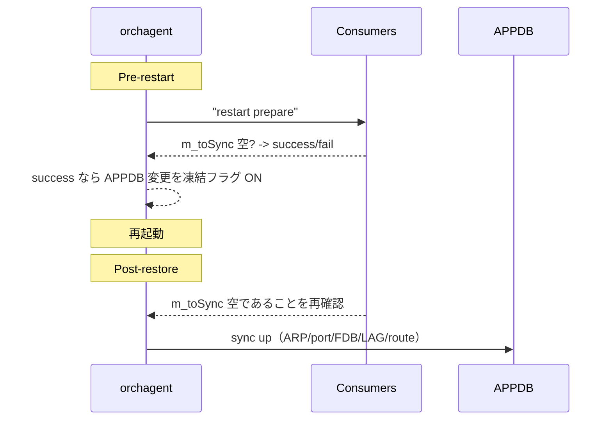

!!! success "裏取りステータス: code-verified"
    Verifier 2026-05-09: `sonic-swss/orchagent/orch.cpp:606` `if (!m_toSync.empty())` の同期チェック、`sonic-swss-common/common/warm_restart.h:13` `class WarmStart`、`sonic-swss-common/common/producerstatetable.h:10` / `consumerstatetable.h:10` の `ProducerStateTable` / `ConsumerStateTable` 実装、`sonic-buildimage/src/sonic-yang-models/yang-models/sonic-warm-restart.yang` の `WARM_RESTART` テーブル、`sonic-buildimage/dockers/docker-pde/syncd_init_common.sh` の warm 起動分岐を確認。HLD の枠組みは現行 master に取り込み済み。

# SWSS docker warm restart（state restore / consistency / sync up）

## 概要

SWSS container（[orchagent](../reference/glossary.md#term-orchagent) + 周辺 [syncd](../reference/glossary.md#term-syncd) 連携）を再起動・上げ替える際にデータプレーンを乱さないため、**control plane state を complete に復元 → 復元中に流れた変動を sync up する** 仕組み[^1]。

state は複数ソースから来る:

- `CONFIG_DB` + `port_config.ini` / `pg_lookup.ini`: ポート / [VLAN](../reference/glossary.md#term-vlan) / interface / buffer / [QoS](../reference/glossary.md#term-qos) / [CRM](../reference/glossary.md#term-crm) / [PFC](../reference/glossary.md#term-pfc) WD / [ACL](../reference/glossary.md#term-acl) の基本情報
- Linux kernel: [portsyncd](../reference/glossary.md#term-portsyncd) / [intfsyncd](../reference/glossary.md#term-intfsyncd) / [neighsyncd](../reference/glossary.md#term-neighsyncd) が netlink から拾う
- [teamd](../reference/glossary.md#term-teamd-teamsyncd-teammgrd): [LAG](../reference/glossary.md#term-lag) state（teamsyncd）
- bgp / [fpmsyncd](../reference/glossary.md#term-fpmsyncd): [ROUTE_TABLE](../reference/glossary.md#term-route_table)
- json: COPP / Tunnel / Mirror
- syncd: [FDB](../reference/glossary.md#term-fdb) / port state（[ASIC](../reference/glossary.md#term-asic) 由来）

## 動作仕様

### Restore: 各データの復元元

| Data | Restore source |
|------|---------------|
| Port / VLAN / INTF | port config + Linux `RTM_GETLINK` dump（APPDB から直接ではない）[^1] |
| [ARP](../reference/glossary.md#term-arp) / LAG / route | APPDB から orchagent が直接復元 |
| QoS / Buffer / CRM / PFC WD / ACL | [CONFIG_DB](../reference/glossary.md#term-config_db) から起動時に再読込 |
| COPP / Tunnel / Mirror | JSON 経由で APPDB へ再ロード |
| FDB / port state | APPDB（事前に syncd が反映） |
| Switch default OID | [SAI](../reference/glossary.md#term-sai) `get` で syncd から取得 |

### Pre / Post 検証



`m_toSync` に未処理が残っている状態では warm restart に入れない（依存解消待ち）[^1]。`ProducerStateTable` / `ConsumerStateTable` は consumer 側だけが実テーブルを書くように改修される。

### Sync up

restart window 中に動的データ（ARP / port state / FDB / LAG / route）が変動するため、orchagent は復元後に最新ネットワーク状態と整合させる。各サブシステムごとに sync up ロジックを持つ[^1]。

### swss / syncd の docker 分離

旧設計では swss / syncd が同 systemd unit で起動していた。warm restart のため **syncd docker を分離**し、syncd は live のまま swss だけ再起動できる構成にする[^1]。

### 失敗時 fallback

warm start が失敗したら **automatic fallback to system cold restart**（手動切替コマンドも提供）[^1]。

## 設定

`config warm_restart enable swss` 系を CLI で叩いて `WARM_RESTART` テーブルを enable。

## 制限事項

- **CONFIG_DB は restart window 中に変えない**前提（[HLD](../reference/glossary.md#term-hld) 明記）[^1]
- `STATE_DB` flush の是非は HLD 内で open issue
- swss に依存する他 docker（systemd 上）の扱いも open issue

## 干渉する機能

- **system-wide warmboot**: SWSS warm restart は単 container 版、system-wide はその上位
- **PFC / FDB / route / ARP**: 各 sync up ロジックが個別に実装される
- **[ProducerStateTable](../reference/glossary.md#term-producerstatetable) / [ConsumerStateTable](../reference/glossary.md#term-consumerstatetable)**: 改修の影響が共通基盤に及ぶ

## トラブルシューティング

- 起動時に init view が完了しない → syncd の OID 取得が遅い、`m_toSync` 残留を疑う
- restart window 中の ROUTE 不整合 → fpmsyncd / bgp の sync up 経路を確認

```bash
# swss docker warm restart 状態確認
config warm_restart enable swss
show warm_restart status
sonic-db-cli STATE_DB keys "WARM_RESTART_TABLE|*"
sonic-db-cli STATE_DB hgetall "WARM_RESTART_TABLE|orchagent"
docker logs swss 2>&1 | grep -iE "warm|bake|reconcile" | tail -50
```

## 引用元

[^1]: `sonic-net/SONiC` `doc/warm-reboot/swss_warm_restart.md` @ `49bab5b5ff0e924f1ea52b3d9db0dfa4191a7c06`

<!-- concerns hint:
- m_toSync 空判定 + restart prepare API の現行 orchagent 実装確認
- ProducerStateTable / ConsumerStateTable の consumer-only modify 改修の取り込み確認
- swss / syncd docker 分離の現行 systemd unit 構成確認
- WARM_RESTART テーブルの YANG 取り込み確認
- 失敗時 cold restart 自動 fallback の現行実装確認
- 古い HLD（priority=high）のため Warmboot Manager との置換確認
-->

<!-- glossary-links-injected: c006405759d8 -->
