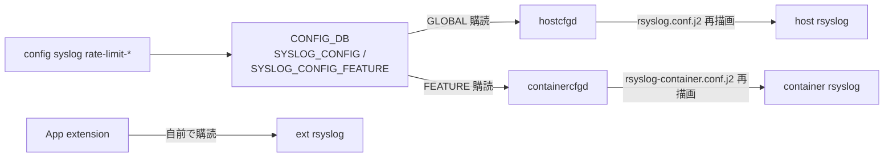

!!! success "裏取りステータス: code-verified"
    containercfgd: `sonic-buildimage/src/sonic-containercfgd/containercfgd/containercfgd.py:18,21,22,98,133-135`（`SYSLOG_CONFIG_FEATURE_TABLE`, `SYSLOG_RATE_LIMIT_INTERVAL`, `SYSLOG_RATE_LIMIT_BURST`, `@config_handler`）/ `config syslog rate-limit-container`: `sonic-utilities/config/syslog.py` で確認（CLI リファレンス `docs/reference/cli/config-syslog.md` L39, L66 も同コマンドを記載）。

# syslog rate limit のコンテナ単位設定

## なぜ必要か

SONiC の syslog は **コンテナ毎の rsyslogd** + **host の rsyslogd** で構成され、コンテナ rsyslog は従来 ハードコード で[^1]:

```text
$SystemLogRateLimitInterval 300
$SystemLogRateLimitBurst 20000
```

`Interval` 秒の窓内に `Burst` 件を超えると以降を drop。flood 防止だが「もっと緩く/厳しく」したいし、host 側にも追加したい。本機能は両者を **[CONFIG_DB](../reference/glossary.md#term-config_db) から動的に変更** できるようにする[^1]。

## CONFIG_DB スキーマ

新設 2 テーブル[^1]:

| Table | Key | フィールド |
|-------|-----|------------|
| `SYSLOG_CONFIG` | `GLOBAL` | `rate_limit_interval`, `rate_limit_burst`（0 で無効）|
| `SYSLOG_CONFIG_FEATURE` | `<container_name>` | 同上（既定 300 / 20000）|

`init_cfg.json.j2` で built-in container 用 default を流し込む。host (GLOBAL) は既定 0/0（制限なし）[^1]。

## 責務分離



要点[^1]:

1. **CLI は CONFIG_DB に書くだけ**
2. **`hostcfgd`**（既存）が `SYSLOG_CONFIG|GLOBAL` を購読し host 側を再描画 + restart
3. **新 daemon `containercfgd`** が各 container 内で `SYSLOG_CONFIG_FEATURE|<container>` を購読
4. テンプレ `rsyslog.conf.j2` / `rsyslog-container.conf.j2` に `rate_limit_interval` / `rate_limit_burst` 変数追加
5. single-ASIC でも `rsyslog-container.conf.j2` テンプレに統一（旧 `rsyslog.conf` 撤廃）
6. **App extension** は capability 申告ベースで自前で読む

## Container 起動時の流れ

`docker_image_ctl.j2` から生成される起動スクリプトの **`preStartAction`** にある `updateSyslogConf` が `rsyslog-container.conf.j2` を CONFIG_DB 値で render し、stopped container に `docker cp` してから起動する[^1]。Runtime 変更は `containercfgd` が観測して container 内 rsyslog を再 render + restart。

> 検証によると **host 側 rate limit はコンテナ側に影響しない**（双方独立）[^1]。

## Multi-ASIC

設定は **per-namespace**[^1]。namespace ごとの container 群が別々に `SYSLOG_CONFIG_FEATURE` を持つ。

## 設定例

```bash
# host: 60 秒に 5000 件
sudo config syslog rate-limit-host -i 60 -b 5000

# bgp container: 制限解除
sudo config syslog rate-limit-container bgp -i 0 -b 0

show syslog rate-limit-container
show syslog rate-limit-host
```

## 制限事項

- [HLD](../reference/glossary.md#term-hld) は Rev 0.1 で日付欄空欄
- App extension は capability 申告ベース（強制ではない）
- host 設定はコンテナに伝播しないため、全体抑制には各 container にも設定が必要
- single-ASIC で `rsyslog.conf` → `rsyslog-container.conf.j2` への切替は後方互換破壊の可能性あり
- 設定変更で rsyslog restart が走る瞬間は syslog が欠ける

## 干渉する機能

`hostcfgd` / `docker_image_ctl.j2` の `preStartAction` / multi-ASIC namespace / App extension framework / journald（別軸）。

## トラブルシューティング

```bash
redis-cli -n 4 HGETALL "SYSLOG_CONFIG|GLOBAL"
redis-cli -n 4 KEYS "SYSLOG_CONFIG_FEATURE|*"

# container 内に反映されているか
docker exec bgp grep -E "RateLimit" /etc/rsyslog.conf

# rsyslog 再起動ログ
journalctl -u rsyslog
docker exec bgp supervisorctl status | grep rsyslog
```

## 関連 Topics

- [09-telemetry-snmp](../topics/09-telemetry-snmp/index.md): ログ / 監視

## 参考リンク

- [CLI: config syslog](../reference/cli/config-syslog.md)
- [CONFIG_DB: SYSLOG_CONFIG](../reference/config-db/syslog-config.md)
- [CONFIG_DB: SYSLOG_CONFIG_FEATURE](../reference/config-db/syslog-config-feature.md)
- [CONFIG_DB: SYSLOG_SERVER](../reference/config-db/syslog-server.md)
- [CLI: show feature](../reference/cli/show-feature.md)
- [Glossary](../reference/glossary.md)
- [Reference 索引](../reference/index.md)

## 引用元

[^1]: `sonic-net/SONiC` `doc/syslog/syslog-rate-limit-design.md` @ `49bab5b5ff0e924f1ea52b3d9db0dfa4191a7c06`

<!-- glossary-links-injected: c5a6ce567024 -->
