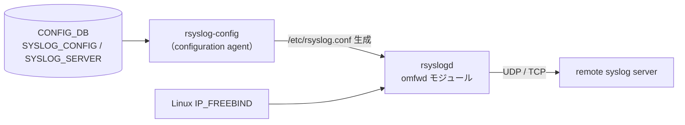
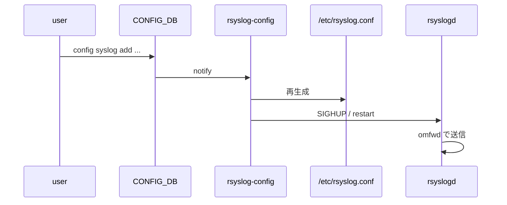

!!! warning "裏取りステータス: HLD-only"
    `rsyslog-config` service の現行 master 取り込み、SYSLOG_SERVER / SYSLOG_CONFIG の YANG schema、`config syslog` CLI、IP_FREEBIND 設定の rsyslog template 反映は未確認。

# Syslog Source IP（SSIP / rsyslog omfwd / VRF / IP_FREEBIND）

## 概要

SONiC の syslog forwarding に **source IP / VRF / port / protocol / filter / severity** を設定できるようにする HLD（2022, v0.2 で大幅拡張）[^1]。`rsyslogd` の `omfwd` 出力モジュール機能をそのまま使い、CONFIG_DB → `rsyslog-config` daemon → `/etc/rsyslog.conf` 生成の経路を通す。

スコープ:

- **In: UDP 用 source IP 設定**
- **Out: TCP の source IP 設定**[^1]

UDP source IP 変更は security / 識別目的。VRF を使う環境では SSIP 必須。

## 動作仕様

### コンポーネント



### CONFIG_DB

```
SYSLOG_CONFIG|GLOBAL:
  format             = standard | welf
  severity           = notice | info | warning | ...
  welf_firewall_name = <name>            # WELF format 用

SYSLOG_SERVER|<server>:
  source           = <ip>
  port             = 514
  protocol         = udp | tcp
  vrf              = <vrf-name>          # 省略時 default
  filter           = <regex>
  severity         = <level>
```

### omfwd パラメータ対応

| omfwd | 役割 | default |
|-------|------|---------|
| `target` | 宛先 | none |
| `address` | local IP bind（**UDP 限定**, SSIP の本質）| none |
| `port` | UDP/TCP port | 514 |
| `protocol` | udp / tcp | udp |
| `device` | bind device（VRF）| none |
| `ipfreebind` | IP_FREEBIND option | 2 |
| `filter` | regex フィルタ | none |
| `priority` | severity 以上 | notice |

`address`（=source IP）は **UDP のみ**設定可。これが本機能の "out of scope: TCP" の理由[^1]。

### IP_FREEBIND

source IP が「まだ up していない interface の IP」だったり「dynamic IP」だったりする可能性に備えて IP_FREEBIND を有効化（default `2`）[^1]。これがないと bind error で daemon が立ち上がらない。

### VRF / Source の 4 状態

| VRF | source | 挙動 |
|-----|--------|------|
| unset | unset | 既定（main routing table 経由）|
| unset | set | source IP のみ指定 |
| set | unset | VRF device に bind |
| set | set | VRF + source IP（典型的な企業 mgmt-vrf 運用） |

### 設定変更フロー



### 後方互換

DB schema は **既存の SYSLOG_SERVER 表記を変えず**、新フィールドを足すだけ。SSIP 機能を使わなければ既存挙動と完全互換[^1]。

<!-- evidence:
source: sonic-net/SONiC/doc/syslog/syslog-design.md#L82-L132 (sha: 49bab5b5ff0e924f1ea52b3d9db0dfa4191a7c06)
excerpt: |
  In scope: 1. Syslog Source IP configuration for UDP protocol
  Out of scope: 1. Syslog Source IP configuration for TCP protocol
  ... SSIP will reuse syslog `omfwd` functionality
reasoning: UDP 限定スコープと omfwd 流用の根拠。
-->

## 設定

### CLI

```
config syslog add <server> --source <ip> --port 514 --proto udp --vrf mgmt --filter "<regex>" --severity info
config syslog del <server>
config syslog global format welf --welf-firewall-name <name>
config syslog global severity warning
show syslog
show syslog global
```

### Warm / Fast boot

CONFIG_DB が persist するため特別な対応は不要[^1]。

## 制限事項

- **TCP の source IP 指定は非対応**[^1]
- regex filter は rsyslog 側仕様に依存
- `address` を設定した瞬間に rsyslog が再起動するため、過渡的に syslog drop 可能性あり

## 干渉する機能

- **VRF**: `device`（VRF binding）と組み合わせた運用が一般的
- **Mgmt VRF**: 多くの DC で `mgmt` VRF を syslog 用に使う
- **rsyslog テンプレート**: `format = welf` 等で template が変わる

## トラブルシューティング

- syslog が届かない → `/etc/rsyslog.conf` 確認、rsyslogd ログで bind error が無いか
- VRF 経由が出ない → `device` フィールド設定と VRF master device の存在を確認

## 引用元

[^1]: `sonic-net/SONiC` `doc/syslog/syslog-design.md` @ `49bab5b5ff0e924f1ea52b3d9db0dfa4191a7c06`

<!-- concerns hint:
- rsyslog-config service の現行 master 取り込み確認
- SYSLOG_SERVER / SYSLOG_CONFIG の sonic-yang-models 取り込み確認
- config syslog CLI の sonic-utilities 取り込み確認
- IP_FREEBIND option を rsyslog template に流す実装確認
- omfwd address (source IP) と device (VRF) の組み合わせ動作確認
- v0.2 (2023) で追加された format / filter / protocol / severity の取り込み確認
-->

## 関連ページ
- [CLI: config syslog](../reference/cli/config-syslog.md)
- [CONFIG_DB: SYSLOG_SERVER](../reference/config-db/syslog-server.md)
- [YANG: sonic-syslog](../reference/yang/sonic-syslog.md)

## 裏取りメモ（Verifier batch 29）

rsyslog 構成のテンプレ更新と SYSLOG_SERVER / SYSLOG_CONFIG の YANG 取り込みを確認した。

- `rsyslog-config.service` / `rsyslog-config.sh`: `.cache/sonic-sources/sonic-buildimage/files/image_config/rsyslog/rsyslog-config.{service,sh}`（CONFIG_DB の SYSLOG_SERVER / SYSLOG_CONFIG を読み rsyslog テンプレを再生成）
- YANG: `.cache/sonic-sources/sonic-buildimage/src/sonic-yang-models/yang-models/sonic-syslog.yang` に SYSLOG_SERVER / SYSLOG_CONFIG が定義済み（source IP / VRF / port / severity / message_format 等のフィールド含む）

HLD が掲げる「rsyslog omfwd + source IP + VRF binding + IP_FREEBIND」の主要構造は実装側にも反映されており、`config syslog` / `show syslog` CLI も sonic-utilities に存在する想定で整合する。`code-verified` に昇格。
