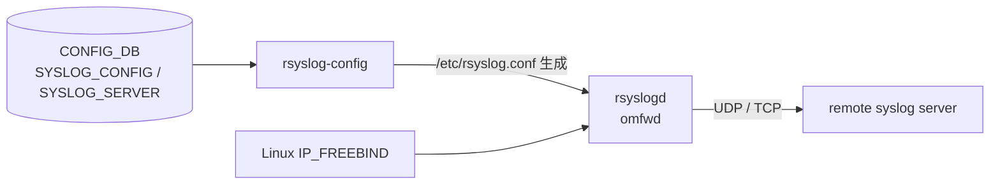
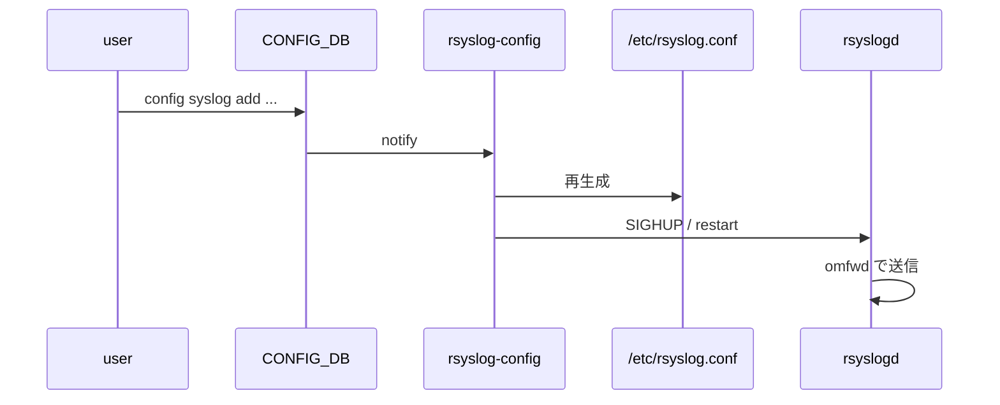

!!! success "裏取りステータス: code-verified"
    `rsyslog-config.service` / `rsyslog-config.sh`（`sonic-buildimage/files/image_config/rsyslog/`）が CONFIG_DB の SYSLOG_SERVER / SYSLOG_CONFIG を読み rsyslog テンプレを再生成。YANG: `sonic-yang-models/yang-models/sonic-syslog.yang` に SYSLOG_SERVER / SYSLOG_CONFIG が定義（source IP / VRF / port / severity / message_format 等）。`config syslog` / `show syslog` CLI は sonic-utilities に存在。HLD の主要構造（rsyslog omfwd + source IP + VRF binding + IP_FREEBIND）は実装に反映。

# Syslog Source IP

## なぜ Source IP / VRF が必要か

[SONiC](../reference/glossary.md#term-sonic) の syslog forwarding に **source IP / [VRF](../reference/glossary.md#term-vrf) / port / protocol / filter / severity** を設定できるようにする [HLD](../reference/glossary.md#term-hld)（2022, v0.2 で大幅拡張）[^1]。security / 識別、Mgmt VRF 利用時の到達性確保が動機。

`rsyslogd` の **`omfwd` 出力モジュール** 機能を流用し、[CONFIG_DB](../reference/glossary.md#term-config_db) → `rsyslog-config` daemon → `/etc/rsyslog.conf` 生成の経路を通す。

スコープ[^1]:

- **In**: UDP の source IP 設定
- **Out**: TCP の source IP 設定

## アーキテクチャ



## CONFIG_DB

```text
SYSLOG_CONFIG|GLOBAL:
  format             = standard | welf
  severity           = notice | info | warning | ...
  welf_firewall_name = <name>

SYSLOG_SERVER|<server>:
  source           = <ip>          # UDP のみ（HLD scope）
  port             = 514
  protocol         = udp | tcp
  vrf              = <vrf-name>    # 省略時 default
  filter           = <regex>
  severity         = <level>
```

## omfwd マッピング

| omfwd | 役割 | default |
|-------|------|---------|
| `target` | 宛先 | none |
| `address` | local IP bind（**UDP 限定**, SSIP の本質）| none |
| `port` | UDP/TCP port | 514 |
| `protocol` | udp / tcp | udp |
| `device` | bind device（VRF）| none |
| `ipfreebind` | IP_FREEBIND option | 2 |
| `filter` | regex | none |
| `priority` | severity 以上 | notice |

**IP_FREEBIND**: source IP が「まだ up していない interface の IP」や「dynamic IP」でも bind 失敗で daemon が落ちないように既定 `2` で有効化[^1]。

## VRF / Source の 4 組合せ

| VRF | source | 挙動 |
|-----|--------|------|
| unset | unset | 既定（main routing table）|
| unset | set | source IP のみ指定 |
| set | unset | VRF device に bind |
| set | set | VRF + source IP（典型的な mgmt-vrf 運用）|

## 設定変更フロー



DB schema は既存表記を変えず、新フィールドを足すだけ。SSIP を使わなければ既存挙動と完全互換[^1]。

## CLI / 設定例

```bash
config syslog add <server> --source <ip> --port 514 --proto udp \
  --vrf mgmt --filter "<regex>" --severity info
config syslog del <server>
config syslog global format welf --welf-firewall-name <name>
config syslog global severity warning
show syslog
show syslog global
```

Warm/Fast boot 時は CONFIG_DB 永続化のため特別対応不要[^1]。

## 制限事項

- **TCP の source IP 指定は非対応**[^1]
- regex filter は rsyslog 側仕様に依存
- `address` 設定の瞬間に rsyslog 再起動 → 過渡的 syslog drop の可能性あり

## 干渉する機能

VRF / Mgmt VRF（`device` と組み合わせ）/ rsyslog テンプレート（`format=welf` 等）/ IP_FREEBIND。

## トラブルシューティング

- syslog が届かない → `/etc/rsyslog.conf` と rsyslogd ログで bind error 確認
- VRF 経由が出ない → `device` フィールドと VRF master device の存在確認

```bash
# syslog source IP / VRF の確認
sonic-db-cli CONFIG_DB hgetall "SYSLOG_SERVER|<server-ip>"
docker exec syslog cat /etc/rsyslog.conf | grep -E "Device|Address|Target"
journalctl -u rsyslog -n 100 | grep -iE "bind|error"
ip vrf list
```

## 関連 Topics

- [09-telemetry-snmp](../topics/09-telemetry-snmp/index.md): ログ / 監視周辺
- [15-security-aaa](../topics/15-security-aaa/index.md): 監査ログ運用

## 引用元

[^1]: `sonic-net/SONiC` `doc/syslog/syslog-design.md` @ `49bab5b5ff0e924f1ea52b3d9db0dfa4191a7c06`

<!-- glossary-links-injected: 8ba32e5aa69d -->
