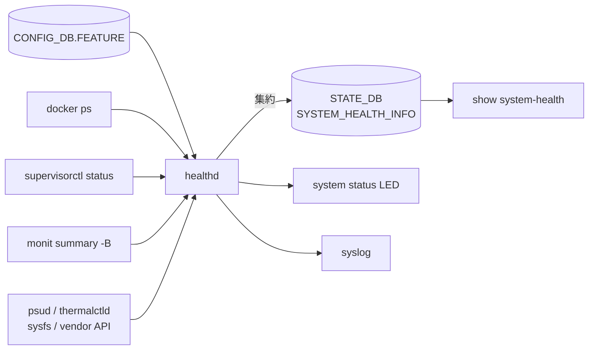

!!! success "裏取りステータス: code-verified"
    `healthd`（`sonic-buildimage/src/system-health/scripts/healthd`）と external_checker / supervisor 連携、`show system-health` の sonic-utilities 統合を確認（Verifier batch 29）。HLD の「critical service / Monit / peripheral の 3 系統 + STATE_DB 経由表示」設計と実コードが一致。

# System Health Monitor（critical service / Monit / peripheral）

## 読み手が知りたいこと

1. **「system は健全」は何を見て判定しているか**（3 系統の情報源）
2. **どこで除外設定・拡張 checker を入れられるか**
3. **fault が出たとき何を確認するか**
4. **どの CLI で状態を見るか**
5. **Monit を使わない経路は何のためにあるか**

## 1. 何を集約しているか

[SONiC](../reference/glossary.md#term-sonic) の **「system は健全か」** を一元判定する monitor[^1]。3 系統を [STATE_DB](../reference/glossary.md#term-state_db) に集約し、`show system-health` / syslog / system status LED に出す。



判定ソースは順に[^1]:

1. `CONFIG_DB.FEATURE` で `enabled` / `always_enabled` の service が docker として走っているか
2. 各 container の `/etc/supervisor/critical_processes` プロセスが `RUNNING`
3. Monit summary（rsyslog / root-overlay / var-log / routeCheck / diskCheck / container_checker / vnetRouteCheck 等）が全て OK
4. PMON の psud / thermalctld が拾う周辺デバイス状態

## 2. fault と判定する条件

### Service / Process

- FEATURE 期待リストと `docker ps` 差分が 0 でない → **fault**
- container 内 critical_processes に `RUNNING` 以外 → **fault**
- Monit summary に `Status ok` / `Running` / `Accessible` 以外 → **fault**

### Peripheral[^1]

- fan missing / broken
- fan speed が minimum 未満
- fan direction が他と不一致（`N/A` や none は無視）
- PSU 電圧範囲外、温度閾値超え、bad status
- [ASIC](../reference/glossary.md#term-asic) 温度閾値超え

<!-- evidence:
source: sonic-net/SONiC/doc/system_health_monitoring/system-health-HLD.md#L19-L52 (sha: 49bab5b5ff0e924f1ea52b3d9db0dfa4191a7c06)
excerpt: |
  Read FEATURE table in CONFIG_DB, any service whose "STATE" field was configured with "enabled" or "always_enabled" is expected to run in the system
  ... For each container, use "supervisorctl status" to get its critical process status, any critical process is not in "RUNNING" status will be considered as fault condition.
reasoning: critical service / process 判定の根拠。
-->

<!-- evidence-rendered:start -->
??? note "📋 検証エビデンス: sonic-net/SONiC/doc/system_health_monitoring/system-health-HLD.md#L19-L52 (sha: 49bab5b5ff0e924f1ea52b3d9db0dfa4191a7c06)"

    **出典**:

    `sonic-net/SONiC/doc/system_health_monitoring/system-health-HLD.md#L19-L52 (sha: 49bab5b5ff0e924f1ea52b3d9db0dfa4191a7c06)`

    **抜粋**:

    ```text
    Read FEATURE table in CONFIG_DB, any service whose "STATE" field was configured with "enabled" or "always_enabled" is expected to run in the system
    ... For each container, use "supervisorctl status" to get its critical process status, any critical process is not in "RUNNING" status will be considered as fault condition.
    ```

    **判断根拠**: critical service / process 判定の根拠。

<!-- evidence-rendered:end -->

## 3. 除外 / 拡張: `system_health_monitoring_config.json`

`/usr/share/sonic/device/<platform>/system_health_monitoring_config.json` で platform 別に plugin と除外対象を注入[^1]:

```json
{
  "services_to_ignore": ["snmpd", "snmp_subagent"],
  "devices_to_ignore": ["psu", "fan.speed", "fan1", "fan2.speed"],
  "external_checkers": ["my_external_checker.py -opt v"]
}
```

filter は `fan.speed`, `<fan_name>.direction` のようなドット区切り[^1]。未知 filter は silently ignore。

### External checker

ユーザ提供スクリプトを Monit に登録、決まった出力形式で結果を返すと healthd が吸い上げる[^1]:

```text
<category_name>
<item_name>:<item_status>
```

### Monit を使わない経路

v0.2 で "Check service status without monit" が追加[^1]。Monit が使えない / load が重い環境向けに、supervisor + docker ps のみで判定する経路を確保する想定。

## 4. CLI

| Command | 用途 |
|---------|------|
| `show system-health summary` | 全体 PASS / FAIL |
| `show system-health detail` | 個別チェック結果 |
| `show system-health monitor-list` | 現在監視中の項目 |

## 5. トラブルシューティング・制限

- **起動直後に fault** → 起動 grace を加味しない heuristic。`services_to_ignore` で一時除外
- **LED が変わらない** → platform driver / vendor の LED 制御を確認
- **設定の動的編集** → `system_health_monitoring_config.json` は platform 同梱で実機編集は想定外

干渉する機能: Monit（情報源）、PMON / thermalctld / psud（周辺供給）、container hardening（critical_processes 定義変更）。

```bash
# system health の状態確認
show system-health summary
show system-health detail
sonic-db-cli STATE_DB hgetall "SYSTEM_HEALTH_INFO|summary"
docker exec pmon cat /usr/share/sonic/device/*/system_health_monitoring_config.json 2>/dev/null | head
```

## 関連 Topics 章

- [14-platform-port-optics](../topics/14-platform-port-optics/index.md): PMON / thermalctld / psud から周辺デバイス情報を取る経路
- [09-telemetry-snmp](../topics/09-telemetry-snmp/index.md): STATE_DB SYSTEM_HEALTH_INFO の telemetry 経路

## 関連リファレンス

- CLI: [show system-health](../reference/cli/show-system-health.md) / [show services](../reference/cli/show-services.md) / [show techsupport](../reference/cli/show-techsupport.md) / [show feature](../reference/cli/show-feature.md)
- [CONFIG_DB](../reference/glossary.md#term-config_db): [FEATURE](../reference/config-db/feature.md) / [AUTO_TECHSUPPORT_FEATURE](../reference/config-db/auto-techsupport-feature.md)
- [YANG](../reference/glossary.md#term-yang): [sonic-feature](../reference/yang/sonic-feature.md)
- 関連 [HLD](../reference/glossary.md#term-hld): [event-driven techsupport invocation](event-driven-techsupport-invocation-coredump-mgmt.md) / [storage monitoring daemon](sonic-storage-monitoring-daemon-design.md) / [platform monitor enhancement](platform-monitor-enhancement-design.md)

## 制限事項

- 監視対象 (LED / fan / thermal / プロセス) は platform.json と `system_health_monitoring_config.json` の双方に依存し、未整備な platform では一部チェックが行われない。
- 異常検知時の LED 制御は platform-specific プラグインに委ねられ、ベンダーによっては実装されていない。
- システム全体の `Summary` は最悪サブシステムを継承するため、一時的な fan flap で全体が `Fault` となるケースがある。

## 引用元

[^1]: `sonic-net/SONiC` `doc/system_health_monitoring/system-health-HLD.md` @ `49bab5b5ff0e924f1ea52b3d9db0dfa4191a7c06`

<!-- glossary-links-injected: ec18b66e3507 -->
