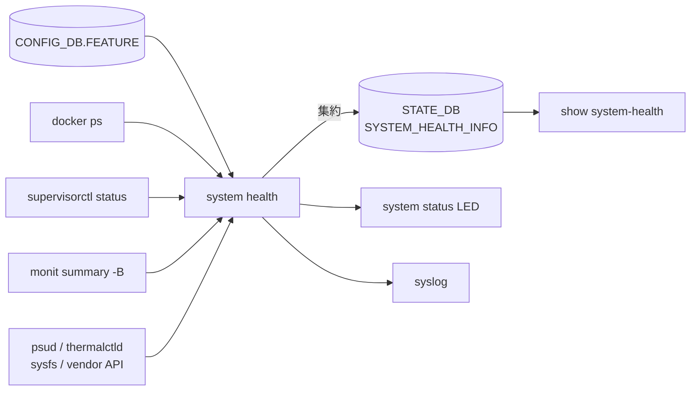

!!! warning "裏取りステータス: HLD-only"
    `healthd`（system health monitor 本体）の現行 master 取り込み、`system_health_monitoring_config.json` のスキーマ、external_checkers の出力フォーマット、`/etc/supervisor/critical_processes` の運用実態は未裏取り。

# System Health Monitor（critical service / Monit / peripheral）

## 概要

SONiC の **「system は健全か」** を一元判定する monitor[^1]。critical service / process の生存、Monit が見るファイルシステム / 周辺 script、PMON の周辺デバイス（fan / PSU / ASIC temp）を統合し、結果を syslog / system status LED / `show system-health` CLI に出す。

判定ソース:

1. `CONFIG_DB.FEATURE` で `state` が `enabled` / `always_enabled` の service が docker として走っているか
2. 各 container の `/etc/supervisor/critical_processes` に列挙されたプロセスが `RUNNING`（`supervisorctl status`）
3. Monit summary の OK 状態（rsyslog, root-overlay, var-log, routeCheck, diskCheck, container_checker, vnetRouteCheck, container_memory_telemetry 等）
4. PMON の psud / thermalctld 等が拾う peripheral 状態

## 動作仕様

### Service / Process チェック



判定ロジック[^1]:

- FEATURE で expected な service と docker ps の差分が 0 でないと **fault**
- container ごと critical_processes が `RUNNING` でないと **fault**
- Monit summary に `Status ok` / `Running` / `Accessible` 以外があると **fault**

### Peripheral

fault と扱う条件[^1]:

- fan missing / broken
- fan speed が minimum 未満
- fan direction が他と不一致（"N/A" や none は無視）
- PSU 電圧範囲外、温度閾値超え、bad status
- ASIC 温度閾値超え

### 設定ファイル

`/usr/share/sonic/device/<platform>/system_health_monitoring_config.json` で **plugin と除外対象** を platform 別に注入[^1]:

```json
{
  "services_to_ignore": ["snmpd", "snmp_subagent"],
  "devices_to_ignore": ["psu", "fan.speed", "fan1", "fan2.speed"],
  "external_checkers": ["my_external_checker.py -opt v"]
}
```

filter 文字列の認識ルール（`fan.speed`, `<fan_name>.direction` などドット区切り）[^1]。未知 filter は silently ignore。

### External checker

ユーザ提供スクリプトを Monit に登録、決まった出力フォーマットで結果を返すと system health がそのまま吸い上げる[^1]:

```
<category_name>
<item_name>:<item_status>
```

### Monit を使わない経路

v0.2 で `Junchao Chen` が "Check service status without monit" を追加[^1]。Monit が使えない / load 重い環境向けに、純粋に supervisor + docker ps だけで判定する道筋を確保する想定。

<!-- evidence:
source: sonic-net/SONiC/doc/system_health_monitoring/system-health-HLD.md#L19-L52 (sha: 49bab5b5ff0e924f1ea52b3d9db0dfa4191a7c06)
excerpt: |
  Read FEATURE table in CONFIG_DB, any service whose "STATE" field was configured with "enabled" or "always_enabled" is expected to run in the system
  ... For each container, use "supervisorctl status" to get its critical process status, any critical process is not in "RUNNING" status will be considered as fault condition.
reasoning: critical service / process 判定の根拠。
-->

## 設定

### CLI

| Command | 用途 |
|---------|------|
| `show system-health summary` | 全体 PASS / FAIL |
| `show system-health detail` | 個別チェックの結果 |
| `show system-health monitor-list` | 現在監視中の項目 |

## 制限事項

- judgment は heuristic（FEATURE と docker ps の照合等）であり、起動 grace period を加味しないと起動直後に false fault が出る
- `system_health_monitoring_config.json` は platform 同梱。実機で動的編集は想定外
- LED マッピングは platform 依存

## 干渉する機能

- **Monit**: 主要な情報源。Monit 設定（`monitrc` 等）と本機能設定の整合が必要
- **PMON / thermalctld / psud**: peripheral 状態の供給元
- **Container Hardening**: critical_processes の定義変更を伴う

## トラブルシューティング

- 起動直後に fault → 起動 grace を疑う、`services_to_ignore` で一時除外
- LED が変わらない → platform driver / vendor API 側の LED 制御を確認

## 引用元

[^1]: `sonic-net/SONiC` `doc/system_health_monitoring/system-health-HLD.md` @ `49bab5b5ff0e924f1ea52b3d9db0dfa4191a7c06`

<!-- concerns hint:
- healthd / system health monitor の現行 master 取り込み確認（sonic-host-services?）
- system_health_monitoring_config.json の filter 文法と現行実装の対応確認
- external_checkers 出力フォーマットの実装確認
- /etc/supervisor/critical_processes の各 docker での更新状況確認
- Monit を使わない経路（v0.2）の現行実装確認
- LED 制御 API（platform_chassis.set_status_led）との結線確認
-->
