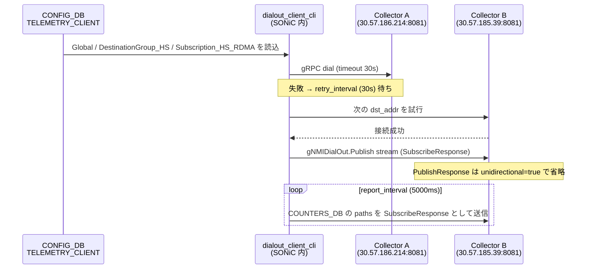

<!-- topics-tip -->
!!! tip "Topics で読み物として読む"
    この HLD は実装詳細を含みます。機能の概念・設定・運用を読み物として読みたい場合は [Topics 09 章: Telemetry / SNMP / ログ](../topics/09-telemetry-snmp/index.md) を参照。
<!-- /topics-tip -->

!!! info "裏取りステータス: code-verified"
    `sonic-gnmi/dialout/{dialout_client,dialout_client_cli,dialout_server,dialout_server_cli}/` の Go 実装と `dialout_client.go`（`TELEMETRY_CLIENT` 読み出し / DestinationGroup / Subscription 走査）、および `sonic_data_client/{db_client,mixed_db_client}.go` を確認。openconfig telemetry YANG との完全 mapping は範囲外（実装は SONiC 独自 schema 中心）。

# telemetry dial-out モード（gNMIDialOut.Publish / TELEMETRY_CLIENT）

## 概要

通常の telemetry（[gNMI](../reference/glossary.md#term-gnmi) Subscribe）はコレクタが DUT に **接続を張りに行く**「dial-in」型。一方 dial-out モードは **DUT 側から** コレクタへ接続を張り、テレメトリを stream する[^1]。次のシナリオで使う:

- DUT とコレクタ間に Firewall / [NAT](../reference/glossary.md#term-nat) があり、コレクタ側からの接続が困難な場合
- コレクタを **stateless** にしたい場合（接続先のリストを管理する責務を別系（NetConf / CLI）に押し付けられる）

実装は openconfig の `gNMIDialOut` サービス[^1]:

```protobuf
service gNMIDialOut {
  rpc Publish(stream SubscribeResponse) returns (stream PublishResponse);
}
```

`SubscribeResponse` は通常の gNMI Subscribe と同じセマンティクス。`PublishResponse` は **optional**（既定スキップ。`unidirectional=true` で完全一方向化）。

## 動作仕様

### CONFIG_DB `TELEMETRY_CLIENT` の 3 種別

設定は openconfig telemetry [YANG](../reference/glossary.md#term-yang) を参照しつつ、[CONFIG_DB](../reference/glossary.md#term-config_db) の `TELEMETRY_CLIENT` テーブルに 3 種類のキーで構造化する[^1]:

#### 1. Global

接続まわりの全体設定:

| field | 値 | 既定 |
|-------|----|------|
| `encoding` | `JSON_IETF` / `ASCII` / `BYTES` / `PROTO` | `JSON_IETF` |
| `src_ip` | 接続元 IP | mgmt IP |
| `retry_interval` | 失敗時リトライ間隔（秒）| 30 |
| `unidirectional` | `true` で `PublishResponse` 不要に | false（双方向）|

#### 2. `DestinationGroup_<name>`

コレクタ群:

| field | 値 |
|-------|----|
| `dst_addr` | `IP:port` の CSV。先頭から順に試行し、失敗時に次へフェイルオーバ |

群の数に上限なし[^1]。

#### 3. `Subscription_<name>`

実際の subscribe 設定:

| field | 値 |
|-------|----|
| `dst_group` | 使う `DestinationGroup` の名前 |
| `path_target` | `COUNTERS_DB` 等の DB target |
| `paths` | csv の path 集合（例: `COUNTERS/Ethernet*,COUNTERS_PORT_NAME_MAP`）|
| `report_type` | `periodic` / `stream` / `once`（既定 `periodic`）|
| `report_interval` | ms 単位（既定 5000）|

### 設定例

```json
{
  "TELEMETRY_CLIENT": {
    "Global": {
      "encoding": "JSON_IETF",
      "retry_interval": "30",
      "src_ip": "30.57.185.38",
      "unidirectional": "true"
    },
    "DestinationGroup_HS": {
      "dst_addr": "30.57.186.214:8081,30.57.185.39:8081"
    },
    "Subscription_HS_RDMA": {
      "dst_group": "HS",
      "path_target": "COUNTERS_DB",
      "paths": "COUNTERS/Ethernet*,COUNTERS_PORT_NAME_MAP",
      "report_interval": "5000",
      "report_type": "periodic"
    }
  }
}
```

### 動作フロー



### 既存の DB / non-DB クライアント分離

dial-out も dial-in も「**DB client**（redis 内データ）」と「**non-DB client**（redis 外）」の 2 種に分かれる。本 [HLD](../reference/glossary.md#term-hld) で扱うのは gRPC dial-out（DB client 系）[^1]。

<!-- evidence:
source: sonic-net/sonic-gnmi/doc/dialout.md#L100-L114 (sha: 49bab5b5ff0e924f1ea52b3d9db0dfa4191a7c06)
excerpt: |
  dialout_client_cli is the program running inside SONiC system to collect telemetry data based on the configuration and stream data to collectors.
  /usr/sbin/dialout_client_cli -insecure -logtostderr -v 1
  ... Dialout connection for {30.57.186.214:8081} failed: ... cs.conTryCnt Dial to ... timeout 30s: context deadline exceeded
reasoning: dialout_client_cli の起動方法と DestinationGroup フェイルオーバ動作の根拠。
-->

<!-- evidence-rendered:start -->
??? note "📋 検証エビデンス: sonic-net/sonic-gnmi/doc/dialout.md#L100-L114 (sha: 49bab5b5ff0e924f1ea52b3d9db0dfa4191a7c06)"

    **出典**:

    `sonic-net/sonic-gnmi/doc/dialout.md#L100-L114 (sha: 49bab5b5ff0e924f1ea52b3d9db0dfa4191a7c06)`

    **抜粋**:

    ```text
    dialout_client_cli is the program running inside SONiC system to collect telemetry data based on the configuration and stream data to collectors.
    /usr/sbin/dialout_client_cli -insecure -logtostderr -v 1
    ... Dialout connection for {30.57.186.214:8081} failed: ... cs.conTryCnt Dial to ... timeout 30s: context deadline exceeded
    ```

    **判断根拠**: dialout_client_cli の起動方法と DestinationGroup フェイルオーバ動作の根拠。

<!-- evidence-rendered:end -->

### `dialout_server_cli`

開発・検証用の **コレクタ側** ダミー実装[^1]。`dialout_server_cli -allow_no_client_auth -logtostderr -port 8081 -insecure` で起動し、DUT からの dial-out を受ける。本番コレクタ実装の代替。

## 設定

### 関連する CONFIG_DB

| Table | Key | フィールド |
|-------|-----|------------|
| `TELEMETRY_CLIENT` | `Global` | `encoding`, `src_ip`, `retry_interval`, `unidirectional` |
| `TELEMETRY_CLIENT` | `DestinationGroup_<name>` | `dst_addr` (CSV) |
| `TELEMETRY_CLIENT` | `Subscription_<name>` | `dst_group`, `path_target`, `paths`, `report_type`, `report_interval` |

### 関連する CLI

`dialout_client_cli` がデーモン本体。HLD には sonic-cli 系の専用設定コマンドは明示されず、CONFIG_DB に直接書く運用想定[^1]。

### 設定例

上記 JSON を `config load` 等で投入。`unidirectional=true` の純送信モードで挙動が安定する。

## 制限事項

- HLD は `dialout_client_cli` 経由の **gRPC dial-out のみ** を扱う。NetConf / [SNMP](../reference/glossary.md#term-snmp) の dial-out は対象外
- DestinationGroup のフェイルオーバは **list の先頭から順次試行**。重み付けや負荷分散はない[^1]
- `PublishResponse` を返す処理は optional で省略可能。stateful にコレクタ側で ack するシナリオは規定されているが既定では無効
- HLD は openconfig telemetry YANG を「参照する」と書くに留まり、[SONiC](../reference/glossary.md#term-sonic) 側 YANG モデルとの完全な mapping は別途確認

## 干渉する機能

- **dial-in モード（gNMI Subscribe）**: 同一 DUT で両方使うことができる。ポート / 認証は別経路
- **`COUNTERS_DB` / Flex Counter**: subscribe 先として最も典型的に使われる
- **management interface / src_ip**: `Global.src_ip` 未指定時は mgmt IP を自動使用[^1]
- **TLS / mTLS**: dial-out も TLS 対応。`-insecure` は dev 用途のみ
- **firewall / NAT**: dial-out の動機そのもの。出向きの connection track が NAT で持続することが前提

## トラブルシューティング

```bash
# プロセスの動作
ps -ef | grep dialout_client_cli
# 接続失敗のログ
journalctl | grep -i dialout
# CONFIG_DB の確認
redis-cli -n 4 KEYS "TELEMETRY_CLIENT|*"
redis-cli -n 4 HGETALL "TELEMETRY_CLIENT|Subscription_HS_RDMA"
# 手動起動でデバッグ
/usr/sbin/dialout_client_cli -insecure -logtostderr -v 1
```

## 引用元

[^1]: `sonic-net/sonic-gnmi` `doc/dialout.md` @ `49bab5b5ff0e924f1ea52b3d9db0dfa4191a7c06`

<!-- glossary-links-injected: 8ba32e5aa69d -->
