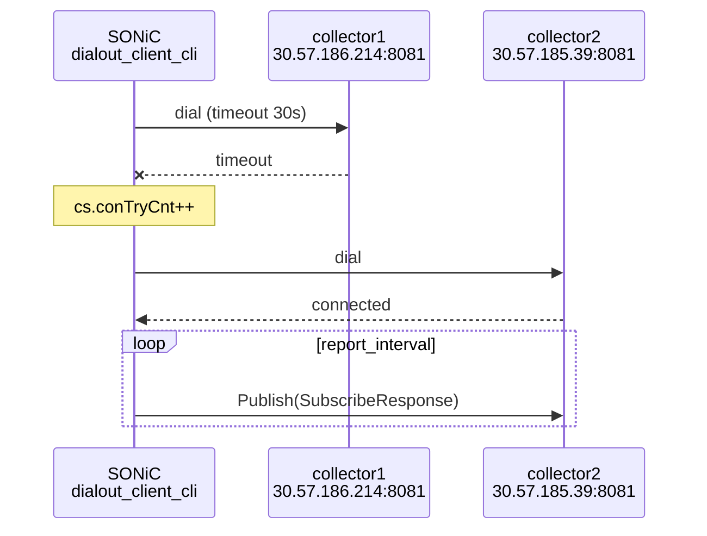

<!-- topics-tip -->
!!! tip "Topics で読み物として読む"
    この HLD は実装詳細を含みます。機能の概念・設定・運用を読み物として読みたい場合は [Topics 09 章: Telemetry / SNMP / ログ](../topics/09-telemetry-snmp/index.md) を参照。
<!-- /topics-tip -->

!!! success "裏取りステータス: code-verified"
    Verifier 2026-05-09: `sonic-gnmi/dialout/dialout_client_cli/dialout_client_cli.go` バイナリと `dialout/dialout_client/dialout_client.go` 内の `TELEMETRY_CLIENT|Global` / `TELEMETRY_CLIENT|DestinationGroup_<name>` / `TELEMETRY_CLIENT|Subscription_<name>` 各キー定義（同ファイル L414, L421, L428）、`proto/dial_out.proto` (`gNMIDialOut.Publish`)、`sonic-buildimage/src/sonic-yang-models/yang-models/sonic-telemetry_client.yang` を確認。OpenConfig 互換は YANG 単独では未確認だがテーブル定義は HLD と整合。

# gNMI dial-out モード（`dialout_client_cli` + `gNMIDialOut.Publish`）

## 概要

通常の [gNMI](../reference/glossary.md#term-gnmi) subscribe は **collector → device** の方向で接続するが、ファイアウォール / [NAT](../reference/glossary.md#term-nat) 越しや stateless collector の場面では device 側から発信したい[^1]。本機能は [SONiC](../reference/glossary.md#term-sonic) を **dial-out クライアント**にし、収集側で動く `gNMIDialOut` サービスへ telemetry を push する。

dialout / dialin の両モードは同じ telemetry コンテナで提供される。DB client が redis から取得、non-DB client は redis 外データを返す[^1]。

## 動作仕様

### サービス定義[^1]

```protobuf
service gNMIDialOut {
  rpc Publish(stream SubscribeResponse) returns (stream PublishResponse);
}

message PublishResponse {
  int64 timestamp = 1;
  Path  prefix    = 2;
  string alias    = 3;
  repeated Path path = 4;
}
```

device 側が `Publish` で gNMI `SubscribeResponse` を流し、collector はオプションで `PublishResponse` を返す（既定は **unidirectional**）。

### 設定（`TELEMETRY_CLIENT` テーブル）

3 カテゴリ[^1]:

#### Global

| key | 既定 | 用途 |
|-----|-----|------|
| `encoding` | `JSON_IETF` | encoding 種別。`ASCII` / `BYTES` / `PROTO` も可 |
| `src_ip` | mgmt IP | dial 元 IP |
| `retry_interval` | `30` (秒) | 失敗時のリトライ間隔 |
| `unidirectional` | `true` | `PublishResponse` を期待しない |

#### `DestinationGroup_<name>`

| key | 用途 |
|-----|------|
| `dst_addr` | `ip:port` をカンマ区切りで複数。1 つ目が落ちたら次へフェイルオーバ |

#### `Subscription_<name>`

| key | 用途 |
|-----|------|
| `dst_group` | 紐づく DestinationGroup 名（プレフィックスは省略） |
| `path_target` | DB target（例: `COUNTERS_DB`） |
| `paths` | カンマ区切り path |
| `report_type` | `periodic` (既定) / `stream` / `once` |
| `report_interval` | ms 単位、既定 `5000` |

### 設定例[^1]

```json
{
  "TELEMETRY_CLIENT": {
    "Global": {
      "encoding": "JSON_IETF", "retry_interval": "30",
      "src_ip": "30.57.185.38", "unidirectional": "true"
    },
    "DestinationGroup_HS": {
      "dst_addr": "30.57.186.214:8081,30.57.185.39:8081"
    },
    "Subscription_HS_RDMA": {
      "dst_group": "HS", "path_target": "COUNTERS_DB",
      "paths": "COUNTERS/Ethernet*,COUNTERS_PORT_NAME_MAP",
      "report_interval": "5000", "report_type": "periodic"
    }
  }
}
```

### 動作フロー



`/usr/sbin/dialout_client_cli -insecure -logtostderr -v 1` で手動起動も可能（開発用）[^1]。検証用に `dialout_server_cli` も提供されており、collector の代わりとして起動できる。

### 配信例（COUNTERS_DB から PFC RX カウンタ）

```text
== subscribeResponse:
update {
  timestamp: 1518398489415679977
  prefix { target: "COUNTERS_DB" }
  update {
    path { elem { name: "COUNTERS" } elem { name: "Ethernet*" } elem { name: "SAI_PORT_STAT_PFC_7_RX_PKTS" } }
    val  { json_ietf_val: "{\"Ethernet0\":{\"SAI_PORT_STAT_PFC_7_RX_PKTS\":\"0\"},...}" }
  }
}
```

OpenConfig の [telemetry yang model](https://github.com/openconfig/public/blob/master/release/models/telemetry/openconfig-telemetry.yang) を参考にスキーマ設計されている[^1]。

### AutoTest / 性能[^1]

- `go test -v ./dialout/dialout_client/` で `TestGNMIDialOutPublish` のサブテスト 2 種（first collector で sync / 1st 失敗時 2nd へフェイルオーバ）
- 性能 / スケールテストは TBD

## 制限事項

- `unidirectional=true` 既定のため `PublishResponse` を使う場合は明示設定
- `DestinationGroup` 内のフェイルオーバは順序付き。両方落ちると retry_interval 後に再試行
- 認証は [HLD](../reference/glossary.md#term-hld) では明示されていない（dialout は通常 TLS で行う）。詳細は telemetry コンテナ側設定に従う

## 干渉する機能

- **dial-in mode**: 同コンテナで提供。設定はそれぞれ別 table
- **gNMI Server**（dial-in）: 同コンテナ内の別サービス
- **OpenConfig telemetry**: 設定スキーマの参照モデル

## 確認コマンド

- `sonic-db-cli CONFIG_DB hgetall "TELEMETRY_CLIENT|Global"` — dial-out 全体設定（retry / encoding 等）
- `sonic-db-cli CONFIG_DB keys "TELEMETRY_CLIENT|DestinationGroup_*"` — 送信先 collector グループ
- `docker exec telemetry supervisorctl status dialout_client` — dialout クライアント状態
- `docker logs telemetry 2>&1 | grep -i dialout` — 接続再試行・publish エラーを確認

```bash
# dial-out telemetry の状態確認
sonic-db-cli CONFIG_DB hgetall "TELEMETRY_CLIENT|Global"
sonic-db-cli CONFIG_DB keys "TELEMETRY_CLIENT|DestinationGroup_*"
docker exec telemetry supervisorctl status dialout_client
docker logs telemetry 2>&1 | grep -i dialout | tail -50
```

## 引用元

[^1]: [sonic-net/SONiC doc/system-telemetry/dialout.md @ 49bab5b](https://github.com/sonic-net/SONiC/blob/49bab5b5ff0e924f1ea52b3d9db0dfa4191a7c06/doc/system-telemetry/dialout.md)

<!-- glossary-links-injected: 8ba32e5aa69d -->
