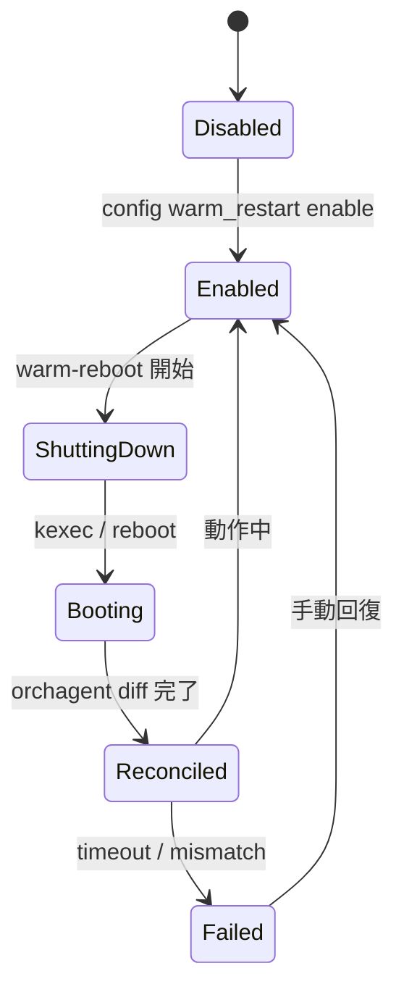

<!-- topics-tip -->
!!! tip "Topics で読み物として読む"
    この HLD は実装詳細を含む。機能の概念・設定・運用を読み物として読みたい場合は [Topics 11 章: Reboot / Warm/Fast/Express/Cold](../topics/11-reboot/index.md) を参照。
<!-- /topics-tip -->

!!! success "裏取りステータス: code-verified"
    `sonic-utilities/scripts/warm-reboot` の warm reboot script、`sonic-buildimage/.../sonic-warm-restart.yang` の `WARM_RESTART` スキーマで HLD の going-down / going-up シーケンスと整合を確認（Verifier 2026-05-10）。詳細な going down / up path は [`system-wide-warmboot.md`](system-wide-warmboot.md) を併読。

# SONiC Warm Reboot（要件・順序・docker 別 warm restart）

## 読み手が知りたいこと

1. **warm reboot とは何で、cold / fast / express とどう違うか**
2. **どこに何が保存され、何が復元されるか**（[SAI](../reference/glossary.md#term-sai) dump / [Redis](../reference/glossary.md#term-redis) dump）
3. **各 docker（bgp / [teamd](../reference/glossary.md#term-teamd-teamsyncd-teammgrd) / swss / lldp / dhcp_relay）は何を準備するべきか**
4. **どの CLI で有効化・実行・確認するか**
5. **データプレーン断や reconcile 失敗のときに何を見るか**

## 1. warm reboot とは

**データプレーンを乱さずに control plane（kernel / docker）を再起動** する [SONiC](../reference/glossary.md#term-sonic) の機能[^1]。LibSAI が [ASIC](../reference/glossary.md#term-asic) state をファイルに退避→ kexec → 復元、という流れで、上限 90 秒の制御平面ダウンを許容しつつフォワーディングは継続させる。

- 同 image / version upgrade は対象、**downgrade は対象外**
- すべての docker / SAI vendor が warm restart を実装している前提
- [BGP](../reference/glossary.md#term-bgp) の GR-helper や teamd の [LACP](../reference/glossary.md#term-lacp) 拡張 timer が peer 側に必要

cold / fast / express との関係は [11-reboot](../topics/11-reboot/index.md) を参照。詳細な going-down / up path と `SONIC_BOOT_TYPE` の扱いは [`system-wide-warmboot.md`](system-wide-warmboot.md)。

## 2. どこに何が保存されるか

| 物 | 保存先 | 役割 |
|----|--------|------|
| ASIC / SAI state | `/host/warmboot/sai-warmboot.bin` | SAI が `remove_switch()` 時に dump、`create_switch` 時に復元 |
| Redis 全体 | `/host/warmboot/dump.rdb` | APP_DB / [ASIC_DB](../reference/glossary.md#term-asic_db) / [STATE_DB](../reference/glossary.md#term-state_db) を再起動後 load |
| `WARM_RESTART_TABLE:system` | STATE_DB | shutdown 進行中フラグ |

## 3. 各レイヤへの要件

### LibSAI / ASIC

- `SAI_KEY_BOOT_TYPE = 1`（warm）で起動可能（0=cold, 2=fast）
- `SAI_SWITCH_ATTR_RESTART_WARM = true` で `remove_switch()` を受けたら state を `SAI_KEY_WARM_BOOT_WRITE_FILE` に書き出す
- `create_switch` を `SAI_SWITCH_ATTR_INIT_SWITCH = true` で呼ぶと保存ファイルから復元
- callback / notification は **SAI が保持しない**。app が再 register

### syncd

- ASIC_DB / 制御 channel から warm shutdown を受けて SAI に橋渡し
- 復旧時に Redis dump と SAI dump を read
- [orchagent](../reference/glossary.md#term-orchagent) との **init view → apply view → diff** で差分のみ SAI に流す

### アプリケーション

各 docker は自身の orch / state を warm reboot を跨いで永続化する責務を持つ:

- **bgp**: graceful restart で peer に GR-helper を促し RIB を保持
- **teamd**: LACP 拡張 timer で 90 秒間 partner にリンクを切らせない
- **swss / orchagent**: APP_DB / ASIC_DB / STATE_DB を Redis dump 保存、再起動後に SAI と diff
- **lldp**: 影響軽微（再認識）
- **dhcp_relay**: lease は server 側保持、relay 自体は無影響

## 4. state machine



## 5. 設定と実行

| Command | 用途 |
|---------|------|
| `config warm_restart enable system` | warm restart 全体有効化 |
| `config warm_restart enable <docker>` | docker 別 |
| `sudo warm-reboot` | warm reboot 実施 |
| `show warm_restart` | 状態確認 |

[CONFIG_DB](../reference/glossary.md#term-config_db):

| Key | 説明 |
|-----|------|
| `WARM_RESTART\|<docker>` | docker 別の `enable` / `timer` |
| `WARM_RESTART\|system` | システム全体の状態 |

## 6. トラブルシューティング

- **90s 超のデータプレーン断** → [syncd](../reference/glossary.md#term-syncd) warm recovery 失敗。`sai-warmboot.bin` の有無を確認
- **BGP convergence 不良** → peer の GR-helper 対応、`config bgp graceful-restart` の値
- **orchagent reconcile が永遠** → APP_DB と ASIC_DB の不一致、syncd ログ

```bash
# warm reboot 前後の確認
config warm_restart enable system
warm-reboot
show warm_restart
ls -la /host/warmboot/ | grep sai-warmboot.bin
sonic-db-cli STATE_DB keys "WARM_RESTART_TABLE|*"
```

## 関連 Topics 章

- [11-reboot](../topics/11-reboot/index.md): warm / fast / express / cold の比較と運用全体像
- [20-swss-sai-redis](../topics/20-swss-sai-redis/index.md): orchagent と SAI の init view / apply view プロトコル

## 制限事項

- **90 秒のデータプレーン断目標**: [HLD](../reference/glossary.md#term-hld) は warm reboot のデータプレーン断を 90 秒以内に抑える設計目標を掲げるが、[ASIC SDK](../reference/glossary.md#term-asic-sdk) の `sai-warmboot.bin` 復元時間や orchagent reconcile に依存し、ベンダー実装で延びることがある。
- **BGP GR ([Graceful Restart](../reference/glossary.md#term-graceful-restart)) 依存**: 隣接 BGP ルータが GR helper をサポートしないとピアセッション切断時にルートが drop される。[FRR](../reference/glossary.md#term-frr) 側の `graceful-restart-time` と peer 側の対応が前提。
- **config 変更の禁止**: warm reboot 進行中 (`pre-shutdown` → `reconcile` 完了まで) の config 変更は未定義動作。`config save` / `config reload` / runtime CLI 変更は避ける必要がある。
- **対応コンテナの限定**: warm restart は対応する docker (`bgp` / `swss` / `syncd` / `teamd` / `nat` / 一部 `lldp`) のみで有効化される。それ以外のコンテナは cold restart 相当となる。
- **multi-ASIC / chassis**: 単体スイッチを想定した設計で、multi-ASIC や [VOQ](../reference/glossary.md#term-voq) chassis では追加の制約 (namespace 単位の順序、`multi-asic-warm-reboot` 補助 HLD) が必要。
- **storage 要件**: `/host/warmboot/` 配下に `sai-warmboot.bin` などの状態ファイルが書き込めるディスク容量が必要。
- **`orchagent_restart_check` が freeze 後も失敗し続ける問題** ([sonic-swss#827](https://github.com/sonic-net/sonic-swss/issues/827)): orchagent が warm reboot の freeze（pause）に成功した後も、`orchagent_restart_check` バイナリが継続して `restart check failed` を報告することがある。freeze 後の orchagent はリクエストを処理しなくなるため、デフォルト 1 秒タイムアウトで毎回失敗するように見える。ログに `RESTARTCHECK failed <n>` が多数出力されていても、その時点で orchagent がすでに freeze 済みである可能性がある。実際の orchagent の状態は syslog の `orchagent: Paused` メッセージや STATE_DB の warm restart 状態で確認すること。

## 引用元

[^1]: `sonic-net/SONiC` `doc/warm-reboot/SONiC_Warmboot.md` @ `49bab5b5ff0e924f1ea52b3d9db0dfa4191a7c06`

<!-- topics-back-ref -->
## 関連 Topics

- [Topics: Reboot / Upgrade / Lifecycle](../topics/11-reboot/index.md)

<!-- /topics-back-ref -->

<!-- glossary-links-injected: ec18b66e3507 -->
