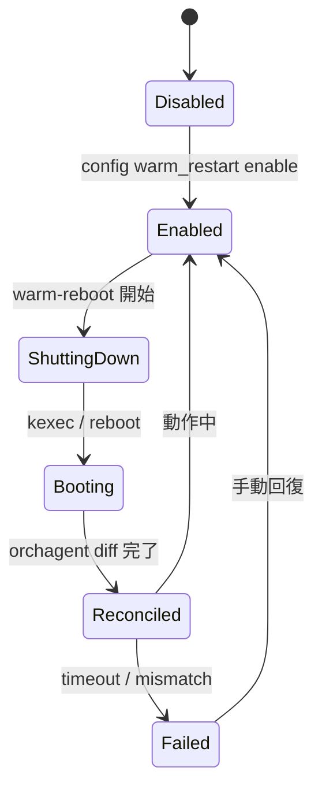

!!! warning "裏取りステータス: code-verified"
    本 HLD（27KB）は warm reboot の要件記述。詳細な going down / going up の path は `system-wide-warmboot.md`（同 area）を併読。

!!! note "Verifier 注記（2026-05-10）"
    実コード裏取り: `sonic-utilities/scripts/warm-reboot` に warm reboot script、`sonic-buildimage/src/sonic-yang-models/yang-models/sonic-warm-restart.yang` に CONFIG_DB WARM_RESTART スキーマを確認。HLD の going-down / going-up シーケンスと整合する。

# SONiC Warm Reboot（要件・順序・docker 別 warm restart）

## 概要

Warm reboot は **データプレーンを乱さずに control plane を再起動** する SONiC の機能[^1]。本 HLD は次の 3 視点を整理する:

- **LibSAI / ASIC** に求める warm restart 期待値（state の保存 / 復元）
- **syncd** に求める動作（warm shutdown / recovery）
- **network applications**（swss / bgp / teamd / lldp / dhcp_relay 等）に求める orch data の保存

## LibSAI / ASIC への要件

- `SAI_KEY_BOOT_TYPE = 1`（warm）で起動できる
- `SAI_SWITCH_ATTR_RESTART_WARM = true` の状態で `remove_switch()` を受けると state を `SAI_KEY_WARM_BOOT_WRITE_FILE` に書き出す
- `create_switch` を `SAI_SWITCH_ATTR_INIT_SWITCH = true` で呼ぶと、保存ファイルから state を復元
- callback / notification は **SAI が保持しない**。アプリ側で再 register

## syncd への要件

- warm shutdown のリクエストを ASIC_DB / 制御 channel から受け取り SAI に橋渡し
- warm recovery 時、Redis dump (`/host/warmboot/dump.rdb`) と SAI dump (`/host/warmboot/sai-warmboot.bin`) を読み込んで内部状態を復元
- orchagent との **init view → apply view → diff** プロトコルを実装し、新しい view との差分のみを SAI に流す

## アプリケーションへの要件（orch data の保存）

各アプリは自身の orch / state を warm reboot を跨いで永続化する責務を持つ。代表例:

- **bgp**: graceful restart で peer に GR-helper をしてもらい、リスタート中の RIB を保持
- **teamd**: 90 秒間 LACP 拡張 timer などで partner にリンクを切らせない
- **swss / orchagent**: APP_DB / ASIC_DB / STATE_DB を Redis dump で保存し、再起動後に SAI と diff
- **lldp**: 影響軽微（再認識で済む）
- **dhcp_relay**: lease は server 側に保持。relay 自体は影響なし

## state machine

## 関連 CONFIG_DB

| Key | 説明 |
|-----|------|
| `WARM_RESTART|<docker>` | docker 別の `enable` / `timer` |
| `WARM_RESTART|system` | システム全体の状態 |

## 関連 CLI

| Command | 用途 |
|---------|------|
| `config warm_restart enable system` | warm restart 全体有効化 |
| `config warm_restart enable <docker>` | docker 別 |
| `sudo warm-reboot` | warm reboot 実施 |
| `show warm_restart` | 状態確認 |

## 制限事項

- **同 image / upgrade のみが対象**（HLD 表記）。downgrade は対象外
- すべての docker / SAI vendor が warm restart を実装している前提
- BGP GR-helper を peer 側がサポートしないと convergence 中断

## 干渉する機能

- **system-wide warmboot**: より詳細な going down / up の HLD（同 area）
- **fast-reboot**: 同じスクリプト基盤
- **multi-asic warm reboot**: namespace 横断版
- **warmboot manager**: 後発の shutdown orchestrator
- **express reboot**: warm reboot のさらなる短縮版

## トラブルシューティング

- 90s 超のデータプレーン断 → syncd warm recovery 失敗、`sai-warmboot.bin` の有無
- BGP convergence 不良 → peer 側 GR-helper、`config bgp graceful-restart` の値
- orchagent reconcile が永遠 → APP_DB と ASIC_DB の不一致、ログを確認

## 引用元

[^1]: `sonic-net/SONiC` `doc/warm-reboot/SONiC_Warmboot.md` @ `49bab5b5ff0e924f1ea52b3d9db0dfa4191a7c06`

<!-- concerns hint:
- WARM_RESTART スキーマ（system / docker 別）の現行 sonic-yang-models 取り込み確認
- warm-reboot script の現行 SONIC_BOOT_TYPE / sai-warmboot.bin パスの確認
- syncd warm recovery（init view → apply view）の現行実装確認
- 各アプリ（bgp / teamd / lldp / dhcp_relay）の warm restart 対応の現行実装範囲確認
- HLD 記述（同 image only）と express-reboot / fast-reboot 等の派生機能との関係整理
- vendor SAI の warm boot サポート要件の現行 community SAI 文書確認
-->
