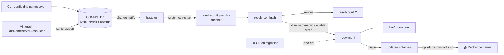
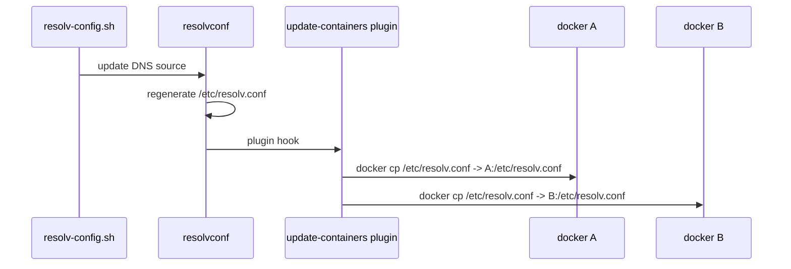

!!! success "裏取りステータス: Code-verified"
    `sonic-buildimage/files/image_config/resolv-config/` 配下に `resolv-config.service` / `resolv-config.sh` / `resolv.conf.j2` / `resolv.conf.head` / `update-containers` がすべて存在することを確認。`sonic-buildimage/src/sonic-config-engine/minigraph.py` L2648-2667 で `DnsNameserverResources` を `dns.j2` テンプレートで展開し `results['DNS_NAMESERVER']` に格納する実装を確認 (verified at: 2026-05-09)。

# 静的 DNS 設定（DNS_NAMESERVER と resolvconf 連携）

## 概要

[SONiC](../reference/glossary.md#term-sonic) は管理インタフェース経由で **DHCP から DNS リゾルバ情報を動的に受け取る** のが既定挙動である。一方、ユーザが手動で `/etc/resolv.conf` を書いてもタイミングによっては DHCP の更新で上書きされてしまい、**静的 DNS が保護されない** という問題があった[^1]。

本機能は [CONFIG_DB](../reference/glossary.md#term-config_db) に `DNS_NAMESERVER` テーブルを追加し、CLI から永続的に静的 DNS を投入できるようにする。中継には Debian の `resolvconf` パッケージを使う。`resolvconf` は「複数の DNS 情報供給源を統合してアプリに通知する」フレームワークで、これに `mgmt-intf.static` という形でユーザ設定を流し込み、動的 DHCP 情報と静的設定の優先制御を行う設計である。

加えて、SONiC の各 docker コンテナ内 `/etc/resolv.conf` も同期する必要があるため、新規の resolvconf プラグイン **`update-containers`** が DNS 変更時に各コンテナへ `/etc/resolv.conf` をコピーする[^1]。

## 動作仕様

### コンポーネント図



### 設定優先のロジック

`resolv-config.sh` は以下の単純な分岐で動く[^1]。

1. CONFIG_DB から `DNS_NAMESERVER` を取得。
2. **静的設定が無い** ⇒ resolvconf の動的更新を有効化（DHCP 経由の DNS を受け入れる）。
3. **静的設定がある** ⇒ `resolv.conf.j2` テンプレートでレンダリングし、`/run/resolvconf/interface/mgmt-intf.static` に書き出す。同時に **動的更新を無効化** して、DHCP 由来の DNS が上書きしないようにする。

つまり「静的があれば静的のみ」「無ければ DHCP 動的のみ」という排他的な切替で、混在は行わない。

### `resolv-config.service`

ホスト側の oneshot systemd サービス。次の 3 経路で起動される[^1]。

| 起動経路 | 例 |
|---------|----|
| `sonic.target` の依存（boot / `config reload`）| 通常起動 |
| `hostcfgd` から `systemctl restart` | CONFIG_DB の DNS_NAMESERVER 変更時 |
| 運用者の手動 `systemctl restart resolv-config.service` | 緊急対応 |

`updategraph.service` の **後** に起動する依存関係を持つ。`resolv-config.sh` は引数なしで呼ばれ、上述のロジックを実行する。

### コンテナへの伝播

`resolvconf` 自体は ホスト側の `/etc/resolv.conf` までしか面倒を見ない。SONiC では DNS を **swss / bgp / mgmt-framework 等の docker コンテナ内** からも引きたいので、resolvconf の plugin として `update-containers` を入れる[^1]。



このプラグインは **DHCP 経由の動的更新時にも呼ばれる**。コンテナへの同期は静的 / 動的を問わず行う設計である[^1]。

### Minigraph 連携

工場出荷時設定のような minigraph 由来の構成のために、`<a:DeviceProperty>` に `DnsNameserverResources` を追加できる[^1]。

```xml
<a:DeviceProperty>
    <a:Name>DnsNameserverResources</a:Name>
    <a:Value>"IP addresses list"</a:Value>
</a:DeviceProperty>
```

`sonic-cfggen` がこれを `DNS_NAMESERVER` テーブルへ展開する。

### 制限

- **管理インタフェースが静的 IP の場合、動的 DNS が動かない**。[HLD](../reference/glossary.md#term-hld) で明示的に書かれた制限。これは `dhclient` 経由で `<mgmt-intf>.dhclient` ファイルが作成されないためであり、本機能というより resolvconf 連携の都合である[^1]。
- Warm/fast boot には影響なし。
- Config migration は特別扱い不要。

<!-- evidence:
source: sonic-net/SONiC/doc/static-dns/static_dns.md#L82-L96 (sha: 49bab5b5ff0e924f1ea52b3d9db0dfa4191a7c06)
excerpt: |
  - Get DNS configuration from Config DB.
  - If no DNS configuration is available in Config DB enable resolvconf updates to receive dynamic DNS configuration.
  - If DNS configuration is available render static DNS configuration with resolv.conf.j2 template, disable resolvconf update to not receive dynamic configuration updates.
reasoning: 静的 / 動的の排他切替ロジックの根拠。
-->

<!-- evidence-rendered:start -->
??? note "📋 検証エビデンス: sonic-net/SONiC/doc/static-dns/static_dns.md#L82-L96 (sha: 49bab5b5ff0e924f1ea52b3d9db0dfa4191a7c06)"

    **出典**:

    `sonic-net/SONiC/doc/static-dns/static_dns.md#L82-L96 (sha: 49bab5b5ff0e924f1ea52b3d9db0dfa4191a7c06)`

    **抜粋**:

    ```text
    - Get DNS configuration from Config DB.
    - If no DNS configuration is available in Config DB enable resolvconf updates to receive dynamic DNS configuration.
    - If DNS configuration is available render static DNS configuration with resolv.conf.j2 template, disable resolvconf update to not receive dynamic configuration updates.
    ```

    **判断根拠**: 静的 / 動的の排他切替ロジックの根拠。

<!-- evidence-rendered:end -->

## 設定

### 関連する CONFIG_DB

| Table | Key | フィールド | 説明 |
|-------|-----|-----------|------|
| `DNS_NAMESERVER` | `<ip-address>` | （空） | キーそのものが nameserver の IP（v4 / v6） |

[YANG](../reference/glossary.md#term-yang) では最大 3 件まで（`max-elements 3`）に制限される[^1]。

### 関連する CLI

| Command | 用途 |
|---------|------|
| `config dns nameserver add <ip>` | 静的 DNS 追加（IPv4 / IPv6 とも可）|
| `config dns nameserver del <ip>` | 削除 |
| `show dns nameserver` | 設定済み DNS 一覧 |

### 関連する YANG

```yang
container sonic-dns {
    container DNS_NAMESERVER {
        list DNS_NAMESERVER_LIST {
            max-elements 3;
            key "ip";
            leaf ip { type inet:ip-address; }
        }
    }
}
```

### 設定例

```bash
config dns nameserver add 1.1.1.1
config dns nameserver add fe80:1000:2000:3000::1

show dns nameserver
# NAMESERVER
# 1.1.1.1
# fe80:1000:2000:3000::1
```

CONFIG_DB JSON:

```json
{
    "DNS_NAMESERVER": {
        "1.1.1.1": {},
        "fe80:1000:2000:3000::1": {}
    }
}
```

## 干渉する機能

- **DHCP (mgmt インタフェース)**: 静的 DNS 設定がある間は DHCP 経由 DNS は無視される（resolvconf の動的更新を停止するため）。
- **管理インタフェース静的 IP**: dhclient が走らないため、そもそも動的 DNS が来ない。静的 DNS を入れない限り名前解決ができない可能性。
- **Docker コンテナ内 DNS 利用**: [SNMP](../reference/glossary.md#term-snmp) / TACACS / NTP 等が FQDN で設定されている場合、`update-containers` プラグインによる伝播タイミングが遅れると瞬間的に解決失敗する可能性。
- **`config reload`**: `sonic.target` 再起動の流れで `resolv-config.service` も再走するので、DNS_NAMESERVER の変更は永続化していれば再 reload 後も反映される。

## トラブルシューティング

- 静的 DNS を入れたのに名前解決が動かない: `/etc/resolv.conf` を確認し、`mgmt-intf.static` 経由で nameserver が反映されているかをチェック。`systemctl status resolv-config.service` で oneshot の最新実行結果も確認。
- 動的 DNS に戻したい: `config dns nameserver del <ip>` ですべて削除すれば、`resolv-config.sh` が動的更新を再有効化する。
- コンテナ内だけ古い DNS が残る: `update-containers` プラグインの動作不良が疑われる。各コンテナに `docker exec ... cat /etc/resolv.conf` で照合する。
- IPv6 link-local DNS: `fe80::` 系は zone id が必要なケースがある。CONFIG_DB / CLI 側でゾーン記法を受けるかどうかは HLD では明記されていないため、実装裏取りが必要。

```bash
# 静的 DNS の確認
show dns nameserver
sonic-db-cli CONFIG_DB keys "DNS_NAMESERVER|*"
cat /etc/resolv.conf
systemctl status resolv-config.service
docker exec bgp cat /etc/resolv.conf
```

## 関連 reference

- [YANG: sonic-dns](../reference/yang/sonic-dns.md)
- [Topics: NAT / DHCP / DNS](../topics/16-nat-dhcp-dns/index.md)

## 制限事項

- DHCP から取得した DNS と静的設定の DNS が混在する場合、`/etc/resolv.conf` 生成順は resolvconf / systemd-resolved の挙動に依存し、HLD 通りにならない事がある。
- management [VRF](../reference/glossary.md#term-vrf) を使う場合、DNS lookup を VRF 内で行うために `ip vrf exec mgmt nslookup ...` のラップが必要となるユーティリティがある。
- IPv6 DNS サーバの優先順位制御は CLI からは表現できず、`config_db.json` 直編集に頼る場合がある。

## 引用元

[^1]: `sonic-net/SONiC` `doc/static-dns/static_dns.md` @ `49bab5b5ff0e924f1ea52b3d9db0dfa4191a7c06`

<!-- topics-back-ref -->
## 関連 Topics

- [Topics: NAT / DHCP Relay / Time-DNS Services](../topics/16-nat-dhcp-dns/index.md)

<!-- /topics-back-ref -->

<!-- glossary-links-injected: 8ba32e5aa69d -->
