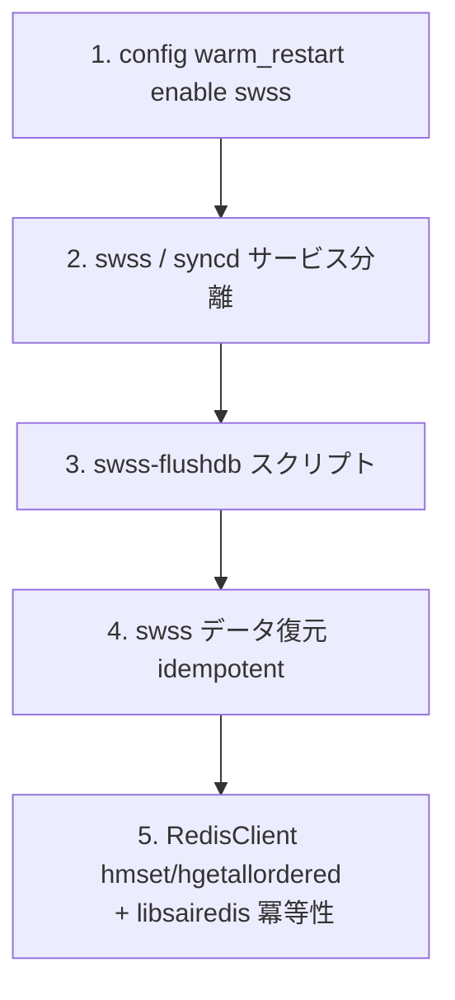

!!! warning "裏取りステータス: HLD-only / 開発時メモ"
    このドキュメントは HLD 自身が冒頭で **"Note: This document is temporary. The code implementations are for reference only. Active development and testing is in progress"** と述べる、warm-restart 機能開発当時のコードリファレンスメモ。**現行 master の Warm Restart の正確な仕様ではない**。具体的な分岐先 PR は当時の開発者個人の fork であり、現行 master では取り込み・改変されている。

# SWSS docker の Warm Restart 実装メモ（開発時リファレンス）

## 概要

`sonic-installer upgrade_docker` で SWSS docker をデータプレーンに影響を与えずアップグレードするために必要な変更点を、開発当時の作業メモとしてまとめたもの[^1]。CLI 動作例と関連リポジトリへの diff リンクが主な内容で、以下の 5 領域の実装変更を扱う。

1. SWSS warm restart の有効化スイッチ（`config warm_restart enable swss`）
2. `swss` と `syncd` サービスの分離 + warm start での CONFIG_DB 取り扱い
3. `swss-flushdb` スクリプトの追加
4. SWSS データ復元（idempotent な orchagent 動作）
5. Redis client の `hmset` / `hgetallordered` 追加と libsairedis の Redis API 冪等性サポート

## 動作仕様

### CLI 例

```text
# Warm Restart の有効化
root@sonic:~# config warm_restart enable swss
root@sonic:~# show warm_restart
WARM_RESTART teamd enable false
WARM_RESTART swss neighbor_timer 5
WARM_RESTART swss enable true
WARM_RESTART system enable false
```

```text
# docker upgrade
sonic-installer upgrade_docker swss test_v03 docker-orchagent-brcm_v03.gz --cleanup_image
# 内部で systemctl stop swss → docker rm/load/tag → systemctl restart swss を実行
```

### Warm Restart テーブル（STATE_DB）

```text
WARM_RESTART_TABLE:portsyncd
WARM_RESTART_TABLE:neighsyncd
WARM_RESTART_TABLE:vlanmgrd
WARM_RESTART_TABLE:orchagent

WARM_RESTART_TABLE:orchagent
  restart_count = 4
WARM_RESTART_TABLE:neighsyncd
  restart_count = 4
```

各サブシステムがリスタート回数を `restart_count` として記録する。

### 5 領域の改修ポイント



#### 1. swss / syncd の分離

warm restart 対象は **swss コンテナのみ**。syncd は別サービスとして残し、CONFIG_DB の起動順や warm start シーケンスで両者を分けて扱う必要がある[^1]。

#### 2. swss-flushdb

旧 swss コンテナが落ちる前に APPL_DB / STATE_DB の特定エントリをクリーンに保つためのスクリプト。

#### 3. データ復元（idempotent orchagent）

新 swss コンテナが起動すると、APPL_DB に残っている既存エントリと SAI 側の既存オブジェクトを突き合わせ、**同じプログラムを再実行しても副作用を起こさない**（idempotent）動作をする必要がある[^1]。

#### 4. Redis ライブラリ拡張

`hmset` と `hgetallordered` を `RedisClient` に追加。順序付き hash 取得は復元時の決定論的な再生に必要。

#### 5. libsairedis の Redis API 冪等性

orchagent の復元処理に必要な、Redis 経由の SAI コマンド再実行で結果が変わらないようにする改修。

## 設定

### 関連する CONFIG_DB

| Table | Key | フィールド | 説明 |
|-------|-----|-----------|------|
| `WARM_RESTART` | `swss` | `enable` / `neighbor_timer` | SWSS warm restart 有効化と timer |

### 関連する CLI

| Command | 用途 |
|---------|------|
| `config warm_restart enable swss` | SWSS の warm restart を有効化 |
| `show warm_restart` | 各サブシステムの warm restart 状態 |
| `sonic-installer upgrade_docker <name> <tag> <url>` | Docker 単体アップグレード |

### 関連する YANG

HLD に YANG モデルの記述は無い。

### 設定例

```bash
config warm_restart enable swss
show warm_restart
# アップグレード
sonic-installer upgrade_docker swss test_v03 docker-orchagent-brcm_v03.gz --cleanup_image
```

## 制限事項

- HLD 自体が「temporary」で、現行 master の Warm Restart 仕様の権威ではない。
- HLD 内で参照されている各 PR/diff は **当時の個人 fork**（jipanyang）への compare URL。現行 master では複数 PR にバラされて取り込まれている。
- ` virtual switch` テストの結果（45 tests passed）も当時のスナップショットにすぎない。

## 干渉する機能

- **syncd warm restart**: 別途 `sonic-buildimage` 側の syncd warm restart 設計を参照する必要がある。
- **teamd warm restart**: `WARM_RESTART teamd` フラグで別管理。
- **System warm restart (kernel)**: `WARM_RESTART system` フラグで別管理。

## トラブルシューティング

- SWSS docker upgrade でデータプレーンが切れる → `WARM_RESTART_TABLE:*` の `restart_count` が増えているかを確認。
- `swss-flushdb` 失敗 → APPL_DB の状態が不整合な可能性。手動で `redis-cli -n 0 keys *_TABLE:*` で確認。
- 復元後に同一エントリが二重登録される → libsairedis 冪等性パッチが効いていない可能性。
- 詳細実装は HLD `doc/warm-reboot/code_implementation.md` を参照（このドキュメントは要点のみ）。

## 引用元

[^1]: `sonic-net/SONiC` `doc/warm-reboot/code_implementation.md` @ `49bab5b5ff0e924f1ea52b3d9db0dfa4191a7c06`
