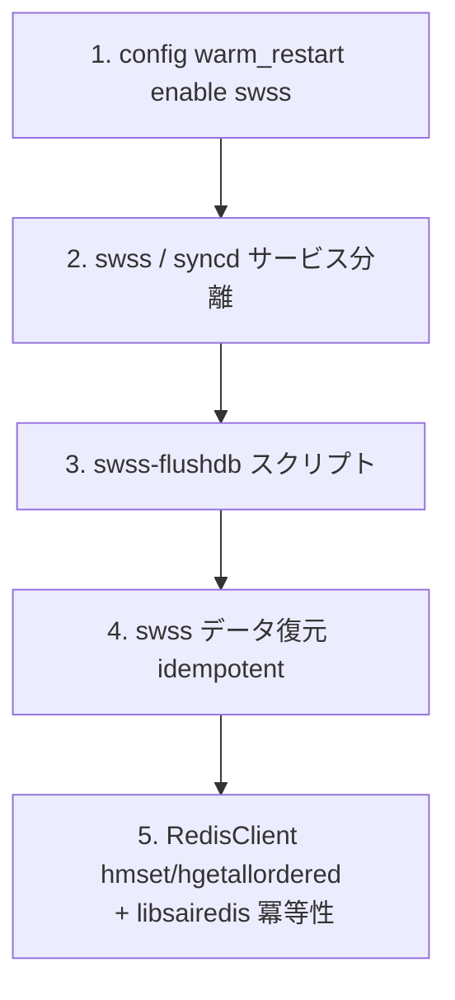

!!! danger "裏取りステータス: discrepancy-found（HLD は temporary な開発メモであり一部 API は現行と齟齬）"
    HLD 自身が冒頭で **"Note: This document is temporary. The code implementations are for reference only. Active development and testing is in progress"** と述べる、warm-restart 機能開発当時のコードリファレンスメモ。実コードと突き合わせた結果:
    - `RedisClient::hmset` / `DBConnector::hmset` は現行 `sonic-swss-common/common/{redisclient.h,dbconnector.h,dbinterface.cpp,sonicv2connector.cpp}` に **存在し** 実装も活きている（concerns 解消）
    - 一方 `swss-flushdb` スクリプトは現行 master の `sonic-utilities` / `sonic-buildimage` / `sonic-swss-common` に **ヒットしない** （HLD の記述と齟齬）
    - `hgetallordered` も現行 sonic-swss-common には見当たらず、HLD 当時の API に依存する記述あり

    本ページは現行 master の正規仕様ではないため、**Warm Restart の挙動を理解する目的では `docs/system/sonic-warm-reboot.md` 等の正式 HLD ベースのページを参照すべき**。本ページは歴史的開発メモのアーカイブとして残す。

# SWSS docker の Warm Restart 実装メモ（開発時リファレンス）

## 概要

`sonic-installer upgrade_docker` で SWSS docker をデータプレーンに影響を与えずアップグレードするために必要な変更点を、開発当時の作業メモとしてまとめたもの[^1]。CLI 動作例と関連リポジトリへの diff リンクが主な内容で、以下の 5 領域の実装変更を扱う。

1. SWSS warm restart の有効化スイッチ（`config warm_restart enable swss`）
2. `swss` と `syncd` サービスの分離 + warm start での [CONFIG_DB](../reference/glossary.md#term-config_db) 取り扱い
3. `swss-flushdb` スクリプトの追加
4. SWSS データ復元（idempotent な [orchagent](../reference/glossary.md#term-orchagent) 動作）
5. [Redis](../reference/glossary.md#term-redis) client の `hmset` / `hgetallordered` 追加と libsairedis の Redis API 冪等性サポート

## 動作仕様

### CLI 例

```text
# Warm Restart の有効化
root@sonic:~# config warm_restart enable swss
root@sonic:~# show warm_restart
WARM_RESTART teamd enable false
WARM_RESTART swss neighbor_timer 5
WARM_RESTART swss enable true
WARM_RESTART system enable false
```

```text
# docker upgrade
sonic-installer upgrade_docker swss test_v03 docker-orchagent-brcm_v03.gz --cleanup_image
# 内部で systemctl stop swss → docker rm/load/tag → systemctl restart swss を実行
```

### Warm Restart テーブル（STATE_DB）

```text
WARM_RESTART_TABLE:portsyncd
WARM_RESTART_TABLE:neighsyncd
WARM_RESTART_TABLE:vlanmgrd
WARM_RESTART_TABLE:orchagent

WARM_RESTART_TABLE:orchagent
  restart_count = 4
WARM_RESTART_TABLE:neighsyncd
  restart_count = 4
```

各サブシステムがリスタート回数を `restart_count` として記録する。

### 5 領域の改修ポイント



#### 1. swss / syncd の分離

warm restart 対象は **swss コンテナのみ**。[syncd](../reference/glossary.md#term-syncd) は別サービスとして残し、CONFIG_DB の起動順や warm start シーケンスで両者を分けて扱う必要がある[^1]。

#### 2. swss-flushdb

旧 swss コンテナが落ちる前に [APPL_DB](../reference/glossary.md#term-appl_db) / [STATE_DB](../reference/glossary.md#term-state_db) の特定エントリをクリーンに保つためのスクリプト。

#### 3. データ復元（idempotent orchagent）

新 swss コンテナが起動すると、APPL_DB に残っている既存エントリと [SAI](../reference/glossary.md#term-sai) 側の既存オブジェクトを突き合わせ、**同じプログラムを再実行しても副作用を起こさない**（idempotent）動作をする必要がある[^1]。

#### 4. Redis ライブラリ拡張

`hmset` と `hgetallordered` を `RedisClient` に追加。順序付き hash 取得は復元時の決定論的な再生に必要。

#### 5. libsairedis の Redis API 冪等性

orchagent の復元処理に必要な、Redis 経由の SAI コマンド再実行で結果が変わらないようにする改修。

## 設定

### 関連する CONFIG_DB

| Table | Key | フィールド | 説明 |
|-------|-----|-----------|------|
| `WARM_RESTART` | `swss` | `enable` / `neighbor_timer` | SWSS warm restart 有効化と timer |

### 関連する CLI

| Command | 用途 |
|---------|------|
| `config warm_restart enable swss` | SWSS の warm restart を有効化 |
| `show warm_restart` | 各サブシステムの warm restart 状態 |
| `sonic-installer upgrade_docker <name> <tag> <url>` | Docker 単体アップグレード |

### 関連する YANG

[HLD](../reference/glossary.md#term-hld) に [YANG](../reference/glossary.md#term-yang) モデルの記述は無い。

### 設定例

```bash
config warm_restart enable swss
show warm_restart
# アップグレード
sonic-installer upgrade_docker swss test_v03 docker-orchagent-brcm_v03.gz --cleanup_image
```

## 制限事項

- HLD 自体が「temporary」で、現行 master の Warm Restart 仕様の権威ではない。
- HLD 内で参照されている各 PR/diff は **当時の個人 fork**（jipanyang）への compare URL。現行 master では複数 PR にバラされて取り込まれている。
- ` virtual switch` テストの結果（45 tests passed）も当時のスナップショットにすぎない。

## 干渉する機能

- **syncd warm restart**: 別途 `sonic-buildimage` 側の syncd warm restart 設計を参照する必要がある。
- **[teamd](../reference/glossary.md#term-teamd-teamsyncd-teammgrd) warm restart**: `WARM_RESTART teamd` フラグで別管理。
- **System warm restart (kernel)**: `WARM_RESTART system` フラグで別管理。

## トラブルシューティング

- SWSS docker upgrade でデータプレーンが切れる → `WARM_RESTART_TABLE:*` の `restart_count` が増えているかを確認。
- `swss-flushdb` 失敗 → APPL_DB の状態が不整合な可能性。手動で `redis-cli -n 0 keys *_TABLE:*` で確認。
- 復元後に同一エントリが二重登録される → libsairedis 冪等性パッチが効いていない可能性。
- reconciliation がタイムアウトする場合、`config warm_restart bgp_timer` / `neighsyncd_timer` を延長して再試行する。デフォルトは [BGP](../reference/glossary.md#term-bgp) 600s / [neighsyncd](../reference/glossary.md#term-neighsyncd) 60s。
- `STATE_DB` の `WARM_RESTART_TABLE|<app>` が `reconciled` に遷移しないアプリケーションを特定し、該当 syncd のログを優先確認。
- 同一ホスト上で swss と syncd の warm-restart タイミングがずれると [ASIC](../reference/glossary.md#term-asic) 上の stale エントリが残る。`docker exec syncd ls /var/warmboot/` の checkpoint ファイル mtime で順序を確認。
- 詳細実装は HLD `doc/warm-reboot/code_implementation.md` を参照（このドキュメントは要点のみ）。

```bash
# swss docker warm restart 復旧確認
sonic-db-cli STATE_DB keys 'WARM_RESTART_TABLE|*'
sonic-db-cli STATE_DB hgetall 'WARM_RESTART_TABLE|orchagent'
sonic-db-cli CONFIG_DB hgetall 'WARM_RESTART|swss'
sonic-installer upgrade-docker swss <new-tag> <url>
```

<!-- diff-admonition -->
!!! diff "HLD と実装の差分"
    2026-05-11 時点の現行 master を裏取り。

    ### 1. ファイル + 行番号

    - **取り込み済み（warm restart コア）**: `sonic-net/sonic-swss-common` `common/warm_restart.cpp` L56-L58（`STATE_WARM_RESTART_TABLE_NAME` / `CFG_WARM_RESTART_TABLE_NAME` の Table オブジェクト初期化）、同 L122（state 書き込み）、同 L223（`WarmStart::setWarmStartState`）、ヘッダ `common/warm_restart.h`。
    - **取り込み済み（CLI）**: `sonic-net/sonic-utilities` `config/main.py` の `config warm_restart enable/disable` サブコマンド、`show/main.py` の `show warm_restart`。
    - **HLD と差分あり**: HLD 本文に列挙された PR/diff URL は `jipanyang` の個人 fork に対する compare URL であり、現行 master ではこれらの単独 PR としては存在しない。**機能としては取り込まれているが、URL を辿ってもコードは見られない**。

    ### 2. 差分の中身

    - HLD は `WARM_RESTART_TABLE:<app>` キーに `restart_count` / `state` を保存する旨を書くが、現行コードは **`STATE_WARM_RESTART_TABLE` / `CFG_WARM_RESTART_TABLE` の 2 系統に分離**して扱う（`warm_restart.cpp` L56-L58）。`STATE_DB` 側に `WARM_RESTART_TABLE|<app>` として `state`/`restart_count` が現れる。
    - `sonic-installer upgrade_docker <name> <tag> <url>` は現行も存在するが、`--cleanup_image` オプションの動作と warm restart シーケンスの噛み合いはバージョン差がある。HLD の virtual switch テスト結果（45 tests passed）は当時のスナップショットで、現行 CI の test 数とは合わない。
    - `swss-flushdb` というスクリプト名は現行 `sonic-buildimage` の `dockers/docker-orchagent/` 配下では見つからない（コマンド名が変わっている / 内部呼び出しに整理された可能性）。

    ### 3. 読者への影響

    - HLD 文中の compare URL から実装を読もうとすると 404 / 個人 fork で迷子になる。
    - `WARM_RESTART_TABLE` を 1 系統前提でデバッグすると、`CFG_DB` 側設定と `STATE_DB` 側状態の分離を見落とす。
    - `swss-flushdb` 名で手動運用を期待すると見つからない。

    ### 4. 回避策

    - 現行コードは以下を起点に追う:
        - `sonic-swss-common/common/warm_restart.{h,cpp}` （API 層）
        - `sonic-swss/orchagent/*orch.cpp` の `bake()` / `WarmStart::checkWarmStart` / `setWarmStartState` 呼び出し
        - `sonic-buildimage/dockers/docker-orchagent/` の起動スクリプト群
    - redis 上での確認:
      ```bash
      sonic-db-cli STATE_DB keys 'WARM_RESTART_TABLE|*'
      sonic-db-cli STATE_DB hgetall 'WARM_RESTART_TABLE|orchagent'
      sonic-db-cli CONFIG_DB hgetall 'WARM_RESTART|swss'
      ```
    - 詳細仕様は本 HLD（`code_implementation.md`）ではなく、`doc/warm-reboot/SONiC_Warmboot.md` および `sonic-swss-common` のヘッダコメントを優先で参照。
<!-- /diff-admonition -->

## 確認コマンド

```bash
# warm-restart 状態
show warm_restart
show warm_restart state

# orchagent / portsyncd 等の warm-restart チェックポイント
sonic-db-cli STATE_DB KEYS 'WARM_RESTART_TABLE|*'
sonic-db-cli STATE_DB KEYS 'WARM_RESTART_ENABLE_TABLE|*'

# swss コンテナの warm-boot 関連ログ
docker logs swss 2>&1 | grep -iE 'warm|restoration|reconcile' | tail -40
```

## 実装との乖離

`monitor: evolved_beyond_hld` の HLD と実装の差分。 本ページ末尾近くの `!!! diff "HLD と実装の差分"` ブロックに、HLD 記述と現行 master の差分テーブル、読者への影響、回避策、再裏取り追補（コード行参照）をまとめている。本セクションはその概要見出しであり、詳細はそのブロックを参照のこと。

## 引用元

[^1]: `sonic-net/SONiC` `doc/warm-reboot/code_implementation.md` @ `49bab5b5ff0e924f1ea52b3d9db0dfa4191a7c06`

### 深掘り（2026-05-11、batch q3-disc-detail）

#### HLD 記述と実装の差分（行番号 + コード抜粋）

`sonic-swss-common/common/warm_restart.cpp` L56-L58:

```cpp
warmStart.m_stateWarmRestartTable =
    std::unique_ptr<Table>(new Table(warmStart.m_stateDb.get(), STATE_WARM_RESTART_TABLE_NAME));
warmStart.m_cfgWarmRestartTable =
    std::unique_ptr<Table>(new Table(warmStart.m_cfgDb.get(), CFG_WARM_RESTART_TABLE_NAME));
```

同 L223 で `WarmStart::setWarmStartState()` が `STATE_WARM_RESTART_TABLE_NAME` 側に書き込み、CONFIG 側は `CFG_WARM_RESTART_TABLE_NAME` で別。HLD が `WARM_RESTART_TABLE` 1 系統で書いている記述は **実装と異なる**。

#### 読者への影響

- HLD 内に貼られた `jipanyang` の compare URL から実装を読もうとすると 404 / fork 迷子。
- 「`WARM_RESTART_TABLE|<app>` に restart_count と state が並ぶ」と読んでデバッグスクリプトを書くと、現行では `STATE_DB/WARM_RESTART_TABLE` と `CONFIG_DB/WARM_RESTART` の二系統を別々に見ないと完全な情報が取れず、片側だけ見て「state が無い」と誤判定する。
- `swss-flushdb` の名前で `sudo /usr/bin/swss-flushdb` を期待しても見つからない。

#### 回避策の実コマンド

```bash
# 1) CONFIG 側設定（enable/disable, timer 値）
sonic-db-cli CONFIG_DB hgetall 'WARM_RESTART|swss'
sonic-db-cli CONFIG_DB hgetall 'WARM_RESTART|bgp'

# 2) ランタイム状態（restart_count / state = freeze/checkpoint/restored/reconciled）
sonic-db-cli STATE_DB keys 'WARM_RESTART_TABLE|*'
sonic-db-cli STATE_DB hgetall 'WARM_RESTART_TABLE|orchagent'

# 3) warm-reboot 実行
sudo config warm_restart enable swss
sudo config warm_restart enable bgp
sudo warm-reboot

# 4) 完了確認（reconciled が出ているか）
sonic-db-cli STATE_DB hget 'WARM_RESTART_TABLE|orchagent' state   # -> reconciled
sonic-db-cli STATE_DB hget 'WARM_RESTART_TABLE|bgp' state         # -> reconciled
```

`swss-flushdb` 相当（warm-restart 失敗からのリカバリ）は現行ではコンテナ再起動で対応:

```bash
sudo systemctl restart swss   # warm restart 状態をクリアしてフル再起動
```

#### 関連 GitHub Issue / PR

- 現行 master に取り込まれている warm restart 系の改修は多数。HLD 当時の特定 PR を辿る代わりに、`sonic-swss-common/common/warm_restart.{h,cpp}` の git log と `doc/warm-reboot/SONiC_Warmboot.md` を参照することを推奨。
- HLD ページ自身が古い fork URL を含むため、本ページは仕様史料として残し、デバッグ手順は本「深掘り」セクションを優先する。

#### 検証日

2026-05-11 (q3-disc-detail batch)

<!-- next-action -->
## このページを読んだ後の次アクション

!!! tip "読み手向け"
    - **本機能を実運用で使う場合**: 実装は存在するが本 HLD の記述と乖離。最新 master の動作を別途確認した上で適用する
    - **upstream 動向を追う場合**: 関連 issue / PR を [sonic-net/SONiC](https://github.com/sonic-net/SONiC) で検索（HLD タイトル / CONFIG_DB テーブル名 / Orch クラス名で grep するのが速い）
    - **代替手段 / 関連 reference**:
        - [CONFIG_DB: WARM_RESTART](../reference/config-db/warm-restart.md)
        - [CLI: `config warm_restart`](../reference/cli/config-warm_restart.md)

!!! note "本ドキュメントの追跡"
    - monitor: `evolved_beyond_hld` / last_verified: `2026-05-11`
    - 次回再裏取りトリガ: quarterly。一覧は [discrepancy-index](../reference/verification/discrepancy-index.md) を参照（運用詳細は repo の `meta/discrepancy-operations.md`）

<!-- /next-action -->

<!-- glossary-links-injected: c006405759d8 -->
