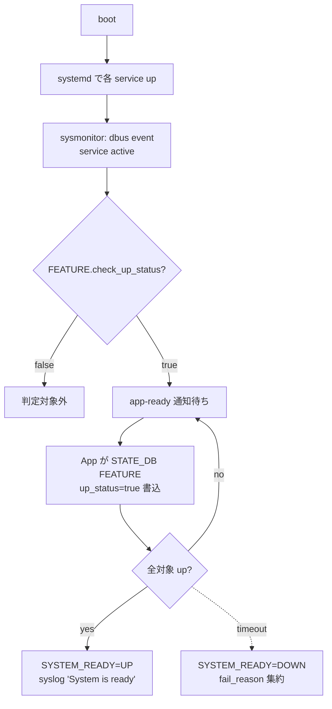

!!! success "裏取りステータス: code-verified (2026-05-10)"
    `sonic-buildimage/src/system-health/health_checker/sysmonitor.py` に sysmonitor 本体、`sonic-utilities/scripts/sysreadyshow:30` が `SYSREADY_TABLE = "SYSTEM_READY|SYSTEM_STATE"` を STATE_DB から読む。CLI は `sonic-utilities/show/system_health.py:141 @system_health.group('sysready-status', invoke_without_command=True)`、`brief` / `detail` も `tests/system_health_test.py:329-336` で検証。

# System Ready

## なぜ必要か

[SONiC](../reference/glossary.md#term-sonic) の起動は **非同期**。systemd の service が `active` でも、その内部の SWSS 系 daemon が [CONFIG_DB](../reference/glossary.md#term-config_db) を消化して [ASIC](../reference/glossary.md#term-asic) に届くまで時間が掛かる。「**システムが本当に traffic を受けられる状態か**」を一発で判定する仕組みがなく、Monit 系の 1 分 poll では遅延・粒度が不足[^1]。

System Ready は Python 製 daemon **`sysmonitor`** を追加し[^1]:

- 全 essential host service の up を **event-driven** で検出
- 各 docker app に **closest UP status** を能動的に申告させる
- 集約結果として 1 つの "system ready" 状態を CLI / syslog に公開

`system-health` フレームワークに統合される。

## 判定ロジック



## どこに状態が出るか

| キー | 意味 |
|------|------|
| `CONFIG_DB.FEATURE\|<name>.check_up_status` | `true` で system ready 判定対象（新規 leaf。[YANG](../reference/glossary.md#term-yang) `sonic-feature` 拡張）[^1] |
| `CONFIG_DB.FEATURE\|<name>.irrel_for_sysready` | `true` で当該 app を sysmonitor が無視（per-app opt-out）[^1] |
| `CONFIG_DB.DEVICE_METADATA\|localhost.sysready_state` | system ready 機能自体の admin enable/disable[^1] |
| `STATE_DB.FEATURE\|<name>.up_status` | App が自分の closest UP を申告（true/false + 任意 `fail_reason`）[^1] |
| `STATE_DB.SYSTEM_READY\|SYSTEM_STATE` | 集約結果（CLI が読む先。`sysmonitor.py:142` で `set(..., "SYSTEM_READY\|SYSTEM_STATE", "Status", state)`）|

<!-- evidence: sonic-buildimage/src/system-health/health_checker/sysmonitor.py:142,241-276 — STATE_DB 書込キーと check_up_status 参照 -->

`sysmonitor` 内の sub-thread は (1) systemd dbus event、(2) docker container running 監視、(3) app-ready hook を持つ[^1]。

## Rev 0.4 で追加された軸

- **Host daemon** もコンテナ外で動く daemon を ready 判定対象に追加。「コンテナは全部 up でも host daemon が起動失敗」を見逃さない[^1]
- **Admin state**: system ready 機能自体を disable できる。デバッグや特殊ワークロード用[^1]

## CLI 出力

| Command | 内容 |
|---------|------|
| `show system-health sysready-status` | 1 行サマリ（ready / not ready, since timestamp）|
| `... brief` | feature 単位の up/down 行 |
| `... detail` | fail_reason / 時刻 まで含む |

```bash
show system-health sysready-status
show system-health sysready-status detail

# 現在の FEATURE テーブル状態を確認（読み取りのみ）
sonic-cfggen -d -v 'FEATURE'
```

!!! note "ready 判定対象の設定方法"
    `check_up_status` を切り替える config 用 CLI は提供されない。HLD §4.5.1 によれば、組込み feature は `/etc/sonic/init_cfg.json` の `FEATURE.<dockername>.check_up_status` を factory default として注入し、第三者 docker は application extension の `manifest.json` で宣言する[^1]。`sonic-cfggen -d -v 'FEATURE'` は CONFIG_DB の現在値を dump する読み取りコマンドであり、設定変更手段ではない。

## 制限事項

- [HLD](../reference/glossary.md#term-hld) Rev 0.4 で日付欄空欄
- ready 判定は **App 自己申告に依存**。app バグで `up_status` を書かないと永遠に ready にならない
- timeout 絶対値は HLD 固定なく実装/運用側に委ねる
- warm-boot 中の ready 判定は別扱い（warm-boot 完了の意味と微妙に異なる）

## 干渉する機能

systemd / Monit（完全置換ではなく ready 判定だけ sysmonitor が担う）/ system-health フレームワーク / `FEATURE` 表（`check_up_status` 追加）/ fastboot・warmboot / TACACS / [AAA](../reference/glossary.md#term-aaa) / [SNMP](../reference/glossary.md#term-snmp) の boot 順。

## トラブルシューティング

```bash
show system-health sysready-status detail
# fail_reason を見て該当 feature を追跡

docker ps
sudo systemctl status <feature>.service
redis-cli -n 6 HGETALL "FEATURE|swss"

# sysmonitor のログ
journalctl -u system-health 2>/dev/null
```

## 関連 Topics

- [11-reboot](../topics/11-reboot/index.md): warm/fast boot との関係
- [09-telemetry-snmp](../topics/09-telemetry-snmp/index.md): system-health とテレメトリ

## 引用元

[^1]: `sonic-net/SONiC` `doc/system_health_monitoring/system-ready-HLD.md` @ `49bab5b5ff0e924f1ea52b3d9db0dfa4191a7c06`（§4.5.1 init_cfg.json / manifest.json、§249-254）

<!-- glossary-links-injected: ec18b66e3507 -->

<!-- topics-back-ref -->
## 関連 Topics

- [Topics: Telemetry / SNMP / Observability](../topics/09-telemetry-snmp/index.md)

<!-- /topics-back-ref -->
