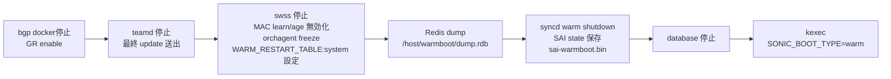
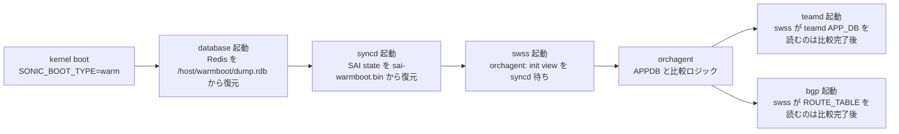

!!! warning "裏取りステータス: HLD-only / 古い HLD"
    本 HLD は SONiC 初期の system-wide warmboot 設計メモ。後発の `Warmboot Manager`（Google 2023, Rev 0.1）が同領域を再設計しているため、`/host/warmboot/dump.rdb` 経路や `SONIC_BOOT_TYPE` カーネル引数の現行有効性は要確認。`priority=high`。

# System-wide Warmboot（going down / up path / SAI 期待値）

## 概要

「全 SONiC コンテナを協調的に shut down → kexec で kernel 入れ替え → 再起動後にすべての control plane state を復元しデータプレーンを乱さない」warmboot の枠組み[^1]。fast-reboot スクリプト基盤を再利用し、`SONIC_BOOT_TYPE=warm` カーネル引数で挙動を分岐する。

ポイント:

- **kernel argument**: `SONIC_BOOT_TYPE=[fast-reboot|warm|cold]`。fast / warm の二重指定不可。既存 `*fast-reboot*` チェッカーとの互換のため `fast-reboot` 表記を許容しつつ、将来 `fast` への簡素化を計画[^1]
- **永続化先**: `/host/warmboot/` 下に `dump.rdb`（Redis 全体）と `sai-warmboot.bin`（SAI state）。旧版で各 DB ごとに json を分割保存する記述は HLD 内で取消線[^1]
- **fast-reboot との関係**: スクリプトは symbol link で兼用、名前で分岐

## 動作仕様

### Going down path（順序）

詳細[^1]:

- bgp: graceful restart 有効化（fast-reboot と同様）
- teamd: 最終的な valid update を peer に送って 90s reboot 時間を確保
- swss: MAC learning / aging を無効化、orchagent freeze、`WARM_RESTART_TABLE:system` フラグセット
- Redis ダンプは AOF / RDB の `dump.rdb` 形式（旧版の per-DB json は廃止）
- syncd: warm shutdown 経由で SAI に state を `/host/warmboot/sai-warmboot.bin` に出させる

### SAI: warm shutdown 期待値

- App は `remove_switch()` 前に `SAI_SWITCH_ATTR_RESTART_WARM=true` を set する（switch_create 時に必要なし）
- `SAI_KEY_WARM_BOOT_WRITE_FILE` profile attribute で書き出し先 path を指定。SAI 実装によっては switch_create 時にしか読まないため、create 前に set する方が安全[^1]

### Going up path（順序）

### SAI: warm recovery 期待値

- `SAI_KEY_BOOT_TYPE = 1` で warm boot を伝える（0=cold, 2=fast）
- `SAI_KEY_WARM_BOOT_READ_FILE` で前回ダンプを指定
- `create_switch` を `SAI_SWITCH_ATTR_INIT_SWITCH=true` で呼ぶ。他の attribute は SAI が自力で復元
- callback / notification は **SAI が保持しない** ため app 側が再登録[^1]

<!-- evidence:
source: sonic-net/SONiC/doc/warm-reboot/system-warmboot.md#L40-L70 (sha: 49bab5b5ff0e924f1ea52b3d9db0dfa4191a7c06)
excerpt: |
  Application sets switch attribute SAI_SWITCH_ATTR_RESTART_WARM to true before calling remove_switch().
  Application sets profile value SAI_KEY_BOOT_TYPE to 1 to indicate WARM BOOT.
  Application re-register all callbacks/notificaions. These function points are not retained by SAI across warm boot.
reasoning: SAI 側 warm shutdown / recovery の API 契約根拠。
-->

## 設定

`config warm_restart enable system` 系のコマンドで `WARM_RESTART_TABLE` を有効化。詳細は [SWSS docker warm restart](./sonic-swss-docker-warm-restart.md) を参照。

## 制限事項

- **同 image 同士の warm reboot と version upgrade は対象、downgrade は対象外**（テスト前提）[^1]
- すべての docker / SAI vendor が warm restart を実装している前提
- `SONIC_BOOT_TYPE` の表記揺れ（`fast-reboot` vs `fast`）が将来変わる可能性

## 干渉する機能

- **fast-reboot**: 同じスクリプト基盤、同じ kernel arg を共有
- **[Warmboot Manager](./warmboot-manager-hld.md)**: 後発の shutdown orchestrator。共存させる設計
- **BGP graceful restart / teamd 90s timer**: control plane downtime <90s 達成に必須

## トラブルシューティング

- warm reboot 後にデータプレーン断 > 30s → syncd の SAI state 復元が失敗、`sai-warmboot.bin` の有無を確認
- orchagent が永遠に compare 中 → SAI 側 init view 完了通知が来ていない可能性、syncd ログ確認

## 引用元

[^1]: `sonic-net/SONiC` `doc/warm-reboot/system-warmboot.md` @ `49bab5b5ff0e924f1ea52b3d9db0dfa4191a7c06`

<!-- concerns hint:
- /host/warmboot/dump.rdb / sai-warmboot.bin の現行 fast-reboot script 取り込み確認
- SONIC_BOOT_TYPE 値（fast-reboot vs fast）の現行 master 取り込み確認
- SAI_SWITCH_ATTR_RESTART_WARM / SAI_KEY_WARM_BOOT_* の community SAI 取り込み確認
- WARM_RESTART_TABLE スキーマの sonic-yang-models 取り込み確認
- Warmboot Manager との共存 / 排他関係の現行設計確認
- BGP graceful restart / teamd 90s timer の現行値確認
-->
