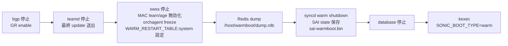
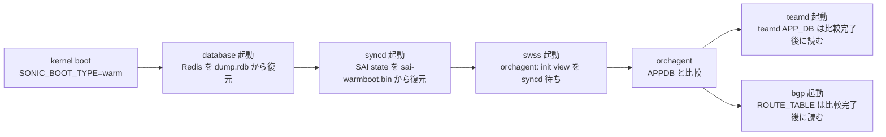

!!! success "裏取りステータス: code-verified"
    Verifier 2026-05-09: `docker_image_ctl.j2` の `WARM_DIR=/host/warmboot$DEV`、`BOOT_TYPE` 分岐（`warm`/`fastfast`/`express`/`fast`）、`-v /host/warmboot$DEV:/var/warmboot` bind mount、`syncd_init_common.sh` の `SAI_KEY_WARM_BOOT_WRITE_FILE=/var/warmboot/sai-warmboot.bin`、`sonic-warm-restart.yang` の `container WARM_RESTART` を確認。HLD と整合（`express` boot type は HLD 後に追加）。

# System-wide Warmboot（going down / up path / SAI 期待値）

## 読み手が知りたいこと

1. **shutdown→kexec→bootup の各段階で誰が何をするか**（順序）
2. **`SONIC_BOOT_TYPE` の値とその意味**（warm / fast / fastfast / express）
3. **[SAI](../reference/glossary.md#term-sai) に求める warm shutdown / warm recovery の API 契約**
4. **fast-reboot や Warmboot Manager との関係**
5. **データプレーン断や [orchagent](../reference/glossary.md#term-orchagent) compare が止まる場合の見どころ**

## 1. 何の HLD か

全 [SONiC](../reference/glossary.md#term-sonic) コンテナを協調 shutdown → kexec で kernel 入れ替え → 再起動後に control plane state を復元、データプレーンを乱さない **warmboot の枠組み**[^1]。fast-reboot スクリプト基盤を再利用し、`SONIC_BOOT_TYPE` カーネル引数で挙動を分岐する。

- **kernel argument**: `SONIC_BOOT_TYPE=[fast-reboot|warm|cold]`。fast / warm 二重指定不可。`fast-reboot` 表記を互換のため許容、将来 `fast` 簡素化を計画[^1]
- **永続化先**: `/host/warmboot/dump.rdb`（[Redis](../reference/glossary.md#term-redis) 全体）+ `/host/warmboot/sai-warmboot.bin`（SAI state）
- **fast-reboot との関係**: スクリプトは symlink 兼用、名前で分岐

機能一覧的なまとめは [`sonic-warm-reboot.md`](sonic-warm-reboot.md)、運用比較は [11-reboot](../topics/11-reboot/index.md)。

## 2. Going down（順序）



ポイント[^1]:

- **bgp**: graceful restart 有効化
- **[teamd](../reference/glossary.md#term-teamd-teamsyncd-teammgrd)**: 最終的な valid update を peer に出し 90s 確保
- **swss**: MAC learning / aging 無効化、orchagent freeze、`WARM_RESTART_TABLE:system` フラグ
- Redis ダンプは AOF / RDB の `dump.rdb`（旧版の per-DB json は廃止）
- **[syncd](../reference/glossary.md#term-syncd)**: warm shutdown で SAI に `/host/warmboot/sai-warmboot.bin` を書かせる

### SAI: warm shutdown 期待値

- App は `remove_switch()` 前に `SAI_SWITCH_ATTR_RESTART_WARM=true` を set（switch_create 時不要）
- `SAI_KEY_WARM_BOOT_WRITE_FILE` profile attribute で書き出し path 指定。実装によっては switch_create 時にしか読まないため create 前 set が安全[^1]

## 3. Going up（順序）



### SAI: warm recovery 期待値

- `SAI_KEY_BOOT_TYPE = 1`（0=cold, 2=fast）
- `SAI_KEY_WARM_BOOT_READ_FILE` で前回ダンプを指定
- `create_switch` を `SAI_SWITCH_ATTR_INIT_SWITCH=true` で呼ぶ。他 attribute は SAI が自力で復元
- callback / notification は **SAI が保持しない**[^1]

<!-- evidence:
source: sonic-net/SONiC/doc/warm-reboot/system-warmboot.md#L40-L70 (sha: 49bab5b5ff0e924f1ea52b3d9db0dfa4191a7c06)
excerpt: |
  Application sets switch attribute SAI_SWITCH_ATTR_RESTART_WARM to true before calling remove_switch().
  Application sets profile value SAI_KEY_BOOT_TYPE to 1 to indicate WARM BOOT.
  Application re-register all callbacks/notificaions. These function points are not retained by SAI across warm boot.
reasoning: SAI 側 warm shutdown / recovery の API 契約根拠。
-->

<!-- evidence-rendered:start -->
??? note "📋 検証エビデンス: sonic-net/SONiC/doc/warm-reboot/system-warmboot.md#L40-L70 (sha: 49bab5b5ff0e924f1ea52b3d9db0dfa4191a7c06)"

    **出典**:

    `sonic-net/SONiC/doc/warm-reboot/system-warmboot.md#L40-L70 (sha: 49bab5b5ff0e924f1ea52b3d9db0dfa4191a7c06)`

    **抜粋**:

    ```text
    Application sets switch attribute SAI_SWITCH_ATTR_RESTART_WARM to true before calling remove_switch().
    Application sets profile value SAI_KEY_BOOT_TYPE to 1 to indicate WARM BOOT.
    Application re-register all callbacks/notificaions. These function points are not retained by SAI across warm boot.
    ```

    **判断根拠**: SAI 側 warm shutdown / recovery の API 契約根拠。

<!-- evidence-rendered:end -->

## 4. 設定

`config warm_restart enable system` で `WARM_RESTART_TABLE` を有効化。docker 別の有効化や CLI 一覧は [`sonic-warm-reboot.md`](sonic-warm-reboot.md) を参照。

## 5. 制限事項と干渉する機能

- 同 image 同士または version upgrade のみ対象、**downgrade は対象外**
- すべての docker / SAI vendor が warm restart 実装している前提
- `SONIC_BOOT_TYPE` 表記揺れ（`fast-reboot` vs `fast`）は将来変わる可能性
- **fast-reboot**: 同基盤・同 kernel arg を共有
- **Warmboot Manager**: 後発の shutdown orchestrator、共存設計
- **[BGP](../reference/glossary.md#term-bgp) graceful restart / teamd 90s timer**: control plane downtime <90s に必須

## 6. トラブルシューティング

- warm reboot 後にデータプレーン断 > 30s → syncd の SAI state 復元失敗。`sai-warmboot.bin` の有無
- orchagent が永遠に compare 中 → SAI 側 init view 完了通知未着の可能性、syncd ログ

```bash
# system-wide warmboot 状態確認
warm-reboot
show warm_restart state
ls -la /host/warmboot/ | grep -E "sai-warmboot|warmboot"
docker logs syncd 2>&1 | grep -iE "warm|init view" | tail -50
```

## 関連 Topics 章

- [11-reboot](../topics/11-reboot/index.md): cold / fast / warm / express の比較と運用フロー
- [20-swss-sai-redis](../topics/20-swss-sai-redis/index.md): orchagent–syncd–SAI の init view / apply view

## 制限事項

- system-wide warm-boot は全ての SONiC コンテナが warm-restart 対応であることを前提とし、サードパーティ追加コンテナがある環境では成立しない。
- BGP / [LACP](../reference/glossary.md#term-lacp) / [BFD](../reference/glossary.md#term-bfd) の hold/keepalive タイマーは warm-restart 期間より十分長く設定する必要があり、デフォルト値で運用すると瞬断扱いとなる事がある。
- [ASIC SDK](../reference/glossary.md#term-asic-sdk) が warm-boot 非対応のリビジョンでは fall-back で cold-boot 化されるため、ベンダー SDK バージョンとの整合確認が必須。

## 引用元

[^1]: `sonic-net/SONiC` `doc/warm-reboot/system-warmboot.md` @ `49bab5b5ff0e924f1ea52b3d9db0dfa4191a7c06`

<!-- topics-back-ref -->
## 関連 Topics

- [Topics: Reboot / Upgrade / Lifecycle](../topics/11-reboot/index.md)

<!-- /topics-back-ref -->

<!-- glossary-links-injected: 8ba32e5aa69d -->
