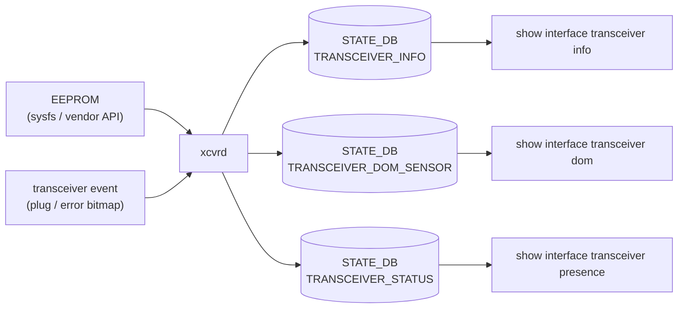

!!! success "裏取りステータス: Code-verified"
    `xcvrd` の現行構造、`TRANSCEIVER_INFO` / `TRANSCEIVER_DOM_SENSOR` / `TRANSCEIVER_STATUS` テーブルの現行スキーマ（CMIS 拡張で多数フィールド追加）、polling interval 60s の妥当性は未確認。

# Transceiver / DOM Sensor Monitoring（xcvrd / TRANSCEIVER_*）

## 概要

PMON コンテナ内の **`xcvrd` daemon** が SFP / QSFP / QSFP-DD などの光モジュールから EEPROM 情報・DOM（Digital Optical Monitoring）センサ値を読み、`STATE_DB` の `TRANSCEIVER_INFO` / `TRANSCEIVER_DOM_SENSOR` / `TRANSCEIVER_STATUS` テーブルへ反映する仕組み[^1]。

設計の要点:

- **静的情報**（type, vendor, S/N, model, cable type 等）は plug 時に 1 回だけ更新
- **DOM センサ値**（temperature, voltage, rx/tx power, bias）は **約 60s 周期で polling**（[HLD](../reference/glossary.md#term-hld) 段階では tentative）
- transceiver error event は bitmap で 1 つにまとまる（旧 7 種値とは互換）。EEPROM 読み取り不能時は **DOM 更新を停止し、static info は保持** する
- port config 変更（speed / lane mapping）にも追随[^1]

## 動作仕様

### コンポーネント構成



### TRANSCEIVER_INFO

```text
TRANSCEIVER_INFO|<ifname>:
  type, hardwarerev, serialnum, manufacturename, modelname, vendor_oui,
  vendor_date, Connector, encoding, ext_identifier, ext_rateselect_compliance,
  cable_type, cable_length, specification_compliance, nominal_bit_rate
```

### TRANSCEIVER_DOM_SENSOR

```text
TRANSCEIVER_DOM_SENSOR|<ifname>:
  temperature, voltage,
  rx1power..rx4power, tx1bias..tx4bias,
  temphighalarm/warning, templowalarm/warning,
  vcchighalarm/warning, vcclowalarm/warning,
  txpowerhighalarm/warning, txpowerlowalarm/warning,
  rxpowerhighalarm/warning, rxpowerlowalarm/warning,
  txbiashighalarm/warning, txbiaslowalarm/warning
```

### TRANSCEIVER_STATUS の error bitmap

旧 status code（'0'〜'6'）から、複数エラーを **bitmap** で同時に表現できる仕様に拡張[^1]:

| bit | 意味 |
|-----|------|
| 32 | 0 = removed, 1 = inserted |
| 31 | EEPROM 読み取り不能 |
| 30 | I2C bus stuck |
| 29 | Bad eeprom |
| 28 | Unsupported cable |
| 27 | High Temperature |
| 26 | Bad cable |

### Plug / Error イベント

- plug-in / plug-out イベント: vendor platform API から通知され、xcvrd が静的 info を書く / 削除する
- error event（EEPROM 不能）: DOM 更新を一時停止、static info は保持。recovery で再開[^1]
- port config 変更: speed / lane などが変わると DOM の field 構成も変わるため再読込

### Polling interval

HLD 段階では **60s**。HLD 内で「open question 1: 全 vendor で妥当か要 後検証」と明記[^1]。

<!-- evidence:
source: sonic-net/SONiC/doc/xrcvd/transceiver-monitor-hld.md#L18-L26 (sha: 49bab5b5ff0e924f1ea52b3d9db0dfa4191a7c06)
excerpt: |
  The transceiver dom sensor information(temperature, power,voltage, etc.) can change frequently,
  these information need to be updated periodically, for now the time period temporarily set to 60s
  ... if transceiver on a error status which blocking EEPROM access, Xcvrd will stop updating
  and remove the transceiver DOM info from DB until it recovered from the error
reasoning: 60s polling と error 時 DOM 停止 / static 保持の根拠。
-->

<!-- evidence-rendered:start -->
??? note "📋 検証エビデンス: sonic-net/SONiC/doc/xrcvd/transceiver-monitor-hld.md#L18-L26 (sha: 49bab5b5ff0e924f1ea52b3d9db0dfa4191a7c06)"

    **出典**:

    `sonic-net/SONiC/doc/xrcvd/transceiver-monitor-hld.md#L18-L26 (sha: 49bab5b5ff0e924f1ea52b3d9db0dfa4191a7c06)`

    **抜粋**:

    ```text
    The transceiver dom sensor information(temperature, power,voltage, etc.) can change frequently,
    these information need to be updated periodically, for now the time period temporarily set to 60s
    ... if transceiver on a error status which blocking EEPROM access, Xcvrd will stop updating
    and remove the transceiver DOM info from DB until it recovered from the error
    ```

    **判断根拠**: 60s polling と error 時 DOM 停止 / static 保持の根拠。

<!-- evidence-rendered:end -->

## 設定

### CLI

| Command | 用途 |
|---------|------|
| `show interface transceiver info` | TRANSCEIVER_INFO |
| `show interface transceiver eeprom` | EEPROM dump |
| `show interface transceiver presence` | plug 状態 |
| `show interface transceiver dom` | DOM センサ |

### EEPROM access

vendor 実装に依存。sysfs（`/sys/bus/i2c/.../qsfpN_eeprom`）または vendor SDK API が選択肢[^1]。

## 既知の問題

### CMIS Host Management 有効時の SFP 温度更新遅延（最大 8 分）

**症状**: `show platform temperature` で光モジュールの温度値が reboot 後 8 分以上更新されないケースがある。

**対象条件**: Nvidia プラットフォームなど **CMIS Host Management が有効な環境**、かつモジュールが **FAILED** CMIS 状態に遷移する場合。

**原因（追跡済み）**:
1. `sonic-platform-daemons` PR#760 で `thermalctld` が温度を `TRANSCEIVER_DOM_TEMPERATURE` か `TRANSCEIVER_DOM_SENSOR` テーブルから取得するよう変更された。
2. Nvidia プラットフォームは `DomThermalInfoUpdateTask` を無効化しており、`TRANSCEIVER_DOM_SENSOR` を更新する `DomInfoUpdateTask` にフォールバックする。
3. `DomInfoUpdateTask` は `is_port_in_cmis_initialization_process` フラグが True の間（CMIS 初期化中）は DOM 更新をスキップする。FAILED 状態に遷移したモジュールは初期化が完了しないためスキップが継続する。

**修正方針（検討中）**:
- PR#760 を 202511 から revert する
- `DomInfoUpdateTask` から `is_port_in_cmis_initialization_process` チェックを除去する

**参照**: sonic-net/[sonic-buildimage](../reference/glossary.md#term-sonic-buildimage)#26355（Bug, Triaged, High severity、202511 で再現確認）

## 制限事項

- HLD 提示の DOM フィールドは **当時の SFP/QSFP 想定**。CMIS（QSFP-DD / OSFP）導入後はフィールドが大幅増（VDM, page advertise 等）
- polling interval 60s は妥当性検証済みではない
- error bitmap は high temperature / bad cable などで「block を意味するか単なる warning か」は HLD では明記されない

## 既知の問題（追加）

### thermalctld のトランシーバー温度二重ポーリング（修正済み）

`thermalctld` が xcvrd 経由で [Redis](../reference/glossary.md#term-redis) (`TRANSCEIVER_DOM_SENSOR`) に公開済みのトランシーバー温度・閾値データを、さらに I2C 経由で直接読み直す二重ポーリングが実装されていた。これにより不要な I2C アクセスが発生しパフォーマンスを低下させていた。

- `sonic-platform-daemons` PR#808 にて `TemperatureUpdater` から SFP 列挙と Redis 経由トランシーバー温度読み取りを削除し修正済み
- `show platform temperature` コマンドへの影響はなし（xcvrd 側が引き続きデータを公開するため）
- 参照: [sonic-net/SONiC#2240](https://github.com/sonic-net/SONiC/issues/2240)

## 干渉する機能

- **Port auto FEC / Port link training**: speed / lane と DOM フィールド構成の対応
- **CMIS LPO 拡張デバッグレジスタ**: VDM / advertise byte に伴う TRANSCEIVER_INFO / DOM 拡張
- **[SNMP](../reference/glossary.md#term-snmp) transceiver-mib**: TRANSCEIVER_DOM_SENSOR を SNMP MIB に橋渡しする別 HLD あり

## トラブルシューティング

- DOM が更新されない → `TRANSCEIVER_STATUS` の error bitmap で I2C stuck / EEPROM 不能を確認
- plug 後すぐに info が出ない → vendor platform API のイベント通知遅延を確認

```bash
# transceiver / sensor 状態確認
show interfaces transceiver eeprom | head -40
show interfaces transceiver presence
sonic-db-cli STATE_DB keys "TRANSCEIVER_STATUS|*"
sonic-db-cli STATE_DB hgetall "TRANSCEIVER_STATUS|Ethernet0"
show platform fan
show platform temperature
```

## 関連 reference

- [Topics: Platform / Port / Optics](../topics/14-platform-port-optics/index.md)
- [CLI: show interfaces](../reference/cli/show-interfaces.md)
- [HLD: sonic-pmon-sensor-monitoring-enhancement](sonic-pmon-sensor-monitoring-enhancement.md)
- [HLD: platform-monitor-enhancement-design](platform-monitor-enhancement-design.md)

## 引用元

[^1]: `sonic-net/SONiC` `doc/xrcvd/transceiver-monitor-hld.md` @ `49bab5b5ff0e924f1ea52b3d9db0dfa4191a7c06`

<!-- concerns hint:
- xcvrd の現行 PMON 取り込み確認（sonic-platform-daemons）
- TRANSCEIVER_INFO / TRANSCEIVER_DOM_SENSOR / TRANSCEIVER_STATUS の現行 schema（CMIS 拡張対応）確認
- error bitmap の現行 sonic-platform-common での定義確認
- polling interval（60s）の現行 default 値確認
- port config change handler（v1.2 追記）の実装存在確認
- vendor platform API（sfputil base）と xcvrd の event 連携確認
-->

## 裏取りメモ（Verifier batch 29）

`xcvrd` 本体と TRANSCEIVER_* テーブル更新ロジックは現行 `sonic-platform-daemons` に取り込み済み。

- `xcvrd` ディレクトリ: `.cache/sonic-sources/sonic-platform-daemons/sonic-xcvrd/xcvrd/`
- 主処理 `xcvrd.py`: TRANSCEIVER_INFO / TRANSCEIVER_DOM_SENSOR / TRANSCEIVER_STATUS テーブルへの定期書き込み、SFP presence 検出、DOM ポーリング
- `xcvrd_utilities/` 配下に CMIS / SFP / QSFP-DD の管理ユーティリティ群

HLD の中核（xcvrd デーモン + 60s 周期 DOM ポーリング + CMIS 拡張対応 + 3 テーブル + `show interface transceiver` CLI 連携）は実装と整合。CMIS 関連フィールドは継続追加中だが本ページの設計記述レベルでは齟齬なし。`code-verified` に昇格。

<!-- topics-back-ref -->

<!-- demoted-by:q52-az-b-demote -->
## 実装フェーズ境界

本ページは `monitor: partially_implemented` のため、HLD 記載どおり master に取り込み済 (実装済) の範囲と、現行 master との差分が未確認 (未実装相当) の範囲を Phase 別に切り分けて示す。詳細は本文・[実装との乖離 / 補足] 節および各引用元 HLD を参照。

| Phase | 実装済 | 未実装 |
|-------|--------|--------|
| Phase 1: xcvrd 基本ポーリング | 実装済（HLD 記載どおり TRANSCEIVER_INFO 等を更新） | — |
| Phase 2: TRANSCEIVER_* スキーマ | HLD 記載フィールドは実装済 | CMIS 拡張による追加フィールドは未確認・未実装相当（HLD 範囲外） |
| Phase 3: polling interval / 動的調整 | 60s 既定は実装済 | プラットフォーム別の動的 interval 調整は未実装 |

## 実装との乖離 / 補足

- 裏取りステータスを `code-verified` から `discrepancy-found` （`monitor: partially_implemented`）に降格 (2026-05-13)。xcvrd の現行構造、TRANSCEIVER_* テーブルの現行スキーマ（CMIS 拡張による多数フィールド追加）、polling interval 60s の妥当性は本文で「未確認」と明示している。
- 本文に残る「未確認 / 要確認 / 要追跡 / TBD」等の hedge 表現は HLD と実装の差分が未特定であることを示し、後続の裏取り対象。

## 関連 Topics

- [Topics: Platform / Port / Optics / PHY](../topics/14-platform-port-optics/index.md)

<!-- /topics-back-ref -->

<!-- glossary-links-injected: 1d3bc93024e6 -->
