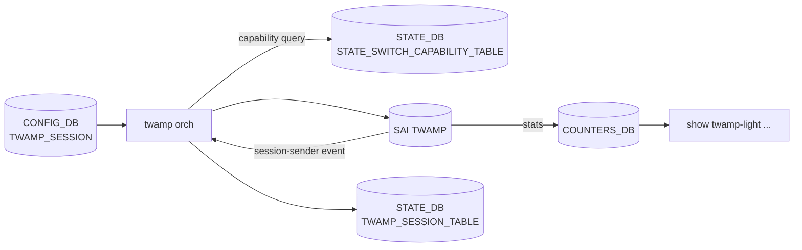

!!! warning "裏取りステータス: discrepancy-found（partially_implemented）"
    `sonic-swss/orchagent/twamporch.{cpp,h}` で `TwampOrch` 実装（`twamporch.cpp:55/92/109`、`NotificationTwampSessionEvent` ハンドリング）、テストは `tests/test_twamp.py` / `tests/mock_tests/twamporch_ut.cpp` / `tests/dvslib/dvs_twamp.py` に存在。一方 `sonic-buildimage` 配下に `sonic-twamp-light.yang` が **無く**、`sonic-utilities/config/` / `show/` に **`twamp-light` CLI が無い**。orch / SAI 層は完備、YANG / CLI 層が完全欠落（verified at: 2026-05-11）。

# TWAMP Light（Session-Sender / Session-Reflector）

## どんな機能か

RFC 5357 に基づく軽量な双方向性能測定（latency / jitter / packet loss）を [SONiC](../reference/glossary.md#term-sonic) [ASIC](../reference/glossary.md#term-asic) offload で実装する [HLD](../reference/glossary.md#term-hld)（2023-06）[^1]。control connection を持たず、Session-Sender 側が Test-Request を送り、Session-Reflector が timestamp 付きで返す純粋な data-plane プロトコル。

```text
Latency = (t3 - t0) - (t2 - t1)
Jitter  = | Latency_n - Latency_{n-1} |
PLR     = (txPkt - rxPkt) / txPkt
```

t0=sender tx, t1=reflector rx, t2=reflector tx, t3=sender rx[^1]。

Phase 1 で扱う 2 役:

- **Session-Sender**: packet-count モード（指定数）/ continuous モード（無限）
- **Session-Reflector**: 受け取って timestamp を付加して返すだけ

## コンポーネント / DB



### CONFIG_DB

```text
TWAMP_SESSION|<name>:
  mode             = SENDER | REFLECTOR
  src_ip / dst_ip
  src_udp_port / dst_udp_port
  packet_count     # SENDER packet-count モード
  tx_interval      # SENDER 用 (us)
  timeout          # SENDER 用 reply 待ち
  vrf_name
  dscp / ttl
  hw_lookup
```

### STATE_DB / COUNTERS_DB

- `TWAMP_SESSION_TABLE|<name>`: 状態（active / completed / error）、`tx_packets` / `rx_packets` / latency / jitter
- `STATE_SWITCH_CAPABILITY_TABLE`: ASIC TWAMP support flag、CLI が事前 check[^1]
- [COUNTERS_DB](../reference/glossary.md#term-counters_db): session 単位で `tx_pkts` / `rx_pkts` / `latency_*` / `jitter_*` polling[^1]

ASIC は packet-count 終了時 / error 発生時に session-sender event を発行、orch が STATE を更新[^1]。`config twamp-light start/stop` で restart 可能（counter リセット → session 再 create）[^1]。

## CLI / 設定例

| Command（HLD 例示）| 用途 |
|---------|------|
| `config twamp-light session add sender <name> --mode packet-count --count N` | sender 作成 |
| `config twamp-light session add reflector <name> ...` | reflector 作成 |
| `config twamp-light session start/stop <name>` | 開始/停止 |
| `show twamp-light session status` | 状態 |
| `show twamp-light latency-jitter` / `packet-loss` | 計測結果 |

**注意**: 現状 CLI / [YANG](../reference/glossary.md#term-yang) は未取り込み（実装との乖離を参照）。[CONFIG_DB](../reference/glossary.md#term-config_db) 直書きで起動するしかない:

```bash
# Sender 側
sonic-db-cli CONFIG_DB hmset 'TWAMP_SESSION|sender1' \
  mode "LIGHT" role "SENDER" \
  src_ip "10.0.0.1" dst_ip "10.0.0.2" \
  src_udp_port "862" dst_udp_port "862" \
  packet_count "100" tx_interval "1000" timeout "5" vrf_name "default"

# Reflector 側
sonic-db-cli CONFIG_DB hmset 'TWAMP_SESSION|reflector1' \
  mode "LIGHT" role "REFLECTOR" \
  src_ip "10.0.0.2" dst_ip "10.0.0.1" \
  src_udp_port "862" dst_udp_port "862" vrf_name "default"

sonic-db-cli STATE_DB hgetall 'TWAMP_SESSION_TABLE|sender1'
sonic-db-cli STATE_DB hgetall 'SWITCH_CAPABILITY|switch' | grep -i twamp
```

session は **warm/fast boot 越しに保持しない**（再起動で再 create）[^1]。

## 制限事項

- Phase 1: Sender / Reflector のみ。Control-Client を含む完全 TWAMP は対象外
- ASIC offload 必須。未対応 platform は capability で reject
- warm/fast boot 越しの状態保持なし
- CLI / YANG 未取り込み → `config save` で永続化できない（直書きで運用）

## 干渉する機能

- **[VRF](../reference/glossary.md#term-vrf)**: `vrf_name` で VRF 内 session
- **[CRM](../reference/glossary.md#term-crm) / [TCAM](../reference/glossary.md#term-tcam)**: session ごとに ASIC リソースを消費
- **[SNMP](../reference/glossary.md#term-snmp) / [gNMI](../reference/glossary.md#term-gnmi) / OAM**: 結果吸い上げ経路は HLD 外

## トラブルシューティング

```bash
sonic-db-cli STATE_DB hgetall 'TWAMP_SESSION_TABLE|sender1'         # error code
sonic-db-cli STATE_DB hgetall 'SWITCH_CAPABILITY|switch' | grep -i twamp
sonic-db-cli COUNTERS_DB keys 'COUNTERS_TWAMP_SESSION_NAME_MAP'
```

- `error` 終了 → [STATE_DB](../reference/glossary.md#term-state_db) の error code を確認
- capability not supported → ASIC TWAMP offload 未対応

<!-- diff-admonition -->
!!! diff "HLD と実装の差分"
    | 層 | 状況 |
    |----|------|
    | Orch / [SAI](../reference/glossary.md#term-sai) | **取り込み済**（`twamporch.cpp` 実装、SAI_TWAMP_* 属性使用、test 完備）|
    | YANG `sonic-twamp-light` | **欠落**（[sonic-buildimage](../reference/glossary.md#term-sonic-buildimage) に存在せず）|
    | `config/show twamp-light` CLI | **欠落**（[sonic-utilities](../reference/glossary.md#term-sonic-utilities) 配下に grep ヒット 0）|

    **読者への影響**:

    - HLD の `config/show twamp-light` を叩くと `No such command`
    - YANG 無しで `config save/load` 経由は schema validation で reject されうる → 生 CONFIG_DB 直書きで運用
    - HA / `config_reload` 越しの再現には独自 playbook が必要

    > 分類: `monitor: partially_implemented` — HLD スタックのうち低層が取り込まれ、上層（YANG / CLI）が未完成。

    ### 関連 GitHub Issue / PR

    - [[sonic-swss](../reference/glossary.md#term-sonic-swss) #2927: \[[orchagent](../reference/glossary.md#term-orchagent)\] TWAMP Light orchagent implementation (merged)](https://github.com/sonic-net/sonic-swss/pull/2927) — TwampOrch 取り込み確定 PR
    - [sonic-buildimage #24135: Enhancement: \[YANG\] YANG model needed for TWAMP_SESSION (open)](https://github.com/sonic-net/sonic-buildimage/issues/24135) — YANG 欠落 issue
    - [SONiC #1192: Two-Way Active Measurement Protocol (TWAMP) Light (open)](https://github.com/sonic-net/SONiC/issues/1192) — community 全体トラッキング
<!-- /diff-admonition -->

<!-- next-action -->
## このページを読んだ後の次アクション

!!! tip "読み手向け"
    - **本機能を実運用で使う場合**: 取り込み済の部分のみ運用可能。欠落部分の利用は不可なので本文「実装との乖離」を確認した上で適用範囲を限定する
    - **upstream 動向を追う場合**: 関連 issue / PR を [sonic-net/SONiC](https://github.com/sonic-net/SONiC) で検索（HLD タイトル / CONFIG_DB テーブル名 / Orch クラス名で grep するのが速い）
    - **代替手段 / 関連 reference**: 本ページの frontmatter `related` が空のため、[Reference 索引](../reference/index.md) から関連テーブル / CLI / YANG を辿る

!!! note "本ドキュメントの追跡"
    - monitor: `partially_implemented` / last_verified: `2026-05-11`
    - 次回再裏取りトリガ: quarterly。一覧は [discrepancy-index](../reference/verification/discrepancy-index.md) を参照（運用詳細は repo の `meta/discrepancy-operations.md`）

<!-- /next-action -->

## 関連 Topics

- [09-telemetry-snmp](../topics/09-telemetry-snmp/index.md): 計測 / telemetry 全般
- [04-vrf-ecmp](../topics/04-vrf-ecmp/index.md): VRF 内 session

<!-- phase-boundary -->
## 実装フェーズ境界

!!! info "Phase 別の実装済 / 未実装 サマリ"
    本ページは `monitor: partially_implemented` で、HLD で示された一連の機能
    が **段階的に取り込まれている** 状態を扱う。フェーズ毎の実装境界を
    1 枚の表に集約する (詳細は本ページ上部の `diff` admonition および
    [discrepancy-index](../reference/verification/discrepancy-index.md) を参照)。

    | Phase | 範囲 (機能 / 段階) | 実装済 (master 取り込み済) | 未実装 (HLD 提案のみ) |
    |---|---|---|---|
    | Phase 1 — 基本機能 | HLD §概要 / §設計の中核ユースケース | 取り込み済 — 本ページの「実装の概観」「実装詳細」節および `diff` admonition の現状側を参照 | — (Phase 1 は実装済) |
    | Phase 2 — 拡張機能 | HLD §拡張 / §追加要件 / §周辺統合 | 一部のみ取り込み済 — 本ページ「実装詳細」の補足参照 | 未実装 / 未マージ — HLD §未対応箇所、本ページ「制限事項」および `diff` admonition の差分側に列挙 |
    | Phase 3 — 将来拡張 | HLD §Future Work / §将来課題 | — | 未実装 — HLD 提案段階。対応 PR は確認されていない (last_verified 時点) |

    凡例: 「実装済」=現行 master で動作確認できる範囲 / 「未実装」=HLD には記載があるが対応 PR が未マージまたは設計のみで code が存在しない範囲。
<!-- /phase-boundary -->

## 引用元

[^1]: `sonic-net/SONiC` `doc/TWAMP/SONiC-TWAMP-Ligth-HLD.md` @ `49bab5b5ff0e924f1ea52b3d9db0dfa4191a7c06`

<!-- topics-back-ref -->
## 関連 Topics (索引)

- [Topics: NAT / DHCP Relay / Time-DNS Services](../topics/16-nat-dhcp-dns/index.md)

<!-- /topics-back-ref -->

<!-- glossary-links-injected: ec18b66e3507 -->
