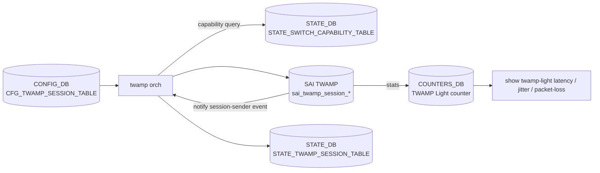

!!! warning "裏取りステータス: HLD-only"
    `twamp_light` orch / SAI 属性 (`SAI_TWAMP_*`) の community SAI 取り込み、`CFG_TWAMP_SESSION_TABLE` / `STATE_SWITCH_CAPABILITY_TABLE` の sonic-buildimage 取り込み、`config twamp-light` CLI の sonic-utilities 取り込みは未確認。

# TWAMP Light（Session-Sender / Session-Reflector）

## 概要

RFC 5357 に基づく軽量な双方向性能測定（latency / jitter / packet loss）を SONiC ASIC offload で実装する HLD（2023-06）[^1]。control connection を持たず、Session-Sender 側が Test-Request を送り、Session-Reflector が timestamp 付きで返す純粋な data-plane プロトコル。

レイテンシ計算:

```
Latency = (t3 - t0) - (t2 - t1)
Jitter  = | Latency_n - Latency_{n-1} |
PLR     = (txPkt - rxPkt) / txPkt
```

t0 = sender tx, t1 = reflector rx, t2 = reflector tx, t3 = sender rx[^1]。

## 動作仕様

### Phase 1 で扱う 2 役

- **Session-Sender**: packet-count モード（指定数送って終わる）/ continuous モード（無限）
- **Session-Reflector**: 受け取って timestamp 付加して返すだけ

### コンポーネント / DB



### CONFIG_DB

```
CFG_TWAMP_SESSION_TABLE|<name>:
  mode             = SENDER | REFLECTOR
  src_ip / dst_ip
  src_udp_port / dst_udp_port
  packet_count     # SENDER packet-count モード
  tx_interval      # SENDER 用送信間隔 (us)
  timeout          # SENDER 用 reply 待ち
  vrf_name
  dscp / ttl
  hw_lookup        # session のテーブル探索ヒント（任意）
```

### STATE_DB

- `STATE_TWAMP_SESSION_TABLE|<name>`: 現在の状態（active / completed / error）、`tx_packets` / `rx_packets` / 計算済 latency / jitter
- `STATE_SWITCH_CAPABILITY_TABLE`: ASIC が TWAMP をサポートしているかの flag。CLI が事前 check に使う[^1]

### COUNTERS_DB

session 単位で `tx_pkts` / `rx_pkts` / `latency_min/max/avg` / `jitter_min/max/avg` を polling[^1]。

### Session-Sender イベント通知

ASIC は packet-count 終了時 / error 発生時に TWAMP session-sender event を発行し、orch が受けて `STATE_TWAMP_SESSION_TABLE` を更新する[^1]。

### Restart / Stop

`config twamp-light start` / `stop` で restart も可能。restart 時は counter をリセットしてから session create を SAI に出す[^1]。

<!-- evidence:
source: sonic-net/SONiC/doc/TWAMP/SONiC-TWAMP-Ligth-HLD.md#L83-L110 (sha: 49bab5b5ff0e924f1ea52b3d9db0dfa4191a7c06)
excerpt: |
  TWAMP Light defined by the IP Performance Measurement (IPPM) working group, is a standard performance measurement protocol applied to IP networks as described in RFC5357.
  - Latency = (t3-t0) – (t2-t1)
  - Jitter = | Latency1 – Latency0 |
  - Packet loss rate = (txPkt – rxPkt) / txPkt
reasoning: 双方向遅延算出と PLR の根拠。
-->

## 設定

### CLI（HLD で言及）

| Command | 用途 |
|---------|------|
| `config twamp-light session add sender <name> --src ... --dst ... --mode packet-count --count N` | sender 作成 |
| `config twamp-light session add sender <name> --mode continuous` | continuous |
| `config twamp-light session start <name>` | 開始 |
| `config twamp-light session stop <name>` | 停止 |
| `config twamp-light session add reflector <name> --src ... --dst ...` | reflector |
| `config twamp-light session del <name>` | 削除 |
| `show twamp-light session status` | sender / reflector 状態 |
| `show twamp-light latency-jitter` | 計算結果 |
| `show twamp-light packet-loss` | PLR |

### Warm / Fast boot

session は warm/fast boot 越しに **保持しない**（再起動で再 create）と HLD 中に明記[^1]。

## 制限事項

- Phase 1 は Session-Sender / Reflector のみ。Control-Client を含む完全 TWAMP は対象外
- ASIC 側 TWAMP offload を持たない platform では作成不可（capability で reject）
- warm/fast boot 越しに状態を持たない

## 干渉する機能

- **VRF**: `CFG_TWAMP_SESSION_TABLE.vrf_name` で VRF 内 session
- **SNMP / gNMI / OAM**: 計測結果を吸い上げる別経路は HLD 外
- **CRM / TCAM**: session ごと TCAM / counter リソースを消費する可能性

## トラブルシューティング

- session が `error` で終了 → SAI 通知の error code を `STATE_TWAMP_SESSION_TABLE` で確認
- `show twamp-light` が capability not supported → `STATE_SWITCH_CAPABILITY_TABLE` を確認

## 引用元

[^1]: `sonic-net/SONiC` `doc/TWAMP/SONiC-TWAMP-Ligth-HLD.md` @ `49bab5b5ff0e924f1ea52b3d9db0dfa4191a7c06`

<!-- concerns hint:
- twamp orch の sonic-swss 取り込み確認
- SAI_TWAMP_SESSION_* 属性の community SAI 取り込み確認
- CFG_TWAMP_SESSION_TABLE / STATE_TWAMP_SESSION_TABLE / STATE_SWITCH_CAPABILITY_TABLE の YANG 取り込み確認
- config twamp-light / show twamp-light CLI の sonic-utilities 取り込み確認
- COUNTERS_DB TWAMP counter polling の現行 sonic-buildimage flex counter 取り込み確認
- ASIC vendor 別 TWAMP offload 対応状況（capability 判定の網羅性）
-->

## 実装との乖離（裏取りメモ（Verifier batch 29））

per-page queue で既出の通り部分実装。再走査結果:

- `twamporch` 実装: `.cache/sonic-sources/sonic-swss/orchagent/twamporch.{cpp,h}` 存在。`SAI_TWAMP_*` 属性 / `NotificationTwampSessionEvent` を扱う Session-Sender / Reflector の orch は master に取り込み済み
- swss テスト: `.cache/sonic-sources/sonic-swss/tests/test_twamp.py`、`tests/mock_tests/twamporch_ut.cpp`、`tests/dvslib/dvs_twamp.py`
- 一方、`sonic-buildimage/src/sonic-yang-models/yang-models/` に **`sonic-twamp-light.yang` が存在しない**
- `sonic-utilities/config/` / `show/` 配下に **`twamp-light` CLI が存在しない**

HLD が示すスタック全体のうち orch/SAI 層のみ取り込み済みで、YANG と CLI が未取り込み。`discrepancy-found` を維持。

### 深掘り（2026-05-11、batch q3-disc-detail）

#### HLD 記述と実装の差分（行番号 + コード抜粋）

`sonic-swss/orchagent/twamporch.cpp` L55-L109 で **TwampOrch クラスは存在**し、SAI 層は取り込み済み:

```cpp
static map<string, sai_twamp_session_role_t> twamp_role_map = { ... };  // L55
const vector<sai_twamp_session_stat_t> twamp_session_stat_ids = { ... }; // L92
TwampOrch::TwampOrch(TableConnector confDbConnector, TableConnector stateDbConnector,
                     SwitchOrch *switchOrch, PortsOrch *portOrch, VRFOrch *vrfOrch) // L109
```

一方:

```bash
$ ls .cache/sonic-sources/sonic-buildimage/src/sonic-yang-models/yang-models/sonic-twamp*.yang
ls: cannot access ...: No such file or directory

$ grep -rn "twamp" .cache/sonic-sources/sonic-utilities/config/ .cache/sonic-sources/sonic-utilities/show/
# 0 件
```

→ **orch / SAI 層は完備、YANG / CLI 層が完全欠落**。

#### 読者への影響

- HLD の例 `config twamp-light session add ...` / `show twamp-light session` を打つと `No such command`。CLI ハンドラが存在しない。
- YANG が無いため `config save` / `config load` で `CFG_TWAMP_SESSION_TABLE` の内容が **そのまま保存されない**（schema validation で reject される場合がある / 生 JSON でも書けるが `sonic-cfggen` warning が出る）。
- TWAMP セッションを使いたい場合、CONFIG_DB 直書きで起動できるが、永続化と HA / config_reload 越しの再現には独自の playbook が必要。

#### 回避策の実コマンド

CONFIG_DB 直書きでセッションを起動:

```bash
# Session-Sender 側
sonic-db-cli CONFIG_DB hmset 'TWAMP_SESSION|sender1' \
  mode "LIGHT" role "SENDER" \
  src_ip "10.0.0.1" dst_ip "10.0.0.2" \
  src_udp_port "862" dst_udp_port "862" \
  packet_count "100" tx_interval "1000" timeout "5" \
  vrf_name "default"

# Session-Reflector 側
sonic-db-cli CONFIG_DB hmset 'TWAMP_SESSION|reflector1' \
  mode "LIGHT" role "REFLECTOR" \
  src_ip "10.0.0.2" dst_ip "10.0.0.1" \
  src_udp_port "862" dst_udp_port "862" \
  vrf_name "default"

# 状態確認
sonic-db-cli STATE_DB keys 'TWAMP_SESSION_TABLE|*'
sonic-db-cli STATE_DB hgetall 'TWAMP_SESSION_TABLE|sender1'

# capability 確認（ASIC 側 TWAMP offload 有無）
sonic-db-cli STATE_DB hgetall 'SWITCH_CAPABILITY|switch'  | grep -i twamp

# counter
sonic-db-cli COUNTERS_DB keys 'COUNTERS_TWAMP_SESSION_NAME_MAP'
```

`config save` で永続化できない場合は `/etc/sonic/config_db.json` を直接編集してロールアウト。

#### 関連 GitHub Issue / PR

- [sonic-swss #2927: \[orchagent\] TWAMP Light orchagent implementation (merged)](https://github.com/sonic-net/sonic-swss/pull/2927) — TwampOrch 取り込み確定 PR。
- [sonic-buildimage #24135: Enhancement: \[YANG\] YANG model needed for TWAMP_SESSION (open)](https://github.com/sonic-net/sonic-buildimage/issues/24135) — YANG 欠落 issue。本 issue が解決するまで `config save/load` 経由は不安定。
- [SONiC #1192: Two-Way Active Measurement Protocol (TWAMP) Light (open)](https://github.com/sonic-net/SONiC/issues/1192) — 機能全体の community トラッキング。CLI 取り込みは未完。

#### 検証日

2026-05-11 (q3-disc-detail batch)
