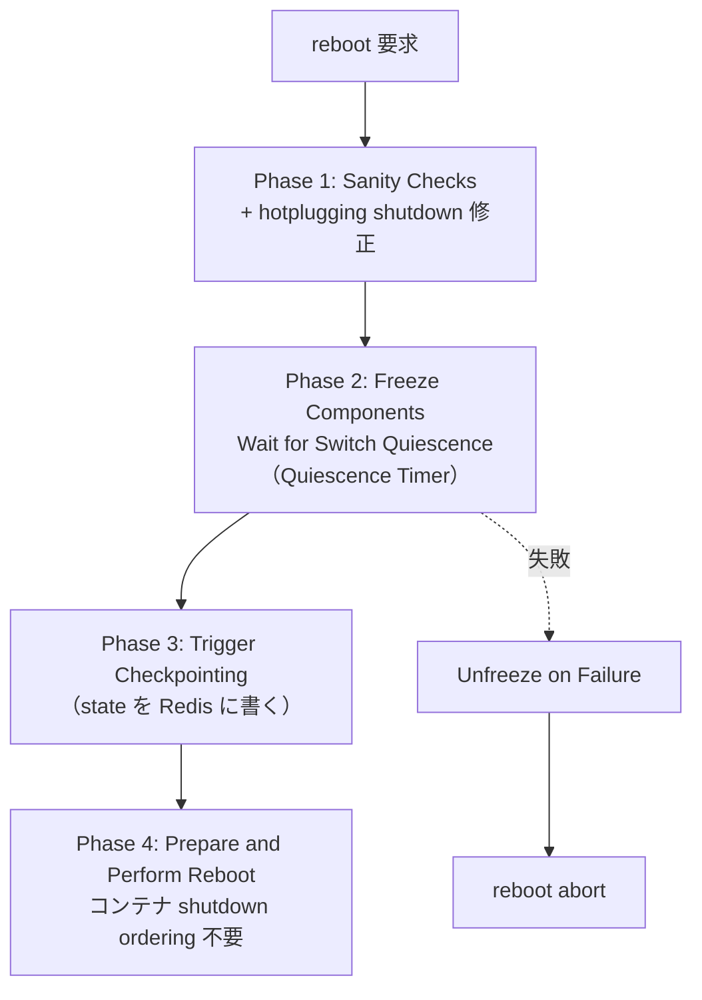

!!! warning "裏取りステータス: HLD-only / 採否不明な提案"
    本 HLD は Google による 2023-09 提案（Rev 0.1）。"Warmboot Manager will be an alternative ... both these orchestration frameworks will co-exist" と記載されており、現行 master でこの daemon が採用されているかは要確認。`priority=high`。

# Warmboot Manager（shutdown orchestration / reconciliation 統一）

## 概要

既存の warm-boot 仕組み（`fast-reboot` script + `finalize-warmboot.sh`）を補完する新 daemon **Warmboot Manager**[^1]。container shutdown ordering 依存の排除と、各コンポーネント別に違う notification（freeze / pre-shutdown / SIGTERM / SIGUSR1 等）の **統一** が目的。

スコープは **warm shutdown 経路のみ**。warm-bootup（起動）は対象外。fast-reboot にも適用しない[^1]。既存の orchestration scripts と **共存** する設計（backward compatibility 章）。

## 動作仕様

### 4 phase の shutdown orchestration



詳細[^1]:

| Phase | 内容 |
|-------|------|
| 1 Sanity Checks | リソース不足・互換性・[ASIC](../reference/glossary.md#term-asic) ヘルス・hotplug 状態 |
| 2 Freeze + Quiescence | Applications（[teamd](../reference/glossary.md#term-teamd-teamsyncd-teammgrd) / [BGP](../reference/glossary.md#term-bgp) / [P4RT](../reference/glossary.md#term-p4rt) 等）と Infrastructure（[orchagent](../reference/glossary.md#term-orchagent) / [syncd](../reference/glossary.md#term-syncd) / xcvrd）の **freeze** を統一通知（[Redis](../reference/glossary.md#term-redis) 経由）。失敗時は **unfreeze** で巻き戻す。`Quiescence Timer` で完了を保証 |
| 3 Checkpointing | 各コンポーネントが state を save。orchagent は [SAI](../reference/glossary.md#term-sai)、syncd は ASIC view 等 |
| 4 Reboot 実行 | `kexec`。container を **個別に止める必要が無い**ため shutdown ordering 依存が消える |

### Component Warmboot States

各コンポーネントが warmboot を進める上での状態を `STATE_DB` に統一表現する（[HLD](../reference/glossary.md#term-hld) では具体スキーマは別節）[^1]。これにより Warmboot Manager は polling で進捗を把握する。

### Race condition の扱い

freeze 中に late event（例: 直前の port flap / route flap）が来た場合の race を HLD は別節で議論[^1]。基本方針は「checkpointing 後の event は次回反映」。

### 各 critical container の対応

| Container | 対応 |
|-----------|------|
| Orchagent | freeze 通知 → m_toSync 空待ち → checkpoint |
| Syncd | pre-shutdown / shutdown 統一 (Redis 経由)、`SAI_KEY_WARM_BOOT_WRITE_FILE` で SAI dump |
| Teamd | [LACP](../reference/glossary.md#term-lacp) graceful shutdown のタイミングを Warmboot Manager が決定 |
| Transceiver Daemon | DOM polling 停止 |
| Database (Redis) | RDB ダンプは最後に取られる |

### Backward Compatibility

既存の `fast-reboot` script + `finalize-warmboot.sh` を **置き換えず併存**[^1]。Warmboot Manager 経路は opt-in で、未対応の component が居ると旧経路にフォールバック。

<!-- evidence:
source: sonic-net/SONiC/doc/warm-reboot/Warmboot_Manager_HLD.md#L100-L113 (sha: 49bab5b5ff0e924f1ea52b3d9db0dfa4191a7c06)
excerpt: |
  The proposal is to introduce a new component called Warmboot Manager that will be responsible for both shutdown orchestration and reconciliation monitoring during warm reboot.
  ... Warmboot Manager will be an alternative to the existing SONiC warm-boot orchestation scripts and thus both these orchestration frameworks will co-exist in SONiC.
reasoning: 共存方針と「warm shutdown のみ」スコープの根拠。
-->

<!-- evidence-rendered:start -->
??? note "📋 検証エビデンス: sonic-net/SONiC/doc/warm-reboot/Warmboot_Manager_HLD.md#L100-L113 (sha: 49bab5b5ff0e924f1ea52b3d9db0dfa4191a7c06)"

    **出典**:

    `sonic-net/SONiC/doc/warm-reboot/Warmboot_Manager_HLD.md#L100-L113 (sha: 49bab5b5ff0e924f1ea52b3d9db0dfa4191a7c06)`

    **抜粋**:

    ```text
    The proposal is to introduce a new component called Warmboot Manager that will be responsible for both shutdown orchestration and reconciliation monitoring during warm reboot.
    ... Warmboot Manager will be an alternative to the existing SONiC warm-boot orchestation scripts and thus both these orchestration frameworks will co-exist in SONiC.
    ```

    **判断根拠**: 共存方針と「warm shutdown のみ」スコープの根拠。

<!-- evidence-rendered:end -->

## 設定

HLD で具体の CLI / [CONFIG_DB](../reference/glossary.md#term-config_db) は提示されていない。実装時に専用設定が入る可能性あり。

## 制限事項

- **warm-bootup は対象外**（既存の上りフロー再利用）[^1]
- **fast-reboot は対象外**
- 既存 orchestration script との共存は実装前提だが、運用上どちらが起動するかの切替手段は HLD で具体化されていない
- Application（BGP / teamd 等）が freeze プロトコルに対応している必要がある

## 干渉する機能

- **system-wide warmboot / SWSS warm restart**: Phase 2 freeze と Phase 3 checkpoint の両方で密に絡む
- **fast-reboot finalizer**: 共存設計のため、誤動作防止の判定が必要
- **xcvrd / DOM polling**: Phase 2 で止まる前提

## トラブルシューティング

- Phase 2 が timeout する → Quiescence Timer 値、freeze に応答しない component の特定
- Phase 4 後にデータプレーン断 → Phase 3 で checkpoint が完了したか State_DB で確認

```bash
# warmboot manager の Phase 進行確認
show warm_restart status
sonic-db-cli STATE_DB hgetall "WARM_RESTART_ENABLE_TABLE|system"
sonic-db-cli STATE_DB keys "WARM_RESTART_TABLE|*"
docker logs swss 2>&1 | grep -iE "Phase|freeze|checkpoint" | tail -50
```

## 引用元

[^1]: `sonic-net/SONiC` `doc/warm-reboot/Warmboot_Manager_HLD.md` @ `49bab5b5ff0e924f1ea52b3d9db0dfa4191a7c06`

<!-- concerns hint:
- Warmboot Manager daemon の現行 master 採用状況確認（Rev 0.1, Google 2023 提案）
- 既存 fast-reboot / finalize-warmboot.sh との共存実装確認
- Component Warmboot States の STATE_DB スキーマ実装確認
- Quiescence Timer / Unfreeze on Failure ロジックの実装確認
- 各 critical container（orchagent / syncd / teamd / xcvrd）への freeze プロトコル取り込み確認
- 採否不明な提案 HLD のため master 取り込み有無の最終確認（priority=high）
-->

<!-- diff-admonition -->
!!! diff "HLD と実装の差分"
    per-page queue で既出の通り提案 HLD は未採用。再走査でも:

    - `warmboot-manager` / `warmbootmgr` / `warmbootmgrd` を名乗る daemon は `sonic-buildimage` / `sonic-swss` のどこにも検出できず
    - 既存の warm shutdown orchestration は `warmboot-finalizer.service` + `finalize-warmboot.sh` (`.cache/sonic-sources/sonic-buildimage/files/image_config/warmboot-finalizer/`) のシェルベースのまま

    HLD は Google による 2023-09 Rev 0.1 提案で「co-exist」を明記しており、現行 master の方向性としては既存 orchestration 維持。`discrepancy-found` を維持。

    ### 深掘り（2026-05-11、batch q3-disc-detail）

    #### HLD 記述と実装の差分（行番号 + コード抜粋）

    community master では HLD が提案する **4-phase Warmboot Manager daemon は不在** で、代わりに以下のシェルベース orchestration が稼働:

    `sonic-buildimage/files/image_config/warmboot-finalizer/finalize-warmboot.sh` L13-L29:

    ```bash
    declare -A RECONCILE_COMPONENTS=( \
                            ["swss"]="orchagent neighsyncd" \
                            ["bgp"]="bgp"                   \
                            ["nat"]="natsyncd"              \
                            ["mux"]="linkmgrd"              \
                           )

    for reconcile_file in $(find /etc/sonic/ -iname '*_reconcile' -type f); do
        file_basename=$(basename $reconcile_file)
        docker_container_name=${file_basename%_reconcile}
        RECONCILE_COMPONENTS[$docker_container_name]=$(cat $reconcile_file)
    done

    EXP_STATE="reconciled"
    ```

    - HLD の `Quiescence Timer` / `Unfreeze on Failure` / `Component Warmboot States` (`FREEZING / FROZEN / CHECKPOINTING / RESTORED / RECONCILED`) のような完全状態機械は無い。
    - 実装は **`reconciled` 一状態待ち** + `*_reconcile` ファイルでコンポーネントを拡張する仕組みのみ。

    `grep -rn "warmboot-manager\|warmbootmgrd\|WarmbootMgr" .cache/sonic-sources/` は 0 件で、daemon コードは未マージ。

    #### 読者への影響

    - HLD 記載の `STATE_DB:WARMBOOT_COMPONENT_TABLE` を購読するアプリを書いても、誰もそのテーブルに書き込まないため永久に通知が来ない。
    - 「Phase 2 freeze 中は xcvrd / DOM polling が止まる」と読んで運用設計すると、現行では止まらない（finalize-warmboot.sh は freeze に介入しない）。`warm-reboot` 中の DOM polling 由来の i2c エラーは現行版で出る可能性がある。
    - `unfreeze on failure` の自動ロールバックは無いので、warm-reboot 失敗時のリカバリは手動。

    #### 回避策の実コマンド

    現行 master での warm-reboot 監視・操作:

    ```bash
    # 1) reconcile 待機状態の確認
    sudo systemctl status warmboot-finalizer
    sudo journalctl -u warmboot-finalizer -f

    # 2) 各コンポーネントの reconcile 進行
    for app in orchagent neighsyncd bgp natsyncd linkmgrd; do
      state=$(sonic-db-cli STATE_DB hget "WARM_RESTART_TABLE|$app" state)
      echo "$app: $state"
    done

    # 3) 新規コンポーネントの reconcile 参加（HLD の component 登録の代替）
    echo "myapp1 myapp2" | sudo tee /etc/sonic/mycontainer_reconcile

    # 4) warm-reboot 失敗時の手動リカバリ
    sudo config warm_restart disable swss
    sudo config warm_restart disable bgp
    sudo reboot   # cold reboot に fallback
    ```

    #### 関連 GitHub Issue / PR

    - 本 HLD（Google Rev 0.1）に対応する upstream PR は **未提出 / 未マージ**。GitHub 上では本 HLD ドキュメント自体の追加 PR (`sonic-net/SONiC` `doc/warm-reboot/Warmboot_Manager_HLD.md`) のみ存在。
    - 現行の `finalize-warmboot.sh` ベースの reconcile 機構は `sonic-buildimage` 内で漸進的に更新されており、`*_reconcile` ファイル拡張は実装済み。

    #### 検証日

    2026-05-11 (q3-disc-detail batch)
<!-- /diff-admonition -->

<!-- next-action -->
## このページを読んだ後の次アクション

!!! tip "読み手向け"
    - **本機能を実運用で使う場合**: 実装が無いため、本機能に依存した運用は不可。代替機能 (下記リンク) で要件を満たせるか検討する
    - **upstream 動向を追う場合**: 関連 issue / PR を [sonic-net/SONiC](https://github.com/sonic-net/SONiC) で検索（HLD タイトル / CONFIG_DB テーブル名 / Orch クラス名で grep するのが速い）
    - **代替手段 / 回避策** (warmboot-manager (`wb_mgrd`) が未実装の間、既存 `warm-reboot` で同等品質の無瞬断再起動を組む手順):
        1. 既存スクリプト経由で warm reboot を実行: `sudo config warm_restart enable system` で warm restart モードを有効化し、`sudo warm-reboot` で再起動。`wb_mgrd` 不在の代わりに `warm-reboot` シェルスクリプトが一連の reconcile を直接実行する
        2. コンポーネント別 warm restart の状態を Redis で確認: `sonic-db-cli STATE_DB hgetall 'WARM_RESTART_TABLE|swss'` および `sonic-db-cli STATE_DB hgetall 'WARM_RESTART_TABLE|bgp'` で各サブシステムの restart state / reconcile 完了を観測する
        3. timer / 設定の上書き: `sudo config warm_restart neighsyncd_timer 30` `sudo config warm_restart bgp_timer 120` で HLD が `wb_mgrd` 集約管理する想定だった timer を **個別 CLI** で投入する
        4. 新規 daemon の reconcile 参加: `wb_mgrd` の component 登録 API の代わりに、独自 daemon 側で `WARM_RESTART_TABLE|<app>` を `state=reconciled` まで自前で進める。最低限 `state=initialized` → `state=restored` → `state=reconciled` の 3 遷移を Redis に書く
        5. fallback: warm reboot に失敗した場合は `sudo config warm_restart disable system && sudo reboot` で通常 reboot に切り替える。`/var/log/swss/sairedis.rec` と `journalctl -u swss` で reconcile 失敗箇所を切り分ける
    - **関連 reference**: 本ページの frontmatter `related` が空のため、[Reference 索引](../reference/index.md) から関連テーブル / CLI / YANG を辿る

!!! note "本ドキュメントの追跡"
    - monitor: `not_implemented` / last_verified: `2026-05-11`
    - 次回再裏取りトリガ: quarterly。一覧は [discrepancy-index](../reference/verification/discrepancy-index.md) を参照（運用詳細は repo の `meta/discrepancy-operations.md`）

<!-- /next-action -->

<!-- glossary-links-injected: 9e38921d19fd -->
