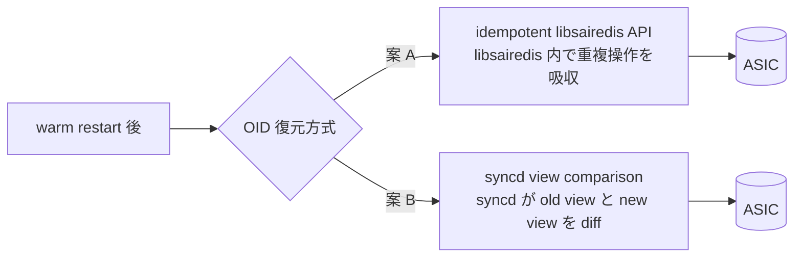

!!! warning "裏取りステータス: HLD-only"
    本ページは Warm Reboot 全体設計の **open issues / 未確定事項** をまとめた古い議事ノート。Phase 1-3 の実装進捗、`config warm_restart` CLI、`sonic-installer upgrade_docker` の現行サポート、idempotent libsairedis と syncd view comparison のうちどちらが master に採用されたかは未裏取り。

# Warm Reboot 開発フェーズと OID 復元戦略（idempotent libsairedis vs syncd view comparison）

## 概要

SONiC の Warm Reboot 設計に関する **open issues / 設計の選択肢** を整理した文書[^1]。3 段階の development phase、docker warm upgrade の手順、kernel warm reboot コマンド、SAI API 互換性、OID 復元の 2 アプローチ、planned vs unplanned warm restart、成功判定方法を扱う。

## 動作仕様

### 開発フェーズ[^1]

| Phase | 範囲 |
|-------|------|
| Phase 1 | swss / BGP の docker warm restart |
| Phase 2 | teamd / syncd（libsai / SDK 含む）の docker warm restart |
| Phase 3 | system 全体 warm reboot（DB save/restore、Linux 環境 graceful 復元） |

### Docker warm upgrade 手順[^1]

```bash
# 1. enable warm restart for swss (or system level)
config warm_restart enable swss
show warm_restart config
# name   enable  timer_name  timer_duration
# swss   true    NULL        NULL

# 2. upgrade docker
sonic-installer upgrade_docker --cleanup_image swss swss_test_02 ./docker-orchagent-brcm_test_02.gz

# 3. restart container
systemctl restart swss
```

system レベル enable は docker レベルを暗黙に有効化する[^1]:

```bash
config warm_restart enable
# system が enable される際 swss も enable される
```

### Kernel warm reboot

`fast-reboot` 同様の system level warm reboot コマンドが提供される。warm 側は state save/restore があるため fast-reboot より多くのオプションを取る[^1]。

### SAI API 互換性

データプレーン影響のある SAI API は **後方互換** 期待。互換切れは個別対応。libsai redis interface（libsairedis）はやや自由度が高い[^1]。

### OID 復元: 2 つのアプローチ



#### A. idempotent libsairedis API[^1]

- 設計: [sai_redis_api_idempotence.md](https://github.com/sonic-net/SONiC/blob/master/doc/warm-reboot/sai_redis_api_idempotence.md)
- 実装ドラフト: [sonic-sairedis idempotent ブランチ](https://github.com/sonic-net/sonic-sairedis/compare/master...jipanyang:idempotent)
- 状況: VS テストが実装済、swss docker warm restart/upgrade の E2E まで通過。コードレビュー前で再構成余地あり。**1 コマンドで feature on/off 可能化** が望ましい

#### B. syncd view comparison[^1]

- 主要実装: [`syncd/syncd_applyview.cpp`](https://github.com/sonic-net/sonic-sairedis/blob/d54977f297301f972e2839d526d8130a5f66e893/syncd/syncd_applyview.cpp)
- 設計ドキュメント: 未公開
- 状況: コードは sairedis に入っているが SONiC 通常パスでは使われていない。production 検証なし。syncd docker 内 unit test のみ

### Planned vs Unplanned warm restart[^1]

libsai に対し **planned warm restart のみ必須**。SONiC が SDK / libsai に明示要求する。unplanned は要求なし。

### 成功判定[^1]

warm restart は 2 段階:

1. **state restore**: 設定 / 状態整合性チェック → 期待状態に到達したかバリデーション
2. **state sync up**: 最新状態へ同期。sync 状態はデターミニスティックでないので **アプリ毎タイマー** で打ち切り、内部固有チェックを実施

## 制限事項

- syncd view comparison は production 検証無し
- idempotent 案も完全 review 未実施
- SAI 互換切れは個別対応
- unplanned warm restart は libsai 要件外

## 干渉する機能

- **fast-reboot**: 関連だが state save 規模が異なる
- **libsai / SDK**: warm restart 対応の baseline
- **sonic-sairedis**: 両アプローチの主舞台
- **CONFIG_DB / APPL_DB save/restore**: Phase 3 の system warm reboot

## 引用元

[^1]: [sonic-net/SONiC doc/warm-reboot/open_issues.md @ 49bab5b](https://github.com/sonic-net/SONiC/blob/49bab5b5ff0e924f1ea52b3d9db0dfa4191a7c06/doc/warm-reboot/open_issues.md)
