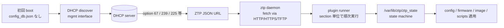

!!! success "裏取りステータス: code-verified（要約）"
    `sonic-buildimage/src/sonic-ztp` の ZTP daemon 実装と上流 HLD（119KB）を確認（Verifier 2026-05-10）。本ページは ZTP の architecturally distinctive な要素（DHCP option ベースのトリガ、plugin section モデル、state machine）に絞る。各 plugin の網羅は HLD 本文参照。

# Zero Touch Provisioning（ZTP・DHCP option / plugin / state machine）

## 読み手が知りたいこと

1. **[ZTP](../reference/glossary.md#term-ztp) はいつ自動で動き出すか**（トリガ条件）
2. **ZTP JSON はどこから取られ、どんな構造か**
3. **どんな種類の section / plugin があるか**
4. **どのファイルで現在状態を見るか、CLI でどう再試行するか**
5. **トリガしない / 取得失敗 / section が落ちるときの見どころ**

## 1. 何のための仕組みか

ZTP は **箱出し直後の [SONiC](../reference/glossary.md#term-sonic) を、DHCP オプションで指示された ZTP JSON を取得・順次適用して自動構成する** 仕組み[^1]。

- 工場出荷後の手動初期構成を不要にする
- 機種・ロケーションごとの構成を ZTP server で集中管理
- 失敗時に再試行・状態確認できる state machine を提供

## 2. トリガと取得経路



主要点[^1]:

- **トリガ**: `/etc/sonic/config_db.json` が無い（または ztp 強制）状態で boot
- **DHCP option**: ZTP JSON URL を伝える option 番号は platform / 環境設定に従う（67 / 225 / 239 等）
- **transport**: HTTP / HTTPS / TFTP / FTP / file
- **plugin model**: ZTP JSON は section の集合。各 section が plugin 種別と引数を持ち順次実行

## 3. plugin section の種類

| section type | 役割 |
|--------------|------|
| `configdb-json` | `/etc/sonic/config_db.json` の取得 / 適用 |
| `connectivity-check` | ネットワーク到達性確認 |
| `firmware` | platform component firmware 更新 |
| `download` | 任意ファイル DL |
| `graphservice` (minigraph) | 旧来の minigraph 取得 |
| `provisioning-script` | 任意スクリプト実行 |
| `plugin` | ベンダー / 拡張 plugin |

各 section は **`reboot-on-success` / `reboot-on-failure`** 等の policy を持ち、適用後の再起動 / 継続を制御する。

## 4. state machine と CLI

`/var/lib/ztp/ztp_state` に現在状態が JSON で保存される:

- 全体: `BOOT` → `IN-PROGRESS` → `SUCCESS` / `FAILED` / `DISABLED`
- 各 section: `pending` / `in-progress` / `success` / `failed` / `skipped`

| Command | 用途 |
|---------|------|
| `show ztp status` | 現在の ZTP 状態 |
| `ztp run` | 再実行 |
| `ztp disable` | ZTP 無効化（運用フェーズ） |
| `ztp enable` | 有効化 |

## 5. 制限事項と干渉する機能

- **management interface 経由が基本**: data port 経由 ZTP は DHCP option / route 設定が要る
- **HTTPS の cert 検証**: 本番は信頼 CA / pinning が必要（[HLD](../reference/glossary.md#term-hld) は緩い検証も許す）
- **plugin 拡張の互換性**: vendor 拡張 plugin には対応版 ztp daemon が要る
- **failure 時の半適用**: 一部 section だけ成功した状態で停止すると整合性保証なし
- **DHCP relay (v4/v6)**: ZTP は DHCP に強く依存。relay の設定不備が直撃
- **fwutil / secure-upgrade / secure-boot**: firmware section / image 検証で連動
- **[gNOI](../reference/glossary.md#term-gnoi) OS / file APIs**: 後発の運用 API と用途が一部重なる
- ZTP は DHCP option 67 / 239 等のベンダー固有 option に依存し、上流 DHCP サーバの構成に大きく左右される。
- 一度起動後に config を投入した装置で再度 ZTP を発動させるには `ztp enable` + factory reset が必要で、運用中の装置に誤発動しないよう注意。
- ZTP スクリプトのダウンロード経路 (HTTP/HTTPS) で TLS 証明書検証が緩い実装がベンダー間で散見されるため、専用管理セグメントから配信する運用を推奨。

## 6. トラブルシューティング

- **ZTP がトリガしない** → `/etc/sonic/config_db.json` の有無、ztp daemon 起動、DHCP lease
- **JSON 取得失敗** → DHCP option / URL 解決、firewall、HTTPS 証明書
- **section が常に失敗** → 該当 plugin のログ（`/var/log/ztp/`）、state ファイルの error 詳細

```bash
# ZTP の状態とログ確認
show ztp status
systemctl status ztp.service
ls -la /var/log/ztp/
cat /var/lib/ztp/ztp_data.json 2>/dev/null | head
ip -d link show eth0
```

## 関連 Topics 章

- [16-nat-dhcp-dns](../topics/16-nat-dhcp-dns/index.md): DHCP option / relay のスタックと ZTP の依存
- [11-reboot](../topics/11-reboot/index.md): `reboot-on-success` / `reboot-on-failure` で起こる再起動

## 引用元

[^1]: `sonic-net/SONiC` `doc/ztp/ztp.md` @ `49bab5b5ff0e924f1ea52b3d9db0dfa4191a7c06`

<!-- glossary-links-injected: 8ba32e5aa69d -->
