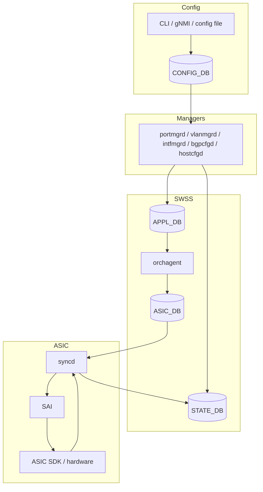

# 設定データフロー

[SONiC](../../reference/glossary.md#term-sonic) の設定を読むときは、まず `CONFIG_DB` を起点にします。`CONFIG_DB` はユーザや controller が投入した意図を保持し、各 daemon がそれを購読して自分の担当する実行状態へ変換します。代表的には、`*mgrd` が `CONFIG_DB` を読み、`APPL_DB` に [orchagent](../../reference/glossary.md#term-orchagent) 向けのテーブルを作り、orchagent が `ASIC_DB` 経由で [syncd](../../reference/glossary.md#term-syncd) / [SAI](../../reference/glossary.md#term-sai) へ渡します。

## CONFIG_DB はどの情報を持つか

`CONFIG_DB` は単なる key-value ではなく、テーブルごとに用途が分かれます。装置全体の根本設定は [DEVICE_METADATA](../../reference/config-db/device-metadata.md)、機能 docker の制御は [FEATURE](../../reference/config-db/feature.md) が代表です。

| テーブル | 読む場面 | 代表的な利用者 |
| --- | --- | --- |
| `DEVICE_METADATA|localhost` | hostname、platform、[BGP](../../reference/glossary.md#term-bgp) ASN、buffer model、switch type など装置単位の前提を確認する | `bgpcfgd`、orchagent、`hostcfgd` |
| `FEATURE|<name>` | bgp、telemetry、snmp など feature service の起動制御を見る | `hostcfgd`、system health |
| 機能別テーブル | [VLAN](../../reference/glossary.md#term-vlan)、BGP、[ACL](../../reference/glossary.md#term-acl)、[QoS](../../reference/glossary.md#term-qos) など各機能の設定を見る | 各 `*mgrd` / `*cfgd` |

`DEVICE_METADATA` は多くの章の前提条件です。BGP、[Multi-ASIC](../../reference/glossary.md#term-multi-asic)、Dual-ToR、[SmartSwitch](../../reference/glossary.md#term-smartswitch)、buffer、DHCP server などの挙動がここから分岐するため、機能ページで謎の既定値が出てきたら最初に確認してください。

## APPL_DB / STATE_DB / ASIC_DB の読み方

[swss-schema](../../internals/swss-schema.md) は `APPL_DB` と `STATE_DB` の中心スキーマをまとめる参照ページです。`APPL_DB` は orchagent に対する依頼、`STATE_DB` は SONiC 内部の状態共有、`ASIC_DB` は syncd に渡す [ASIC](../../reference/glossary.md#term-asic) 操作に近い層です。

この流れで重要なのは、`CONFIG_DB` に正しい値があっても、`APPL_DB` や `ASIC_DB` まで届いていなければデータプレーンには反映されないことです。障害切り分けでは「設定値」「manager の投影」「orchagent の処理」「syncd / SAI の処理」を順番に見ると原因を分けやすくなります。

## Redis 以外のトランスポート

通常の [ProducerStateTable](../../reference/glossary.md#term-producerstatetable) / [ConsumerStateTable](../../reference/glossary.md#term-consumerstatetable) は [Redis](../../reference/glossary.md#term-redis) を使いますが、低レイテンシ用途では [ZMQ ProducerStateTable / ConsumerStateTable](../../internals/zmq-producer-consumer-state-table-design.md) の設計があります。ZMQ 版は既存 API 形状を保ちつつ、Redis 書き込みを optional にできます。性能は上がりますが、DB に痕跡を残さない構成では観測性が落ちるため、トラブルシュート時には対象機能が Redis 経由か ZMQ 経由かを確認します。

## 管理 API 側の Redis 接続

REST / [gNMI](../../reference/glossary.md#term-gnmi) / Management Framework 側では Redis client の作り方自体が性能と安定性に影響します。[Redis Client Manager](../../management/redis-client-manager-rcm-hld.md) は、Go 実装の translib 周辺で DBNum ごとの共有 connection pool と transactional client を分ける設計です。設定データフローそのものではありませんが、自動化 controller から大量の Set / Get が来る環境では、管理 API 側の接続管理もボトルネックになります。

## 関連ページ

- [swss-schema](../../internals/swss-schema.md)
- [ZMQ ProducerStateTable / ConsumerStateTable 設計](../../internals/zmq-producer-consumer-state-table-design.md)
- [Redis Client Manager](../../management/redis-client-manager-rcm-hld.md)
- [DEVICE_METADATA テーブル](../../reference/config-db/device-metadata.md)
- [FEATURE テーブル](../../reference/config-db/feature.md)

<!-- glossary-links-injected: 5c9b3765d470 -->
