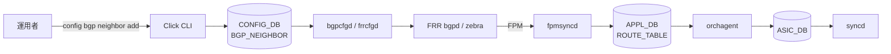
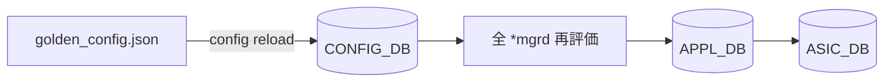
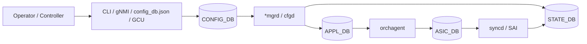

# 概念と読み始め方

この章は「[SONiC](../../reference/glossary.md#term-sonic) をこれから読む人が、最初の数時間でつまずきやすい所」を整理しておく入口です。SONiC は、Linux distribution、複数の daemon、複数の [Redis](../../reference/glossary.md#term-redis) DB、[ASIC](../../reference/glossary.md#term-asic) vendor 固有の [syncd](../../reference/glossary.md#term-syncd)、[FRR](../../reference/glossary.md#term-frr) のような外部 OSS、そして CLI / [gNMI](../../reference/glossary.md#term-gnmi) / RESTCONF / [config_db.json](../../reference/glossary.md#term-config_db.json) といった複数の入口を組み合わせた NOS です。それぞれが独立した [HLD](../../reference/glossary.md#term-hld) を持つため、最初から HLD を順に読むと「設定 1 つを変えるためのコンテキスト」を組み立てるのに時間がかかります。

このページでは、まず読み手が抱きやすい疑問を順に解いていきます。

## SONiC とは何か / 何の問題を解決するか

SONiC は、ホワイトボックススイッチ上で [BGP](../../reference/glossary.md#term-bgp)、L2、[ACL](../../reference/glossary.md#term-acl)、[QoS](../../reference/glossary.md#term-qos)、Telemetry といった一般的なネットワーク機能を提供する Linux ベースの NOS です。中心となる発想は次の 3 つです。

- **ASIC を vendor 非依存に扱う**: ベンダー固有の SDK ではなく [SAI](../../reference/glossary.md#term-sai) (Switch Abstraction Interface) を介して ASIC を操作する。
- **状態を Redis DB に集約する**: 設定、APP 層からの依頼、観測状態、ASIC への投影をすべて DB エントリで表現する。これにより、観測 / 監視 / 自動化が DB 単位で標準化できる。
- **機能を docker container に分離する**: BGP、[teamd](../../reference/glossary.md#term-teamd-teamsyncd-teammgrd)、[LLDP](../../reference/glossary.md#term-lldp)、syncd などを別 container にして、再起動・upgrade 単位を分ける。

SONiC が解いているのは「複数 vendor のスイッチを 1 つの NOS で扱いたい」「ネットワークの状態を Linux 流のテキスト + DB で扱いたい」「機能ごとに upgrade したい」という運用課題です。

## SONiC の中での「設定」の位置

SONiC を構成軸で 3 つに分けると次のようになります。本章はこのうち **management plane** から **control plane** の上端までを扱います。

| 軸 | 主な担当 | この章での扱い |
| --- | --- | --- |
| Management plane | CLI、gNMI、RESTCONF、[ZTP](../../reference/glossary.md#term-ztp)、`config_db.json` | 中心トピック |
| Control plane | bgpd / teamd / [linkmgrd](../../reference/glossary.md#term-linkmgrd) / [orchagent](../../reference/glossary.md#term-orchagent) | DB 経由でどう触るかの観点で扱う |
| Data plane | syncd / SAI / ASIC | 「設定が最終的にここに落ちる」程度に触れる |

設定変更の話は management plane と control plane の境界、つまり「人間/コントローラの意図 → [CONFIG_DB](../../reference/glossary.md#term-config_db) → daemon → ASIC」の経路を読むことが中心になります。

## 最初に押さえる用語

| 用語 | 意味（最低限） |
| --- | --- |
| CONFIG_DB | 運用者 / コントローラの「意図」を保持する Redis DB。永続化対象は `config_db.json` |
| [APPL_DB](../../reference/glossary.md#term-appl_db) | 各 `*mgrd` が orchagent に渡す「依頼」を保持する DB |
| [STATE_DB](../../reference/glossary.md#term-state_db) | SONiC daemon が観測した状態（link 状態、neighbor、[PFC](../../reference/glossary.md#term-pfc) counter など） |
| [ASIC_DB](../../reference/glossary.md#term-asic_db) | syncd / SAI に投影された ASIC object |
| orchagent | APPL_DB を読み、SAI 呼び出しで ASIC_DB に書き出す中心 daemon |
| syncd | ASIC_DB を見て SAI/SDK に流す ASIC vendor 固有 daemon |
| `*mgrd` / cfgd | CONFIG_DB をその機能ドメインの APPL_DB / Linux 設定に翻訳する daemon 群 |
| [GCU](../../reference/glossary.md#term-gcu) (Generic Config Updater) | `config apply-patch` / `replace` の中身。[YANG](../../reference/glossary.md#term-yang) validation 付きの差分適用 |
| Management Framework | YANG → REST/gNMI → CONFIG_DB のパス。`sonic-cli` がこの上にいる |

「`config` CLI」と「`sonic-cli`」は別系統です。前者は Click ベースで `sonic-utilities` に入っており、後者は Management Framework / YANG を経由します。両方が CONFIG_DB に向かうため、最終的な状態は同じですが、validation や RBAC、対応コマンド範囲が異なります。

## まずどこから読むか

読者の目的別に「最初に開くべきページ」をまとめます。

| 読者の目的 | 最初に読むもの | 次に読むもの |
| --- | --- | --- |
| 全体像を知りたい | この章の [設定データフロー](architecture.md) | [初学者向けガイド](../../guides/beginner.md) |
| 実機で設定したい | [設定変更の選び方](configuration.md) | [CLI リファレンス](../../reference/cli/index.md) |
| 設定変更の影響を見たい | [運用入口](operations.md) | [CONFIG_DB リファレンス](../../reference/config-db/index.md) |
| 新機能を実装したい | [内部実装](internals.md) | [YANG リファレンス](../../reference/yang/index.md) と [swss schema](../../internals/swss-schema.md) |
| 機能ドメインを横断したい | `docs/categories/` | 対応する topics 章または area 別ページ |

[読み手別ガイド](../../guides/index.md) は「誰が読むか」で入口を分け、`docs/categories/` は「キーワードから逆引き」する索引です。本章はその前段として、SONiC 全体に共通する設定・状態・DB の読み方をまとめる位置付けです。

## 典型的な使用シーン

### シーン 1: 「BGP neighbor を 1 つ足したい」

CLI を 1 行打っただけのように見えますが、内部では CONFIG_DB → FRR → [FPM](../../reference/glossary.md#term-fpm) → APPL_DB → ASIC_DB と複数のホップを経由します。問題切り分けはこのホップのどこで止まったかで決まります。

### シーン 2: 「Golden config をまるごと適用する」

`config reload` は大きな停止影響を持ちます。低停止で差分だけ当てたい場合は `config apply-patch` (GCU) を使うのが基本です。両者の使い分けは [設定変更の選び方](configuration.md) で扱います。

## 設定入口の大まかな役割

| 入口 | 向いている用途 | 注意点 |
| --- | --- | --- |
| `config` CLI | 人手の小さな変更、日常運用 | 変更後の永続化は `config save` を確認する |
| `show` CLI | 状態確認、切り分け | 表示元は `CONFIG_DB` だけでなく `STATE_DB` / `APPL_DB` / daemon 状態にもまたがる |
| `sonic-cli` | Management Framework / YANG 寄りの操作 | Click 系 `config` とカバレッジや表現が異なる |
| `sonic-cfggen` | JSON 生成、テンプレート描画、CONFIG_DB dump / write | スクリプト向き。入力ソースの混ぜ方を確認する |
| `config_db.json` | 起動時設定、Golden Config 管理 | `config reload` は大きな停止影響を持つ |
| RESTCONF / gNMI | controller / 自動化 / telemetry | YANG、CVL、GCU との関係を見る |
| `config apply-patch` / `replace` | 低停止の構造化変更 | YANG validation と rollback 前提で使う |
| ZTP / `config-setup` | 初期展開、first boot、upgrade migration | 起動時フローの一部として読む |

## DB 名をどう覚えるか

`CONFIG_DB` は「意図」、`APPL_DB` は「各 manager が orchagent に渡す依頼」、`STATE_DB` は「SONiC 内部で観測した状態」、`ASIC_DB` は「syncd / SAI へ近い ASIC 操作の投影」として読むと迷いにくくなります。

この図は概念図です。BGP、platform、telemetry、[Multi-ASIC](../../reference/glossary.md#term-multi-asic) では例外や追加 DB がありますが、多くの章はこの流れを前提に読めます。

## 似た仕組みとの違い

| 比較対象 | SONiC が選んだ方式 | 違いと意味 |
| --- | --- | --- |
| 一般的なベンダー NOS の running-config | running-config 1 本ではなく **CONFIG_DB に常時 commit** される | 「未保存変更」の概念が薄い。`config save` は config_db.json への書き出し |
| Cumulus / VyOS の text config | テキストではなく **JSON / DB key** で表現 | diff / patch を JSON Pointer (RFC 6901) で書ける |
| NETCONF candidate datastore | **GCU の `apply-patch` / `replace`** が近い役割 | 完全な candidate ではなく、検証 + 差分適用 |
| Kubernetes の desired state | 思想は近い（CONFIG_DB が desired、STATE_DB が observed） | reconcile loop の主役は `*mgrd` + orchagent |

「意図 (CONFIG_DB) と観測 (STATE_DB) を別に持つ」という設計は、Kubernetes 風の reconcile を意識すると理解しやすくなります。CLI は意図を書く道具、`show` は意図と観測の両方を見る道具です。

## 読み終わったあとにできるようになること

- 「`config` でなぜ反映に時間がかかるのか」を、CONFIG_DB → APPL_DB → ASIC_DB のホップに分解して考えられる。
- 状態確認に使う DB を、目的（意図 / 依頼 / 観測 / ASIC 投影）で選び分けられる。
- `config` / `sonic-cli` / gNMI / `config apply-patch` の使い分けの第一感を持てる。
- 機能別 topics 章を読むときに、どの daemon と DB を主軸にすべきか目星を付けられる。

## 関連ページ

- [SONiC User Manual の位置づけ](../../management/sonic-user-manual.md)
- [SONiC NOS の設定手段一覧](../../management/sonic-nos-configuration-methods.md)
- [読み手別ガイド](../../guides/index.md)
- [カテゴリ一覧](../../categories/index.md)

<!-- xref-prereq -->
## この章の前提知識

この章は SONiC ドキュメント全体の入口に位置するため、特段の前提章はない。`docs/topics/index.md` の読み進め方マップを参照すること。

<!-- glossary-links-injected: 5c9b3765d470 -->
