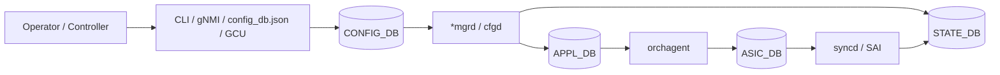

# 概念と読み始め方

SONiC の設定基盤は、最初に「操作入口」と「内部の正規状態」を分けて読むと理解しやすくなります。管理者が触る入口は `config` / `show` CLI、`sonic-cli`、`sonic-cfggen`、`config_db.json`、RESTCONF / gNMI、ZTP、`config apply-patch` など複数あります。一方で、多くの設定は最終的に `CONFIG_DB` に入り、そこから各 daemon が自分の担当する DB やプロセスへ反映します。

## まずどこから読むか

| 読者の目的 | 最初に読むもの | 次に読むもの |
| --- | --- | --- |
| 全体像を知りたい | この章の [設定データフロー](architecture.md) | [初学者向けガイド](../../guides/beginner.md) |
| 実機で設定したい | [設定変更の選び方](configuration.md) | [CLI リファレンス](../../reference/cli/index.md) |
| 設定変更の影響を見たい | [運用入口](operations.md) | [CONFIG_DB リファレンス](../../reference/config-db/index.md) |
| 新機能を実装したい | [内部実装](internals.md) | [YANG リファレンス](../../reference/yang/index.md) と [swss schema](../../internals/swss-schema.md) |
| 機能ドメインを横断したい | `docs/categories/` | 対応する topics 章または area 別ページ |

既存の [読み手別ガイド](../../guides/index.md) は「誰が読むか」で入口を分けています。`docs/categories/` は BGP、Multi-ASIC、gNMI、reboot など「キーワードから逆引きする」ための索引です。この章は、その前段として SONiC 全体に共通する設定・状態・DB の読み方をまとめます。

## 設定入口の大まかな役割

| 入口 | 向いている用途 | 注意点 |
| --- | --- | --- |
| `config` CLI | 人手の小さな変更、日常運用 | 変更後に永続化が必要な場合は `config save` を確認する |
| `show` CLI | 状態確認、切り分け | 表示元は `CONFIG_DB` だけではなく `STATE_DB` / `APPL_DB` / daemon 状態にも分かれる |
| `sonic-cli` | Management Framework / YANG 寄りの操作 | Click 系 `config` とカバレッジや表現が異なる |
| `sonic-cfggen` | JSON 生成、テンプレート描画、CONFIG_DB dump / write | スクリプト向き。直接実行時は入力ソースの混ぜ方を確認する |
| `config_db.json` | 起動時設定、Golden Config 管理 | `config reload` は大きな停止影響を持つ |
| RESTCONF / gNMI | controller / 自動化 / telemetry | YANG、CVL、GCU との関係を見る |
| `config apply-patch` / `replace` | 低停止の構造化変更 | YANG validation と rollback 前提で使う |
| ZTP / `config-setup` | 初期展開、first boot、upgrade migration | 起動時フローの一部として読む |

## DB 名をどう覚えるか

`CONFIG_DB` は「意図」、`APPL_DB` は「各 manager が orchagent に渡す依頼」、`STATE_DB` は「SONiC 内部で観測した状態」、`ASIC_DB` は「syncd / SAI へ近い ASIC 操作の投影」として読むと迷いにくくなります。

この図は概念図です。BGP、platform、telemetry、Multi-ASIC では例外や追加 DB がありますが、多くの章はこの流れを前提に読めます。

## 関連ページ

- [SONiC User Manual の位置づけ](../../management/sonic-user-manual.md)
- [SONiC NOS の設定手段一覧](../../management/sonic-nos-configuration-methods.md)
- [読み手別ガイド](../../guides/index.md)
- [カテゴリ一覧](../../categories/index.md)
