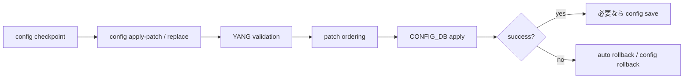

# 設定変更の選び方

[SONiC](../../reference/glossary.md#term-sonic) には設定変更の入口が複数あります。選び方の軸は「変更範囲」「停止影響」「検証と rollback が必要か」「永続化するか」です。小さな手作業なら `config` CLI、全体構成ファイルの再投入なら `config reload`、低停止で構造化変更したいなら `config replace` / `config apply-patch` を優先して検討します。

## まず判断すること

| やりたいこと | 入口 | 理由 |
| --- | --- | --- |
| 現在の設定を保存する | `config save` | running `CONFIG_DB` を `/etc/sonic/config_db.json` へ dump する |
| ファイルの設定を merge する | `config load` | 既存エントリを消さずに書き足す |
| ファイルの設定で入れ替える | `config reload` | `CONFIG_DB` をクリアして再ロードし、必要な service restart を伴う |
| 全体 config の差分だけ当てる | `config replace` | target config との差分を JSON Patch 化し、[GCU](../../reference/glossary.md#term-gcu) 経由で適用する |
| 増分変更を明示的に当てる | `config apply-patch` | RFC 6902 JSON Patch を validation / ordering / rollback 前提で適用する |
| DB dump やテンプレート生成をする | `sonic-cfggen` | [CONFIG_DB](../../reference/glossary.md#term-config_db)、minigraph、[YANG](../../reference/glossary.md#term-yang) JSON、Jinja2 を扱う汎用エンジン |

`config load` と `config reload` は特に混同しやすい入口です。`load` は merge なので、ファイルから消した設定が DB に残る可能性があります。クリーンな全体入れ替えが必要なら `reload`、停止影響を抑えて差分だけ当てたいなら `replace` を検討します。

## GCU を使う場面

[Generic Config Update / Rollback](../../architecture/sonic-generic-configuration-update-and-rollback.md) は、`config reload` を避けて running `CONFIG_DB` に増分パッチを安全に当てる仕組みです。入力は JSON Patch、適用前に YANG validation を行い、依存関係を考慮して適用順を決めます。失敗時は rollback し、任意の checkpoint へ戻す操作も扱います。

GCU を使う典型例は、[VLAN](../../reference/glossary.md#term-vlan) / [ACL](../../reference/glossary.md#term-acl) / [BGP](../../reference/glossary.md#term-bgp) など複数テーブルにまたがる変更を、依存順序を壊さずに入れたい場合です。特に dynamic port breakout のように `PORT`、`VLAN_MEMBER`、`ACL_TABLE` などの参照関係が絡む変更では、[JSON Patch ordering](../../management/json-patch-ordering-using-yang-models.md) の考え方が効きます。

## JSON Patch と JsonChange の違い

JSON Patch はユーザが投入する操作列です。一方、内部の JsonChange は「最終状態へ近づけるために、同時に適用してよい変更単位」です。[JSON Change Application](../../architecture/json-change-application.md) は、table 単位の書き込み、必要な service restart、反映確認、最終 diff 検証を担当します。つまり、ユーザは JSON Patch を書き、GCU がそれを安全な適用単位へ分割・整列し、applier が DB と service に反映します。

## config reload を使うとき

`config reload` は強い操作です。`CONFIG_DB` をクリアしてファイルを再ロードし、service restart を伴います。現行設計では [config reload enhancement](../../management/config-reload-enhancement.md) により、`FEATURE.delayed` と `PortInitDone` を使って非クリティカル service の起動を遅らせる event-driven 化が入っています。それでも reload はデータプレーンや制御プレーンの影響が大きいため、事前に `config save`、対象ファイル、maintenance window、rollback 手順を確認して使います。

## sonic-cfggen の位置づけ

[sonic-cfggen](../../reference/cli/sonic-cfggen.md) は設定生成エンジンです。`CONFIG_DB` を JSON として dump する、Jinja2 テンプレートを描画する、minigraph や YANG JSON を変換する、生成した dict を `CONFIG_DB` へ書く、といった低レベルな作業を担います。運用者が常用するというより、`config` / `show` の裏側や起動時スクリプト、自動化で使われる道具として読むと位置づけがはっきりします。

## 関連ページ

- [Generic Config Update / Rollback](../../architecture/sonic-generic-configuration-update-and-rollback.md)
- [JSON Change Application](../../architecture/json-change-application.md)
- [JSON Patch ordering](../../management/json-patch-ordering-using-yang-models.md)
- [config reload の event-driven 化](../../management/config-reload-enhancement.md)
- [config save / load / reload / replace / qos reload](../../reference/cli/config-mgmt-trio.md)
- [sonic-cfggen コマンド](../../reference/cli/sonic-cfggen.md)

<!-- glossary-links-injected: 8ba32e5aa69d -->
