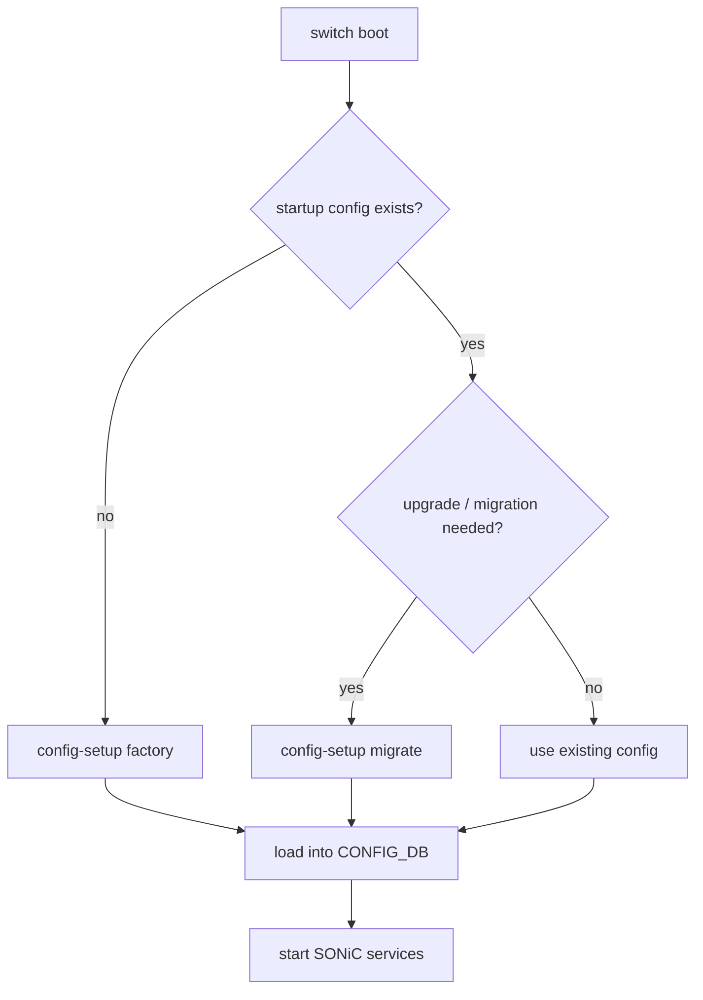

# 内部実装

設定基盤の内部実装は、起動時に設定をどう作るか、Redis をどう配置するか、Multi-ASIC で namespace をどう分けるか、という順に読むと全体像がつかめます。通常運用では意識しない層ですが、first boot、upgrade、Multi-ASIC、性能問題ではここが原因になります。

## first boot と migration

[config-setup](../../system/sonic-configuration-setup-service.md) は、first boot で startup config が無い場合の factory default 生成、firmware upgrade 時の backup / restore / migration、Config DB 外の設定ファイルの扱いを集約するサービスです。



ZTP が動く環境では、first boot の factory default 生成と外部 provisioning の責務がぶつからないように読む必要があります。upgrade では、古い `config_db.json` を新版の schema に合わせる migration が重要です。

## Redis インスタンスを分ける理由

単一 Redis に `APPL_DB`、`ASIC_DB`、`CONFIG_DB`、`STATE_DB`、`COUNTERS_DB` などを載せると、大量 route や counter 更新で hot spot になります。[複数 Redis インスタンス](../../internals/support-multiple-user-defined-redis-database-instances.md) の設計は、`database_config.json` の `INSTANCES` と `DATABASES` で DB 名から Redis インスタンスを引けるようにし、負荷を分散するものです。

```json
{
  "DATABASES": {
    "APPL_DB": {"id": 0, "separator": ":", "instance": "redis"},
    "ASIC_DB": {"id": 1, "separator": ":", "instance": "redis2"},
    "CONFIG_DB": {"id": 4, "separator": "|", "instance": "redis"}
  }
}
```

この設定は CONFIG_DB テーブルではなく、database service の起動設定です。変更時は database service の再起動や downgrade 互換性を考慮します。

## Multi-ASIC namespace の DB

[Multi-ASIC 名前空間の Redis](../../internals/support-redis-databases-in-multiple-namespaces.md) は、host global namespace と `asic0`、`asic1` などの NPU namespace を分けます。各 namespace は独自の `database_config.json` を持ち、host 側の `database_global.json` が全体の目録になります。

| 層 | 持つもの | 読む場面 |
| --- | --- | --- |
| global namespace | system 共通設定、管理系 service、global DB | chassis / management / platform 共通情報 |
| per-ASIC namespace | その ASIC の `APPL_DB`、`ASIC_DB`、`COUNTERS_DB`、`STATE_DB` | port、route、counter、orchagent 切り分け |
| `database_global.json` | namespace と DB config の include 一覧 | クライアントが別 namespace DB へ接続する時 |

Single-ASIC では「global が唯一の Redis」と考えれば十分です。Multi-ASIC 章では、同じ `CONFIG_DB` という名前でも host 側と per-ASIC 側のどちらを見ているかが重要になります。

## DB 選択で迷ったら

| 症状 / 調査対象 | まず見る場所 |
| --- | --- |
| 設定ファイルが起動時に反映されない | `config-setup`、`config_db.json`、migration log |
| `redis-cli -n 4` で期待値が見えない | namespace、database_config、CONFIG_DB の接続先 |
| orchagent まで届かない | `APPL_DB` と `swss-schema` |
| syncd / SAI 近辺で止まる | `ASIC_DB`、syncd log、SAI failure handling 章 |
| Multi-ASIC で片 ASIC だけ違う | `-n asicX`、per-ASIC `config_db<ns>.json`、`database_global.json` |

## 関連ページ

- [config-setup サービス](../../system/sonic-configuration-setup-service.md)
- [複数 Redis インスタンスのユーザ定義](../../internals/support-multiple-user-defined-redis-database-instances.md)
- [Multi-ASIC 名前空間の Redis](../../internals/support-redis-databases-in-multiple-namespaces.md)
