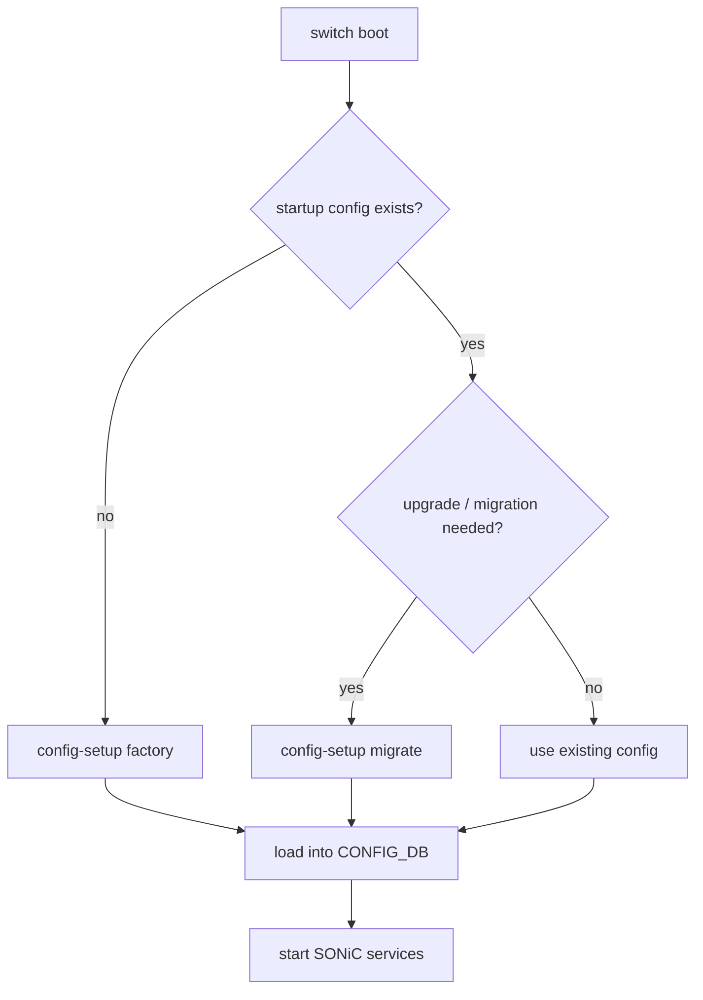
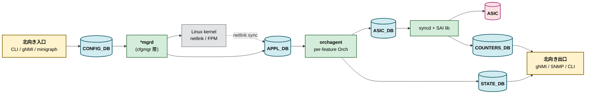

# 内部実装

設定基盤の内部実装は、起動時に設定をどう作るか、[Redis](../../reference/glossary.md#term-redis) をどう配置するか、[Multi-ASIC](../../reference/glossary.md#term-multi-asic) で namespace をどう分けるか、という順に読むと全体像がつかめます。通常運用では意識しない層ですが、first boot、upgrade、Multi-[ASIC](../../reference/glossary.md#term-asic)、性能問題ではここが原因になります。

## first boot と migration

[config-setup](../../system/sonic-configuration-setup-service.md) は、first boot で startup config が無い場合の factory default 生成、firmware upgrade 時の backup / restore / migration、Config DB 外の設定ファイルの扱いを集約するサービスです。



[ZTP](../../reference/glossary.md#term-ztp) が動く環境では、first boot の factory default 生成と外部 provisioning の責務がぶつからないように読む必要があります。upgrade では、古い `config_db.json` を新版の schema に合わせる migration が重要です。

## Redis インスタンスを分ける理由

単一 Redis に `APPL_DB`、`ASIC_DB`、`CONFIG_DB`、`STATE_DB`、`COUNTERS_DB` などを載せると、大量 route や counter 更新で hot spot になります。[複数 Redis インスタンス](../../internals/support-multiple-user-defined-redis-database-instances.md) の設計は、`database_config.json` の `INSTANCES` と `DATABASES` で DB 名から Redis インスタンスを引けるようにし、負荷を分散するものです。

```json
{
  "DATABASES": {
    "APPL_DB": {"id": 0, "separator": ":", "instance": "redis"},
    "ASIC_DB": {"id": 1, "separator": ":", "instance": "redis2"},
    "CONFIG_DB": {"id": 4, "separator": "|", "instance": "redis"}
  }
}
```

この設定は [CONFIG_DB](../../reference/glossary.md#term-config_db) テーブルではなく、database service の起動設定です。変更時は database service の再起動や downgrade 互換性を考慮します。

## Multi-ASIC namespace の DB

[Multi-ASIC 名前空間の Redis](../../internals/support-redis-databases-in-multiple-namespaces.md) は、host global namespace と `asic0`、`asic1` などの [NPU](../../reference/glossary.md#term-npu) namespace を分けます。各 namespace は独自の `database_config.json` を持ち、host 側の `database_global.json` が全体の目録になります。

| 層 | 持つもの | 読む場面 |
| --- | --- | --- |
| global namespace | system 共通設定、管理系 service、global DB | chassis / management / platform 共通情報 |
| per-ASIC namespace | その ASIC の `APPL_DB`、`ASIC_DB`、`COUNTERS_DB`、`STATE_DB` | port、route、counter、[orchagent](../../reference/glossary.md#term-orchagent) 切り分け |
| `database_global.json` | namespace と DB config の include 一覧 | クライアントが別 namespace DB へ接続する時 |

Single-ASIC では「global が唯一の Redis」と考えれば十分です。Multi-ASIC 章では、同じ `CONFIG_DB` という名前でも host 側と per-ASIC 側のどちらを見ているかが重要になります。

## DB 選択で迷ったら

| 症状 / 調査対象 | まず見る場所 |
| --- | --- |
| 設定ファイルが起動時に反映されない | `config-setup`、`config_db.json`、migration log |
| `redis-cli -n 4` で期待値が見えない | namespace、database_config、CONFIG_DB の接続先 |
| orchagent まで届かない | `APPL_DB` と `swss-schema` |
| [syncd](../../reference/glossary.md#term-syncd) / [SAI](../../reference/glossary.md#term-sai) 近辺で止まる | `ASIC_DB`、syncd log、SAI failure handling 章 |
| Multi-ASIC で片 ASIC だけ違う | `-n asicX`、per-ASIC `config_db<ns>.json`、`database_global.json` |

## SONiC 全体のデータフロー

01 章の overview として、[SONiC](../../reference/glossary.md#term-sonic) の典型的な「設定 → SAI → ASIC」の流れを一枚で示します。



## 主要 Orch / daemon の責務（一覧）

| 種別 | 代表的なプロセス / クラス | 役割 |
| --- | --- | --- |
| cfgmgr 層 | `vlanmgrd`、`intfmgrd`、`teammgrd`、`natmgr`、`buffermgrd`、`vrfmgrd` | CONFIG_DB → kernel + [APPL_DB](../../reference/glossary.md#term-appl_db) |
| sync 層 | `portsyncd`、`fdbsyncd`、`teamsyncd`、`natsyncd`、`fpmsyncd` | kernel / [FRR](../../reference/glossary.md#term-frr) の netlink/[FPM](../../reference/glossary.md#term-fpm) を APPL_DB へ |
| orchagent 内 Orch | `PortsOrch`、`RouteOrch`、`NeighOrch`、`NhgOrch`、`AclOrch`、`QosOrch`、`BufferOrch`、`VxlanOrch`、`VNetOrch`、`NatOrch`、`FdbOrch`、`MirrorOrch`、`PolicerOrch`、`CrmOrch`、`SwitchOrch` | APPL_DB → SAI |
| syncd 層 | `syncd`、`sairedis`、`SAIRedis ASIC view` | [ASIC_DB](../../reference/glossary.md#term-asic_db) ↔ SAI library ↔ [ASIC SDK](../../reference/glossary.md#term-asic-sdk) |
| host services | `hostcfgd`、`sonic-host-service`、`pcied`、`pmon`、`thermalctld`、`psud`、`xcvrd` | host 設定、platform sensor、optic |
| 管理面 | `telemetry`（[gNMI](../../reference/glossary.md#term-gnmi)/[gNOI](../../reference/glossary.md#term-gnoi)）、`snmpd`、`rest-server`、`mgmt-framework` | 北向き API |

## Redis pub/sub の使われ方（一覧）

| 経路 | 用途 |
| --- | --- |
| `__keyspace@N__:*` notification | `ConsumerStateTable` / `SubscriberStateTable` が key 変更を待つ |
| `_NOTIFY:asic_state` 等の notification channel | ASIC_DB 上の [FDB](../../reference/glossary.md#term-fdb) / port state 等のイベント |
| ZMQ producer/consumer | 大量書き込み（[VNET](../../reference/glossary.md#term-vnet) route、[DASH](../../reference/glossary.md#term-dash) SDN）で APPL_DB を経由しない直行路 |

ZMQ は SONiC master でも増えつつある経路で、章ごとに使用有無が違います（→ 03、13 章）。

## 既知の実装上の制約（概観）

- **Redis の単一スレッド**：全テーブルが redis-server の単一スレッドに直列化されるため、高 QPS 時には Redis 自体が bottleneck になりやすいです。複数インスタンス化はこのため。
- **CONFIG_DB ↔ APPL_DB の二段構造**：CLI から CONFIG_DB に書いた直後に APPL_DB に同名 key が無い場合がある（`*mgrd` 経由のため）。SET 直後の STATE/APPL 確認は polling が必要。
- **ASIC_DB の write は async**：sairedis の async mode により、ASIC_DB に書いた直後の SAI 反映確認は notification channel か [COUNTERS_DB](../../reference/glossary.md#term-counters_db) 経由でしか観測できない。
- **Multi-ASIC は namespace で分離**：同名 DB が複数ある。`-n asicX` を忘れた CLI は host 側の DB を読むだけで silent に成功する事故が多発する。

## 関連ページ

- [config-setup サービス](../../system/sonic-configuration-setup-service.md)
- [複数 Redis インスタンスのユーザ定義](../../internals/support-multiple-user-defined-redis-database-instances.md)
- [Multi-ASIC 名前空間の Redis](../../internals/support-redis-databases-in-multiple-namespaces.md)
- [20 章 SWSS / SAI / Redis 内部実装](../20-swss-sai-redis/internals.md)

<!-- glossary-links-injected: 5c9b3765d470 -->
