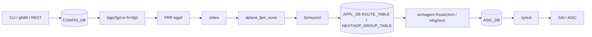

# アーキテクチャ

[BGP](../../reference/glossary.md#term-bgp) route が転送可能になるまでの主経路は、[FRR](../../reference/glossary.md#term-frr) 内の bgpd/[zebra](../../reference/glossary.md#term-zebra) から [FPM](../../reference/glossary.md#term-fpm) 経由で [fpmsyncd](../../reference/glossary.md#term-fpmsyncd) に渡り、[APPL_DB](../../reference/glossary.md#term-appl_db)、[orchagent](../../reference/glossary.md#term-orchagent)、[syncd](../../reference/glossary.md#term-syncd)、[SAI](../../reference/glossary.md#term-sai)/[ASIC](../../reference/glossary.md#term-asic) へ進む。設定反映の経路と、学習 route の転送面反映の経路を分けて見ることが重要である。



## FRR から SONiC への通信チャネル

従来は zebra の `dplane_fpm_nl` module が kernel [Netlink](../../reference/glossary.md#term-netlink) 形式の経路情報を fpmsyncd に流すという理解で十分だった。新しい設計では [SONiC](../../reference/glossary.md#term-sonic) 側で保守する `dplane_fpm_sonic` module を使い、SONiC 固有の属性や message type を Netlink encoding に追加できるようにする[^fpm-sonic]。[SRv6](../../reference/glossary.md#term-srv6) SID のように kernel data model だけでは表現できない属性を運ぶための基盤である。

この変更はユーザが BGP neighbor を設定する入口には直接見えない。しかし Suppress FIB Pending や SRv6 のように「FRR と SONiC の間で追加情報を往復させる」機能では前提になる。詳細は [新 FRR-SONiC 通信チャネル](../../routing/new-frr-sonic-communication-channel.md) を参照する。

<!-- evidence:
source: sonic-net/SONiC/doc/sonic-fpm-module/frr_sonic_communication_channel.md#L79-L125 (sha: 49bab5b5ff0e924f1ea52b3d9db0dfa4191a7c06)
excerpt: |
  We introduce a new FPM module called FPM SONiC (`dplane_fpm_sonic`). Initially, this new FPM SONiC module is a copy of the current FPM module. ...
  command=/usr/lib/frr/zebra -A 127.0.0.1 -s 90000000 -M dplane_fpm_sonic -M snmp --asic-offload=notify_on_offload
reasoning: SONiC HLD は zebra の起動オプションを `-M dplane_fpm_nl` から `-M dplane_fpm_sonic` に置き換えることを明示しており、本文の「SONiC 側保守の新 FPM module」記述と整合する。
-->

<!-- evidence-rendered:start -->
??? note "📋 検証エビデンス: sonic-net/SONiC/doc/sonic-fpm-module/frr_sonic_communication_channel.md#L79-L125 (sha: 49bab5b5ff0e924f1ea52b3d9db0dfa4191a7c06)"

    **出典**:

    `sonic-net/SONiC/doc/sonic-fpm-module/frr_sonic_communication_channel.md#L79-L125 (sha: 49bab5b5ff0e924f1ea52b3d9db0dfa4191a7c06)`

    **抜粋**:

    ```text
    We introduce a new FPM module called FPM SONiC (`dplane_fpm_sonic`). Initially, this new FPM SONiC module is a copy of the current FPM module. ...
    command=/usr/lib/frr/zebra -A 127.0.0.1 -s 90000000 -M dplane_fpm_sonic -M snmp --asic-offload=notify_on_offload
    ```

    **判断根拠**: SONiC HLD は zebra の起動オプションを `-M dplane_fpm_nl` から `-M dplane_fpm_sonic` に置き換えることを明示しており、本文の「SONiC 側保守の新 FPM module」記述と整合する。

<!-- evidence-rendered:end -->

## route と nexthop group を分ける理由

大量 route では、各 route に nexthop list を埋め込むと APPL_DB と orchagent の処理量が膨らむ。`NEXTHOP_GROUP_TABLE` に nexthop group を分離すると、route は group を参照し、group の作成・削除・参照カウントを `NhgOrch` 側で扱える[^nhgorch]。これは BGP PIC や [ECMP](../../reference/glossary.md#term-ecmp) 更新の土台にもなる。

`fpmsyncd` の NextHop Group 拡張は、FRR から受けた nexthop group を APPL_DB の `NEXTHOP_GROUP_TABLE` に出せるようにする[^fpmsyncd-nhg]。APPL_DB route と nexthop group の分離は [NEXT_HOP_GROUP_TABLE による APP_DB ルートとネクストホップ分離](../../routing/routing-and-next-hop-table-enhancement.md)、FPM 受信側の拡張は [fpmsyncd NextHop Group 拡張](../../routing/fpmsyncd-nexthop-group-enhancement-high-level-design-document.md) を読む。

<!-- evidence:
source: sonic-net/sonic-swss/orchagent/orchdaemon.cpp#L338-L338 (sha: 4305596156d70e9797e8a881b3d19b46de0bce0d)
excerpt: |
  gNhgOrch = new NhgOrch(m_applDb, APP_NEXTHOP_GROUP_TABLE_NAME);
reasoning: orchdaemon 初期化で NhgOrch が APPL_DB の NEXTHOP_GROUP_TABLE を subscribe して生成される実装。fpmsyncd が同テーブルに publish した group を orchagent が受け取る経路が成立する。
-->

<!-- evidence-rendered:start -->
??? note "📋 検証エビデンス: sonic-net/sonic-swss/orchagent/orchdaemon.cpp#L338-L338 (sha: 4305596156d70e9797e8a881b3d19b46de0bce0d)"

    **出典**:

    `sonic-net/sonic-swss/orchagent/orchdaemon.cpp#L338-L338 (sha: 4305596156d70e9797e8a881b3d19b46de0bce0d)`

    **抜粋**:

    ```text
    gNhgOrch = new NhgOrch(m_applDb, APP_NEXTHOP_GROUP_TABLE_NAME);
    ```

    **判断根拠**: orchdaemon 初期化で NhgOrch が APPL_DB の NEXTHOP_GROUP_TABLE を subscribe して生成される実装。fpmsyncd が同テーブルに publish した group を orchagent が受け取る経路が成立する。

<!-- evidence-rendered:end -->

<!-- evidence:
source: sonic-net/sonic-swss/fpmsyncd/routesync.cpp#L156-L158 (sha: 4305596156d70e9797e8a881b3d19b46de0bce0d)
excerpt: |
  m_routeTable(createProducerStateTable(pipeline, APP_ROUTE_TABLE_NAME, true, m_zmqClient)),
  m_nexthop_groupTable(pipeline, APP_NEXTHOP_GROUP_TABLE_NAME, true),
  m_label_routeTable(createProducerStateTable(pipeline, APP_LABEL_ROUTE_TABLE_NAME, true, m_zmqClient)),
reasoning: fpmsyncd の RouteSync が APP_ROUTE_TABLE と APP_NEXTHOP_GROUP_TABLE を ProducerStateTable として保持し、両者へ別レコードで publish する実装が確認できる。
-->

<!-- evidence-rendered:start -->
??? note "📋 検証エビデンス: sonic-net/sonic-swss/fpmsyncd/routesync.cpp#L156-L158 (sha: 4305596156d70e9797e8a881b3d19b46de0bce0d)"

    **出典**:

    `sonic-net/sonic-swss/fpmsyncd/routesync.cpp#L156-L158 (sha: 4305596156d70e9797e8a881b3d19b46de0bce0d)`

    **抜粋**:

    ```text
    m_routeTable(createProducerStateTable(pipeline, APP_ROUTE_TABLE_NAME, true, m_zmqClient)),
    m_nexthop_groupTable(pipeline, APP_NEXTHOP_GROUP_TABLE_NAME, true),
    m_label_routeTable(createProducerStateTable(pipeline, APP_LABEL_ROUTE_TABLE_NAME, true, m_zmqClient)),
    ```

    **判断根拠**: fpmsyncd の RouteSync が APP_ROUTE_TABLE と APP_NEXTHOP_GROUP_TABLE を ProducerStateTable として保持し、両者へ別レコードで publish する実装が確認できる。

<!-- evidence-rendered:end -->

## 失敗はどこで見えるか

経路反映は一方向に見えるが、実際には ASIC 書き込み失敗や offload 完了を FRR に戻したい場面がある。歴史的な [BGP Route Install Error Handling](../../routing/bgp-route-install-error-handling.md) は `ERROR_ROUTE_TABLE` を ERROR_DB に置き、fpmsyncd が subscribe して zebra に逆通知する提案だった[^err-hld]。ただし現行 master の `sonic-swss` / `sonic-swss-common` に `ERROR_ROUTE_TABLE` という名前の table 定義は存在せず、[HLD](../../reference/glossary.md#term-hld) 提案は採用見送りの状態である[^err-grep]。後発の [BGP Suppress FIB Pending](../../routing/bgp-suppress-announcements-of-routes-not-installed-in-hw.md) は `dplane_fpm_nl` / `dplane_fpm_sonic` 系の応答経路と FRR の `bgp suppress-fib-pending` を使う方向で整理されている。

運用上は「bgpd が best path を持つ」「zebra が route を持つ」「APPL_DB に出ている」「orchagent が ASIC に入れた」を別々に確認する。どこまで進んだかで、見る daemon とログが変わる。

<!-- evidence:
source: sonic-net/SONiC/doc/bgp_error_handling/BGP_Route_Error_Handling_Arlo.md#L68-L96 (sha: 49bab5b5ff0e924f1ea52b3d9db0dfa4191a7c06)
excerpt: |
  On enabling the error-handling feature, fpmsyncd subscribes to the changes in the ERROR_ROUTE_TABLE entries. ...
  A new class is added in fpmsyncd to subscribe to ERROR_ROUTE_TABLE present inside the ERROR_DB.
reasoning: HLD は ERROR_ROUTE_TABLE を ERROR_DB に置き fpmsyncd が subscribe する設計を提示している。
-->

<!-- evidence-rendered:start -->
??? note "📋 検証エビデンス: sonic-net/SONiC/doc/bgp_error_handling/BGP_Route_Error_Handling_Arlo.md#L68-L96 (sha: 49bab5b5ff0e924f1ea52b3d9db0dfa4191a7c06)"

    **出典**:

    `sonic-net/SONiC/doc/bgp_error_handling/BGP_Route_Error_Handling_Arlo.md#L68-L96 (sha: 49bab5b5ff0e924f1ea52b3d9db0dfa4191a7c06)`

    **抜粋**:

    ```text
    On enabling the error-handling feature, fpmsyncd subscribes to the changes in the ERROR_ROUTE_TABLE entries. ...
    A new class is added in fpmsyncd to subscribe to ERROR_ROUTE_TABLE present inside the ERROR_DB.
    ```

    **判断根拠**: HLD は ERROR_ROUTE_TABLE を ERROR_DB に置き fpmsyncd が subscribe する設計を提示している。

<!-- evidence-rendered:end -->

<!-- evidence:
source: sonic-net/sonic-swss (sha: 4305596156d70e9797e8a881b3d19b46de0bce0d), sonic-net/sonic-swss-common (sha: 158de8d3463ff4b841653f6d57190bb142b80d9c)
excerpt: |
  grep -r "ERROR_ROUTE_TABLE" sonic-swss sonic-swss-common --include="*.cpp" --include="*.h" --include="*.py"
  -> 0 matches
reasoning: 現行 master のソースに ERROR_ROUTE_TABLE / errorRouteTable 等の symbol が存在しないため、HLD の提案は master に取り込まれていない。
-->

<!-- evidence-rendered:start -->
??? note "📋 検証エビデンス: sonic-net/sonic-swss (sha: 4305596156d70e9797e8a881b3d19b46de0bce0d), sonic-net/sonic-swss-common (sha: 158de8d3463ff4b841653f6d57190bb142b80d9c)"

    **出典**:

    `sonic-net/sonic-swss (sha: 4305596156d70e9797e8a881b3d19b46de0bce0d), sonic-net/sonic-swss-common (sha: 158de8d3463ff4b841653f6d57190bb142b80d9c)`

    **抜粋**:

    ```text
    grep -r "ERROR_ROUTE_TABLE" sonic-swss sonic-swss-common --include="*.cpp" --include="*.h" --include="*.py"
    -> 0 matches
    ```

    **判断根拠**: 現行 master のソースに ERROR_ROUTE_TABLE / errorRouteTable 等の symbol が存在しないため、HLD の提案は master に取り込まれていない。

<!-- evidence-rendered:end -->

## 関連ページ

- [新 FRR-SONiC 通信チャネル](../../routing/new-frr-sonic-communication-channel.md)
- [fpmsyncd NextHop Group 拡張](../../routing/fpmsyncd-nexthop-group-enhancement-high-level-design-document.md)
- [NEXT_HOP_GROUP_TABLE による APP_DB ルートとネクストホップ分離](../../routing/routing-and-next-hop-table-enhancement.md)
- [BGP Suppress FIB Pending](../../routing/bgp-suppress-announcements-of-routes-not-installed-in-hw.md)

## 引用元

[^fpm-sonic]: `dplane_fpm_sonic` は SONiC が保守する FPM module。`sonic-net/SONiC/doc/sonic-fpm-module/frr_sonic_communication_channel.md` (commit `49bab5b5`) L79-L125 で導入と zebra 起動オプション `-M dplane_fpm_sonic` への切替が示されている。
[^nhgorch]: `NhgOrch` クラス定義は `sonic-net/sonic-swss/orchagent/nhgorch.h` L117 (commit `43055961`)、APPL_DB の `NEXTHOP_GROUP_TABLE` を subscribe して group lifecycle を管理する。`orchagent/orchdaemon.cpp` L338 で `gNhgOrch = new NhgOrch(m_applDb, APP_NEXTHOP_GROUP_TABLE_NAME)` として生成される。
[^fpmsyncd-nhg]: `sonic-net/sonic-swss/fpmsyncd/routesync.cpp` L156-L158 (commit `43055961`) で RouteSync が `APP_ROUTE_TABLE_NAME` と `APP_NEXTHOP_GROUP_TABLE_NAME` を別 [ProducerStateTable](../../reference/glossary.md#term-producerstatetable) として保持する実装が確認できる。
[^err-hld]: `sonic-net/SONiC/doc/bgp_error_handling/BGP_Route_Error_Handling_Arlo.md` (commit `49bab5b5`) L68-L96 で fpmsyncd が ERROR_DB 内 `ERROR_ROUTE_TABLE` を subscribe して zebra に逆通知する設計を提示している。
[^err-grep]: 2026-06 時点の `sonic-net/sonic-swss` (`43055961`) と `sonic-net/sonic-swss-common` (`158de8d3`) を `ERROR_ROUTE_TABLE` で grep してもヒット 0 件のため、HLD 提案は master に取り込まれていない。後発の `bgp suppress-fib-pending` が事実上の代替経路である。

<!-- glossary-links-injected: e0debdd7b136 -->
