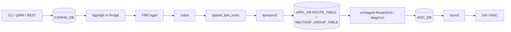

# アーキテクチャ

BGP route が転送可能になるまでの主経路は、FRR 内の bgpd/zebra から FPM 経由で fpmsyncd に渡り、APPL_DB、orchagent、syncd、SAI/ASIC へ進む。設定反映の経路と、学習 route の転送面反映の経路を分けて見ることが重要である。

## FRR から SONiC への通信チャネル

古い理解では zebra の `dplane_fpm_nl` が kernel Netlink 形式の経路情報を fpmsyncd に流す、と捉えればよかった。新しい設計では SONiC 側で保守する `dplane_fpm_sonic` module を使い、SONiC 固有の属性や message type を追加できるようにする。SRv6 SID のように kernel data model だけでは表現できない属性を運ぶための基盤である。

この変更はユーザーが BGP neighbor を設定する入口には直接見えない。しかし Suppress FIB Pending や SRv6 のように「FRR と SONiC の間で追加情報を往復させる」機能では前提になる。詳細は [新 FRR-SONiC 通信チャネル](../../routing/new-frr-sonic-communication-channel.md) を参照する。

## route と nexthop group を分ける理由

大量 route では、各 route に nexthop list を埋め込むと APPL_DB と orchagent の処理量が膨らむ。`NEXT_HOP_GROUP_TABLE` に nexthop group を分離すると、route は group を参照し、group の作成・削除・参照カウントを NhgOrch 側で扱える。これは BGP PIC や ECMP 更新の土台にもなる。

`fpmsyncd` NextHop Group 拡張は、FRR から受けた nexthop group を APPL_DB の `NEXTHOP_GROUP_TABLE` に出せるようにする。APPL_DB route と nexthop group の分離は [NEXT_HOP_GROUP_TABLE による APP_DB ルートとネクストホップ分離](../../routing/routing-and-next-hop-table-enhancement.md)、FPM 受信側の拡張は [fpmsyncd NextHop Group 拡張](../../routing/fpmsyncd-nexthop-group-enhancement-high-level-design-document.md) を読む。

## 失敗はどこで見えるか

経路反映は一方向に見えるが、実際には ASIC 書き込み失敗や offload 完了を FRR に戻したい場面がある。歴史的な [BGP Route Install Error Handling](../../routing/bgp-route-install-error-handling.md) は `ERROR_ROUTE_TABLE` を使う提案だったが、現行実装との乖離がある。後発の [BGP Suppress FIB Pending](../../routing/bgp-suppress-announcements-of-routes-not-installed-in-hw.md) は `dplane_fpm_nl`/`dplane_fpm_sonic` 系の応答経路と FRR の `bgp suppress-fib-pending` を使う方向で整理されている。

運用上は「bgpd が best path を持つ」「zebra が route を持つ」「APPL_DB に出ている」「orchagent が ASIC に入れた」を別々に確認する。どこまで進んだかで、見る daemon とログが変わる。

## 関連ページ

- [新 FRR-SONiC 通信チャネル](../../routing/new-frr-sonic-communication-channel.md)
- [fpmsyncd NextHop Group 拡張](../../routing/fpmsyncd-nexthop-group-enhancement-high-level-design-document.md)
- [NEXT_HOP_GROUP_TABLE による APP_DB ルートとネクストホップ分離](../../routing/routing-and-next-hop-table-enhancement.md)
- [BGP Suppress FIB Pending](../../routing/bgp-suppress-announcements-of-routes-not-installed-in-hw.md)
