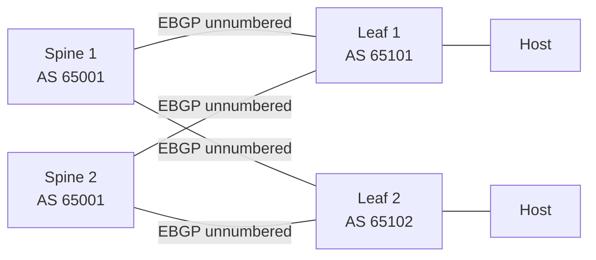
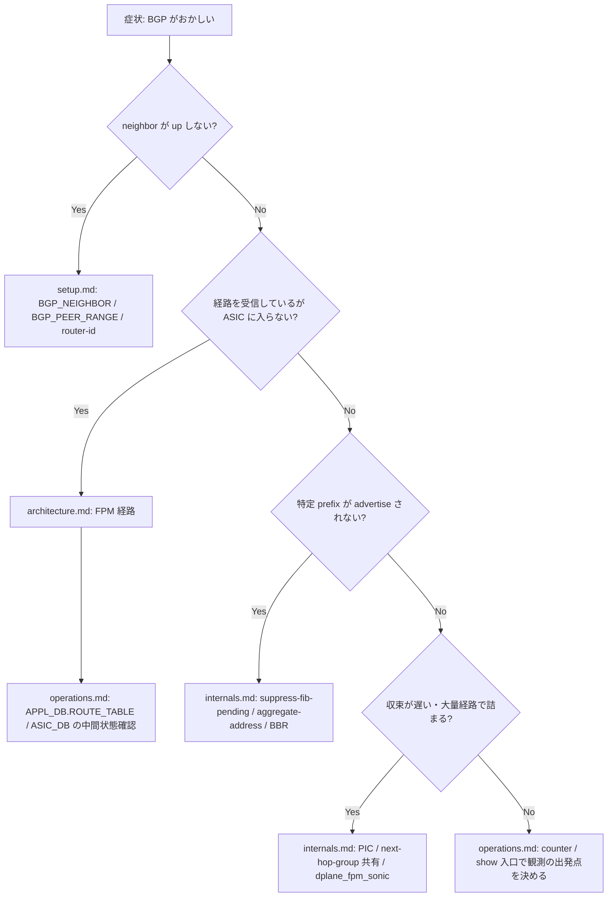
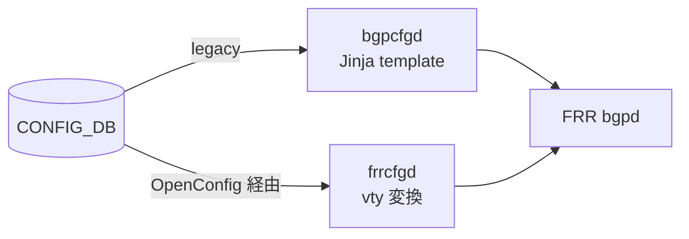

# 概要

「SONiC で [BGP](../../reference/glossary.md#term-bgp) を読む」ときに最初にぶつかる困りごとは、BGP プロトコルそのものではなく、**SONiC と [FRR](../../reference/glossary.md#term-frr) の境界がどこにあるか** が見えづらいことです。BGP のプロトコル処理は FRR（オープンソースのルーティング suite）が行い、SONiC は設定の受付と ASIC への反映を担当しますが、両者の橋渡しに複数の daemon と DB が並んでいるため、どこで何が起きているかを掴むのに時間がかかります。

この章は、その境界線をはっきりさせるための入口です。

## SONiC の BGP は何の問題を解決するか

データセンタースイッチでは、BGP は単に AS 間の経路交換ではなく、**EBGP unnumbered で leaf-spine のあらゆる link 上で動かす [ECMP](../../reference/glossary.md#term-ecmp) fabric の制御面** として使われます。SONiC はこの利用形態を前提に、以下を引き受けます。

- BGP neighbor / policy / route-map を [CONFIG_DB](../../reference/glossary.md#term-config_db) / [YANG](../../reference/glossary.md#term-yang) / CLI で受ける。
- FRR の vty / 設定ファイルへ差分反映する。
- FRR から到達した経路を [FPM](../../reference/glossary.md#term-fpm) 経由で受け取り、ASIC の FIB に書き込む。
- BGP 由来のイベント（peer down、route flap）を [STATE_DB](../../reference/glossary.md#term-state_db) / telemetry に出す。

つまり SONiC の BGP は「FRR をうまく使うための包み」と考えると、[HLD](../../reference/glossary.md#term-hld) を読むときの迷子が減ります。

## SONiC の中での位置

| 軸 | 担当 |
| --- | --- |
| Management plane | `config bgp`, `vtysh`, sonic-cli, [gNMI](../../reference/glossary.md#term-gnmi), CONFIG_DB.BGP_* |
| Control plane | FRR bgpd / [zebra](../../reference/glossary.md#term-zebra) / staticd、[bgpcfgd](../../reference/glossary.md#term-bgpcfgd) / frrcfgd、[fpmsyncd](../../reference/glossary.md#term-fpmsyncd) |
| Data plane | [orchagent](../../reference/glossary.md#term-orchagent) (RouteOrch / NhgOrch)、[syncd](../../reference/glossary.md#term-syncd)、[SAI](../../reference/glossary.md#term-sai) route / next-hop / next-hop-group |

BGP は **management と control の橋渡し** が大半で、data plane 側はほぼ汎用の RouteOrch を使います。BGP 固有のロジックの多くは「CONFIG_DB → FRR」と「FRR → [APPL_DB](../../reference/glossary.md#term-appl_db)」の 2 つの方向にあります。

## 最初に押さえる用語

| 用語 | 意味 |
| --- | --- |
| FRR | bgpd / zebra / staticd など複数 daemon からなる routing suite。SONiC は patch-fork した FRR を使う |
| bgpcfgd | CONFIG_DB を読み、Jinja テンプレートで FRR 設定ファイルを生成する daemon |
| frrcfgd | OpenConfig BGP 等、Management Framework 経由の設定を FRR vty コマンドへ翻訳する daemon |
| FPM | FRR Forwarding Plane Manager。zebra が学習経路を外部へ出す TCP プロトコル |
| fpmsyncd | FPM を受け取り `APPL_DB.ROUTE_TABLE` に書き込む SONiC 側 daemon |
| dplane_fpm_sonic | FRR 側の SONiC 専用 FPM plugin（オリジナル FPM のフォーク） |
| RIB / FIB | FRR が持つ Routing Information Base / ASIC に入っている Forwarding Information Base |
| `frr_mgmt_framework_config` | bgpcfgd と frrcfgd のどちらを使うかを切り替えるメタデータ |

## まず責務を分ける

| 層 | 主な責務 | 代表コンポーネント |
| --- | --- | --- |
| 設定入力 | CLI、gNMI/REST、CONFIG_DB の受付 | [sonic-utilities](../../reference/glossary.md#term-sonic-utilities)、Management Framework |
| FRR 設定反映 | CONFIG_DB 差分を FRR 設定へ変換 | bgpcfgd、frrcfgd |
| BGP 制御 | neighbor、policy、best path、RIB | bgpd |
| 経路配布 | FRR RIB から SONiC への FPM 出力 | zebra、dplane_fpm_sonic |
| SONiC 転送面反映 | APPL_DB から [ASIC_DB](../../reference/glossary.md#term-asic_db)/SAI へ | fpmsyncd、orchagent、syncd |

従来の中心は `bgpcfgd` で、Jinja template と一部の動的反映により FRR 設定を作ります。OpenConfig BGP を Management Framework から扱う構成では `frrcfgd` が CONFIG_DB の差分から FRR vty コマンドを生成します。両者は同時に動かす前提ではなく、`DEVICE_METADATA.localhost.frr_mgmt_framework_config` で切り替える設計です。詳しくは [FRR-BGP Unified Mgmt Framework](../../routing/sonic-frr-bgp-extended-unified-configuration-management-framework.md) を参照してください。

## 典型的な使用シーン

### シーン 1: leaf-spine fabric の EBGP unnumbered

Spine と Leaf の各リンクで EBGP を張り、IPv6 link-local + RFC 5549 で IPv4 prefix を運ぶのが典型です。SONiC では `BGP_NEIGHBOR` ではなく `BGP_PEER_RANGE` / unnumbered 用の templates が使われることが多く、router-id の決まり方が hostname / loopback / metadata に依存する点が落とし穴になりがちです。

### シーン 2: BGP-EVPN を被せた VXLAN overlay

[VXLAN](../../reference/glossary.md#term-vxlan) / [EVPN](../../reference/glossary.md#term-evpn) を被せる場合は、同じ BGP セッションの上に `l2vpn evpn` AFI が乗ります。BGP 自体の設定パスは同じですが、経路を受け取る先が `VXLAN_*` / `EVPN_*` テーブルや FRR の EVPN モジュールに広がります。詳細は [03 章 VXLAN / EVPN](../03-vxlan-evpn/concept.md) を併せて読みます。

## router-id はどこで決まるか

BGP router-id は、明示設定がない場合に既存ロジックで決まります。明示したい場合は `DEVICE_METADATA.localhost.bgp_router_id` を使う設計があります。これは FRR 側だけの設定ではなく、SONiC の起動時設定生成に関わるため、どの値が最終的に FRR に入るかを確認する必要があります。詳細は [BGP router-id を明示的に設定する](../../routing/bgp-router-id-explicitly-configured.md) にまとまっています。

## FRR upgrade は何に影響するか

FRR upgrade は単なるパッケージ更新ではありません。SONiC では FRR fork、patch、docker image、起動テンプレート、FPM plugin、Management Framework との接点が絡みます。BGP 機能を読むときは、HLD が前提にする FRR version と現在の SONiC 実装が一致するかを確認してください。upgrade 手順と patch 管理の観点は [SONiC における FRR upgrade](../../routing/detailed-steps-to-upgrade-frr-in-sonic.md) を参照します。

## 似た機能との違い

| 比較対象 | 違い |
| --- | --- |
| Static route | CONFIG_DB.STATIC_ROUTE → FRR staticd 経由で同じく FPM → ASIC へ。BGP のような peer 状態管理がない |
| OSPF (FRR ospfd) | SONiC のサポート範囲が薄い。bgpcfgd / frrcfgd の翻訳テンプレートが BGP 中心 |
| EVPN | BGP の AFI として動く。data plane が VXLAN / VNI 側に伸びる |
| OpenConfig network-instance/protocols/bgp | gNMI から触る経路。frrcfgd 経路を有効にしているときに使う |

## counter / show の入口

| 見たいもの | 主な入口 |
| --- | --- |
| neighbor の up/down | `show bgp summary`, FRR の `vtysh -c "show ip bgp summary"`, STATE_DB.NEIGH_STATE_TABLE |
| 受信 / 送信経路数 | `show ip bgp summary`, `show bgp neighbor <peer>` |
| ASIC FIB に入った経路 | `show ip route`, `redis-cli -n 0 keys 'ROUTE_TABLE:*'`（APPL_DB）, `redis-cli -n 1 keys 'ASIC_STATE:SAI_OBJECT_TYPE_ROUTE_ENTRY:*'`（ASIC_DB） |
| FPM 反映の停滞 | fpmsyncd ログ、APPL_DB [ROUTE_TABLE](../../reference/glossary.md#term-route_table) pending |

`show ip route` は FRR 側を見ているのか SONiC 側を見ているのかが混ざりやすい点に注意します。確実な切り分けは「FRR の vty」と「[Redis](../../reference/glossary.md#term-redis) の APPL_DB / ASIC_DB」を別個に確認することです。

## 問題を切り分けるための流れ図

「BGP がおかしい」と感じたとき、どの章のどの節を先に読むかを決めるための地図。SONiC の BGP は **設定経路（CONFIG_DB → FRR）** と **学習経路（FRR → FPM → APPL_DB → ASIC_DB）** の 2 方向にまたがるため、症状から逆引きで節境界をまたぐ。

この流れ図で行き先が分かったら、各節へジャンプ。`internals.md` は複数 HLD を「同じ問題群」として比較表で並べてあるため、節をまたがず 1 ページで読める。

## この章での読み方

BGP の設定問題は [設定](setup.md) へ進みます。経路が ASIC に入らない、advertise が遅れる問題は [アーキテクチャ](architecture.md) と [運用](operations.md) を先に読みます。大量経路、障害収束、FIB pending、dynamic peer のように実装差分が大きい機能は [内部実装](internals.md) で比較します。

## 読み終わったあとにできるようになること

- 「BGP の問題」を、CONFIG_DB / FRR / FPM / APPL_DB / ASIC_DB のどこで起きているか切り分けられる。
- `bgpcfgd` と `frrcfgd` の使い分けと、それを決める metadata を把握できる。
- 同じ `show ip route` でも、FRR と SONiC のどちらを見るべきかが選べる。
- HLD を読むとき、その記述が FRR version 依存か SONiC patch 依存かに当たりを付けられる。

## CONFIG_DB の主要テーブル

BGP まわりで最初に把握しておくべき CONFIG_DB は次のとおりです。詳細は `docs/reference/config-db/` 配下の各ページに辞書化されています。

| Table | 用途 |
| --- | --- |
| `BGP_NEIGHBOR` | 個別 neighbor（peer IP）の AS / hold time / shutdown / route-map など |
| `BGP_PEER_RANGE` | unnumbered / dynamic peer の subnet 単位定義。leaf-spine ECMP fabric の主流 |
| `BGP_GLOBALS` | router-id、ebgp/ibgp multipath、graceful-restart などのグローバル設定 |
| `BGP_ALLOWED_PREFIXES` / `PREFIX_LIST` | prefix-list と route-map の参照先 |
| `BGP_AGGREGATE_ADDRESS` | 集約広告。`BGP_BBR` 連動による条件付き advertise が可能 |
| `BGP_BBR` | Bounce Back Routing の enable/disable。集約広告と密結合 |
| `DEVICE_METADATA.localhost` | `bgp_router_id` / `frr_mgmt_framework_config` 等のメタ設定 |

`bgpcfgd` 構成では Jinja テンプレートでこれらを FRR `vtysh` 設定に reduce します。`frrcfgd` 構成では Management Framework が差分を vty コマンドに翻訳します。同じ CONFIG_DB を読んでいるように見えても、生成される FRR 設定の経路が違う点に注意してください。

## bgpcfgd と frrcfgd の切替

切替キーは `DEVICE_METADATA.localhost.frr_mgmt_framework_config` です。`true` で frrcfgd 経路、未設定 / `false` で bgpcfgd 経路。両方を同時に動かす設計ではないため、機能 HLD を読むときは「どちらの経路を前提とした記述か」を判定する必要があります。新しい OpenConfig BGP 機能は frrcfgd 側に寄り、レガシー Jinja で扱いづらかった政策系の入力経路が広がっています。

## 経路が ASIC に入るまでの段

`show ip route` が同じプレフィックスを返しても、それが FRR RIB か Linux FIB か ASIC FIB のどれかで切り分けが必要です。

| 段 | 場所 | 確認方法 |
| --- | --- | --- |
| FRR RIB | bgpd / zebra の内部 | `vtysh -c "show ip bgp"` / `show ip route` |
| FPM 通過後 | APPL_DB.ROUTE_TABLE | `sonic-db-cli APPL_DB keys 'ROUTE_TABLE:*'` |
| ASIC_DB | syncd / SAI 入力 | `sonic-db-cli ASIC_DB keys 'ASIC_STATE:SAI_OBJECT_TYPE_ROUTE_ENTRY:*'` |
| Linux FIB | kernel | `ip route show` |

特に **大量経路 + 障害収束** の場面では、「BGP は受け取ったが FPM が詰まって APPL_DB に来ていない」「APPL_DB には入ったが orchagent が SAI へ書き切れていない」のような中間状態が観測されます。

## 大量経路 / 高速収束で押さえる機能

DC 規模では **route scale が秒間数万 update** に達することがあり、収束時間を延ばす主な要因は FRR ↔ SONiC 境界です。SONiC 側で確認すべき機能は次のとおりです。

- **BGP suppress-fib-pending**: ASIC FIB に入っていない経路の advertise を抑止し、ブラックホールを避ける（[詳細](../../routing/bgp-suppress-announcements-of-routes-not-installed-in-hw.md)）
- **dplane_fpm_sonic plugin の合体送信**: FRR 側で複数 update をまとめて FPM に流す（[FRR-SONiC FPM channel](../../routing/new-frr-sonic-communication-channel.md)）
- **next-hop group の共有**: 同一 nexthop を持つ経路の group 化で ASIC への書込み量を削減（[Multiple Nexthop Route](../../routing/multiple-nexthop-route-hld.md)）
- **prefix-independent convergence (PIC)**: backup nexthop の事前 program による収束時間短縮（[PIC architecture](../../routing/bgp-prefix-independent-convergence-architecture-document.md)）

## 関連ページ

- [BGP router-id を明示的に設定する](../../routing/bgp-router-id-explicitly-configured.md)
- [FRR-BGP Unified Mgmt Framework](../../routing/sonic-frr-bgp-extended-unified-configuration-management-framework.md)
- [SONiC における FRR upgrade](../../routing/detailed-steps-to-upgrade-frr-in-sonic.md)
- [BGP suppress-fib-pending](../../routing/bgp-suppress-announcements-of-routes-not-installed-in-hw.md)
- [PIC architecture](../../routing/bgp-prefix-independent-convergence-architecture-document.md)

<!-- xref-prereq -->
## この章の前提知識

この章を読み進める前に、次の章を押さえておくと迷子になりにくい。

- [SONiC 全体像と設定基盤](../01-overview/index.md)
- [VRF / ECMP / RIB-FIB パイプライン](../04-vrf-ecmp/index.md)

<!-- glossary-links-injected: 6ff44b32cebf -->
