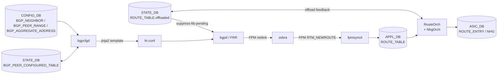

# 内部実装

BGP の内部実装トピックは、同じ「BGP の改善」でも狙っている問題が違う。大量 route 投入を速くするもの、障害時の収束を速くするもの、FIB 未導入 route の advertise を止めるもの、peer 変更を再起動なしで扱うものに分けて読む。

## 改善機能の比較

| 機能 | 改善する問題 | 主な層 | 設定面 |
| --- | --- | --- | --- |
| BGP Loading Optimization | 2M routes 級投入時の fpmsyncd/orchagent/sairedis 処理遅延 | fpmsyncd、orchagent、sairedis | 新規 CLI/CONFIG_DB なし |
| BGP PIC | 障害時に prefix 数 N に比例して再プログラムする遅さ | FRR、NhgOrch、ASIC NHG | HLD は architecture 中心 |
| Suppress FIB Pending | ASIC 未導入 route を先に advertise して traffic loop を起こす問題 | bgpd、zebra、fpmsyncd、orchagent | `DEVICE_METADATA` |
| BGP aggregate with BBR awareness | 集約 route と BBR/prefix-list の連動 | bgpcfgd、FRR | `BGP_AGGREGATE_ADDRESS` |
| dynamic peer modification | dynamic peer range の追加/削除を再起動なしで扱う | bgpcfgd、FRR templates、STATE_DB | `BGP_PEER_RANGE` など |

## データフロー



## 主要 Orch / daemon の責務

| コンポーネント | 主実体 | 責務 |
| --- | --- | --- |
| `bgpd` (FRR) | `frr/bgpd/` | BGP プロトコル実装、best path 計算、graceful restart、suppress-fib-pending |
| `zebra` (FRR) | `frr/zebra/` + `zebra_fpm.c` | RIB 管理、kernel route 反映、FPM 経由で fpmsyncd へ送信 |
| `bgpcfgd` (`src/sonic-bgpcfgd/`) | `bgpcfgd/main.py`、`managers_*.py` | CONFIG_DB の BGP 系テーブルを subscribe し、jinja2 template で frr.conf を render |
| `fpmsyncd` (`fpmsyncd/fpmsyncd.cpp`) | `FpmLink::processFpmMessage`、`RouteSync` | FPM netlink を APPL_DB の ROUTE_TABLE に流す。Loading Optimization の Redis pipeline 入口 |
| `RouteOrch` (`orchagent/routeorch.cpp`) | `RouteOrch::doTask`、`addRoute` | ROUTE_TABLE から SAI route entry を生成。ring buffer + assistant thread で大量 route を処理 |
| `NhgOrch` / `CbfNhgOrch` (`orchagent/nhgorch.cpp`) | `NhgOrch::doTask` | shared nexthop group の作成。BGP PIC の階層 NHG (CbfNhg) を提供 |
| `bgpmon` (`src/sonic-bgpcfgd/bgpmon/`) | `bgpmon.py` | BGP neighbor state を STATE_DB に publish |

## SAI 属性使用

| object | 主要属性 |
| --- | --- |
| `SAI_OBJECT_TYPE_ROUTE_ENTRY` | `SAI_ROUTE_ENTRY_ATTR_PACKET_ACTION`、`SAI_ROUTE_ENTRY_ATTR_NEXT_HOP_ID` |
| `SAI_OBJECT_TYPE_NEXT_HOP_GROUP` | `SAI_NEXT_HOP_GROUP_ATTR_TYPE = ECMP / DYNAMIC_UNORDERED_ECMP` |
| `SAI_OBJECT_TYPE_NEXT_HOP_GROUP_MEMBER` | `SAI_NEXT_HOP_GROUP_MEMBER_ATTR_WEIGHT`（PIC で BFD down 時に動的更新）、`SAI_NEXT_HOP_GROUP_MEMBER_ATTR_NEXT_HOP_ID` |

PIC は member weight の hot update に依存するため、ベンダ SAI 側で WEIGHT のホットスワップが SAI_STATUS_SUCCESS で返るかが分かれ目になります。`offloaded` feedback も同じく ASIC 側の `ROUTE_ENTRY` 設置完了通知に依存します。

## Redis テーブル参照関係

```
CONFIG_DB:
  BGP_NEIGHBOR, BGP_PEER_RANGE, BGP_INTERNAL_NEIGHBOR,
  BGP_AGGREGATE_ADDRESS, BGP_MONITORS, DEVICE_METADATA (suppress-fib-pending flag)
APPL_DB:
  ROUTE_TABLE, LABEL_ROUTE_TABLE, NEXTHOP_GROUP_TABLE
STATE_DB:
  BGP_PEER_CONFIGURED_TABLE, NEIGH_STATE_TABLE,
  ROUTE_TABLE (offloaded=true/false)
ASIC_DB:
  ROUTE_ENTRY, NEXT_HOP, NEXT_HOP_GROUP, NEXT_HOP_GROUP_MEMBER
```

`bgpcfgd` は CONFIG_DB の更新を subscribe するときに `BGP_PEER_RANGE` 単位で diff を取り、FRR vtysh に**追加/削除コマンド単位**で投入するため、frr.conf 全体を再書き出しせずに済みます。

## ZMQ / Redis pub/sub

- BGP 系で **ZMQ は使われません**。fpmsyncd → APPL_DB → orchagent の経路はすべて Redis pub/sub と ProducerStateTable です。
- Loading Optimization では fpmsyncd 側の Redis pipeline flush と orchagent 側の ring buffer（`gRingBuffer`）+ assistant thread で大量 route 投入の throughput を上げます（→ 04 章参照）。
- `bgpd` は `fpm` socket（TCP localhost:2620）で zebra と通信し、Redis を介しません。

## 大量 route loading

BGP Loading Optimization は、BGP 自体の best path 計算ではなく、SONiC に route が流れ込んだ後の処理量を減らす。fpmsyncd の Redis pipeline flush、orchagent の ring buffer/assistant thread、sairedis async 化が主な論点である。小規模経路の即時性と大量経路の throughput のバランスが設計上の注意点になる。詳細は [BGP Loading Optimization](../../routing/bgp-loading-optimization-for-sonic.md) を参照する。

## 障害収束と PIC

BGP PIC は、prefix ごとに route を更新するのではなく、共有 nexthop group を更新して多くの prefix をまとめて切り替える発想である。FAST DOWNLOAD は NHG の hardware update、SLOW DOWNLOAD は制御プレーンの通常収束と捉えると読みやすい。NextHop Group 分離や階層 NHG の理解が前提になる。詳細は [BGP PIC](../../routing/bgp-prefix-independent-convergence-architecture-document.md) を参照する。

## FIB pending と advertise 抑止

Suppress FIB Pending は、route が FRR で best になっても ASIC へ入るまで peer に advertise しないための仕組みである。再起動直後や CRM/SAI エラーで FIB が遅れる場面では、control plane の到達性と data plane の到達性が一時的にずれる。これを FRR の `bgp suppress-fib-pending` と SONiC 側 offload feedback で縮める。

注意点は、これは「route install 失敗を完全に解決する」機能ではないこと。一度 install された後に dataplane から消えた route を自動 withdraw する範囲には制約がある。

## dynamic peer はどこが動的か

dynamic peer modification は、peer range や dynamic peer の変更時に FRR container 全体を大きく揺らさず、bgpcfgd が追加/削除用 template を使って反映する設計である。STATE_DB の `BGP_PEER_CONFIGURED_TABLE` により、どの dynamic peer が構成済みかを管理する。頻繁に peer が増減する fabric では、設定反映の粒度と既存 session への影響を確認する。

## 既知の実装上の制約

- **Suppress FIB Pending** は ASIC からの `offloaded` フィードバックが前提で、ベンダ syncd が `STATE_DB.ROUTE_TABLE.offloaded` を更新しない場合は永続的に suppress 状態のままになります。FRR の `show bgp suppress-fib-pending` で詰まった prefix を確認する必要があります。
- **BGP PIC** は ASIC 側で `NEXT_HOP_GROUP_MEMBER` の weight 動的更新がサポートされている前提です。member 単位の差し替えしか提供しないベンダ ASIC では PIC の benefit が出ません。
- **bgpcfgd の jinja2 template** は SONiC 標準 `bgpd.main.conf.j2` 系を基準にしており、外部のカスタム template を差し込むと dynamic peer modification が partial update ではなく全 reload に劣化することがあります。
- **graceful restart / warm restart** は FRR 側で実装されていますが、SONiC の warm-reboot framework (`WARM_RESTART_TABLE|bgp`) と必ずしも完全に同期しないため、reconcile timeout を CONFIG_DB の `WARM_RESTART` で十分に確保する必要があります（→ 11 章）。
- **大量経路投入時** は orchagent の単一スレッド処理が bottleneck になりやすく、ring buffer / assistant thread の有効化が前提です。`gBufferOrchEnabled` 系のビルドフラグで挙動が変わります。

## bgpcfgd の manager 構成

bgpcfgd は単一プロセス内で複数 manager を並べ、CONFIG_DB の各テーブルを subscribe します。`src/sonic-bgpcfgd/bgpcfgd/managers_*.py` の構成は以下のとおりです。

| manager | 対象テーブル | 反映先 |
| --- | --- | --- |
| `BGPPeerMgrBase` 系 | `BGP_NEIGHBOR` / `BGP_INTERNAL_NEIGHBOR` / `BGP_MONITORS` | vtysh `neighbor ...` |
| `BGPPeerGroupMgr` | `BGP_PEER_RANGE` | vtysh `bgp listen range` |
| `BGPAllowListMgr` | `BGP_ALLOWED_PREFIXES` | vtysh `prefix-list` |
| `BGPDeviceGlobalCfgMgr` | `BGP_DEVICE_GLOBAL` | global flags（`tcp-mss`、graceful-restart 等） |
| `BGPAggregateAddressMgr` | `BGP_AGGREGATE_ADDRESS` | vtysh `aggregate-address` |
| `BGPVrfMgr` | `VRF` / `BGP_VRF` | vtysh `router bgp ... vrf ...` |

全 manager は共通の `cfgmgr.run()` ループ上で動き、CONFIG_DB の変更を 1 トランザクション分まとめてから vtysh へ投げる設計です。これが「peer 1 件追加で frr.conf 全体を rewrite しない」根拠で、dynamic peer modification の partial update もこの粒度に依存します。

## 関連ページ

- [BGP Loading Optimization](../../routing/bgp-loading-optimization-for-sonic.md)
- [BGP PIC](../../routing/bgp-prefix-independent-convergence-architecture-document.md)
- [BGP Suppress FIB Pending](../../routing/bgp-suppress-announcements-of-routes-not-installed-in-hw.md)
- [BBR 連動の BGP ルート集約](../../routing/bgp-route-aggregation-with-bbr-awareness.md)
- [bgpcfgd の dynamic BGP peer 動的変更](../../routing/bgpcfgd-dynamic-peer-modification-support.md)
