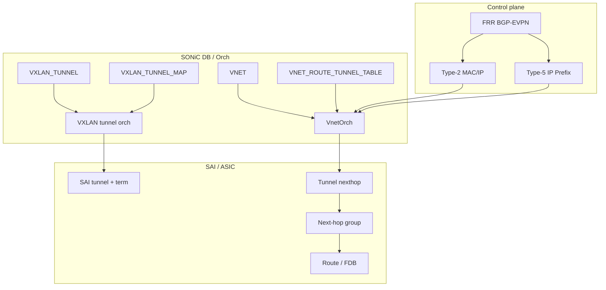

# Overlay アーキテクチャ

Overlay を読むときの中心は、設定テーブルそのものではなく「誰がどの table を見て、最終的にどの [SAI](../../reference/glossary.md#term-sai) object を作るか」です。[VXLAN](../../reference/glossary.md#term-vxlan)/[VNET](../../reference/glossary.md#term-vnet)/[EVPN](../../reference/glossary.md#term-evpn) は入口が違っても、[VTEP](../../reference/glossary.md#term-vtep)、tunnel map、tunnel nexthop、[VRF](../../reference/glossary.md#term-vrf)/VNI map、route の組み合わせに落ちます。

## 主要コンポーネント

| コンポーネント | 役割 |
| --- | --- |
| `vxlanmgrd` / config CLI | `CONFIG_DB` の VXLAN/VNET 設定を検証・投影する |
| `VxlanTunnelOrch` / `VxlanTunnelMapOrch` | VXLAN tunnel、termination、[VLAN](../../reference/glossary.md#term-vlan)/VRF/VNI map を SAI に作る |
| `VnetOrch` | VNET の VRF / bridge、VNET route、tunnel nexthop、[ECMP](../../reference/glossary.md#term-ecmp) group を管理する |
| `FRR bgpd` | EVPN Type-2 / Type-3 / Type-5 を [BGP](../../reference/glossary.md#term-bgp) で交換する |
| `fpmsyncd` / route sync 経路 | [FRR](../../reference/glossary.md#term-frr) から [SONiC](../../reference/glossary.md#term-sonic) DB / [orchagent](../../reference/glossary.md#term-orchagent) 側へ route 情報を渡す |
| `BfdOrch` | Overlay ECMP の endpoint 生存性を [BFD](../../reference/glossary.md#term-bfd) で監視する |
| SAI / [ASIC](../../reference/glossary.md#term-asic) | tunnel、tunnel map、tunnel nexthop、next-hop group、VRF を実装する |

[HLD](../../reference/glossary.md#term-hld) 名では `VxlanOrch` と書かれる箇所がありますが、現行の整理では VXLAN tunnel、map、EVPN NVO などが複数の orch クラスに分かれています。読み物としては「VXLAN 系 orch が tunnel と mapper を担当し、VNET 系 orch が route と nexthop を担当する」と捉えるのが実用的です。

## Type-2 / Type-5 と VNET route

EVPN Type-2 は MAC/IP の到達性、Type-5 は IP prefix の到達性を配ります。一方、VNET route は SONiC の DB で local / tunnel route を表す形式です。両者は同一ではありませんが、最終的には remote endpoint への tunnel nexthop や route として ASIC へ入ります。

## VNET route の流れ

`VNET_ROUTE_TABLE` は VNET 内の subnet / local route、`VNET_ROUTE_TUNNEL_TABLE` は remote endpoint へ encapsulate する route として扱います。tunnel route では endpoint、必要なら endpoint monitor、MAC、VNI、BFD profile、primary/secondary、custom monitoring などが判断材料になります。

Overlay ECMP では、同じ prefix に複数 endpoint を持たせ、VnetOrch が tunnel nexthop group を作ります。BFD monitoring が有効な設計では、monitoring IP の BFD state に応じて NHG member を出し入れします。拡張版では primary/secondary、custom monitoring、`pinned_state`、per-route BFD timer、directly connected nexthop が追加されます。

## Local endpoint forwarding

[SmartSwitch](../../reference/glossary.md#term-smartswitch) / [DPU](../../reference/glossary.md#term-dpu) 連携では、remote endpoint に見える nexthop が実は local DPU と直結している場合があります。`check_directly_connected=true` を使うと、VnetOrch は [ARP](../../reference/glossary.md#term-arp) / neighbor を確認し、直結なら tunnel route ではなく通常 ECMP route として扱います。failover の transient state では、tunnel decap 後のパケットを local nexthop へ redirect する高優先 [ACL](../../reference/glossary.md#term-acl) が使われます。

## EVPN multihoming の位置

EVPN multihoming は、Type-1 / Type-4、ESI、DF election、split-horizon を使って host を複数 leaf に接続する発展機能です。基本の Type-2 / Type-5 VXLAN EVPN の上に乗るため、この章では境界だけを扱い、詳細は [EVPN VXLAN Multihoming](../../routing/evpn-vxlan-multihoming.md) へ譲ります。

## 関連ページ

- [VXLAN / VNet 全体設計](../../overlay/vxlan-sonic.md)
- [EVPN VXLAN](../../routing/evpn-vxlan-hld.md)
- [Overlay ECMP with BFD monitoring](../../routing/overlay-ecmp-with-bfd-monitoring.md)
- [Overlay ECMP enhancements](../../routing/overlay-ecmp-enhancements.md)
- [VNET の Local Endpoint Forwarding](../../overlay/vnet-local-endpoint-forwarding.md)
- [EVPN VXLAN Multihoming](../../routing/evpn-vxlan-multihoming.md)

<!-- glossary-links-injected: 7b27b638c4f3 -->
