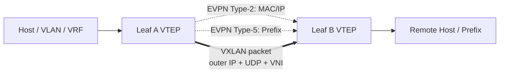
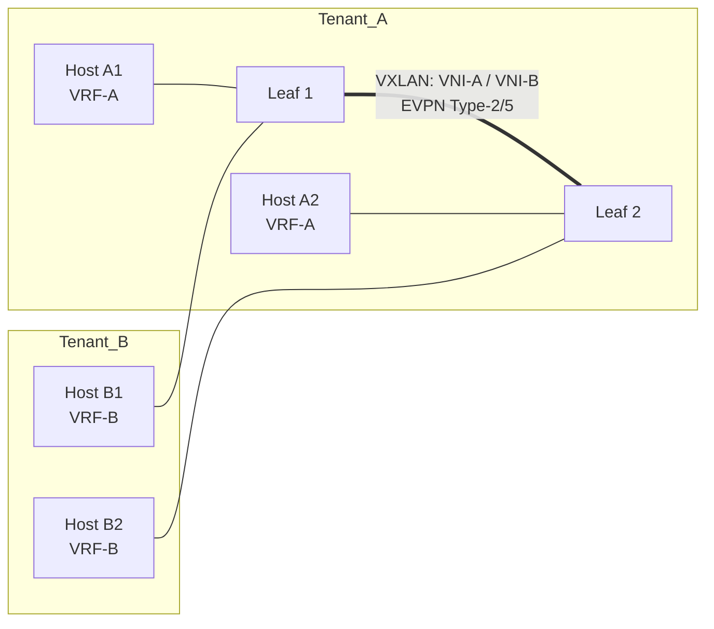
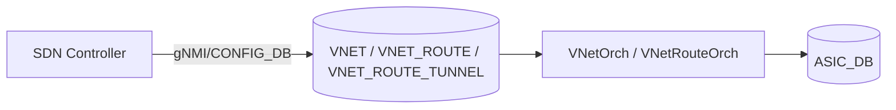
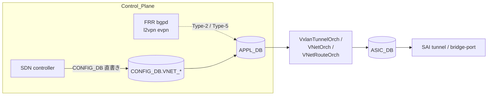

# VXLAN / VNET / EVPN の概要

[SONiC](../../reference/glossary.md#term-sonic) の overlay 周りは、「[VXLAN](../../reference/glossary.md#term-vxlan)」「[VNET](../../reference/glossary.md#term-vnet)」「[EVPN](../../reference/glossary.md#term-evpn)」という 3 つの単語がほぼ同じ文脈で使われるのに役割が違うため、最初に分けて理解しないと混乱します。VXLAN は data plane の encapsulation、VNET は SONiC 内部の設定オブジェクト、EVPN はその上に乗る control plane です。

## SONiC overlay は何の問題を解決するか

データセンタや CSP は、物理ネットワークの上に **テナントごとの仮想ネットワーク** を載せたい、L3 fabric の上で **L2 が必要なホストを越境させたい**、という要件を抱えます。SONiC overlay はこれを以下の道具で解きます。

- **VXLAN**: L2 / L3 トラフィックを UDP/IP に encapsulate して L3 fabric 上を運ぶ。
- **VNET**: SONiC が tenant / [VRF](../../reference/glossary.md#term-vrf) / VNI を 1 つのオブジェクトとして扱うための設定単位。controller 直書きにも EVPN 学習にも使える。
- **EVPN**: [BGP](../../reference/glossary.md#term-bgp) の AFI として MAC / IP / prefix の到達情報を配り、VXLAN tunnel を自動的に張る。

「VXLAN を有効化する」と言うとき、実際には [VTEP](../../reference/glossary.md#term-vtep) を作るだけの場合、[VLAN](../../reference/glossary.md#term-vlan)-VNI を作る場合、VNET route を作る場合、EVPN で経路を受ける場合があります。最初にどの層を触っているかを分けると、設定の迷子になりにくくなります。

## SONiC の中での位置

| 軸 | 担当 |
| --- | --- |
| Management plane | `config vxlan`, `config vnet`, [FRR](../../reference/glossary.md#term-frr) vty, `VXLAN_*` / `VNET_*` [CONFIG_DB](../../reference/glossary.md#term-config_db) |
| Control plane | FRR bgpd (l2vpn evpn AFI)、[vxlanmgrd](../../reference/glossary.md#term-vxlanmgrd)、VNetOrch、VNetRouteOrch |
| Data plane | [orchagent](../../reference/glossary.md#term-orchagent) (TunnelOrch / VxlanTunnelOrch)、[syncd](../../reference/glossary.md#term-syncd)、[SAI](../../reference/glossary.md#term-sai) tunnel / bridge-port |

VXLAN は data plane、EVPN は control plane、VNET は management/control の境界にいる、という整理が役に立ちます。

## まず分けて考える

| 用語 | 読み方 | SONiC での主な入口 |
| --- | --- | --- |
| VXLAN | UDP/IP 上に VNI を載せる data plane | `VXLAN_TUNNEL`, `VXLAN_TUNNEL_MAP`, `config vxlan` |
| VNET | VXLAN tunnel と VNI を使う仮想ネットワーク | `VNET`, `VNET_ROUTE`, `VNET_ROUTE_TUNNEL`, `config vnet` |
| EVPN | BGP で overlay 到達性を配る control plane | FRR BGP-EVPN, `VXLAN_EVPN_NVO`, `show evpn ...` |
| VTEP | VXLAN を終端する tunnel endpoint | `VXLAN_TUNNEL.src_ip` |
| VNI | tenant / segment を識別する 24 bit ID | VLAN-VNI map、VRF-VNI map、VNET.vni |
| NVO | Network Virtualization Overlay。EVPN が VXLAN を使うことを宣言する設定 | `VXLAN_EVPN_NVO` |
| L2VNI / L3VNI | MAC を運ぶ VNI / prefix を運ぶ VNI | EVPN Type-2 / Type-5 で対応 |

## L2 overlay と L3 overlay

L2 overlay は VLAN と VNI を対応させ、remote MAC を VXLAN の向こうへ送ります。SONiC では `VXLAN_TUNNEL_MAP` が VLAN-VNI 対応を持ち、EVPN を使う場合は Type-2 route が MAC/IP 到達性を配ります。

L3 overlay は VRF / VNET と VNI を対応させ、prefix を overlay nexthop へ送ります。EVPN では Type-5 route が IP prefix を配り、VNET route では `VNET_ROUTE_TUNNEL_TABLE` に endpoint と prefix が入ります。

## 典型的な使用シーン

### シーン 1: EVPN-VXLAN multi-tenant fabric

各 Leaf が VTEP になり、VRF-A は VNI-A、VRF-B は VNI-B にマップされます。EVPN がない場合は controller が VNET / VNET_ROUTE_TUNNEL を直接書きます（次のシーン）。

### シーン 2: SDN controller 直書きの VNET (DASH / SmartSwitch 系)

FRR EVPN を介さず、controller が直接 VNET route を書く構成です。EVPN を使わないことで control plane の挙動が単純になり、tenant 規模を集中管理しやすくなります。

## VNET は EVPN の別名ではない

VNET は SONiC の configuration / orchestration 単位です。`VNET` は `vxlan_tunnel` と `vni` を持ち、`VNET_ROUTE` は local / subnet route、`VNET_ROUTE_TUNNEL` は remote endpoint へ encapsulate する route を表します。EVPN がある場合は control plane からこれらに相当する情報が供給されますが、VNET 自体は EVPN に限定されません。

このため、コントローラが直接 VNET route を書く設計と、FRR EVPN が Type-2 / Type-5 を受けて SONiC 側へ反映する設計は、同じ VXLAN data plane に収束しても、運用上の入口が異なります。

## 似た / 混同しやすい機能との違い

| 比較対象 | 違い |
| --- | --- |
| NVGRE | encapsulation が GRE + VSID。SONiC NVGRE [HLD](../../reference/glossary.md#term-hld) は decap 受信側中心で、EVPN control plane を持たない |
| Subnet decap | VLAN subnet 宛 [IPinIP](../../reference/glossary.md#term-ipinip) を T0 が decap して Netscan へ戻す platform 機能。tenant overlay ではない |
| GENEVE | SONiC では encapsulation 対象として一般には扱っていない |
| [MPLS](../../reference/glossary.md#term-mpls) L3VPN | control plane に BGP-VPNv4/v6、data plane に MPLS label を使う。SONiC では限定的 |
| VLAN trunk のみ | L2 を物理リンクで運ぶ。fabric を越えられない |

NVGRE は VXLAN と同じ「L2 over L3」系の overlay ですが、カプセル化に GRE と VSID を使います。詳細は [NVGRE トンネル](../../overlay/nvgre-tunnel-in-sonic.md) を参照してください。

Subnet decap は overlay tenant を作る機能ではなく、VLAN subnet 宛の IPinIP probe を T0 が decap して Netscan へ戻す platform 機能です。tunnel decap object を使うため同じ章で触れますが、VXLAN/VNET の data plane とは目的が違います。

## 読み終わったあとにできるようになること

- 「VXLAN を設定する」という曖昧な要求を、VTEP / VLAN-VNI / VNET / EVPN のどの層の話かに分解できる。
- EVPN を使う構成と controller 直書きの構成の使い分けがイメージできる。
- NVGRE や subnet decap が overlay tenant とは別の話だと区別できる。
- BGP-EVPN のセッションがあるのに data plane が来ない問題を「FRR EVPN」「VxlanTunnelOrch」「SAI tunnel」のどこで止まったかで切れる。

## CONFIG_DB の主要テーブル

VXLAN / VNET / EVPN まわりで把握しておくべき CONFIG_DB は次のとおりです。

| Table | 用途 |
| --- | --- |
| `VXLAN_TUNNEL` | VTEP（src IP）と peer 種別を定義 |
| `VXLAN_TUNNEL_MAP` | VLAN ↔ VNI / VRF ↔ VNI 対応 |
| `VXLAN_EVPN_NVO` | EVPN を VXLAN 上で動かす宣言（FRR EVPN 接続点） |
| `VNET` | VRF + VNI + vxlan_tunnel をまとめた SONiC 内オブジェクト |
| `VNET_ROUTE` / `VNET_ROUTE_TUNNEL` | VNET の local / remote endpoint route |
| `EVPN_NVO` / `EVPN_RT_TBL` 等 | EVPN 系の補助 table（FRR との接続側） |

`vxlanmgrd` は CONFIG_DB と Linux netlink を仲立ちし、`VNetOrch` / `VxlanTunnelOrch` / `TunnelDecapOrch` が SAI tunnel / bridge port を作ります。EVPN を使う構成では FRR 側で受けた Type-2 / Type-5 が [APPL_DB](../../reference/glossary.md#term-appl_db) / VNET_ROUTE_TUNNEL に降りてきます。

## EVPN と VNET 直書きのデータパスは同じ

control plane は EVPN（FRR 経路）か controller 直書きの 2 系統に分かれますが、SAI tunnel / bridge port を作る orchagent 側はほぼ共通です。問題切り分けでは「EVPN セッションは張れているか」「VNET object は CONFIG_DB に居るか」「APPL_DB の TUNNEL/VNET_ROUTE まで来ているか」「[ASIC_DB](../../reference/glossary.md#term-asic_db) に tunnel object が居るか」を順に追います。

## EVPN Type と SONiC 側の受け口

| Type | 意味 | SONiC で書き込まれる先 |
| --- | --- | --- |
| Type-2 | MAC / MAC+IP 到達性 | bridge-port / [FDB](../../reference/glossary.md#term-fdb) / NEIGH / VNET_ROUTE_TUNNEL（L2 端末向け） |
| Type-3 | inclusive multicast tunnel endpoint | head-end replication 用 tunnel member |
| Type-5 | IP prefix | VNET_ROUTE_TUNNEL / VRF route |

Type-2 が来ても bridge-port が作られていない場合は **vlan-vni map** が抜けていることが多く、Type-5 が来ても VNET_ROUTE_TUNNEL に乗らない場合は **VRF-VNI map** や `nvo` の設定漏れが原因になりがちです。

## SmartSwitch / DASH の VNET との関係

[DASH](../../reference/glossary.md#term-dash) / [SmartSwitch](../../reference/glossary.md#term-smartswitch) の SDN data path は VNET スキーマを再利用し、[ENI](../../reference/glossary.md#term-eni) 単位の policy（[ACL](../../reference/glossary.md#term-acl) / mapping）と組み合わせて [DPU](../../reference/glossary.md#term-dpu) 上に展開します。EVPN を介さず controller が VNET_ROUTE 系を直書きする使い方は、SmartSwitch ENI と相性が良い構成です。詳細は [13 章 DASH / SmartSwitch](../13-dash-smartswitch/concept.md) を参照してください。

## 関連ページ

- [VXLAN / VNet 全体設計](../../overlay/vxlan-sonic.md)
- [EVPN VXLAN](../../routing/evpn-vxlan-hld.md)
- [NVGRE トンネル](../../overlay/nvgre-tunnel-in-sonic.md)
- [VLAN Subnet Decap](../../platform/subnet-decapsulation-with-sonic.md)
- [VNet local endpoint forwarding](../../overlay/vnet-local-endpoint-forwarding.md)
- [DSCP remapping for tunnel traffic](../../overlay/dscp-remapping-for-tunnel-traffic.md)

<!-- xref-prereq -->
## この章の前提知識

この章を読み進める前に、次の章を押さえておくと迷子になりにくい。

- [SONiC 全体像と設定基盤](../01-overview/index.md)
- [BGP と FRR 制御プレーン](../02-bgp/index.md)
- [VRF / ECMP / RIB-FIB パイプライン](../04-vrf-ecmp/index.md)

<!-- glossary-links-injected: c5c8b661ae7e -->
