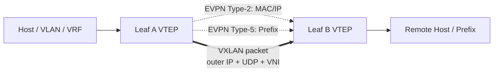

# VXLAN / VNET / EVPN の概要

SONiC の overlay は、1 つの機能名ではなく複数の層の組み合わせです。VXLAN はパケットを運ぶ tunnel、VNET は SONiC 内で tenant / virtual network を表す設定単位、EVPN は BGP で MAC/IP/prefix の到達情報を配る control plane です。

## まず分けて考える

| 用語 | 読み方 | SONiC での主な入口 |
| --- | --- | --- |
| VXLAN | UDP/IP 上に VNI を載せる data plane | `VXLAN_TUNNEL`, `VXLAN_TUNNEL_MAP`, `config vxlan` |
| VNET | VXLAN tunnel と VNI を使う仮想ネットワーク | `VNET`, `VNET_ROUTE`, `VNET_ROUTE_TUNNEL`, `config vnet` |
| EVPN | BGP で overlay 到達性を配る control plane | FRR BGP-EVPN, `VXLAN_EVPN_NVO`, `show evpn ...` |
| VTEP | VXLAN を終端する tunnel endpoint | `VXLAN_TUNNEL.src_ip` |
| VNI | tenant / segment を識別する 24 bit ID | VLAN-VNI map、VRF-VNI map、VNET.vni |

「VXLAN を有効化する」と言うとき、実際には VTEP を作るだけの場合、VLAN-VNI を作る場合、VNET route を作る場合、EVPN で経路を受ける場合があります。最初にどの層を触っているかを分けると、設定の迷子になりにくくなります。

## L2 overlay と L3 overlay

L2 overlay は VLAN と VNI を対応させ、remote MAC を VXLAN の向こうへ送ります。SONiC では `VXLAN_TUNNEL_MAP` が VLAN-VNI 対応を持ち、EVPN を使う場合は Type-2 route が MAC/IP 到達性を配ります。

L3 overlay は VRF / VNET と VNI を対応させ、prefix を overlay nexthop へ送ります。EVPN では Type-5 route が IP prefix を配り、VNET route では `VNET_ROUTE_TUNNEL_TABLE` に endpoint と prefix が入ります。

## VNET は EVPN の別名ではない

VNET は SONiC の configuration / orchestration 単位です。`VNET` は `vxlan_tunnel` と `vni` を持ち、`VNET_ROUTE` は local / subnet route、`VNET_ROUTE_TUNNEL` は remote endpoint へ encapsulate する route を表します。EVPN がある場合は control plane からこれらに相当する情報が供給されますが、VNET 自体は EVPN に限定されません。

このため、コントローラが直接 VNET route を書く設計と、FRR EVPN が Type-2 / Type-5 を受けて SONiC 側へ反映する設計は、同じ VXLAN data plane に収束しても、運用上の入口が異なります。

## NVGRE と subnet decap の位置づけ

NVGRE は VXLAN と同じ「L2 over L3」系の overlay ですが、カプセル化に GRE と VSID を使います。SONiC の NVGRE HLD は decap 受信側を主対象にしており、VXLAN/VNET の EVPN control plane とは別系統です。詳細は [NVGRE トンネル](../../overlay/nvgre-tunnel-in-sonic.md) を参照してください。

Subnet decap は overlay tenant を作る機能ではなく、VLAN subnet 宛の IPinIP probe を T0 が decap して Netscan へ戻す platform 機能です。tunnel decap object を使うため同じ章で触れますが、VXLAN/VNET の data plane とは目的が違います。

## 関連ページ

- [VXLAN / VNet 全体設計](../../overlay/vxlan-sonic.md)
- [EVPN VXLAN](../../routing/evpn-vxlan-hld.md)
- [NVGRE トンネル](../../overlay/nvgre-tunnel-in-sonic.md)
- [VLAN Subnet Decap](../../platform/subnet-decapsulation-with-sonic.md)
