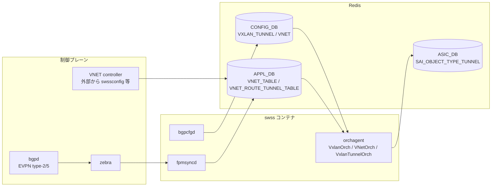

# 内部実装

[VXLAN](../../reference/glossary.md#term-vxlan) / [EVPN](../../reference/glossary.md#term-evpn) / [VNET](../../reference/glossary.md#term-vnet) の内部実装は「[FRR](../../reference/glossary.md#term-frr) (bgpd) が EVPN type-2/type-5 を学習し、[zebra](../../reference/glossary.md#term-zebra) が kernel/[fpmsyncd](../../reference/glossary.md#term-fpmsyncd) に渡し、[orchagent](../../reference/glossary.md#term-orchagent) が VxlanOrch / VNetOrch / VRFOrch / NeighOrch を通じて [SAI](../../reference/glossary.md#term-sai) tunnel 系オブジェクトを [ASIC_DB](../../reference/glossary.md#term-asic_db) に投入する」という縦の流れと「外部 controller が VNET / VNET_ROUTE_TUNNEL を直接 [APPL_DB](../../reference/glossary.md#term-appl_db) に書く」という横の流れに分かれます。[HLD](../../reference/glossary.md#term-hld) の章をまたいで読むときは、この二経路をまず分離します。

## データフロー



EVPN 学習経路と VNET API 経路は orchagent の中で同じ tunnel / encap オブジェクトに合流します。重複作成を避けるため、`VxlanTunnelOrch` は tunnel 名を key とした参照カウントを内部で持ちます。

## 主要 Orch / daemon の責務

| コンポーネント | 主なクラス / 実体 | 責務 |
| --- | --- | --- |
| `VxlanTunnelOrch` (`orchagent/vxlanorch.cpp`) | `VxlanTunnelOrch::doTask`、`createVxlanTunnel` | `VXLAN_TUNNEL` から SAI tunnel / tunnel-map を生成、underlay/overlay router interface を関連付け |
| `VxlanTunnelMapOrch` | `VxlanTunnelMapOrch::doTask` | VNI ↔ [VLAN](../../reference/glossary.md#term-vlan) / [VRF](../../reference/glossary.md#term-vrf) の tunnel-map entry を管理 |
| `VNetOrch` (`orchagent/vnetorch.cpp`) | `VNetOrch::doTask`、`VNetBitmapObject` / `VNetVrfObject` | `VNET` テーブルから vrf 実体（または bitmap 方式）を作成 |
| `VNetRouteOrch` | `addRoute`、`addTunnelRoute` | `VNET_ROUTE_TABLE` / `VNET_ROUTE_TUNNEL_TABLE` を SAI nexthop / nexthop group へ |
| `EvpnRemoteVnipOrch` / `EvpnNvoOrch` | `orchagent/vxlanorch.cpp` | type-2 で学んだ remote VTEP を tunnel decap 側に登録 |
| `VRFOrch` | `orchagent/vrforch.cpp` | EVPN type-5 受信 vrf の作成・参照管理 |
| `IntfsOrch` | `orchagent/intfsorch.cpp` | overlay SVI / router interface の作成 |
| `bgpcfgd` (`dockers/docker-fpm-frr/bgpcfgd/`) | jinja2 + [bgpcfgd](../../reference/glossary.md#term-bgpcfgd) | [CONFIG_DB](../../reference/glossary.md#term-config_db) の `BGP_*` / `DEVICE_METADATA` から FRR の vtysh config を生成 |
| `fpmsyncd` (`fpmsyncd/fpmlink.cpp`) | `FpmLink::processFpmMessage` | zebra の [FPM](../../reference/glossary.md#term-fpm) netlink を `ROUTE_TABLE` / `LABEL_ROUTE_TABLE` に書き込み |

## SAI 属性の使用一覧

| ステップ | SAI object | 主要属性 |
| --- | --- | --- |
| tunnel 作成 | `SAI_OBJECT_TYPE_TUNNEL` | `SAI_TUNNEL_ATTR_TYPE = VXLAN`、`SAI_TUNNEL_ATTR_ENCAP_SRC_IP`、`SAI_TUNNEL_ATTR_DECAP_MAPPERS`、`SAI_TUNNEL_ATTR_ENCAP_MAPPERS` |
| tunnel map | `SAI_OBJECT_TYPE_TUNNEL_MAP` | `SAI_TUNNEL_MAP_ATTR_TYPE = VNI_TO_VLAN_ID / VNI_TO_VIRTUAL_ROUTER_ID` 等 |
| tunnel map entry | `SAI_OBJECT_TYPE_TUNNEL_MAP_ENTRY` | `SAI_TUNNEL_MAP_ENTRY_ATTR_VNI_ID_KEY`、`SAI_TUNNEL_MAP_ENTRY_ATTR_VLAN_ID_VALUE` / `VIRTUAL_ROUTER_ID_VALUE` |
| decap term | `SAI_OBJECT_TYPE_TUNNEL_TERM_TABLE_ENTRY` | `SAI_TUNNEL_TERM_TABLE_ENTRY_ATTR_TUNNEL_TYPE = VXLAN`、`DST_IP`、`SRC_IP`（P2P 時） |
| overlay nexthop | `SAI_OBJECT_TYPE_NEXT_HOP` | `SAI_NEXT_HOP_ATTR_TYPE = TUNNEL_ENCAP`、`SAI_NEXT_HOP_ATTR_TUNNEL_ID`、`SAI_NEXT_HOP_ATTR_TUNNEL_VNI`、`SAI_NEXT_HOP_ATTR_TUNNEL_MAC` |

これら属性のうち `SAI_NEXT_HOP_ATTR_TUNNEL_MAC` は EVPN type-2 由来の inner DMAC を渡すために使われ、ベンダ実装で missing になりやすい点が discrepancy として上がりやすい箇所です。

## Redis テーブル参照関係

```yaml
CONFIG_DB:
  VXLAN_TUNNEL ─┬─> VxlanTunnelOrch
  VXLAN_TUNNEL_MAP ─> VxlanTunnelMapOrch
  VNET ─────────> VNetOrch
  VLAN_INTERFACE / VLAN  ─> IntfsOrch (overlay SVI)
  BGP_NEIGHBOR (l2vpn evpn AF)  ─> bgpcfgd → FRR

APPL_DB:
  VNET_TABLE / VNET_ROUTE_TABLE / VNET_ROUTE_TUNNEL_TABLE ─> VNetOrch / VNetRouteOrch
  EVPN_REMOTE_VNI_TABLE ─> EvpnRemoteVnipOrch
  NEIGH_TABLE (type-2) ─> NeighOrch

STATE_DB:
  VXLAN_TUNNEL_TABLE / EVPN_REMOTE_VNI_TABLE / BFD_SESSION_TABLE
ASIC_DB:
  SAI_OBJECT_TYPE_TUNNEL / TUNNEL_MAP / TUNNEL_TERM_TABLE_ENTRY / NEXT_HOP / ROUTE_ENTRY
```

VNET monitoring / [BFD](../../reference/glossary.md#term-bfd) は `BFD_SESSION_TABLE` 経由で `BfdOrch` に届き、[ECMP](../../reference/glossary.md#term-ecmp) nexthop の up/down 判定にフィードバックされます。

## ZMQ / pub-sub の使用

- `VNET_ROUTE_TUNNEL_TABLE` は外部 controller からの大量 push を想定し、**ZMQ producer/consumer 経路**で APPL_DB を経由せずに orchagent に直接渡す経路があります（`zmq_server_address` の `ORCHAGENT` 設定）。SDN コントローラ統合 HLD で導入された経路で、[Redis](../../reference/glossary.md#term-redis) pub/sub のスループット限界回避のためです。
- 通常 EVPN 経路は [ProducerStateTable](../../reference/glossary.md#term-producerstatetable) / SubscriberStateTable を使う Redis pub/sub のみで、ZMQ は使いません。
- `BfdOrch` から `VNetOrch` への通知は orchagent 内 `Observer` パターン（プロセス内 callback）で、Redis を経由しません。

## 既知の実装上の制約

- VxLAN encap source IP は **loopback IP** をひとつ選ぶ設計で、複数 source を SAI 側で同時に持つことは tunnel object 単位では未対応です（HLD で明記）。
- ベンダ ASIC によっては `SAI_TUNNEL_MAP_TYPE_VNI_TO_VIRTUAL_ROUTER_ID`（type-5 用）が未実装で、EVPN type-5 を MAC-VRF + IRB で代替する実装に倒れることがあります。これは discrepancy として記録する典型例です。
- VNET [BGP](../../reference/glossary.md#term-bgp)（VNET 内 BGP セッション）は BGP route の VNET 帰属を nexthop で識別する設計で、同一 nexthop が複数 VNET から指される構成は HLD では除外されています。
- type-2 で学んだ [ARP](../../reference/glossary.md#term-arp)/ND の老化は kernel ではなく orchagent の `NeighOrch` が tunnel route と一緒に管理するため、tcpdump で aging を観測しても挙動が一致しないことがあります。

## VNI ↔ VRF / VLAN マッピング

EVPN は VNI を L2（type-2）と L3（type-5）の両方で使うため、VNI の意味を文脈で分ける必要があります。

| 種別 | 用途 | SONiC 実装 |
| --- | --- | --- |
| L2 VNI | type-2（MAC / MAC+IP）broadcast domain | `VLAN` ↔ `VXLAN_TUNNEL_MAP` で VLAN にバインド |
| L3 VNI | type-5（IP prefix）受信側で route lookup | `VRF` ↔ `VXLAN_EVPN_NVO` で VRF にバインド |
| Symmetric IRB | type-2 でも L3 VNI を経由して inter-subnet ルーティング | type-2 の RT に L3 VNI を含めて広告 |

`fpmsyncd` は FRR からの EVPN route を `EVPN_REMOTE_VNI_TABLE` 系で受け、`VnetOrch` がそれを SAI tunnel / [FDB](../../reference/glossary.md#term-fdb) / route に変換します。VNI が L2 と L3 で衝突する設定は CONFIG_DB の整合性チェックで拒否される設計ですが、bgpcfgd 経由でない手動の vtysh 投入では拒否されない既知の隙があります。

## tunnel decap term の使い分け

`SAI_OBJECT_TYPE_TUNNEL_TERM_TABLE_ENTRY` には P2P / P2MP / MP2MP の 3 種があり、SONiC は EVPN の挙動に合わせて切り替えます。

| type | 用途 | SAI 属性 |
| --- | --- | --- |
| P2P | 特定 remote VTEP からの decap | `DST_IP`（local VTEP IP）+ `SRC_IP`（remote VTEP IP） |
| P2MP | 任意 remote からの decap、特定 local IP | `DST_IP` のみ |
| MP2MP | DCI 用、任意 source / 任意 destination | DST/SRC とも IP range |

`EvpnRemoteVnipOrch` は remote VTEP を学習するごとに P2P term を追加する実装と、初回に P2MP を 1 件作って共有する実装が SONiC のバージョンによって混在します。`VxlanTunnelOrch::createTunnel` の `dip` 引数が空かどうかで分岐します。

## EVPN GR / fast convergence

EVPN の障害収束は FRR の `bgp graceful-restart` と SONiC の `EVPN_REMOTE_VNI_TABLE` の TTL に依存します。FRR 側が下流 advertise を止めた後、`VxlanTunnelOrch` が remote VTEP を保持する期間（HOLD time）に traffic を blackhole しないようにする `restart-time` 系のパラメータが `BGP_NEIGHBOR.graceful_restart_helper_only` で制御されます。

## 関連ページ

- [VXLAN SONiC HLD](../../overlay/vxlan-sonic.md)
- [VNET local endpoint forwarding](../../overlay/vnet-local-endpoint-forwarding.md)

<!-- glossary-links-injected: fc9afb9971f0 -->
