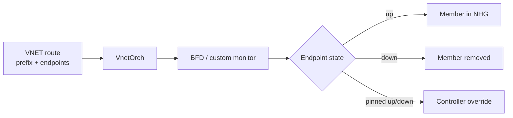

# Overlay 運用

Overlay の障害切り分けは、underlay、[VTEP](../../reference/glossary.md#term-vtep)、control plane、route programming、[QoS](../../reference/glossary.md#term-qos) / hash の順に見ると無駄が少なくなります。[VXLAN](../../reference/glossary.md#term-vxlan) の外側パケットが届かない問題と、[EVPN](../../reference/glossary.md#term-evpn) / [VNET](../../reference/glossary.md#term-vnet) route が入らない問題は、最初から分けて扱います。

## 確認順

1. Underlay で remote VTEP IP に到達できるか。
2. `VXLAN_TUNNEL` と `VXLAN_TUNNEL_MAP` / `VNET` が想定どおり DB に入っているか。
3. EVPN 利用時は [BGP](../../reference/glossary.md#term-bgp)-EVPN session、VNI、Type-2 / Type-5 の受信状態を見る。
4. VNET route 利用時は `VNET_ROUTE_TUNNEL_TABLE`、endpoint、monitoring、[BFD](../../reference/glossary.md#term-bfd) state を見る。
5. [ASIC](../../reference/glossary.md#term-asic) 側で tunnel object、tunnel nexthop、NHG member、route / [FDB](../../reference/glossary.md#term-fdb) が作られているかを確認する。
6. 負荷分散や loss が問題なら [DSCP](../../reference/glossary.md#term-dscp) remap、PBH inner hash、[ECMP](../../reference/glossary.md#term-ecmp) / ARS の影響を切り分ける。

## Overlay ECMP と BFD

Overlay ECMP は、1 prefix に複数 tunnel endpoint を持たせ、VnetOrch が tunnel nexthop group を作る仕組みです。BFD monitoring 付きでは、`endpoint_monitor` に対応する BFD state が Down になると、その endpoint は NHG から外れます。

拡張版では primary/secondary の優先集合、custom monitoring、per-route BFD timer、`pinned_state` が追加されます。運用上は、route が「消えた」のか「secondary に退避した」のか「pinned_state で固定された」のかを区別する必要があります。



## DSCP remap

Tunnel traffic の DSCP remap は、特に Dual-ToR の bounce-back 経路で [PFC](../../reference/glossary.md#term-pfc) deadlock を避けるための QoS 機能です。VXLAN/VNET そのものの到達性ではなく、tunnel encap / decap 時の DSCP、TC、PG、Queue の対応を変えます。

切り分けでは、`TUNNEL` / `TUNNEL_DECAP_TABLE` に QoS map が紐付いているか、`dscp_mode` が想定どおりか、[ASIC_DB](../../reference/glossary.md#term-asic_db) に `SAI_TUNNEL_ATTR_ENCAP_QOS_*` / `DECAP_QOS_*` が入っているかを確認します。

## Inner packet hashing

Encapsulated traffic の ECMP 偏りを見るときは、outer 5-tuple で hash しているのか、inner 5-tuple で hash しているのかを確認します。PBH の inner hash テストでは、VXLAN/NVGRE の outer を変えても inner が同じなら同一 nexthop に寄ること、inner を変えれば複数 nexthop に分散することを確認します。

## Local ARS との境界

Local ARS は ECMP の next-hop 選択を static hash ではなく queue depth や port utilization で動的に変える発展機能です。既存ページでは現行 master で SWSS / [YANG](../../reference/glossary.md#term-yang) / CLI への取り込み未完了の可能性が示されているため、VXLAN/VNET の通常運用手順として前提にしない方が安全です。設計比較や将来機能として読む位置づけです。

## show vxlan の出力サンプル

`show vxlan tunnel` は [CONFIG_DB](../../reference/glossary.md#term-config_db) の `VXLAN_TUNNEL` と [STATE_DB](../../reference/glossary.md#term-state_db) / [APPL_DB](../../reference/glossary.md#term-appl_db) の oper 状態を結合します。EVPN 由来の場合 `Creation Source = EVPN`、static 設定なら `CLI` 等が出ます。

```text
+---------+-------------+-------------------+--------------+
| SIP     | DIP         | Creation Source   | OperStatus   |
+=========+=============+===================+==============+
| 1.1.1.1 | 25.25.25.25 | EVPN              | oper_down    |
+---------+-------------+-------------------+--------------+
| 1.1.1.1 | 25.25.25.26 | EVPN              | oper_down    |
+---------+-------------+-------------------+--------------+
| 1.1.1.1 | 25.25.25.27 | EVPN              | oper_down    |
+---------+-------------+-------------------+--------------+
Total count : 3
```

`show vxlan vlanvnimap` は [VLAN](../../reference/glossary.md#term-vlan) と VNI の対応を表示します。

```text
+---------+-------+
| VLAN    |   VNI |
+=========+=======+
| Vlan100 |   100 |
+---------+-------+
| Vlan101 |   101 |
+---------+-------+
Total count : 2
```

`show vxlan remotevni` は受信した Type-2 / Type-3 EVPN route 由来の remote VTEP を表示します。

```text
+---------+--------------+-------+
| VLAN    | RemoteVTEP   |   VNI |
+=========+==============+=======+
| Vlan100 | 25.25.25.25  |   100 |
+---------+--------------+-------+
```

VNET 構成では `show vnet routes all` で `Vnet name`、`Prefix`、`Endpoints`、`MAC`、`VNI`、`Metric`、`State` の 7 カラムが並びます。Endpoints が複数あるときは 3 つずつ折り返されます。

## 異常検出パターン

| 観測 | 疑う状態 | 一次切り分け |
|---|---|---|
| `show vxlan tunnel` で `OperStatus=oper_down` | underlay 到達性なし、SIP/DIP 不一致、[SAI](../../reference/glossary.md#term-sai) tunnel 未作成 | `ping <remote VTEP>`、`show ip route <remote>`、ASIC_DB の tunnel object 有無 |
| `show vxlan remotevni` が空だが EVPN Up | Type-3 受信なし、VNI not imported、RT 不一致 | `vtysh -c "show bgp l2vpn evpn route"`、route-target 整合 |
| FDB に MAC が入らない | Type-2 受信なし、または [vxlanmgrd](../../reference/glossary.md#term-vxlanmgrd) 反映失敗 | `show mac`、`vtysh -c "show evpn mac vni <id>"` |
| VNET route の endpoint が NHG から外れる | BFD Down 検出、custom monitor failure | `show muxcable health` 系ではなく vnet 用 monitor／`show vnet endpoint` |
| inner traffic が同じ nexthop に偏る | outer 5-tuple のみで hash、PBH inner hash 未設定 | `show pbh` 設定、`show counters` で member 偏り |
| DSCP 値が想定と違う | encap / decap QoS map 未紐付け | `TUNNEL_DECAP_TABLE`、`TC_TO_DSCP_MAP`、ASIC_DB の `SAI_TUNNEL_ATTR_ENCAP_QOS_*` |
| route advertise されない / Type-5 が出ない | redistribute connected 未設定、route-target 不一致 | `vtysh -c "show running-config"`、address-family `l2vpn evpn` 内の `advertise` |

## 典型的なログサンプル

vxlanorch / VnetOrch / [FRR](../../reference/glossary.md#term-frr) EVPN 関連の代表ログ:

```text
vxlanmgrd: VxlanTunnel 'tunnel_v4' was added
vxlanmgrd: Tunnel Decap term entry added for tunnel: tunnel_v4 src_ip: 25.25.25.25
orchagent: :- create: Can't create a tunnel object
orchagent: :- removeNextHopTunnel: delete NH tunnel for ip '25.25.25.25', mac '00:00:00:00:00:00' vni 100 failed
orchagent: :- addEndpointMonitor: Endpoint 25.25.25.25 for prefix 10.1.1.0/24 set to DOWN
bgpd[28]: %ADJCHANGE: neighbor 10.0.0.1 in vrf default Up (BGP-EVPN)
zebra: EVPN: Failed to install MAC 00:11:22:33:44:55 in VNI 100
```

SAI fail パターン例:

```text
syncd: SAI_API_TUNNEL: SAI_STATUS_INSUFFICIENT_RESOURCES
syncd: SAI_API_NEXT_HOP_GROUP: SAI_STATUS_TABLE_FULL
```

## 対応コマンド早見表

| 目的 | コマンド |
|---|---|
| Tunnel 一覧 | `show vxlan tunnel` |
| VLAN-VNI map | `show vxlan vlanvnimap` |
| Remote VTEP | `show vxlan remotevni` |
| VNI のカウンタ | `show vxlan counters` |
| VNET 一覧 | `show vnet brief`、`show vnet name <vnet>` |
| VNET route 全部 | `show vnet routes all` |
| VNET endpoint 監視 | `show vnet endpoint` |
| EVPN MAC / Type-2 | `vtysh -c "show evpn mac vni all"` |
| EVPN IP-prefix / Type-5 | `vtysh -c "show evpn next-hops vni all"` |
| EVPN [VRF](../../reference/glossary.md#term-vrf) route | `vtysh -c "show bgp l2vpn evpn route"` |
| BFD endpoint | `show bfd summary`、APPL_DB の BFD_SESSION |
| Counter clear | `sonic-clear vxlancounters` |
| PBH 設定 | `show pbh table`、`show pbh rule`、`show pbh hash` |
| DSCP map | `show qos map dscp_to_tc`、`show qos map tc_to_dscp` |

## 関連 CONFIG_DB / STATE_DB / counter

- `CONFIG_DB:VXLAN_TUNNEL|<name>` — `src_ip`、`dst_ip`（static の場合）。
- `CONFIG_DB:VXLAN_TUNNEL_MAP|<tunnel>|<map>` — `vni`、`vlan`。
- `CONFIG_DB:VNET|<name>` — `vxlan_tunnel`、`vni`、`peer_list`、`scope`、`advertise_prefix`。
- `APPL_DB:VNET_ROUTE_TUNNEL_TABLE:<vnet>:<prefix>` — `endpoint`、`endpoint_monitor`、`mac_address`、`vni`、`weight`、`profile`、`primary`、`monitoring`、`adv_prefix`。
- `APPL_DB:VXLAN_FDB_TABLE` — EVPN Type-2 由来 FDB。
- `STATE_DB:VXLAN_TUNNEL_TABLE|<name>` — `operstatus`。
- `STATE_DB:BFD_SESSION_TABLE|<sess>` — VNET endpoint 監視に紐づく状態。
- `COUNTERS_DB:COUNTERS_TUNNEL_NAME_MAP` — tunnel object と counter の対応。
- `ASIC_DB` の `SAI_OBJECT_TYPE_TUNNEL`、`SAI_OBJECT_TYPE_NEXT_HOP`（type=TUNNEL_ENCAP）、`SAI_OBJECT_TYPE_NEXT_HOP_GROUP_MEMBER` を ASIC への投入確認に使います。

## 横断参照

- BGP-EVPN session 自体の up/down は [BGP 章 運用](../02-bgp/operations.md) のフローで切り分け。
- Type-5 が VRF にインポートされるかは [VRF / ECMP 章 運用](../04-vrf-ecmp/operations.md) の RIB/FIB 確認手順を併読。
- Dual-ToR の tunnel bounce-back は [Dual-ToR 章 運用](../05-dual-tor/operations.md) の DSCP / PFC 文脈と切り離せません。
- L2 側の VLAN / FDB と EVPN MAC の同期問題は [L2 章 運用](../06-l2-vlan-lag/operations.md) の FDB セクション。

## 関連ページ

- [Overlay ECMP with BFD monitoring](../../routing/overlay-ecmp-with-bfd-monitoring.md)
- [Overlay ECMP enhancements](../../routing/overlay-ecmp-enhancements.md)
- [トンネルトラフィックの DSCP / TC リマップ](../../overlay/dscp-remapping-for-tunnel-traffic.md)
- [ECMP inner packet hashing テストプラン](../../routing/test-plan-for-inner-packet-hashing-in-ecmp.md)
- [Policy Based Hashing](../../architecture/sonic-policy-based-hashing.md)
- [Local ARS](../../routing/local-ars-hld.md)

<!-- glossary-links-injected: a05b1a0422d1 -->
