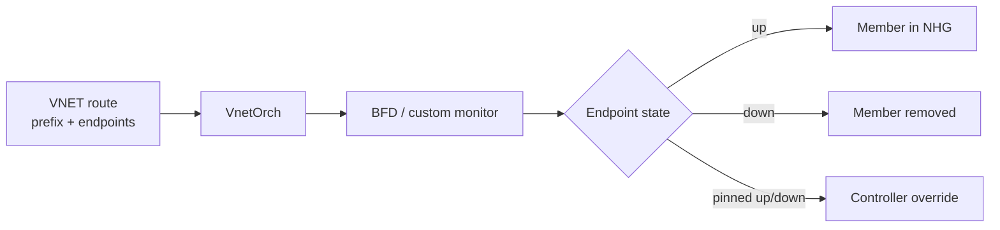

# Overlay 運用

Overlay の障害切り分けは、underlay、VTEP、control plane、route programming、QoS / hash の順に見ると無駄が少なくなります。VXLAN の外側パケットが届かない問題と、EVPN / VNET route が入らない問題は、最初から分けて扱います。

## 確認順

1. Underlay で remote VTEP IP に到達できるか。
2. `VXLAN_TUNNEL` と `VXLAN_TUNNEL_MAP` / `VNET` が想定どおり DB に入っているか。
3. EVPN 利用時は BGP-EVPN session、VNI、Type-2 / Type-5 の受信状態を見る。
4. VNET route 利用時は `VNET_ROUTE_TUNNEL_TABLE`、endpoint、monitoring、BFD state を見る。
5. ASIC 側で tunnel object、tunnel nexthop、NHG member、route / FDB が作られているかを確認する。
6. 負荷分散や loss が問題なら DSCP remap、PBH inner hash、ECMP / ARS の影響を切り分ける。

## Overlay ECMP と BFD

Overlay ECMP は、1 prefix に複数 tunnel endpoint を持たせ、VnetOrch が tunnel nexthop group を作る仕組みです。BFD monitoring 付きでは、`endpoint_monitor` に対応する BFD state が Down になると、その endpoint は NHG から外れます。

拡張版では primary/secondary の優先集合、custom monitoring、per-route BFD timer、`pinned_state` が追加されます。運用上は、route が「消えた」のか「secondary に退避した」のか「pinned_state で固定された」のかを区別する必要があります。

## DSCP remap

Tunnel traffic の DSCP remap は、特に Dual-ToR の bounce-back 経路で PFC deadlock を避けるための QoS 機能です。VXLAN/VNET そのものの到達性ではなく、tunnel encap / decap 時の DSCP、TC、PG、Queue の対応を変えます。

切り分けでは、`TUNNEL` / `TUNNEL_DECAP_TABLE` に QoS map が紐付いているか、`dscp_mode` が想定どおりか、ASIC_DB に `SAI_TUNNEL_ATTR_ENCAP_QOS_*` / `DECAP_QOS_*` が入っているかを確認します。

## Inner packet hashing

Encapsulated traffic の ECMP 偏りを見るときは、outer 5-tuple で hash しているのか、inner 5-tuple で hash しているのかを確認します。PBH の inner hash テストでは、VXLAN/NVGRE の outer を変えても inner が同じなら同一 nexthop に寄ること、inner を変えれば複数 nexthop に分散することを確認します。

## Local ARS との境界

Local ARS は ECMP の next-hop 選択を static hash ではなく queue depth や port utilization で動的に変える発展機能です。既存ページでは現行 master で SWSS / YANG / CLI への取り込み未完了の可能性が示されているため、VXLAN/VNET の通常運用手順として前提にしない方が安全です。設計比較や将来機能として読む位置づけです。

## 関連ページ

- [Overlay ECMP with BFD monitoring](../../routing/overlay-ecmp-with-bfd-monitoring.md)
- [Overlay ECMP enhancements](../../routing/overlay-ecmp-enhancements.md)
- [トンネルトラフィックの DSCP / TC リマップ](../../overlay/dscp-remapping-for-tunnel-traffic.md)
- [ECMP inner packet hashing テストプラン](../../routing/test-plan-for-inner-packet-hashing-in-ecmp.md)
- [Policy Based Hashing](../../architecture/sonic-policy-based-hashing.md)
- [Local ARS](../../routing/local-ars-hld.md)
