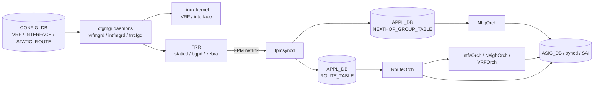

# RIB-FIB と Route Object 生成

SONiC の L3 pipeline は、[FRR](../../reference/glossary.md#term-frr) が持つ RIB と、[orchagent](../../reference/glossary.md#term-orchagent) / [syncd](../../reference/glossary.md#term-syncd) / ASIC が持つ FIB を分けて読むと理解しやすくなります。CLI や [CONFIG_DB](../../reference/glossary.md#term-config_db) で route を設定しても、それが直ちに ASIC route object になるわけではありません。

## 全体の流れ

この図の読み方は次の通りです。

- `CONFIG_DB` は intent です。[VRF](../../reference/glossary.md#term-vrf)、interface、static route を定義します。
- FRR は control-plane RIB を持ちます。[BGP](../../reference/glossary.md#term-bgp) や static route の選択はここで起きます。
- `fpmsyncd` は FRR から来た [FPM](../../reference/glossary.md#term-fpm) メッセージを `APPL_DB` に変換します。
- `RouteOrch` は route を [SAI](../../reference/glossary.md#term-sai) route object にし、VRF OID、[RIF](../../reference/glossary.md#term-rif)、next hop、NHG の準備ができるまで pending します。
- `syncd` が SAI API を通じて ASIC に反映します。

## ROUTE_TABLE と NEXT_HOP_GROUP_TABLE

従来の `ROUTE_TABLE` は route ごとに `nexthop` と `ifname` を直接持ちます。大量 prefix が同じ next-hop set を共有する環境では、この形は [Redis](../../reference/glossary.md#term-redis) payload と orchagent の処理量が増えます。

[NEXT_HOP_GROUP_TABLE による APP_DB ルートとネクストホップ分離](../../routing/routing-and-next-hop-table-enhancement.md) は、next-hop set を `NEXT_HOP_GROUP_TABLE` に切り出し、route 側は `nexthop_group` で参照する形を説明しています。RouteOrch は `nexthop_group` を見つけると NhgOrch に SAI OID を問い合わせ、準備できていなければ route を pending に残します。

## FRR から NHG を直接運ぶ拡張

[fpmsyncd NextHop Group 拡張](../../routing/fpmsyncd-nexthop-group-enhancement-high-level-design-document.md) は、FRR [zebra](../../reference/glossary.md#term-zebra) の nexthop group netlink 情報を `fpmsyncd` が受け、`NEXTHOP_GROUP_TABLE` と `ROUTE_TABLE.nexthop_group` に分けて書く設計です。BGP PIC や recursive route のように、多数 prefix が同じ next-hop group を共有する構成で効きます。

ただし、このページは [HLD](../../reference/glossary.md#term-hld)-only として整理されています。現行実装で有効かどうかを判断する場合は、該当ページの裏取りステータスと実装メモを確認してください。

## FRR-SONiC 通信チャネル

FRR と SONiC の境界は FPM です。[新 FRR-SONiC 通信チャネル](../../routing/new-frr-sonic-communication-channel.md) は、既存 `dplane_fpm_nl` では SONiC 固有属性を運びにくい問題に対し、SONiC 側で保守する `dplane_fpm_sonic` モジュールを使う設計を説明しています。

この章の通常 L3 route だけを見るなら「FRR zebra から `fpmsyncd` へ FPM で渡る」で十分です。[SRv6](../../reference/glossary.md#term-srv6) のように SONiC 固有 TLV が必要な機能へ進むと、この通信チャネルの違いが重要になります。

## RIF と neighbor が route の前提になる

RouteOrch は route object だけを単独で作るわけではありません。出力 interface は `IntfsOrch` が作った RIF に、next hop は `NeighOrch` が解決した neighbor / next hop object に依存します。VRF OID は `VRFOrch` の担当です。

route が `APPL_DB` に見えているのに FIB に入らない場合、route そのものより先に次を確認します。

| 確認対象 | 典型的な問題 |
|----------|--------------|
| VRF | route の VRF が存在しない、interface が別 VRF にいる。 |
| RIF | L3 interface が作られていない、IP が外れている、admin/oper down。 |
| Neighbor | next hop の [ARP](../../reference/glossary.md#term-arp)/ND が解決していない。 |
| NHG | group 作成が pending、メンバ不足、ASIC resource 不足。 |
| Route | `ROUTE_TABLE` と `ASIC_DB` の差、FRR RIB と FIB の差。 |

## スケール時の読みどころ

[L3 Scaling と Performance 強化](../../internals/l3-scaling-and-performance-enhancements.md) は、route programming、ARP/ND、bulk API、`show arp` / `show ndp` の性能改善をまとめています。大量 route や大きい [ECMP](../../reference/glossary.md#term-ecmp) を扱うときは、route 数だけでなく ARP/ND、[CoPP](../../reference/glossary.md#term-copp)、bulk route API、show コマンドの応答も同時に見ます。

## 関連ページ

- [NEXT_HOP_GROUP_TABLE による APP_DB ルートとネクストホップ分離](../../routing/routing-and-next-hop-table-enhancement.md)
- [fpmsyncd NextHop Group 拡張](../../routing/fpmsyncd-nexthop-group-enhancement-high-level-design-document.md)
- [新 FRR-SONiC 通信チャネル](../../routing/new-frr-sonic-communication-channel.md)
- [L3 Scaling と Performance 強化](../../internals/l3-scaling-and-performance-enhancements.md)

<!-- glossary-links-injected: 00b3349b6aea -->
