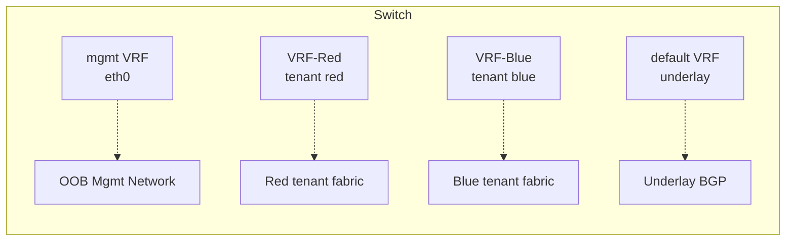
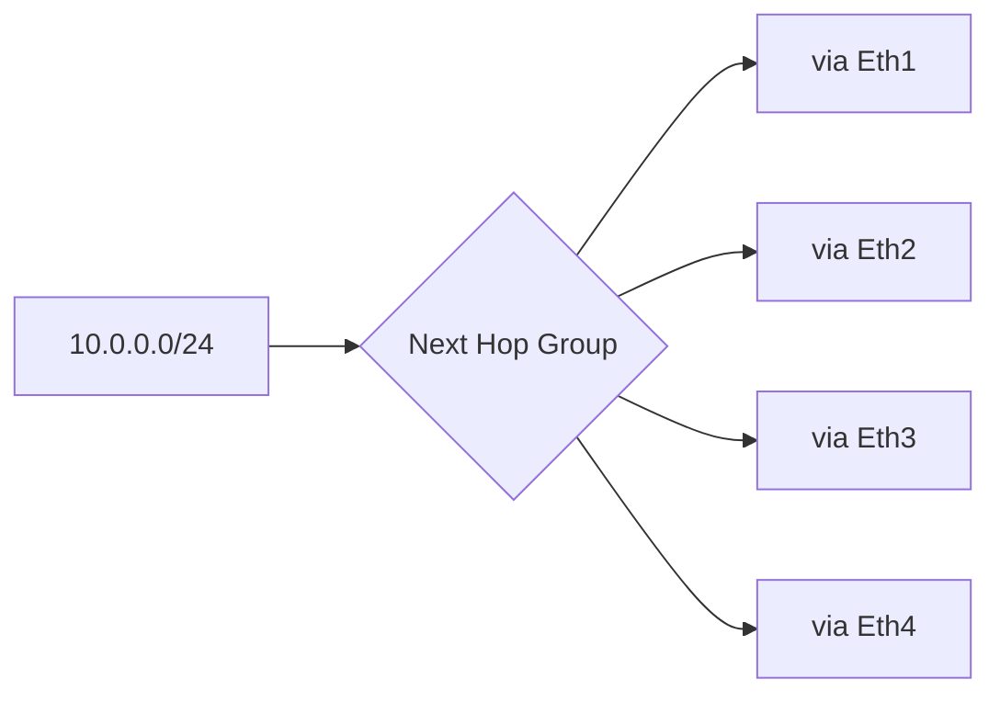
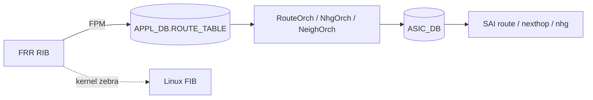

# L3 基盤と VRF

[SONiC](../../reference/glossary.md#term-sonic) で L3 を読み始めるとき、最初に route テーブルから入ると挫折しやすい構成になっています。route の振る舞いは [VRF](../../reference/glossary.md#term-vrf) と interface に強く依存し、next hop の解決もリンク状態と隣接探索に依存するためです。この章は **VRF と interface を最初に押さえる** ための入口です。

## SONiC の L3 は何の問題を解決するか

データセンタースイッチ単位で見ると、SONiC の L3 は以下を引き受けます。

- 物理 / [VLAN](../../reference/glossary.md#term-vlan) / [PortChannel](../../reference/glossary.md#term-portchannel) / Loopback / sub-port を **L3 interface** として束ね、VRF に所属させる。
- [BGP](../../reference/glossary.md#term-bgp) / static で得た経路を **VRF 単位** で持ち、Linux kernel と [ASIC](../../reference/glossary.md#term-asic) 両方に反映する。
- IPv4 / IPv6、link-local、[ECMP](../../reference/glossary.md#term-ecmp)、management traffic 分離など、運用上必要な L3 機能を Linux + ASIC で 1 つの NOS として扱う。

特に **management traffic 用の VRF (mgmt VRF) と forwarding 用の VRF を別に持つ** こと、**Linux と ASIC の両方に VRF を作る** ことが SONiC 特有の押さえどころです。

## SONiC の中での位置

| 軸 | 担当 |
| --- | --- |
| Management plane | `config vrf`, `config interface`, `config route`, `CONFIG_DB.VRF / INTERFACE / STATIC_ROUTE` |
| Control plane | [vrfmgrd](../../reference/glossary.md#term-vrfmgrd), [intfmgrd](../../reference/glossary.md#term-intfmgrd), [FRR](../../reference/glossary.md#term-frr) staticd / [zebra](../../reference/glossary.md#term-zebra), [fpmsyncd](../../reference/glossary.md#term-fpmsyncd) |
| Data plane | VRFOrch, IntfsOrch, RouteOrch, NhgOrch, NeighOrch, [SAI](../../reference/glossary.md#term-sai) Virtual Router / Router Interface |

## 最初に押さえる用語

| 用語 | 意味 |
| --- | --- |
| VRF | Linux VRF master device + SAI Virtual Router。default / data VRF / mgmt VRF を区別する |
| L3 interface | IP / VRF を持つ interface。`INTERFACE` / `VLAN_INTERFACE` / `PORTCHANNEL_INTERFACE` / `LOOPBACK_INTERFACE` |
| [RIF](../../reference/glossary.md#term-rif) (Router Interface) | SAI 上の L3 interface object |
| Next hop | route の出口。IP + interface + （link-local の場合） interface alias を含むキー |
| NHG ([Next Hop Group](../../reference/glossary.md#term-next-hop-group)) | ECMP / WCMP / FG-ECMP を表す SAI object 群 |
| [FPM](../../reference/glossary.md#term-fpm) | FRR zebra から SONiC へ経路を送るプロトコル |
| mgmt VRF | `eth0` の管理面トラフィックを default から分離する VRF |

## 最初に押さえる順番

| 順番 | 見るもの | 何を決めるか |
|------|----------|--------------|
| 1 | VRF | 経路表を分ける単位。default VRF、データ VRF、management VRF を区別する。 |
| 2 | L3 interface | Ethernet / VLAN / PortChannel / Loopback をどの VRF に所属させるか。 |
| 3 | IP address / link-local | RIF と connected route、BGP unnumbered や RFC 5549 の next-hop 解決に関係する。 |
| 4 | static / dynamic route | FRR が RIB を持ち、SONiC 側へ FPM で流す。 |
| 5 | next hop / NHG | 単一 next hop、ECMP、WCMP、FG ECMP などの差がここで出る。 |

VRF の設計詳細は [VRF サポート](../../routing/sonic-vrf-support-design-spec-draft.md) が入口です。static route の [CONFIG_DB](../../reference/glossary.md#term-config_db) から FRR への経路は [Static IP Route 設定](../../routing/static-ip-route-configuration.md) を参照してください。

## VRF は Linux と ASIC の両方に現れる

SONiC の VRF は、Linux 上では VRF master device として、ASIC 側では SAI Virtual Router として扱われます。`vrfmgrd` は `CONFIG_DB.VRF` から Linux VRF を作り、`VRFOrch` は `APP_DB.VRF_TABLE` 側を受けて SAI Virtual Router を作ります。interface は `intfmgrd` / `IntfsOrch` を通って Linux と ASIC の両方に反映されます。

重要なのは、VRF は単なる CLI 上の名前ではなく、FRR、kernel、[orchagent](../../reference/glossary.md#term-orchagent)、SAI の共通キーになることです。non-default VRF の経路を調べるときは、常に「その route はどの VRF の route か」「next hop は同じ VRF か、`nexthop-vrf` で別 VRF を参照しているか」を確認します。

## 典型的な使用シーン

### シーン 1: tenant 分離のための data VRF + mgmt VRF

`mgmt VRF` は `eth0` 専用、`default VRF` は underlay BGP、`VRF-Red/Blue` は tenant の data plane、というふうに役割を分けます。

### シーン 2: 8-way ECMP の next-hop group

1 prefix に複数 nexthop を結び、SAI Next Hop Group object として ASIC に書き込みます。BGP multipath と組み合わせて leaf-spine fabric の主流の経路形態になります。

## Management VRF はデータ VRF と用途が違う

management VRF は front panel port の転送ではなく、`eth0` を使う管理面トラフィックを分離するための VRF です。`config vrf add mgmt` は通常のデータ VRF と違い、`MGMT_VRF_CONFIG` や management interface 側の処理に関係します。

古い management VRF [HLD](../../reference/glossary.md#term-hld) には cgroup を使う起動ラッパー方式が出てきますが、現行ページでは iproute2 の VRF master device 方式へ寄っている点が注記されています。詳細は [Management VRF 設計](../../routing/sonic-management-vrf-design-document-201911-release.md) を確認してください。

## IPv6 link-local は next hop のキーに interface を含める

IPv6 link-local の next hop はアドレスだけでは一意になりません。同じ `fe80::...` が複数 interface 上に存在し得るため、SONiC の next hop key は link-local 利用時に interface alias を含めて扱います。BGP unnumbered や RFC 5549 を読むときは、next hop IP と出力 interface をセットで見ます。

IPv6 link-local-only の設定条件、`fe80::/10` の route-to-CPU、IP2ME の扱いは [IPv6 Link-Local アドレス管理](../../routing/ipv6-link-local-enhancements.md) にまとまっています。

## Static route は CONFIG_DB から FRR へ入る

`config route` は `STATIC_ROUTE` テーブルを書き、FRR の staticd / zebra 側に反映されます。ASIC へ直接 route を書くわけではありません。FRR が RIB を計算し、FPM 経由で `fpmsyncd` が `APPL_DB.ROUTE_TABLE` へ書き、そこから RouteOrch が SAI route object を作ります。

VRF 付き static route では key が `STATIC_ROUTE|<vrf>|<prefix>` になります。ECMP は nexthop / ifname / distance などのカンマ区切りリストで表現され、同じ index の値が 1 つの next hop を構成します。

## 似た / 混同しやすい機能との違い

| 比較対象 | 違い |
| --- | --- |
| VLAN | VLAN は L2 broadcast domain。L3 として使うには `VLAN_INTERFACE` で SVI 化して VRF に所属させる必要がある |
| [VNET](../../reference/glossary.md#term-vnet) | [VXLAN](../../reference/glossary.md#term-vxlan) を前提にした overlay 用の仮想ネットワーク。data VRF と概念的に重なるが、tunnel と VNI を持つ |
| Sub-interface | `Ethernet0.100` の形で 1q tag を L3 RIF として扱う。VLAN bridge domain には入らない |
| ECMP vs WCMP vs FG-ECMP | ECMP は等分散、WCMP は重み付き、FG-ECMP は flowlet 単位の動的分散 |
| Mgmt VRF vs data VRF | 前者は eth0 専用で route export を想定しない、後者は forwarding を担う |

## 読み終わったあとにできるようになること

- 「経路が入っていない」問題を VRF / interface / next-hop / RIB / FIB のどこで切れるか判断できる。
- mgmt VRF と data VRF を混同せずに設計できる。
- IPv6 link-local + BGP unnumbered の next-hop が「IP + interface」のセットで決まることを理解した上で `show ip route` を読める。
- ECMP / NHG が SAI object としてどう ASIC に入るか想像できる。

## CONFIG_DB の主要テーブル

L3 / VRF / ECMP まわりで押さえる CONFIG_DB を整理します。

| Table | 用途 |
| --- | --- |
| `VRF` | data VRF の定義（fallback、import/export RT 等を含む） |
| `MGMT_VRF_CONFIG` | management VRF の enable / DNS / NTP source など |
| `INTERFACE` / `VLAN_INTERFACE` / `PORTCHANNEL_INTERFACE` / `LOOPBACK_INTERFACE` | L3 interface と VRF 所属 |
| `STATIC_ROUTE` | static route。VRF・ECMP・blackhole を表現できる |
| `BGP_NEIGHBOR` 等 | 各 VRF 配下の BGP（02 章） |
| `NEIGH` / `FDB` | neighbor / MAC 解決の入口（運用時に [STATE_DB](../../reference/glossary.md#term-state_db) と対照） |
| `DEVICE_METADATA.localhost` | `bgp_router_id` や `frr_mgmt_framework_config` の置き場 |

`vrfmgrd` が `VRF` / `MGMT_VRF_CONFIG` を読み Linux VRF を作り、`intfmgrd` が L3 interface を VRF に bind し、`VRFOrch` / `IntfsOrch` が SAI Virtual Router / Router Interface を作ります。経路系はその上に乗ります。

## ECMP / NHG / WCMP / FG-ECMP の整理

| 機構 | 重み | 動的性 | SONiC 側の入口 |
| --- | --- | --- | --- |
| ECMP | 等分散 | static | NhgOrch、RouteOrch |
| WCMP | 重み付き | static | sonic-weighted-ecmp / NhgOrch |
| FG-ECMP | flow-group 単位 | dynamic（再 hash 抑制） | fine-grained ecmp HLD |
| Overlay ECMP + [BFD](../../reference/glossary.md#term-bfd) | overlay nexthop の生死で再選択 | dynamic（BFD 通知） | overlay-ecmp-with-bfd-monitoring |

SAI 側は **Next Hop Group + Next Hop Group Member** の 2 段で表現され、member の OID 配列の最大値 / 1 group あたりの最大 member 数は ASIC の制約に強く依存します。経路爆発時にはこの上限超過で「ECMP が縮退する」「最も古い member だけが残る」現象が起きやすく、`CRM` カウンタや `flex counter` で監視するのが定石です。

## RIB → FIB の段ごとの確認

`show ip route` を見ても、それが FRR RIB（[vtysh](../../reference/glossary.md#term-vtysh)）か Linux FIB（`ip route`）か SONiC FIB（`sonic-db-cli APPL_DB`）か ASIC FIB（[ASIC_DB](../../reference/glossary.md#term-asic_db)）かで意味が違います。VRF 付きの問題切り分けでは「どの VRF の table を見ているか」を都度確認します。

## management VRF の特殊性

management VRF（既定 `mgmt`）は **front panel 経路ではなく `eth0` の管理通信を分離する** ための VRF です。現行 SONiC は iproute2 の VRF master device 方式を採り、古い HLD に出てくる cgroup wrapper 方式は使われなくなっています。NTP / DNS / TACACS / [SNMP](../../reference/glossary.md#term-snmp) の source interface 設定や、`config save -y` / `sonic-installer` 系コマンドが management VRF 側を経由する点が、forwarding 系 VRF との運用差分になります。

## 関連ページ

- [VRF サポート](../../routing/sonic-vrf-support-design-spec-draft.md)
- [Static IP Route 設定](../../routing/static-ip-route-configuration.md)
- [IPv6 Link-Local アドレス管理](../../routing/ipv6-link-local-enhancements.md)
- [Management VRF 設計](../../routing/sonic-management-vrf-design-document-201911-release.md)
- [Fine-grained ECMP](../../routing/sonic-fine-grained-ecmp.md)
- [Weighted ECMP](../../routing/sonic-weighted-ecmp.md)
- [Overlay ECMP with BFD](../../routing/overlay-ecmp-with-bfd-monitoring.md)

<!-- xref-prereq -->
## この章の前提知識

この章を読み進める前に、次の章を押さえておくと迷子になりにくい。

- [SONiC 全体像と設定基盤](../01-overview/index.md)
- [SWSS / SAI / Redis 内部実装](../20-swss-sai-redis/index.md)

<!-- glossary-links-injected: d62d2c91ba87 -->
