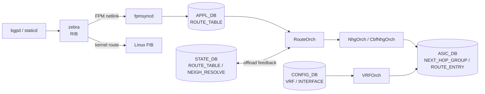

# 内部実装

[VRF](../../reference/glossary.md#term-vrf) / [ECMP](../../reference/glossary.md#term-ecmp) / RIB-FIB パイプラインの内部実装は、「route が [FRR](../../reference/glossary.md#term-frr) で best になった瞬間」から「[ASIC](../../reference/glossary.md#term-asic) に program され、peer に advertise される瞬間」までの長いパイプラインに、どこに非対称性や遅延が入るかを意識すると整理しやすいです。

## データフロー



## 主要 Orch / daemon の責務

| コンポーネント | 主なクラス | 責務 |
| --- | --- | --- |
| `zebra` (FRR) | `zebra/zebra_fpm.c` | RIB best path を [FPM](../../reference/glossary.md#term-fpm) 経由で送信。`ip route` の VRF はカーネル table id に対応 |
| `fpmsyncd` (`fpmsyncd/fpmlink.cpp`) | `FpmLink::processFpmMessage`、`RouteSync` | FPM netlink (`RTM_NEWROUTE`) を `ROUTE_TABLE` / `LABEL_ROUTE_TABLE` に流す |
| `RouteOrch` (`orchagent/routeorch.cpp`) | `RouteOrch::doTask`、`addRoute`、`removeRoute` | `ROUTE_TABLE` から [SAI](../../reference/glossary.md#term-sai) route entry を作成。nexthop group を NhgOrch に依頼 |
| `NhgOrch` (`orchagent/nhgorch.cpp`) | `NhgOrch::doTask`、`NextHopGroup::sync` | shared nexthop group の生成、PIC のための階層 NHG（CbfNhg） |
| `NeighOrch` (`orchagent/neighorch.cpp`) | `addNeighbor`、`resolveNeighbor` | [ARP](../../reference/glossary.md#term-arp)/ND を `SAI_NEIGHBOR_ENTRY` / `SAI_NEXT_HOP` に投影 |
| `VRFOrch` (`orchagent/vrforch.cpp`) | `VRFOrch::doTask` | `VRF` テーブルから `SAI_VIRTUAL_ROUTER` 作成、参照カウント管理 |
| `IntfsOrch` | `addRouterIntfs` | router interface を VRF に紐付け |
| `FgNhgOrch` (`orchagent/fgnhgorch.cpp`) | fine-grained ECMP | hash bucket を固定にし、prefix の入れ替えで flow を乱さない |

## SAI 属性使用一覧

| object | 主要属性 |
| --- | --- |
| `SAI_OBJECT_TYPE_VIRTUAL_ROUTER` | `SAI_VIRTUAL_ROUTER_ATTR_ADMIN_V4_STATE`、`SAI_VIRTUAL_ROUTER_ATTR_ADMIN_V6_STATE`、`SAI_VIRTUAL_ROUTER_ATTR_SRC_MAC_ADDRESS` |
| `SAI_OBJECT_TYPE_ROUTE_ENTRY` | `SAI_ROUTE_ENTRY_ATTR_PACKET_ACTION = FORWARD/DROP/TRAP`、`SAI_ROUTE_ENTRY_ATTR_NEXT_HOP_ID` |
| `SAI_OBJECT_TYPE_NEXT_HOP_GROUP` | `SAI_NEXT_HOP_GROUP_ATTR_TYPE = ECMP / FINE_GRAIN_ECMP / DYNAMIC_UNORDERED_ECMP` |
| `SAI_OBJECT_TYPE_NEXT_HOP_GROUP_MEMBER` | `SAI_NEXT_HOP_GROUP_MEMBER_ATTR_WEIGHT`、`SAI_NEXT_HOP_GROUP_MEMBER_ATTR_NEXT_HOP_ID` |
| `SAI_OBJECT_TYPE_NEIGHBOR_ENTRY` | `SAI_NEIGHBOR_ENTRY_ATTR_DST_MAC_ADDRESS`、`SAI_NEIGHBOR_ENTRY_ATTR_NO_HOST_ROUTE` |

`FINE_GRAIN_ECMP` は FgNhgOrch のための拡張で、ベンダ差が出やすい SAI 属性です。PIC（Prefix Independent Convergence）では [BFD](../../reference/glossary.md#term-bfd)-down 時に group member の `weight` を 0 化する path（`SAI_NEXT_HOP_GROUP_MEMBER_ATTR_WEIGHT` の動的更新）に頼るため、ASIC で WEIGHT のホットスワップが効くかが分かれ目になります。

## Redis テーブル参照関係

```yaml
CONFIG_DB:
  VRF             ─> VRFOrch
  INTERFACE / PORTCHANNEL_INTERFACE / VLAN_INTERFACE (vrf_name)  ─> IntfsOrch → VRFOrch
  BGP_NEIGHBOR    ─> bgpcfgd → FRR

APPL_DB:
  ROUTE_TABLE     ─> RouteOrch
  NEIGH_TABLE     ─> NeighOrch
  NEXTHOP_GROUP_TABLE  ─> NhgOrch
  LABEL_ROUTE_TABLE    ─> MplsRouteOrch (※ MPLS 参照)

STATE_DB:
  ROUTE_TABLE / NEIGH_RESOLVE_TABLE / FG_ROUTE_TABLE
  → offload feedback として FRR の suppress-fib-pending に効く

ASIC_DB:
  VIRTUAL_ROUTER / ROUTE_ENTRY / NEXT_HOP / NEXT_HOP_GROUP / NEIGHBOR_ENTRY
```

## ZMQ / Redis pub/sub の使用

- 大量 route の loading 時、`fpmsyncd` は [Redis](../../reference/glossary.md#term-redis) pipeline を pump し、`orchagent` 側は ring buffer（`gRingBuffer`）+ assistant thread で `ConsumerStateTable` の dequeue を加速する設計が入っています（[BGP](../../reference/glossary.md#term-bgp) Loading Optimization）。
- `sairedis` は async モードで書き込み、`ASIC_DB` の `_temp` キーを使った redis transaction を avoid する設計です。
- `RouteOrch` ↔ `NeighOrch` ↔ `NhgOrch` 間はプロセス内 `Observer` で notify します（Redis を経由しない）。

## 既知の実装上の制約

- VRF を跨ぐ leak route は `VRFOrch` の view では暗黙の依存が増えるため、[orchagent](../../reference/glossary.md#term-orchagent) 内では VRF 単位の lock が太く、極端な VRF 数（数千）では route convergence の serialization が問題になります。
- ECMP の hash field 設定は `SwitchOrch` が `SAI_SWITCH_ATTR_ECMP_HASH_*` をまとめて投入する仕組みで、per-VRF / per-route の hash 切替は [SONiC](../../reference/glossary.md#term-sonic) master では未対応です。
- `Suppress FIB Pending` の offload-feedback path は、ASIC reject（capacity over や属性 unsupported）の通知を `STATE_DB.ROUTE_TABLE` の `offloaded` field 経由で FRR に返しますが、ベンダ [syncd](../../reference/glossary.md#term-syncd) が `offloaded` を更新しない場合に suppress が解除されない discrepancy がよく観測されます。
- FgNhgOrch は `FG_NHG_PREFIX` テーブルに登録された prefix のみ fine-grained 扱いになり、その範囲外の ECMP は通常の `NhgOrch` 経路を通ります。

## VRF と Linux kernel の連携

SONiC は VRF を Linux kernel の VRF（`l3mdev`）と SAI の `VIRTUAL_ROUTER` の二重で表現します。`IntfMgr` が [CONFIG_DB](../../reference/glossary.md#term-config_db) の `INTERFACE|<intf>` の `vrf_name` フィールドを見て、kernel に `ip link set <intf> master Vrf-Red` を発行し、同時に [APPL_DB](../../reference/glossary.md#term-appl_db) 経路で orchagent に SAI router interface の VRF 属性を更新させます。

| 操作 | kernel 側 | ASIC 側 |
| --- | --- | --- |
| VRF 追加 | `ip link add Vrf-Red type vrf table 1001` | `SAI_OBJECT_TYPE_VIRTUAL_ROUTER` 作成 |
| interface に VRF 割当 | `ip link set Ethernet0 master Vrf-Red` | router_interface の `VIRTUAL_ROUTER_ID` を更新 |
| route 投入 | `ip route add … vrf Vrf-Red` | ROUTE_ENTRY の `vr_id` に紐付け |

kernel side が遅延し orchagent 側が先に更新されると、`fpmsyncd` が「該当 VRF table が kernel に無い」エラーで route を skip するケースが報告されています（VRF 作成直後の race）。

## ECMP hash の制御

ECMP のハッシュフィールドは `SwitchOrch` が `CONFIG_DB:SWITCH_HASH` を購読し、変更を検知した時点で SAI に投入します。起動時に行うのは `querySwitchHashDefaults()` による SAI OID キャッシュのみで、`SWITCH_HASH|GLOBAL` の取り込みは `doCfgSwitchHashTableTask()` 経由の event-driven な経路です。

```yaml
CONFIG_DB:SWITCH_HASH|GLOBAL
  ecmp_hash: "SRC_IP,DST_IP,IP_PROTOCOL,L4_SRC_PORT,L4_DST_PORT,INNER_*"
  lag_hash:  "..."
```

これは ASIC 全体 1 つの設定で、per-VRF / per-route の hash 切替は SONiC master でサポートされません。inner header をハッシュに含めるかは [VXLAN](../../reference/glossary.md#term-vxlan) / [SRv6](../../reference/glossary.md#term-srv6) でしばしば問題になります（VXLAN/[EVPN](../../reference/glossary.md#term-evpn) 章および SRv6 関連ページを参照）。

## NHG 参照カウントと resync

`NhgOrch` は同一の `(prefix, nexthop set)` を共有して SAI 上の `NEXT_HOP_GROUP` を再利用します。参照カウントは以下のように動きます。

| 操作 | 内部処理 |
| --- | --- |
| route 追加で新 NHG 必要 | `NhgOrch::addNhg` で SAI create、refcount=1 |
| 既存 NHG と同形 | `NextHopGroup::find` でヒット、refcount++ |
| route 削除 | refcount--、0 になったら SAI remove |
| member の BFD down | `setNextHopGroupMembers` で member 差し替え |

PIC では member の `weight=0` 化のみで NHG 自体は維持するため、refcount は減りません。member 集合が変わらない限り SAI object は再作成されない設計です。`gNhgMapOrch` 経由の CBF（class-based forwarding）は別管理で、`CbfNhgOrch` が一段上の階層 NHG として `NhgOrch` を呼びます。

## 関連ページ

- [BGP Loading Optimization](../../routing/bgp-loading-optimization-for-sonic.md)
- [BGP PIC](../../routing/bgp-prefix-independent-convergence-architecture-document.md)
- [BGP Suppress FIB Pending](../../routing/bgp-suppress-announcements-of-routes-not-installed-in-hw.md)
- [Fine Grained ECMP](../../routing/sonic-fine-grained-ecmp.md)
- [Routing / Next Hop table enhancement](../../routing/routing-and-next-hop-table-enhancement.md)
- [VRF design spec (draft)](../../routing/sonic-vrf-support-design-spec-draft.md)

<!-- glossary-links-injected: 23f2999cb556 -->
