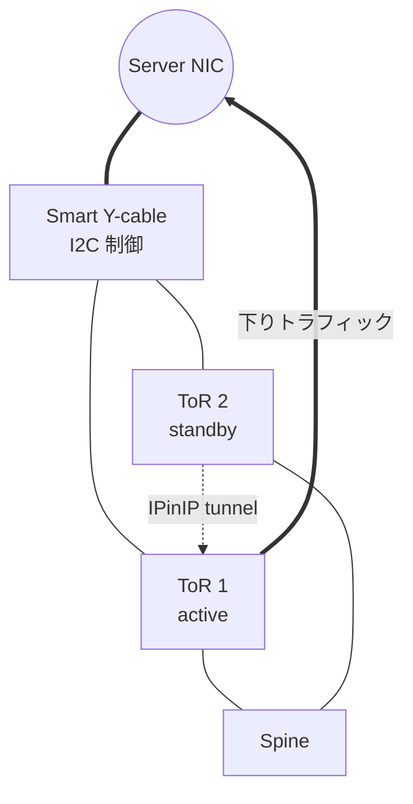
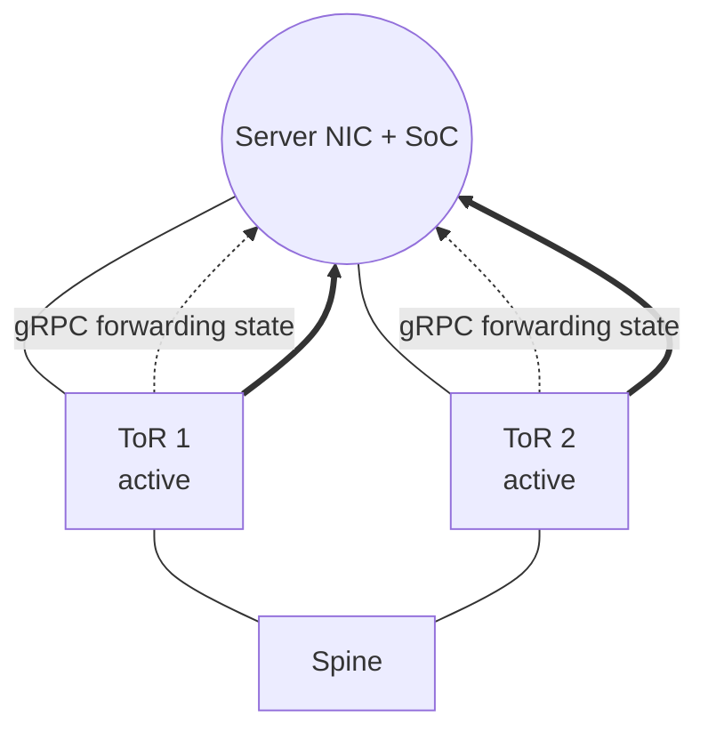
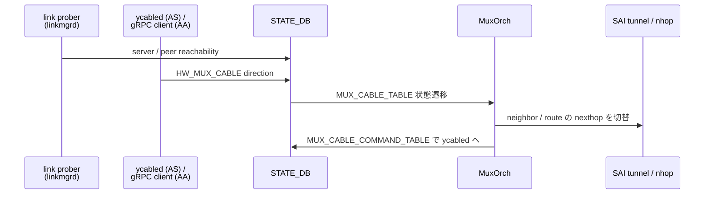
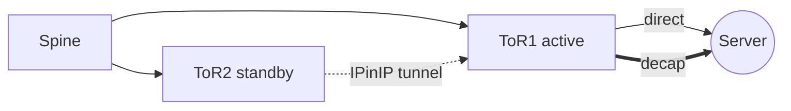

# Dual-ToR の考え方

Dual-ToR は「サーバを 2 台の ToR に二重接続して、ToR / リンク / ケーブルの片側障害でもサービスを継続する」ための構成です。MC-[LAG](../../reference/glossary.md#term-lag) とよく混同されますが、Dual-ToR は **クラウド事業者の大規模 ToR 冗長を念頭に置いた [SONiC](../../reference/glossary.md#term-sonic) 固有の構成** で、特殊なケーブル / NIC とそれを制御する SONiC daemon を組み合わせている点が異なります。

## Dual-ToR は何の問題を解決するか

データセンタ ToR の冗長化要件は次のとおりです。

- サーバ NIC は単一の LAG / bond ではなく、**個別に 2 本のリンク** を持っているケースが多い（特に NIC SDK の都合）。
- ToR の faulty 切り戻しや upgrade の際に、**サーバ側を巻き込まずに片側だけを抜く** ことが求められる。
- 障害時の切替時間は **mlag より厳しい SLO**（秒未満〜数十 ms 級）が要求されることがある。
- 大量サーバを擁する CSP では、**ToR 状態を集中管理 / SDN controller から制御** したい。

Dual-ToR は smart Y-cable や SoC NIC を使い、サーバ NIC に切替の責任を持たせない（あるいは ToR と協調させる）ことで、これらを解こうとしています。

## SONiC の中での位置

| 軸 | 担当 |
| --- | --- |
| Management plane | `MUX_CABLE` [CONFIG_DB](../../reference/glossary.md#term-config_db)、`config muxcable`、ycabled (Active-Standby) |
| Control plane | [linkmgrd](../../reference/glossary.md#term-linkmgrd)、[MuxOrch](../../reference/glossary.md#term-muxorch)、icmp_responder、SoC との gRPC channel (Active-Active) |
| Data plane | MuxTunnel ([IPinIP](../../reference/glossary.md#term-ipinip))、neighbor / route nexthop の active/standby 切替、[SAI](../../reference/glossary.md#term-sai) tunnel |

`linkmgrd` がリンク健全性を判断し、`MuxOrch` が forwarding（neighbor / route の nexthop）を直接サーバ向け / tunnel 向けに切り替える、というのが Dual-ToR 中核の流れです。

## まず分けて考えること

| 観点 | Active-Standby | Active-Active |
|---|---|---|
| 通常時の帯域 | 片側リンク分 | 両リンク分 |
| ケーブル / NIC 制御 | smart Y-cable、I2C、ycabled | SoC NIC、gRPC |
| 障害時の基本動作 | standby が active へ昇格 | 不健全な側だけ forwarding を止める |
| 下りの standby 経路 | IPinIP tunnel で peer へ戻す | NIC 側の分散 / forwarding state が中心 |
| 設計上の注意 | tunnel、neighbor、route 更新の整合 | gRPC channel、SoC state、peer link state |

サーバに向かう下り方向を「片側だけが受け持つ」か「両側が同時に受け持つ」かが、Active-Standby と Active-Active の本質的な違いです。

## Active-Standby は何を解くか

Active-Standby では、サーバ NIC と 2 台の ToR の間に smart Y-cable があり、mux の向きが active ToR を決めます。standby ToR は通常、サーバ宛の下りトラフィックを直接サーバへ送らず、peer ToR へ IPinIP tunnel で戻します。障害時には standby 側が active へ昇格し、サーバ側リンクを生かしたまま転送面を切り替えます。

この方式の中心は「どちらが active か」を明確に 1 つに決めることです。`linkmgrd` は ICMP heartbeat、物理リンク、mux 方向を見て状態遷移を決めます。`MuxOrch` は active / standby に応じて neighbor や route の nexthop を直接サーバ向けまたは tunnel 向けに切り替えます。

## Active-Active は何を変えるか

Active-Active では、両 ToR が常時トラフィックを処理します。サーバ NIC は 2 本のリンクを使い、northbound は 5-tuple などで分散し、必要な制御パケットは両リンクへ複製します。従来の I2C ベースの Y-cable 制御ではなく、ToR と SoC NIC の間で gRPC による forwarding state 制御を使う点が大きな違いです。

Active-Active でも `linkmgrd` はリンク健全性を見ますが、状態判断は各 ToR がより独立に行います。障害を検知した側だけが standby 相当の forwarding state に倒れ、復旧後に active へ戻る、という整理になります。

## 典型的な使用シーン

### シーン 1: Active-Standby + Y-cable

下り方向は常に active ToR が受け、standby は IPinIP で peer に戻すだけです。

### シーン 2: Active-Active + SoC NIC

両 ToR が同時に下りを送り、各 ToR と SoC が gRPC で forwarding state を交換します。

## まず押さえる用語

| 用語 | 意味 |
|---|---|
| `MUX_CABLE` | server-facing port ごとの Dual-ToR 設定。`cable_type`、`state`、サーバ IP、SoC IP、neighbor mode を持つ |
| mux state | active / standby / auto / manual / detach などの論理状態 |
| link prober | サーバ NIC への ICMP heartbeat で self / peer の到達性を見る `linkmgrd` の機能 |
| MuxTunnel | standby ToR がサーバ宛トラフィックを peer ToR へ戻す IPinIP tunnel |
| prefix-based neighbor | neighbor を残したまま `/32` / `/128` route の nexthop だけを切り替える方式 |
| Y-cable | サーバ - ToR 間で I2C 制御の mux を持つ特殊ケーブル |
| SoC NIC | サーバ側に小型コンピュータを持ち、ToR と gRPC でやり取りできる NIC |
| ycabled | Y-cable を扱う SONiC daemon |
| icmp_responder | サーバへの heartbeat に応える / 発生させる daemon |

## 似た / 混同しやすい機能との違い

| 比較対象 | 違い |
| --- | --- |
| MC-LAG | 2 台の ToR を 1 つの LAG として見せる。サーバ NIC 側は標準 [LACP](../../reference/glossary.md#term-lacp)。Dual-ToR より物理層の特殊要件が小さい |
| [VRRP](../../reference/glossary.md#term-vrrp) / FHRP | gateway IP の冗長化が目的。物理リンクの選び替えはしない |
| [BGP](../../reference/glossary.md#term-bgp) [ECMP](../../reference/glossary.md#term-ecmp) unnumbered | Spine - Leaf に向く設計。サーバ - ToR の冗長化には別の仕組みが要る |
| 単純な NIC bonding | サーバ OS 側に依存。ToR から能動的に切り替えを誘導できない |

## どちらを選ぶか

通常時の帯域、ケーブル / NIC 制約、障害時 SLO の 3 軸で決めます。Active-Standby は smart Y-cable と I2C 周りに特殊ハードウェアが要り、Active-Active は SoC NIC と gRPC スタックを前提にします。既存の Active-Standby は「片側 active」を前提にした経路制御が多く、tunnel、prefix-based neighbor、multi-nexthop route のループ回避が重要です。Active-Active は帯域効率を上げますが、NIC / SoC 側の制御と観測点が増えるため、gRPC client と forwarding state の切り分けが必要になります。

## 読み終わったあとにできるようになること

- Dual-ToR を MC-LAG や VRRP と区別して説明できる。
- Active-Standby と Active-Active の trade-off を、帯域 / ハードウェア / SLO の観点で比較できる。
- 下り方向のパスが何によって決まるか（mux state / SoC forwarding state）を意識して切り分けに臨める。
- `linkmgrd` と `MuxOrch` が neighbor / route の nexthop をどう書き換えるかをイメージできる。

## CONFIG_DB / APPL_DB の主要テーブル

Dual-ToR で見るべき主な DB は次のとおりです。

| Table | 場所 | 用途 |
| --- | --- | --- |
| `MUX_CABLE` | CONFIG_DB | server-facing port ごとの `cable_type` / `state` / server IP / SoC IP / neighbor mode |
| `MUX_LINKMGR` | CONFIG_DB | linkmgrd の各種パラメータ（heartbeat 間隔 / timeout / mode） |
| `TUNNEL` / `TUNNEL_DECAP_TABLE` | CONFIG_DB / [APPL_DB](../../reference/glossary.md#term-appl_db) | MuxTunnel の IPinIP 設定 |
| `HW_MUX_CABLE_TABLE` | [STATE_DB](../../reference/glossary.md#term-state_db) | ycabled が見る physical mux 方向 |
| `MUX_CABLE_TABLE` | STATE_DB | linkmgrd の論理 state（active/standby/unknown） |
| `MUX_LINKMGR_TABLE` | STATE_DB | link prober の状態 |
| `MUX_CABLE_COMMAND_TABLE` | STATE_DB | linkmgrd → ycabled への切替指示 |

linkmgrd は ICMP heartbeat（link prober）/ HW link / mux 方向の 3 信号を STATE_DB 越しに集めて状態遷移を決め、MuxOrch が neighbor / route の nexthop を直接サーバ向け or tunnel 向けに切り替えます。

## 切替の信号フロー

Active-Standby ではこの SDB を経由した制御が中心で、Active-Active では同様の構図で gRPC client が SoC との forwarding state を扱います。

## prefix-based mux neighbor の意味

Active-Standby では、サーバ側 neighbor を残したまま **`/32` / `/128` route の nexthop だけ** を切り替える方式（prefix-based mux neighbor）が使われます。理由は、neighbor を削除すると [ARP](../../reference/glossary.md#term-arp)/ND の再解決が必要になり、切替時間が伸びるからです。詳細は [Prefix-based mux neighbors](../../routing/prefix-based-mux-neighbors.md) を参照してください。

## ループ回避と境界

standby から peer に IPinIP で戻したパケットを **peer 側でループしてもう一度 tunnel に乗せない** ように、MuxOrch は tunnel decap 後の nexthop を local server 向けに固定します。Active-Active では両 ToR が直接サーバへ送るためこのループ問題は出ず、代わりに「**北行きの 5-tuple ハッシュが両側で一致するか**」が観測すべき項目になります。

## 関連ページ

- [Active-Standby Dual ToR](../../overlay/active-standby-dual-tor.md)
- [Active-Active Dual ToR](../../overlay/active-active-dual-tor.md)
- [Dual-ToR 関連](../../categories/dual-tor.md)
- [Prefix-based mux neighbors](../../routing/prefix-based-mux-neighbors.md)
- [DSCP remapping for tunnel traffic](../../overlay/dscp-remapping-for-tunnel-traffic.md)

<!-- xref-prereq -->
## この章の前提知識

この章を読み進める前に、次の章を押さえておくと迷子になりにくい。

- [SONiC 全体像と設定基盤](../01-overview/index.md)
- [L2 / VLAN / LAG / MC-LAG](../06-l2-vlan-lag/index.md)
- [VRF / ECMP / RIB-FIB パイプライン](../04-vrf-ecmp/index.md)

<!-- glossary-links-injected: a864afbcc47d -->
