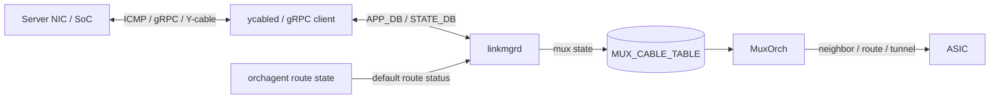

# Mux 制御の内部構造

Dual-ToR の制御は 1 つの daemon だけでは完結しません。`linkmgrd` が「どちらへ倒すべきか」を判断し、`ycabled` または gRPC client がケーブル / NIC 側へ指示し、`MuxOrch` が [ASIC](../../reference/glossary.md#term-asic) の neighbor / route / tunnel を転送状態に合わせます。

## 状態はどこで作られるか



`linkmgrd` は ICMP heartbeat、物理 link state、mux state、必要なら default route state を合成します。Active-Standby では Y-cable の mux 方向が重要で、Active-Active では SoC NIC の admin / operational forwarding state が重要になります。

## `linkmgrd` が見る状態

Active-Standby の典型では、`linkmgrd` は 3 種類の入力を見ます。

| 入力 | 例 | 判断への使い方 |
|---|---|---|
| LinkProber | ICMP self / peer / none | サーバ側経路が自 ToR または peer ToR 経由で返ってくるか |
| LinkState | Ethernet up / down | 物理リンクが利用可能か |
| MuxState | active / standby / unknown | Y-cable がどちらを向いているか |

Active-Active では mux 方向ではなく、リンクごとの forwarding state が中心になります。`linkmgrd` は admin forwarding state を設定し、NIC 側は operational forwarding state として実際に転送できるかを判断します。

## `MuxOrch` が避ける障害

`MuxOrch` の仕事は、mux state を ASIC の転送状態に落とすことです。Active-Standby で standby 側にサーバ宛パケットが来た場合、直接サーバへ出すのではなく MuxTunnel へ向ける必要があります。

prefix-based neighbor は、この切替を軽くするための方式です。neighbor entry を作り直さず、サーバ IP の `/32` または `/128` route の nexthop だけを直接 neighbor と tunnel の間で切り替えます。大量の neighbor を持つ ToR で、状態遷移時の [SAI](../../reference/glossary.md#term-sai) 操作を減らすための設計です。

multi-nexthop route のループ回避も同じ文脈です。1 つの route が複数 nexthop を持ち、その一部が active、一部が standby になると、[ECMP](../../reference/glossary.md#term-ecmp) の一部が tunnel へ入り、peer ToR 側でまた戻ってくる可能性があります。このため `MuxOrch` は active nexthop がある場合は単一 nexthop に絞り、全て standby なら tunnel を選ぶ、という動きをします。

## default route 連動の意味

サーバ側リンクが正常でも、ToR から上流への default route が消えていると、その ToR を active にしても上りがブラックホールになります。default route 連動は、[orchagent](../../reference/glossary.md#term-orchagent) が [STATE_DB](../../reference/glossary.md#term-state_db) に公開する default route 状態を `linkmgrd` が読み、default route が無い側を standby 寄りに倒すための仕組みです。

重要なのは、これは mux state machine に新しい障害源を足しているというより、「default route が無い間は heartbeat を止める」ことで既存の不健全判定に乗せる設計だという点です。manual mode では自動切替しない、両 ToR で default route を失っても揺れ続けない、という性質を守るために状態キャッシュも必要になります。

## gRPC client はどこに入るか

Active-Active では、ToR から SoC NIC へ forwarding state を問い合わせたり設定したりします。この経路が gRPC client です。`ycabled` 側から proto 生成された stub を使って SoC の service を呼び、channel state や応答を DB に反映します。

Active-Standby の Y-cable 制御では I2C / xcvrd / ycabled の役割が前面に出ます。Active-Active では SoC NIC の状態を含むため、gRPC channel の疎通、TLS、keepalive、Loopback IP を送信元に使う要件が切り分けポイントになります。

## 主要 Orch / daemon の責務

| コンポーネント | 主実体 | 責務 |
| --- | --- | --- |
| `linkmgrd` (`src/linkmgrd/`) | `LinkManagerStateMachineBase`、`ActiveStandbyStateMachine`、`ActiveActiveStateMachine` | LinkProber / LinkState / MuxState を合成し mux 状態決定 |
| `ycabled` (`sonic-platform-daemons/sonic-ycabled/`) | `y_cable_helper.py` | Y-cable I2C 操作、APP_DB/STATE_DB の mux state 反映 |
| `MuxOrch` (`orchagent/muxorch.cpp`) | `MuxOrch::doTask`、`MuxCable::stateActive`、`MuxCable::stateStandby` | mux 状態を SAI neighbor / route / tunnel に展開 |
| `MuxCableOrch` | `MuxCableOrch::updateMuxState` | [APPL_DB](../../reference/glossary.md#term-appl_db) の `MUX_CABLE_TABLE` を読み、tunnel route の付け替え |
| `TunnelDecapOrch` | `TunnelDecapOrch::doTask` | active 側のサーバ IP を decap する tunnel term entry |
| `gRPC client` (Active-Active) | proto generated stub | SoC NIC の forwarding state 取得・設定 |

## SAI 属性使用一覧

| object | 属性 | 用途 |
| --- | --- | --- |
| `SAI_OBJECT_TYPE_NEIGHBOR_ENTRY` | `SAI_NEIGHBOR_ENTRY_ATTR_DST_MAC_ADDRESS`、`SAI_NEIGHBOR_ENTRY_ATTR_NO_HOST_ROUTE` | mux 状態でサーバ MAC / placeholder MAC を切替 |
| `SAI_OBJECT_TYPE_NEXT_HOP` | `SAI_NEXT_HOP_ATTR_TYPE = TUNNEL_ENCAP`、`SAI_NEXT_HOP_ATTR_TUNNEL_ID` | standby 経由のサーバ宛 tunnel encap |
| `SAI_OBJECT_TYPE_TUNNEL_TERM_TABLE_ENTRY` | `SAI_TUNNEL_TERM_TABLE_ENTRY_ATTR_DST_IP` | peer ToR からの tunnel を decap |
| `SAI_OBJECT_TYPE_ROUTE_ENTRY` | `SAI_ROUTE_ENTRY_ATTR_NEXT_HOP_ID` | サーバ IP host route の nexthop 切替 |

## Redis テーブル参照関係

```yaml
CONFIG_DB:
  MUX_CABLE, DEVICE_METADATA (peer_switch / subtype)
APPL_DB:
  HW_MUX_CABLE_TABLE (state からの fb)
  MUX_CABLE_TABLE (linkmgrd → MuxCableOrch)
STATE_DB:
  MUX_CABLE_TABLE (現状態), MUX_LINKMGR_TABLE, MUX_METRICS_TABLE,
  HW_MUX_CABLE_TABLE_PEER, FORWARDING_STATE_TABLE (Active-Active)
ASIC_DB:
  NEIGHBOR_ENTRY, NEXT_HOP, TUNNEL_TERM_TABLE_ENTRY, ROUTE_ENTRY
```

## ZMQ / Redis pub/sub

- Dual-ToR は **[Redis](../../reference/glossary.md#term-redis) pub/sub のみ**で ZMQ は使われていません。
- [linkmgrd](../../reference/glossary.md#term-linkmgrd) は `STATE_DB:MUX_CABLE_TABLE` を SubscriberStateTable で監視。
- Active-Active gRPC は SoC NIC と TLS 上で双方向 stream。 [SONiC](../../reference/glossary.md#term-sonic) コンテナ内の `linkmgrd` プロセス自体が gRPC client。

## 既知の実装上の制約

- `linkmgrd` の状態機械は **per-port** で、複数ポートをまたぐ整合（例：同一サーバの A/A NIC 両側が同期して flip する）は明示的には保証されない。[HLD](../../reference/glossary.md#term-hld) では individual port basis 設計。
- `MuxOrch` は active → standby 切替時に neighbor を**削除 → tunnel nexthop へ再作成**する path を取るため、ASIC で neighbor を作り直すコストが大きい場合の path として prefix-based mux neighbors が導入された。
- Active-Active で SoC NIC が応答しない場合、`linkmgrd` 側は admin forwarding state を変えても operational state が追従しないため、observability が不十分という指摘が PR レビューで複数挙がっている。
- gRPC channel が切断中は `linkmgrd` が default の "active" 想定で進む傾向があり、両 ToR で active になる split-brain 風の状態を運用で監視する必要がある。

## linkmgrd 状態機械の遷移

`linkmgrd` は per-port の有限状態機械を持ち、ICMP probe（ToR ↔ SoC NIC）と gRPC（SoC NIC API）の二系統入力で遷移します。

| 状態 | 意味 | 主な遷移条件 |
| --- | --- | --- |
| Active | 自 ToR が forwarding 担当 | probe 応答正常、peer は standby |
| Standby | 対向 ToR が forwarding 担当 | peer が active を主張、自分はバックアップ |
| Unknown | probe failure | ICMP 連続失敗、grace 期間中 |
| Wait | 切替判定中 | switchover 中の transition |

状態は `STATE_DB.MUX_CABLE_TABLE|<port>.state` に publish され、`MuxOrch` がそれを受けて SAI の neighbor / route を切替えます。split-brain（両側 active）の検出は HLD で peer 状態を追加チェックする設計ですが、運用上は監視で網を張る必要があります。

## 関連ページ

- [gRPC client](../../management/design-doc.md)
- [linkmgrd のデフォルトルート連動](../../routing/default-route.md)
- [プレフィックスルート方式の Mux ネイバ](../../routing/prefix-based-mux-neighbors.md)
- [dual-tor mux 跨ぎの multi-nexthop route ループ回避](../../routing/multiple-nexthop-route-hld.md)
- [Active-Standby Dual ToR](../../overlay/active-standby-dual-tor.md)
- [Active-Active Dual ToR](../../overlay/active-active-dual-tor.md)

<!-- glossary-links-injected: ec18b66e3507 -->
