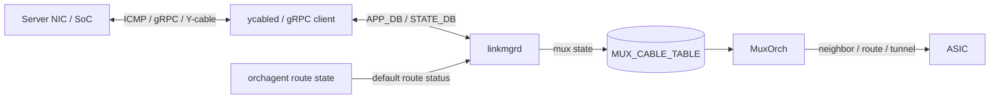

# Mux 制御の内部構造

Dual-ToR の制御は 1 つの daemon だけでは完結しません。`linkmgrd` が「どちらへ倒すべきか」を判断し、`ycabled` または gRPC client がケーブル / NIC 側へ指示し、`MuxOrch` が ASIC の neighbor / route / tunnel を転送状態に合わせます。

## 状態はどこで作られるか

`linkmgrd` は ICMP heartbeat、物理 link state、mux state、必要なら default route state を合成します。Active-Standby では Y-cable の mux 方向が重要で、Active-Active では SoC NIC の admin / operational forwarding state が重要になります。

## `linkmgrd` が見る状態

Active-Standby の典型では、`linkmgrd` は 3 種類の入力を見ます。

| 入力 | 例 | 判断への使い方 |
|---|---|---|
| LinkProber | ICMP self / peer / none | サーバ側経路が自 ToR または peer ToR 経由で返ってくるか |
| LinkState | Ethernet up / down | 物理リンクが利用可能か |
| MuxState | active / standby / unknown | Y-cable がどちらを向いているか |

Active-Active では mux 方向ではなく、リンクごとの forwarding state が中心になります。`linkmgrd` は admin forwarding state を設定し、NIC 側は operational forwarding state として実際に転送できるかを判断します。

## `MuxOrch` が避ける障害

`MuxOrch` の仕事は、mux state を ASIC の転送状態に落とすことです。Active-Standby で standby 側にサーバ宛パケットが来た場合、直接サーバへ出すのではなく MuxTunnel へ向ける必要があります。

prefix-based neighbor は、この切替を軽くするための方式です。neighbor entry を作り直さず、サーバ IP の `/32` または `/128` route の nexthop だけを直接 neighbor と tunnel の間で切り替えます。大量の neighbor を持つ ToR で、状態遷移時の SAI 操作を減らすための設計です。

multi-nexthop route のループ回避も同じ文脈です。1 つの route が複数 nexthop を持ち、その一部が active、一部が standby になると、ECMP の一部が tunnel へ入り、peer ToR 側でまた戻ってくる可能性があります。このため `MuxOrch` は active nexthop がある場合は単一 nexthop に絞り、全て standby なら tunnel を選ぶ、という動きをします。

## default route 連動の意味

サーバ側リンクが正常でも、ToR から上流への default route が消えていると、その ToR を active にしても上りがブラックホールになります。default route 連動は、orchagent が STATE_DB に公開する default route 状態を `linkmgrd` が読み、default route が無い側を standby 寄りに倒すための仕組みです。

重要なのは、これは mux state machine に新しい障害源を足しているというより、「default route が無い間は heartbeat を止める」ことで既存の不健全判定に乗せる設計だという点です。manual mode では自動切替しない、両 ToR で default route を失っても揺れ続けない、という性質を守るために状態キャッシュも必要になります。

## gRPC client はどこに入るか

Active-Active では、ToR から SoC NIC へ forwarding state を問い合わせたり設定したりします。この経路が gRPC client です。`ycabled` 側から proto 生成された stub を使って SoC の service を呼び、channel state や応答を DB に反映します。

Active-Standby の Y-cable 制御では I2C / xcvrd / ycabled の役割が前面に出ます。Active-Active では SoC NIC の状態を含むため、gRPC channel の疎通、TLS、keepalive、Loopback IP を送信元に使う要件が切り分けポイントになります。

## 関連ページ

- [gRPC client](../../management/design-doc.md)
- [linkmgrd のデフォルトルート連動](../../routing/default-route.md)
- [プレフィックスルート方式の Mux ネイバ](../../routing/prefix-based-mux-neighbors.md)
- [dual-tor mux 跨ぎの multi-nexthop route ループ回避](../../routing/multiple-nexthop-route-hld.md)
- [Active-Standby Dual ToR](../../overlay/active-standby-dual-tor.md)
- [Active-Active Dual ToR](../../overlay/active-active-dual-tor.md)
