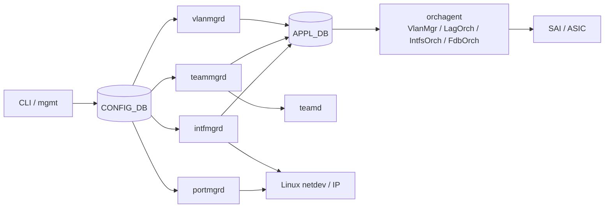
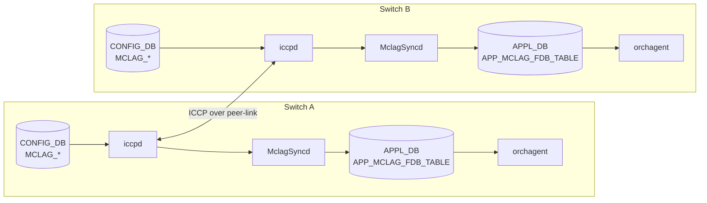

# L2 のアーキテクチャ

L2 設定は、[CONFIG_DB](../../reference/glossary.md#term-config_db) のテーブルごとに担当 daemon が決まり、[APPL_DB](../../reference/glossary.md#term-appl_db) や [orchagent](../../reference/glossary.md#term-orchagent) を通って [ASIC](../../reference/glossary.md#term-asic) に反映されます。読むときの軸は「[VLAN](../../reference/glossary.md#term-vlan) を作る経路」「[LAG](../../reference/glossary.md#term-lag) を作る経路」「L3 interface を作る経路」「MC-LAG で peer と同期する経路」の 4 つです。

## 通常 L2 の反映経路

`sonic-ip-lag-incremental-update` の設計原則では、1 つの CONFIG_DB テーブルには 1 つの manager daemon が対応します。たとえば port admin / MTU は `portmgrd`、IP interface は `intfmgrd`、[PortChannel](../../reference/glossary.md#term-portchannel) は `teammgrd` が中心です。この分担により、再起動なしの incremental update を table 単位で扱えます。

## VLAN と FDB

`VLAN` は VLAN オブジェクト、`VLAN_MEMBER` は VLAN と port / PortChannel の所属関係を表します。`VLAN_INTERFACE` は VLAN 上の L3 interface です。

[FDB](../../reference/glossary.md#term-fdb) は VLAN 内の MAC 学習結果を保持します。L2 forwarding 強化では、flush の粒度が重要です。

| イベント | flush 対象の考え方 |
|---|---|
| port oper down | その port 上の dynamic FDB |
| port を VLAN から外す | その port / VLAN の FDB。static は保存・復元対象 |
| STP topology change | 影響範囲の dynamic FDB |
| PortChannel down | その LAG 上の dynamic FDB |

static FDB は CONFIG_DB の設定として残し、条件が整ったときに再 program する設計です。現行 CLI との乖離がある項目は [L2 Forwarding 強化](../../switching/layer-2-forwarding-enhancements.md) 側で確認してください。

## LAG の制御面

PortChannel は `PORTCHANNEL` と `PORTCHANNEL_MEMBER` から作られます。`teammgrd` が `teamd` 設定を生成し、`teamsyncd` / APPL_DB を介して orchagent が [SAI](../../reference/glossary.md#term-sai) LAG と member を作ります。`min_links`、`fallback`、`fast_rate` は集約の up 判定や [LACP](../../reference/glossary.md#term-lacp) 動作に関わります。

PortChannel は 2 つの顔を持ちます。`VLAN_MEMBER|Vlan100|PortChannel10` のように L2 trunk / access として使う場合と、`PORTCHANNEL_INTERFACE|PortChannel10|192.0.2.1/31` のように L3 interface として使う場合です。同じ PortChannel を同時に両方へ混ぜないよう、テーブル間制約と CLI の事前チェックを意識します。

## MC-LAG / ICCP

MC-LAG では、通常の LAG に加えて `iccpd` と `MclagSyncd` が peer 間の状態を同期します。

`MCLAG_DOMAIN` は peer IP、source IP、peer-link、keepalive / session timeout を持ちます。`MCLAG_INTERFACE` は domain に属する PortChannel を示します。`MCLAG_UNIQUE_IP` は [MCLAG](../../reference/glossary.md#term-mclag) VLAN interface 上で OSPF などの L3 protocol を動かすため、仮想 IP ではなく個別 IP を扱うモードです。

## STP / MSTP

MSTP は `stp` コンテナの `stpd`、CONFIG_DB の `STP` / `STP_MST*`、`stpmgrd`、APPL_DB、STP Orch、SAI STP オブジェクトで構成されます。VLAN 群を MST instance にまとめ、instance 単位で topology を計算します。

FDB flush と STP は近い位置にあります。Topology change は L2 loop 解消後も古い MAC 学習が残ると誤転送を起こすため、影響範囲の dynamic FDB を flush します。

## 関連ページ

- [MCLAG Enhancements](../../switching/mclag-enhancements.md)
- [ICCPd 内部構成](../../switching/brief-introduction-of-iccp-code.md)
- [MSTP on SONiC](../../switching/multiple-spanning-tree-protocol.md)
- [IP / LAG / MTU Incremental Update](../../switching/sonic-ip-lag-incremental-update.md)
- [L2 Forwarding 強化](../../switching/layer-2-forwarding-enhancements.md)

<!-- glossary-links-injected: c006405759d8 -->
