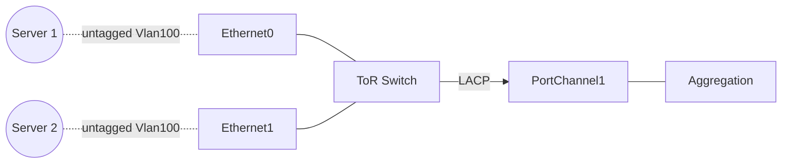
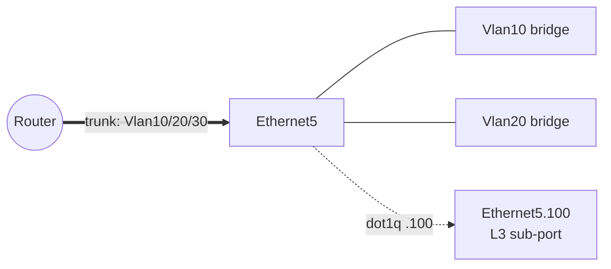

# L2 機能の考え方

[SONiC](../../reference/glossary.md#term-sonic) で L2 を読むときは、最初に「どの interface がどの forwarding domain に属するか」と「その interface を L2 として使うのか、L3 として使うのか」を分けて整理すると、その後の設定や運用が追いやすくなります。同じ `Ethernet0` でも、VLAN_MEMBER に入れれば L2、`INTERFACE` テーブルに入れれば L3、`VLAN_SUB_INTERFACE` で `Ethernet0.100` を作れば dot1q L3 になります。

## SONiC の L2 は何の問題を解決するか

データセンタの leaf-spine fabric では L2 を極力使わず L3 [ECMP](../../reference/glossary.md#term-ecmp) に寄せるのが王道ですが、現実にはサーバ - ToR 間の [VLAN](../../reference/glossary.md#term-vlan)、management VLAN、ストレージ系の broadcast 要件、L2 over [VXLAN](../../reference/glossary.md#term-vxlan) を運ぶための L2 bridge など、L2 は完全には消えません。SONiC の L2 機能は以下を引き受けます。

- VLAN bridge domain、tagged / untagged のメンバシップ、SVI を提供する。
- 複数物理リンクを [LAG](../../reference/glossary.md#term-lag) ([PortChannel](../../reference/glossary.md#term-portchannel)) として束ねる。
- [FDB](../../reference/glossary.md#term-fdb)、STP、storm control、link event damping など L2 周りの保護機能を持つ。
- MC-LAG、sub-port interface など、L2 と L3 の境界にいる機能をサポートする。

## SONiC の中での位置

| 軸 | 担当 |
| --- | --- |
| Management plane | `config vlan`, `config interface`, `config portchannel`, `CONFIG_DB.VLAN / VLAN_MEMBER / PORTCHANNEL` |
| Control plane | [vlanmgrd](../../reference/glossary.md#term-vlanmgrd), [intfmgrd](../../reference/glossary.md#term-intfmgrd), teammgrd / Linux [teamd](../../reference/glossary.md#term-teamd-teamsyncd-teammgrd), fdb sync, STP daemon |
| Data plane | VlanMgr / VlanMgrOrch, LagOrch, FdbOrch, [SAI](../../reference/glossary.md#term-sai) bridge-port / LAG |

LAG の責務は Linux 側の `teamd` と SONiC の `teammgrd` / `LagOrch` に分かれており、最終的に SAI LAG object に落ちます。VLAN は Linux bridge を使わずに SAI bridge-port で扱う点が、一般的な Linux distribution と違う部分です。

## 最初に押さえる単位

| 単位 | 主な [CONFIG_DB](../../reference/glossary.md#term-config_db) | 役割 |
|---|---|---|
| 物理ポート | `PORT` | Ethernet ポートの速度、MTU、admin state、switchport mode、TPID など |
| VLAN | `VLAN` | L2 broadcast domain の定義。名前は `Vlan<id>` |
| VLAN メンバ | `VLAN_MEMBER` | `PORT` または `PORTCHANNEL` を VLAN に tagged / untagged で所属させる |
| VLAN interface | `VLAN_INTERFACE` | VLAN を L3 SVI として使い、IP / [VRF](../../reference/glossary.md#term-vrf) / proxy [ARP](../../reference/glossary.md#term-arp) などを持たせる |
| PortChannel | `PORTCHANNEL` / `PORTCHANNEL_MEMBER` | 複数物理ポートを [LACP](../../reference/glossary.md#term-lacp) LAG として束ねる |
| PortChannel interface | `PORTCHANNEL_INTERFACE` | PortChannel を L3 interface として使う |
| Sub-port | `VLAN_SUB_INTERFACE` | 親 `Ethernet` / `PortChannel` 上に `.<vlan-id>` の L3 sub-interface を作る |

VLAN は L2 の入れ物です。`VLAN_MEMBER` はその入れ物にポートを入れる設定です。`VLAN_INTERFACE` は同じ VLAN 名を L3 の gateway interface として扱う設定で、L2 メンバとは別の役割を持ちます。

## 典型的な使用シーン

### シーン 1: サーバアクセス VLAN + uplink LAG

サーバ向けポートを `Vlan100` の untagged member にし、uplink を PortChannel として束ねる典型構成です。`Vlan100` を SVI 化（`VLAN_INTERFACE`）すればサーバの gateway になります。

### シーン 2: trunk + sub-interface mix

同じ物理ポートで、ある VLAN は L2 bridge に入れ、別の VLAN は dot1q L3 sub-port として終端する、という構成も可能です。bridge と sub-port の使い分けは VLAN ごとに別になる点に注意します。

## Access / trunk / routed の見方

Switchport mode は、ポートや PortChannel をどう扱うかを運用者に明示するための概念です。

| モード | 期待される使い方 |
|---|---|
| `routed` | L3 interface として IP を持たせる。VLAN_MEMBER には入れない |
| `access` | 1 つの VLAN に untagged で所属させる |
| `trunk` | 1 つ以上の VLAN に tagged、必要なら native VLAN に untagged で所属させる |

実装上の中心は `PORT.<name>.mode` または `PORTCHANNEL.<name>.mode` です。詳細な CLI と実装差分は [Switchport モードと VLAN CLI 拡張](../../switching/switch-port-modes-and-vlan-cli-enhancement.md) を参照してください。

## VLAN interface と sub-port の違い

VLAN interface は、VLAN 全体に対する L3 gateway です。`Vlan100` に `192.0.2.1/24` を持たせると、その VLAN に属する member port から来る端末の gateway になります。

Sub-port は、親 interface 上の dot1q tag を L3 [RIF](../../reference/glossary.md#term-rif) として直接扱います。`Ethernet0.100` や `PortChannel100.20` のように、VLAN bridge domain へ入れるのではなく、親 interface + VLAN ID の組を L3 interface にします。既存 [HLD](../../reference/glossary.md#term-hld) では sub-port を L2 bridge port として使うことはスコープ外です。

## LAG と MC-LAG の境界

通常の PortChannel は 1 台のスイッチ内で複数の物理ポートを束ねます。SONiC では `PORTCHANNEL` と `PORTCHANNEL_MEMBER` を `teammgrd` が読み、Linux `teamd` と [orchagent](../../reference/glossary.md#term-orchagent) の LAG programming へつなぎます。

MC-LAG は 2 台のスイッチが peer になり、下流ホストから 1 つの LAG に見えるように協調します。通常 LAG の設定に加えて、ICCP セッション、peer-link、[MCLAG](../../reference/glossary.md#term-mclag) domain、remote MAC / ARP / ND 同期、isolation group、unique IP といった制御面が必要です。通常の PortChannel の延長ではなく、「2 台の制御面を同期する仕組み」として読むのが安全です。

## FDB、STP、storm control の位置づけ

FDB は VLAN 内で MAC address と出力 port を結び付ける学習テーブルです。ポート down、VLAN member 削除、STP topology change、PortChannel down では FDB flush の範囲が変わります。

STP / MSTP は L2 ループを避ける制御面です。Storm control はループや誤接続で BUM traffic が増えたときに物理ポート単位でレート制限します。Link event damping はポート up/down の連続発生を抑え、L2 / L3 の制御面へイベントを流しすぎないための保護です。

## 似た / 混同しやすい機能との違い

| 比較対象 | 違い |
| --- | --- |
| VLAN_INTERFACE vs sub-port | 前者は VLAN bridge 全体の SVI。後者は親 interface + dot1q tag を直接 L3 化 |
| LAG vs MC-LAG | 前者は 1 台内、後者は 2 台の協調。ICCP / peer-link が必要 |
| L2 bridge VXLAN vs sub-port | VXLAN は VLAN-VNI map で bridge、sub-port は L3 のみ |
| Linux bridge vs SAI bridge-port | SONiC は kernel bridge をデータパスに使わない。SAI bridge-port が [ASIC](../../reference/glossary.md#term-asic) で forwarding |
| STP vs storm control | 前者はループ回避のためのトポロジ計算、後者は BUM のレート制限 |

## 読み終わったあとにできるようになること

- 同じ物理ポートを L2 / L3 / sub-port のどれとして扱っているか、CONFIG_DB のテーブルだけで判定できる。
- `Vlan100` の L2 メンバシップと L3 SVI を別の話として扱える。
- LAG の振る舞いを `teamd` / `teammgrd` / `LagOrch` の責務に分けられる。
- MC-LAG を「2 台の制御面同期」として読み、通常 LAG の延長と誤解しない。

## 関連ページ

- [L2 Forwarding 強化](../../switching/layer-2-forwarding-enhancements.md)
- [Basic L2 モードテストプラン](../../switching/sonic-basic-l2-mode-test-plan.md)
- [Switchport モードと VLAN CLI 拡張](../../switching/switch-port-modes-and-vlan-cli-enhancement.md)
- [Sub-port Interface HLD](../../architecture/sonic-sub-port-interface-high-level-design.md)

<!-- xref-prereq -->
## この章の前提知識

この章を読み進める前に、次の章を押さえておくと迷子になりにくい。

- [SONiC 全体像と設定基盤](../01-overview/index.md)
- [Platform / Port / Optics / PHY](../14-platform-port-optics/index.md)

<!-- glossary-links-injected: ec18b66e3507 -->
