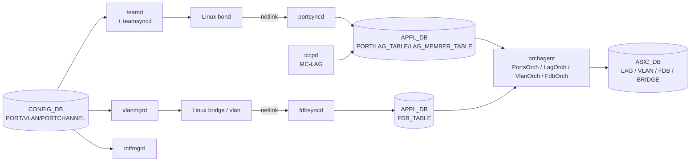

# 内部実装

L2 / [VLAN](../../reference/glossary.md#term-vlan) / [LAG](../../reference/glossary.md#term-lag) / MC-LAG の内部実装は「kernel と [orchagent](../../reference/glossary.md#term-orchagent) の二重管理」を理解するのが鍵です。Linux bond / bridge / vlan device の状態と、[SAI](../../reference/glossary.md#term-sai) の LAG / VLAN member / [FDB](../../reference/glossary.md#term-fdb) entry が常に同期しているわけではなく、[teamd](../../reference/glossary.md#term-teamd-teamsyncd-teammgrd) / [portsyncd](../../reference/glossary.md#term-portsyncd) / [vlanmgrd](../../reference/glossary.md#term-vlanmgrd) / [fdbsyncd](../../reference/glossary.md#term-fdbsyncd) が橋渡しをします。

## データフロー



## 主要 Orch / daemon の責務

| コンポーネント | 主なクラス | 責務 |
| --- | --- | --- |
| `PortsOrch` (`orchagent/portsorch.cpp`) | `PortsOrch::doTask`、`initializePort`、`addLag`、`addLagMember` | PORT / LAG / VLAN を SAI に投入。最も巨大な Orch |
| `VlanMgr` (`cfgmgr/vlanmgr.cpp`) | `VlanMgr::doTask` | [CONFIG_DB](../../reference/glossary.md#term-config_db) の `VLAN` / `VLAN_MEMBER` を bridge fdb 設定と [APPL_DB](../../reference/glossary.md#term-appl_db) に反映 |
| `IntfMgr` (`cfgmgr/intfmgr.cpp`) | `IntfMgr::doTask` | router interface の IP/MTU を kernel に設定し、orchagent 用 APPL_DB key を作る |
| `FdbOrch` (`orchagent/fdborch.cpp`) | `FdbOrch::doTask`、`addFdbEntry`、`handleFdbNotification` | static FDB と learned FDB の管理、aging notification |
| `teamd` / `teamsyncd` | open source teamd + `teamsyncd.cpp` | [LACP](../../reference/glossary.md#term-lacp) の実装は teamd。teamsyncd が kernel bond state を [STATE_DB](../../reference/glossary.md#term-state_db) / APPL_DB へ |
| `portsyncd` (`portsyncd/portsyncd.cpp`) | `PortSyncd::run` | netlink で kernel の link state を APPL_DB に反映 |
| `fdbsyncd` (`fdbsyncd/fdbsync.cpp`) | [EVPN](../../reference/glossary.md#term-evpn) type-2 同期も担う。kernel bridge fdb と APPL_DB の同期 |
| `iccpd` (`linkmgrd` ではなく `iccpd`) | `iccpd/` 配下 | MC-LAG 制御。ICCP メッセージで peer と sync、active/standby を決め APPL_DB に書く |

## SAI 属性の使用一覧

| object | 属性 |
| --- | --- |
| `SAI_OBJECT_TYPE_LAG` | `SAI_LAG_ATTR_PORT_VLAN_ID`、`SAI_LAG_ATTR_INGRESS_ACL`、`SAI_LAG_ATTR_DROP_UNTAGGED` |
| `SAI_OBJECT_TYPE_LAG_MEMBER` | `SAI_LAG_MEMBER_ATTR_LAG_ID`、`SAI_LAG_MEMBER_ATTR_PORT_ID`、`SAI_LAG_MEMBER_ATTR_EGRESS_DISABLE` |
| `SAI_OBJECT_TYPE_VLAN` | `SAI_VLAN_ATTR_VLAN_ID`、`SAI_VLAN_ATTR_LEARN_DISABLE` |
| `SAI_OBJECT_TYPE_VLAN_MEMBER` | `SAI_VLAN_MEMBER_ATTR_BRIDGE_PORT_ID`、`SAI_VLAN_MEMBER_ATTR_VLAN_TAGGING_MODE` |
| `SAI_OBJECT_TYPE_BRIDGE_PORT` | `SAI_BRIDGE_PORT_ATTR_TYPE = PORT`、`SAI_BRIDGE_PORT_ATTR_FDB_LEARNING_MODE` |
| `SAI_OBJECT_TYPE_FDB_ENTRY` | `SAI_FDB_ENTRY_ATTR_TYPE = STATIC/DYNAMIC`、`SAI_FDB_ENTRY_ATTR_BRIDGE_PORT_ID`、`SAI_FDB_ENTRY_ATTR_PACKET_ACTION` |
| `SAI_OBJECT_TYPE_STP` | `SAI_STP_ATTR_VLAN_LIST`（PVST 系で参照） |

MC-LAG では `SAI_LAG_MEMBER_ATTR_EGRESS_DISABLE = true` を peer link 側に設定して loopback を防ぐ実装が使われます。

## Redis テーブル参照関係

```yaml
CONFIG_DB:
  PORT, VLAN, VLAN_MEMBER, PORTCHANNEL, PORTCHANNEL_MEMBER,
  FDB, MCLAG_DOMAIN, MCLAG_INTERFACE, STP, STP_PORT
APPL_DB:
  PORT_TABLE, LAG_TABLE, LAG_MEMBER_TABLE,
  VLAN_TABLE, VLAN_MEMBER_TABLE, FDB_TABLE, STP_TABLE
STATE_DB:
  PORT_TABLE, LAG_TABLE, FDB_TABLE, MCLAG_REMOTE_FDB_TABLE
COUNTERS_DB:
  COUNTERS:<oid> (port, queue, PG)
ASIC_DB:
  LAG, LAG_MEMBER, VLAN, VLAN_MEMBER, BRIDGE_PORT, FDB_ENTRY, STP
```

`FdbOrch` は [ASIC](../../reference/glossary.md#term-asic) からの notification (`SAI_FDB_EVENT_LEARNED / AGED / FLUSHED`) を [Redis](../../reference/glossary.md#term-redis) pub/sub 経由で受け、APPL_DB.FDB_TABLE を更新します。MC-LAG の remote FDB は iccpd が `MCLAG_REMOTE_FDB_TABLE` に書き、`FdbOrch` がそれを static 同等として SAI に投入します。

## ZMQ / Redis pub/sub

- 通常 L2 系は [ProducerStateTable](../../reference/glossary.md#term-producerstatetable) / SubscriberStateTable の Redis pub/sub のみ。ZMQ は使いません。
- FDB notification は `ASIC_DB` の notification channel（Redis pub/sub）で `FdbOrch` に届きます。
- teamsyncd → APPL_DB は netlink → ProducerStateTable で、teamd 自体は Unix socket DBus で teamsyncd と話します。

## 既知の実装上の制約

- VLAN ID は [SONiC](../../reference/glossary.md#term-sonic) では `Vlan<id>` の文字列キーで扱われ、`VLAN_MEMBER|Vlan100|Ethernet0` のように `|` 区切り。`vlanmgrd` 内で id の桁違いやスペースが入ると silent に skip されることが過去 issue で報告されています。
- MC-LAG（iccpd ベース）と [EVPN-MH](../../reference/glossary.md#term-evpn-mh)（EVPN multi-homing、[FRR](../../reference/glossary.md#term-frr) ベース）は別実装で、同じスイッチで両立する設計にはなっていません。
- FDB MAC move は ASIC 通知遅延と orchagent 内のリオーダリングで一時的に同じ MAC が複数ポート所属に見えることがあります。`FdbOrch::handleFdbNotification` が `SAI_FDB_EVENT_MOVE` を扱いますが、ASIC が MOVE ではなく LEARNED + DELETE を別タイミングで上げる場合に瞬間的に重複が出ます。
- LAG member の dynamic add/remove は SAI 側で `EGRESS_DISABLE` を切り替えるだけの実装と、`LAG_MEMBER` を作り直す実装があり、ベンダで挙動が違います。`PortsOrch::setLagMemberEgressDisable` 経路を取れない ASIC では一瞬パケットロスが入ります。
- STP は SONiC では PVST / RPVST の制御プレーンが limited で、`stp` モジュール ([sonic-stp](https://github.com/sonic-net/sonic-stp)) が有効になっている場合のみ動きます。

## MC-LAG (iccpd) の内部状態機械

iccpd は peer 2 台間で ICCP セッションを張り、以下の状態を同期します。

| 状態 | 同期内容 | 反映先 |
| --- | --- | --- |
| LAG member status | local / remote の port-channel member 健全性 | `MCLAG_LOCAL_INTF_TABLE`、`MCLAG_REMOTE_INTF_TABLE` |
| FDB | learned MAC | `MCLAG_REMOTE_FDB_TABLE` → FdbOrch |
| [ARP](../../reference/glossary.md#term-arp) / ND | neighbor entry | `MCLAG_NEIGH_TABLE` → NeighOrch |
| IPv4/IPv6 route | route leak（オプション） | APPL_DB 経由 |

`MCLAG_DOMAIN` テーブルの `peer_ip` / `source_ip` / `keepalive_interval` / `session_timeout` が ICCP TCP セッションを定義します。session timeout 超過で active/standby が切替り、standby 側 LAG member は `SAI_LAG_MEMBER_ATTR_EGRESS_DISABLE = true` になります。

## kernel ↔ ASIC 同期の race

L2 系は kernel 状態と ASIC 状態の二重管理であり、以下の race が頻出します。

- VLAN member 追加直後の FDB learn が、bridge fdb 反映前に ASIC notification として届くと `FdbOrch` が `BRIDGE_PORT_ID` を解決できず drop する
- LAG member 追加で teamd が kernel bond に member を入れた直後、portsyncd の netlink 通知より先に LACP packet が flow しはじめ、orchagent が `LAG_MEMBER` を作る前に `EGRESS_DISABLE` の初期値で短時間ロスする
- portchannel down → up のフラップで `LAG_MEMBER_TABLE` の delete/add がペアにならず、`PortsOrch::removeLagMember` が orphan member を残すケース

これらは ASIC 通知に対する orchagent の reentrancy 設計上避けにくく、頻発する場合は teamd の `runner.tx_hash` や `lacp_rate` を調整します。

## FDB notification 経路の詳細

ASIC からの FDB 通知は `ASIC_DB` の notification channel（Redis pub/sub）に流れ、`FdbOrch` が以下の event を処理します。

| SAI event | FdbOrch handler | 反映先 |
| --- | --- | --- |
| `SAI_FDB_EVENT_LEARNED` | `handleLearnedEvent` | APPL_DB.FDB_TABLE 追加、STATE_DB 更新 |
| `SAI_FDB_EVENT_AGED` | `handleAgedEvent` | APPL_DB.FDB_TABLE 削除 |
| `SAI_FDB_EVENT_MOVE` | `handleMoveEvent` | bridge_port 差し替え |
| `SAI_FDB_EVENT_FLUSHED` | `handleFlushedEvent` | 該当 LAG/VLAN の FDB 一括削除 |

`SAI_BRIDGE_PORT_ATTR_FDB_LEARNING_MODE` を `HW` にすると LEARNED イベントを抑制（CPU 負荷削減）でき、`CPU_TRAP` にすると全 frame が orchagent 経由になります。SONiC 標準は `HW` で、MC-LAG では peer link 側を `DISABLE` に倒します。

## 関連ページ

- [L2 basic mode test plan](../../switching/sonic-basic-l2-mode-test-plan.md)
- [MC-LAG enhancements](../../switching/mclag-enhancements.md)
- [LAG on distributed VOQ system](../../switching/lag-on-distributed-voq-system.md)
- [SONiC IP LAG incremental update](../../switching/sonic-ip-lag-incremental-update.md)

<!-- glossary-links-injected: ec18b66e3507 -->
